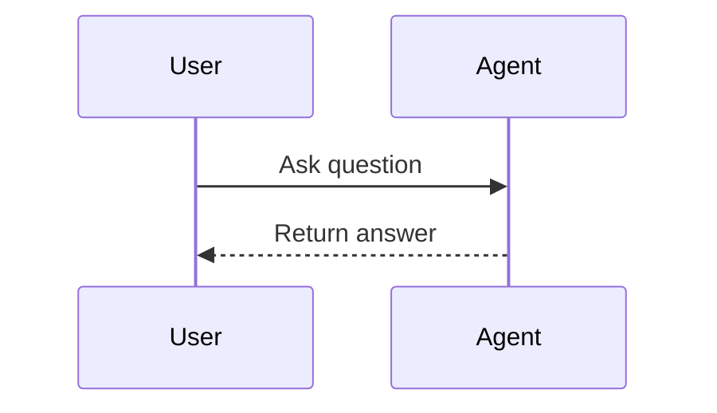

# Write Documentation

Write a new documentation page for the VitePress docs site. The topic should be provided via `$ARGUMENTS`.

## Step 1: Read Reference Materials

1. Read the docs scope guide: `docs/CLAUDE.md`
2. Study 2-3 existing pages near where the new page will live:
   - Platform example: `docs/docs/2_platform/5_agents/index.en.md`
   - SDK example: `docs/docs/3_sdk/2_building_agents/1_agent_fundamentals/index.en.md`
   - Ecosystem example: `docs/docs/4_ecosystem/2_using_ai/3_vibe_coding_guidelines/index.en.md`
3. If the page describes a feature, read the relevant source code to verify all claims

## Step 2: Create the File

Every page lives in its own numbered directory as `index.en.md`. The numeric prefix controls sidebar order.

```
docs/docs/<section>/<N>_<topic>/index.en.md
```

To determine the correct number prefix, list the sibling directories and pick the next available number:

```bash
ls docs/docs/<section>/
```

**Only write `index.en.md`** — German translations are auto-generated by `pnpm run docs:translate`. Never create
`index.de.md` manually.

### Do NOT edit these generated zones

- `docs/6_code_deep_dive/` — overwritten by `sync-docs.sh`
- `index.de.md` files — overwritten by `translate-docs.sh`
- `public/` — rebuilt by `generate-llm-files.mjs`

## Step 3: Frontmatter

Minimal frontmatter — the `title` field is mandatory:

```yaml
---
title: Your page title here
---
```

- `description` is optional
- No `index`, `order`, or `sidebar_position` field — ordering is via directory prefix only
- The title appears in the auto-generated sidebar (`docs/.vitepress/sidebar-logic.mjs`)

## Step 4: Page Structure

```markdown
---
title: Page title
---

# Page title

Opening paragraph that sets context. No meta-commentary ("In this section, we will discuss...").

## First major section

Content in paragraphs, not bullet lists by default.

## Second major section

Mix paragraphs, code blocks, tables, and containers for variety.
```

**Heading rules:**

- `#` for the page title (must match frontmatter title)
- `##` for major sections — use sentence case, not Title Case
- `###` sparingly for subsections when necessary
- Never go deeper than `###`
- Prefer flatter structure over deeply nested headings

## Step 5: Write the Content

### Writing guidelines

**Be direct and factual.** Write like you're explaining something to an intelligent colleague. Describe what the
platform does without inflating its significance. Skip "powerful", "game-changing", "seamless", "robust", or any
tourist-brochure language.

**Never use these patterns:**

- Grandiose framing: "testament to", "vital role", "watershed moment", "underscores the importance"
- Editorial commentary: "it's important to note", "it is worth remembering", "no discussion would be complete without"
- Formulaic connectors to start sentences: "Moreover,", "Furthermore,", "In addition,"
- Summary endings: "In summary,", "In conclusion,", "Overall,"
- Forced parallelism: "Not only... but...", "It's not just about X, it's about Y"
- Rule of three: avoid listing exactly three adjectives or three parallel phrases
- Significance tacking: "-ing" phrases like "highlighting the platform's entry", "improving convenience"
- Vague attributions: "Industry reports suggest", "Observers have noted" — cite a specific source or don't make the
  claim
- "From X to Y" constructions when listing examples
- Meta-commentary: "In this section, we will discuss..."
- Knowledge disclaimers: "as of [date]", "based on available information"
- Conversational asides: "I hope this helps", "Certainly!"

**Style and formatting:**

- Sentence case for headings ("How agents work", not "How Agents Work")
- **Bold** only for the article subject on first mention, never for emphasis
- Write in paragraphs, not lists, unless a list is genuinely the clearest format
- No emojis
- Prefer commas or parentheses over em dashes for asides
- Use straight quotes (`"`) not curly quotes

**Technical accuracy:**

- Verify all claims against the codebase — confirm features exist, check configuration
- Don't describe features that aren't implemented
- Be honest about limitations rather than implying capabilities
- Remove unverified performance numbers or statistics

**Consistent terminology:**

- Lowercase for general terms: "agents", "pipelines", "knowledge bases"
- Capitalize proper names: "SharePoint", "Dagster", "LiteLLM", "Milvus"

**Write naturally.** Vary sentence lengths. Include occasional informality. Let your personality show through. Real
writing has rhythm variations that formulaic writing lacks. Trust readers to understand why something matters without
explicit signposting.

### VitePress containers

Use containers for callouts — not for decoration:

```markdown
::: info
Context that helps understanding.
:::

::: tip
Helpful suggestion or best practice.
:::

::: warning
Important caveat or gotcha.
:::

::: danger
Critical security or safety concern.
:::

::: details Click to expand
Collapsible content for long examples, JSON payloads, or optional detail.
:::
```

### Code blocks

Use language identifiers for syntax highlighting:

````markdown
```python
def example():
    return "highlighted"
```
````

### Mermaid diagrams

Use for flowcharts, sequence diagrams, and architecture diagrams:

````markdown

````

### Images

Store in `docs/media/` organized by topic. Reference with relative paths:

```markdown

```

Add `data-zoomable` for lightbox behavior on important images. Create a new subdirectory in `media/` if the topic
doesn't have one yet.

### Internal links

Use relative paths to other pages:

```markdown
[Link to sibling section](../5_agents/)
[Link to subsection](../../6_pipelines/1_fundamentals/)
```

### Tables

Use for decision matrices, feature comparisons, or structured data:

```markdown
| Feature | Agent | Pipeline |
|---------|-------|----------|
| Real-time | Yes | No |
| Scheduled | No | Yes |
```

## Step 6: Verify

1. Check frontmatter has `title`:
   ```bash
   head -5 docs/docs/<section>/<N>_<topic>/index.en.md
   ```
2. Preview the page:
   ```bash
   cd docs && pnpm run docs:dev
   ```
3. Verify the page appears in the sidebar at the correct position
4. Check all internal links resolve
5. Check all image paths resolve
6. Run translation to generate German version:
   ```bash
   cd docs && pnpm run docs:translate
   ```
7. Commit both `index.en.md` and the generated `index.de.md`

## Existing Docs Structure

For reference, the top-level documentation sections:

```
docs/
├── 1_vision_and_positioning/   # Why the platform exists
├── 2_platform/                 # Platform features and configuration (22 subsections)
├── 3_sdk/                      # Building agents, pipelines, processes
├── 4_ecosystem/                # Contributing, using AI, certification
├── 5_references/               # API reference, troubleshooting, glossary
└── 6_code_deep_dive/           # AUTO-SYNCED — never edit directly
```

Place new pages in the appropriate section. If unsure, `2_platform/` covers platform features and `3_sdk/` covers
building with the SDK.
