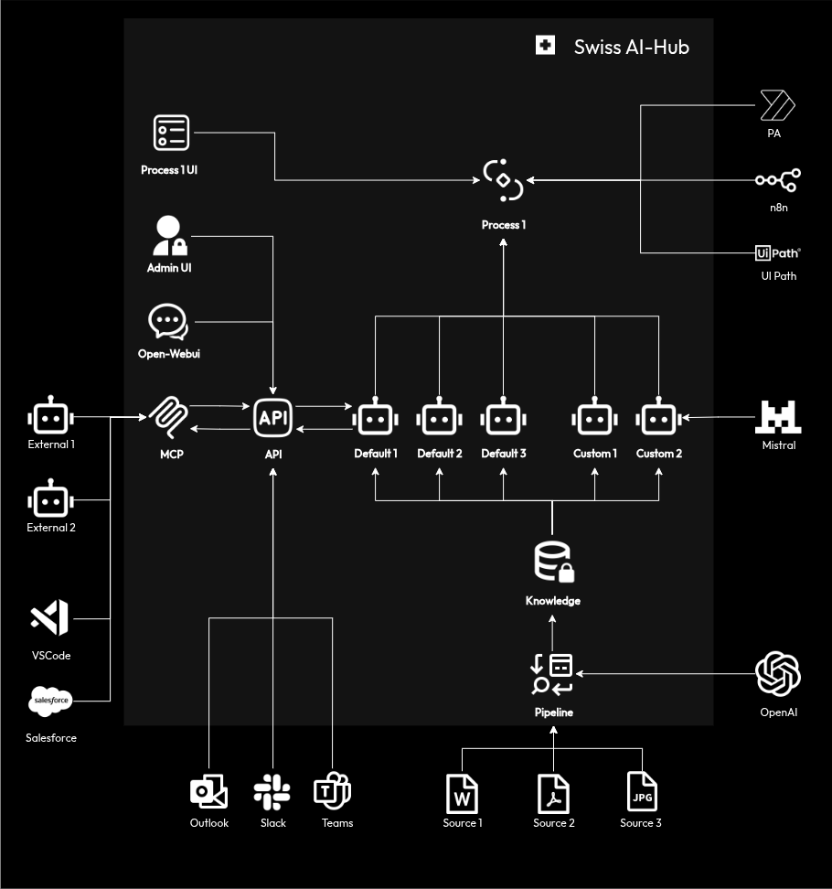

<div align="center">


# Swiss AI-Hub

[](https://github.com/bbvch-ai/aihub-core/releases)
[](LICENSE)
[](https://python.org)
[](https://docs.docker.com/compose/)
[](https://bbvch-ai.github.io/aihub-core/)

The open AI platform you own and control.

[Read the docs](https://bbvch-ai.github.io/aihub-core/) · [Releases](https://github.com/bbvch-ai/aihub-core/releases) ·
[Report a bug](https://github.com/bbvch-ai/aihub-core/issues)

</div>

______________________________________________________________________

<p align="center" width="100%">
<video src="https://github.com/user-attachments/assets/2e512252-a5f4-4eca-9550-40ee5a29010a" width="80%" autoplay loop muted></video>
</p>

______________________________________________________________________

## What is Swiss AI-Hub

Complete infrastructure for production AI. Deploy in your data center, build agents and pipelines with the SDK, keep
your data where it belongs. Not a SaaS subscription, not a code library. Authentication, monitoring, databases, UIs, LLM
routing, vector search, data pipelines, document parsing, cost tracking, and observability -- all included, all yours.

One command deploys everything. On a single NVIDIA RTX 6000 Pro (48GB VRAM), the platform runs chat, embeddings,
reranking, OCR, and speech-to-text locally. No API keys needed, no egress traffic, no cloud bills. When cloud access is
available, Swiss LLM Cloud or any OpenAI-compatible provider scales you further without code changes.

The SDK provides Python packages for building agents, data pipelines, and multi-step processes that plug into the
running platform. Agents you build automatically appear in the chat UI, get traced in Langfuse, stream responses over
WebSocket, and inherit the platform's authentication and access control. You write business logic. The platform handles
everything else.

## Quick start

### GPU deployment

Runs the full platform with local inference on a single NVIDIA GPU (48GB VRAM).

```bash
# Download the latest GPU release bundle
VERSION="v0.269.0"  # Check https://github.com/bbvch-ai/aihub-core/releases
mkdir swiss-ai-hub && cd swiss-ai-hub
curl -L "https://github.com/bbvch-ai/aihub-core/releases/download/${VERSION}/swissaihub-${VERSION}-gpu.tar.gz" \
  | tar -xz

# Generate environment file with secure random secrets
./setup-env.sh

# Configure your domain and auth provider in .env
# (see docs for Azure AD / OIDC setup)

# Start everything
docker compose up -d
```

This starts ~35 containers: chat UI, admin UI, API, LLM gateway, Milvus, PostgreSQL, NATS, SeaweedFS, Dagster, Langfuse,
Presidio, MinerU, vLLM (Qwen3-VL-30B, BGE-M3, BGE-Reranker), Whisper, and more.

### CPU-only deployment

Routes all inference to Swiss LLM Cloud (or any OpenAI-compatible endpoint). Same platform, no GPU required.

```bash
VERSION="v0.269.0"
mkdir swiss-ai-hub && cd swiss-ai-hub
curl -L "https://github.com/bbvch-ai/aihub-core/releases/download/${VERSION}/swissaihub-${VERSION}.tar.gz" \
  | tar -xz

./setup-env.sh
# Set SWISS_LLM_CLOUD_API_KEY and endpoint URLs in .env

docker compose up -d
```

### Local development

```bash
git clone https://github.com/bbvch-ai/aihub-core.git
cd aihub-core
cp .env.dev .env
mkcert -install && make local-cert  # Self-signed TLS for localhost
docker compose -f docker-compose.dev.yml up -d
```

## Platform features

### LLM gateway

LiteLLM provides a unified OpenAI-compatible interface to all model providers. Switch between local vLLM models, Swiss
LLM Cloud, Azure OpenAI, or any other provider by changing configuration, not code. Built-in cost tracking per user,
team, and model. Presidio intercepts requests for PII detection and anonymization before they reach external providers.

<p align="center" width="100%">
<video src="https://github.com/user-attachments/assets/7d282ed1-2c23-4283-93b1-dcb26d9f45bb" width="80%" autoplay loop muted></video>
</p>

### Knowledge and RAG

Dagster-orchestrated pipelines ingest documents from SharePoint, OneDrive, Google Drive, S3, SFTP, or local filesystems.
MinerU handles OCR and structural extraction from PDFs, Office files, and images. Documents are chunked, embedded, and
stored in Milvus for semantic search. Seven pre-configured source templates get you from zero to working RAG in minutes.

<p align="center" width="100%">
<video src="https://github.com/user-attachments/assets/243c2949-a034-47ae-a65f-f988e1c438ac" width="80%" autoplay loop muted></video>
</p>

### Agent runtime

Agents run as stateless microservices communicating over NATS via the Swiss AI Agent Protocol. Each agent is a workflow
of decorated steps with dependency injection for configuration, state, memory, and display events. The protocol
separates Control Events (workflow state transitions) from Display Events (observability), so the chat UI can visualize
agent reasoning in real-time without interfering with execution. Agents scale horizontally and deploy independently.

### Process orchestration

Processes coordinate multi-step workflows involving agents, humans, and external systems. When a step requires human
judgment, a task appears in the Process UI. When it requires AI, the engine delegates to an agent over NATS. When it
requires an external action, it triggers a webhook to Power Automate, n8n, or UiPath.

### Observability

Every agent action is traced through Langfuse with full prompt/response capture, per-trace cost tracking, and RAG
retrieval analysis. OpenTelemetry collects distributed traces across all services. The admin dashboard provides
real-time monitoring of threads, agent status, and system health.

### User interfaces

- **OpenWebUI** -- Chat interface with voice input, image upload, document attachment, web search, and code execution
  via Jupyter
- **Admin UI** -- Agent configuration, knowledge base management, user roles, cost dashboards, thread inspection
- **Process UI** -- Workflow monitoring, human task queues, process status
- **MS Teams and Slack** -- Bots that connect users to agents in the channels they already use
- **OpenAI-compatible API** -- Drop-in replacement for existing tools that speak the OpenAI protocol

### Security and access control

SSO via any OIDC provider (Azure AD, Keycloak, etc.). Role-based access control with granular permissions down to
individual agents and knowledge bases. API token management for programmatic access. Five isolated Docker networks
(proxy, backend, data, storage, egress) enforce defense-in-depth. Docker socket proxy prevents container escape from the
reverse proxy.

<p align="center" width="100%">
<video src="https://github.com/user-attachments/assets/9ef17c7e-2fc7-4ca7-8299-fa52fe0f6157" width="80%" autoplay loop muted></video>
</p>

## Build with the SDK

Install the SDK packages for the components you need:

```bash
pip install swissaihub-agent    # Agent development
pip install swissaihub-pipeline # Data pipelines (Dagster)
pip install swissaihub-process  # Process orchestration
```

### Agents

An agent is a stateless workflow of steps that consume and produce events. The `@step` decorator defines each step's
input/output events, and the runtime handles dispatch, state management, and infrastructure injection.

```python
from swissaihub.agent import Agent, AgentRunner, step
from swissaihub.agent.i18n import AgentLocaleString
from swissaihub.core.nats.events import UserMessageEvent, StopEvent
from swissaihub.core.nats.events.display import ChunkEvent
from swissaihub.core.displayers import EventDisplayer
from swissaihub.core.i18n import LocaleString

class SummaryAgent(Agent):
    name = AgentLocaleString.from_i18n_path("agent.summary.metadata.name")
    description = AgentLocaleString.from_i18n_path("agent.summary.metadata.description")
    icon = "mage:document-search"

    @step(name=LocaleString(en="Summarize"))
    async def summarize(
        self,
        event: UserMessageEvent,
        config: SummaryAgentConfig,
        displayer: EventDisplayer,
    ) -> StopEvent:
        # config, displayer, and other dependencies are injected automatically
        llm = LLM(model=config.model_name)
        response = await llm.acomplete(f"Summarize: {event.content}")

        await displayer.display(ChunkEvent(data=str(response)))
        return StopEvent()

# Start the agent
runner = AgentRunner(agent_type=SummaryAgent, agent_config=SummaryAgentConfig.as_form())
await runner.run_forever()
```

The agent automatically registers with the platform, appears in the chat UI, and gets full observability through
Langfuse. Configuration defined with the form duality pattern renders as an editable form in the admin UI.

Seven pre-built agents ship with the platform: RAG with retrieval and reranking, LLM passthrough, expert escalation via
Teams/Slack, few-shot pattern matching, namespace-based knowledge routing, and pure document retrieval.

### Data pipelines

Pipelines use a two-stage architecture: Stage 1 pulls files from external sources into an S3-compatible data lake, Stage
2 processes them through parsing, chunking, embedding, and vector storage. The `default_definitions` function wires
everything together.

```python
from swissaihub.pipeline import default_definitions

defs = default_definitions(
    datalake_container_name="my-knowledge-base",
    embedding_model_name="embedding/bge-m3",
    llm_model_name="text-generation/qwen3-vl-30b",
    with_summary_nodes=True,        # Hierarchical RAG summaries
    with_table_refinement=True,     # LLM-powered table extraction
    with_figure_descriptions=True,  # Vision model for image descriptions
)
```

Source connectors for SharePoint, OneDrive, Google Drive, S3, Azure Blob, SFTP, and local filesystems ship as templates
with ready-to-use configuration files. Dagster provides the orchestration UI, lineage tracking, and scheduling.

<p align="center" width="100%">
<video src="https://github.com/user-attachments/assets/b43e613e-6b23-41e6-99f7-cb9bdd821685" width="80%" autoplay loop muted></video>
</p>

### Processes

Processes orchestrate multi-step workflows that delegate to agents, humans, and external programs.

```python
from swissaihub.process import AgenticProcess, ProcessRunner, process_step
from swissaihub.process.i18n import ProcessLocaleString
from swissaihub.core.nats.events import StartEvent, StopEvent
from swissaihub.core.i18n import LocaleString

class DocumentReviewProcess(AgenticProcess):
    name = ProcessLocaleString.from_i18n_path("process.doc_review.metadata.name")

    @process_step(name=LocaleString(en="Extract content"))
    async def extract(self, event: StartEvent) -> AgentTaskEvent:
        return AgentTaskEvent(agent_class="RAGAgent", agent_id="legal-docs")

    @process_step(name=LocaleString(en="Human review"))
    async def review(self, event: AgentTaskEvent) -> HumanTaskEvent:
        return HumanTaskEvent(form=ReviewForm.as_form())

    @process_step(name=LocaleString(en="Archive"))
    async def archive(self, event: HumanTaskEvent) -> StopEvent:
        return StopEvent()
```

### Frontend

The admin UI is a standalone Nuxt 3 application. Install it separately to embed or extend it:

```bash
npm install @swissaihub/web
```

## Architecture

<div align="center">

</div>

### Swiss AI Agent Protocol

All inter-service communication follows the Swiss AI Agent Protocol, an event-driven contract over NATS. The protocol
enforces a strict separation between Control Events (workflow state transitions that trigger agent execution) and
Display Events (observability data consumed by frontends and tracing). This separation means the chat UI can show agent
reasoning, retrieval results, and cost data in real-time without affecting workflow execution.

Events are scoped hierarchically: a Thread groups Display Contexts, which group Runs. Each Run is a traceable execution
from StartEvent to StopEvent. Security is enforced at the Thread level, and agents reconstruct state by replaying the
event history for a given thread.

### Infrastructure stack

| Category            | Service           | Role                                              |
| ------------------- | ----------------- | ------------------------------------------------- |
| User-facing         | OpenWebUI         | Chat interface with voice, images, code execution |
| User-facing         | Admin UI (Nuxt 3) | Agent config, knowledge, roles, dashboards        |
| API                 | FastAPI           | REST, WebSocket, MCP server                       |
| API                 | LiteLLM           | Unified LLM proxy with cost tracking              |
| AI inference        | vLLM              | Local chat model (Qwen3-VL-30B FP8)               |
| AI inference        | vLLM              | Embeddings (BGE-M3) and reranking (BGE-Reranker)  |
| AI inference        | Speaches          | Speech-to-text (Whisper Large V3)                 |
| AI inference        | Presidio          | PII detection and anonymization                   |
| Data                | PostgreSQL        | Relational storage (4 databases)                  |
| Data                | FerretDB          | MongoDB-compatible API over PostgreSQL            |
| Data                | Milvus            | Vector database for semantic search               |
| Data                | Neo4j             | Graph database for agent memory                   |
| Data                | Valkey            | Redis-compatible cache and ephemeral state        |
| Storage             | SeaweedFS         | S3-compatible distributed object storage          |
| Messaging           | NATS + JetStream  | Event-driven communication backbone               |
| Pipelines           | Dagster           | Data pipeline orchestration                       |
| Document processing | MinerU            | OCR, structural extraction, VLM                   |
| Observability       | Langfuse          | LLM tracing, cost tracking, evaluation            |
| Observability       | OTEL Collector    | Distributed trace collection                      |
| Networking          | Traefik           | Reverse proxy, TLS termination, routing           |
| Utility             | Jupyter           | Code execution sandbox                            |
| Utility             | Playwright        | Browser automation for agents                     |

GPU-specific services (vLLM instances, Speaches, MinerU VLM) are only present in GPU deployments. CPU-only deployments
route inference to external providers through LiteLLM.

### Network isolation

Five Docker networks enforce least-privilege communication:

- **proxy** -- External ingress via Traefik. Only services that need public access join this network.
- **backend** -- Application services (API, bots, LiteLLM, agents). Internal communication between services.
- **data** -- Databases, message broker, caches. No direct external access.
- **storage** -- SeaweedFS cluster and its metadata store (etcd). Isolated from application logic.
- **egress** -- Outbound internet access with inter-container communication disabled. Used by services that need
  external connectivity (Playwright, rclone).

## Deployment options

|                  | GPU deployment                        | CPU-only deployment                          |
| ---------------- | ------------------------------------- | -------------------------------------------- |
| Inference        | Local via vLLM                        | Swiss LLM Cloud or any OpenAI-compatible API |
| Chat model       | Qwen3-VL-30B-A3B-Instruct (FP8)       | Cloud-hosted (configurable)                  |
| Embeddings       | BGE-M3 (local)                        | Cloud-hosted (configurable)                  |
| Reranking        | BGE-Reranker-v2-M3 (local)            | Cloud-hosted (configurable)                  |
| Speech-to-text   | Whisper Large V3 (local)              | Cloud-hosted (configurable)                  |
| OCR              | MinerU VLM (local GPU)                | MinerU CPU + cloud VLM                       |
| Data sovereignty | Full -- nothing leaves the machine    | Depends on inference provider                |
| GPU requirement  | 48GB VRAM (RTX 6000 Pro, A6000, A100) | None                                         |
| Containers       | ~35                                   | ~28                                          |

Both deployments use the same platform code, the same SDK, and the same APIs. The only difference is where inference
runs.

<details>
<summary>Hardware guidelines</summary>

**GPU deployment** (single machine, all-in-one):

- NVIDIA GPU with 48GB VRAM (RTX 6000 Pro, RTX A6000, A100 48GB)
- 64GB system RAM
- 200GB+ SSD storage
- NVIDIA Container Toolkit installed
- Docker and Docker Compose v2

**CPU-only deployment**:

- 32GB system RAM
- 100GB+ SSD storage
- Docker and Docker Compose v2
- API key for Swiss LLM Cloud or another inference provider

</details>

## How it compares

|                        | Data sovereignty  | Cost control  | Observability | Time to value | Vendor independence | Production ready |
| ---------------------- | :---------------: | :-----------: | :-----------: | :-----------: | :-----------------: | :--------------: |
| **Swiss AI-Hub**       |       Full        |     Full      |     Full      |   Moderate    |        Full         |       Full       |
| LangChain / LlamaIndex |   Self-managed    | None built-in | None built-in |     Slow      |        Full         |       DIY        |
| Azure AI Foundry       | Region-selectable |    Partial    |    Partial    |   Moderate    |        None         |       Full       |
| Dify                   |   Self-hostable   |     Full      |    Partial    |     Fast      |        Full         |     Partial      |
| n8n                    |   Self-hostable   |     Full      |     None      |     Fast      |        Full         |     Partial      |
| OpenAI Assistants      |       None        |    Partial    |    Partial    |     Fast      |        None         |       Full       |

Libraries like LangChain give you flexibility but no infrastructure. Cloud platforms like Azure AI Foundry give you
infrastructure but no ownership. Visual tools like Dify are fast to start but limited in production depth. Swiss AI-Hub
sits at the intersection: a complete platform that you deploy and own.

Read the
[full comparison](https://bbvch-ai.github.io/aihub-core/1_vision_and_positioning/2_why_swiss_ai_hub/1_comparison_matrix_light/)
in the docs.

## Package structure

```
aihub-core/
  aihub_lib/       # Shared library (swissaihub-core on PyPI)
  aihub_agent/     # Agent SDK and pre-built agents (swissaihub-agent)
  aihub_pipeline/  # Data pipeline SDK and source templates (swissaihub-pipeline)
  aihub_process/   # Process orchestration SDK (swissaihub-process)
  aihub_api/       # REST API and WebSocket gateway (swissaihub-api)
  aihub_web/       # Admin UI, Nuxt 3 (@swissaihub/web on npm)
  aihub_bot/       # Teams and Slack integration (swissaihub-bot)
  aihub_doc/       # Documentation site (VitePress)
  aihub_action/    # GitHub Actions for CI/CD
```

Each package has its own README with detailed documentation. The SDK packages (`swissaihub-agent`,
`swissaihub-pipeline`, `swissaihub-process`) are what you install to build on the platform. The platform packages
(`swissaihub-api`, `swissaihub-bot`) run as services and ship with the Docker Compose deployment.

## Documentation

| Section                                                                                   | What it covers                                              |
| ----------------------------------------------------------------------------------------- | ----------------------------------------------------------- |
| [Vision and positioning](https://bbvch-ai.github.io/aihub-core/1_vision_and_positioning/) | Why Swiss AI-Hub exists, where it fits against alternatives |
| [Platform guide](https://bbvch-ai.github.io/aihub-core/2_platform/)                       | Quick start, architecture, deployment, configuration        |
| [SDK reference](https://bbvch-ai.github.io/aihub-core/3_sdk/)                             | Building agents, pipelines, and processes                   |
| [Ecosystem](https://bbvch-ai.github.io/aihub-core/4_ecosystem/)                           | Integrations, extensions, community resources               |
| [Architecture decisions](https://bbvch-ai.github.io/aihub-core/arc42/)                    | ADRs documenting key technical choices                      |
| [API reference](https://bbvch-ai.github.io/aihub-core/5_references/)                      | REST API docs, event catalog, configuration reference       |

## Contributing

Swiss AI-Hub is developed by [bbv Software Services](https://www.bbv.ch) and open to contributions.

- [Open an issue](https://github.com/bbvch-ai/aihub-core/issues) for bugs and feature requests
- See the package-level READMEs for development setup in each scope
- Read the [architecture decisions](https://bbvch-ai.github.io/aihub-core/arc42/) before proposing structural changes

## License

The Swiss AI-Hub platform is licensed under **Apache 2.0**. See [LICENSE](LICENSE) for details.

______________________________________________________________________

<div align="center">

Built in Switzerland by [bbv Software Services](https://www.bbv.ch)

</div>
