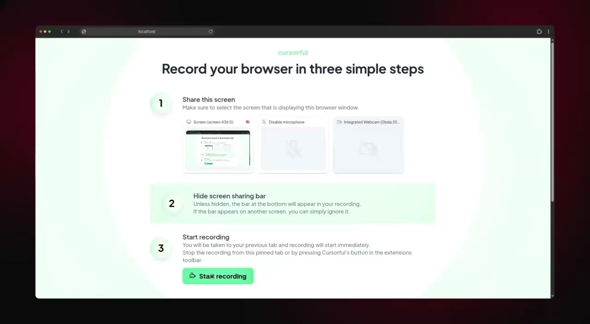
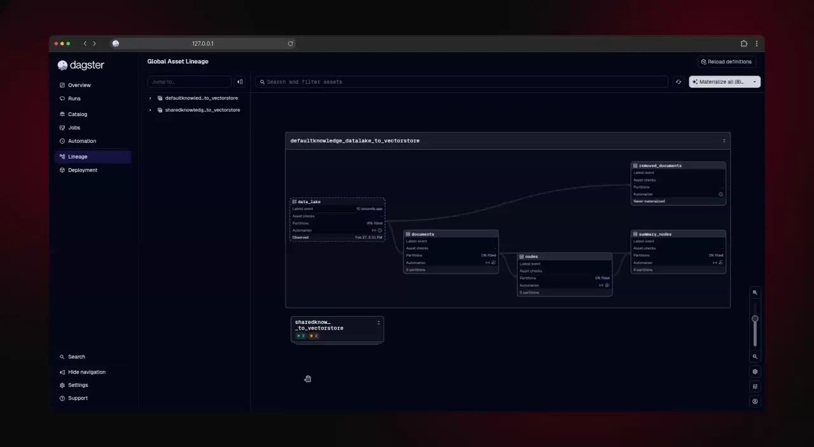
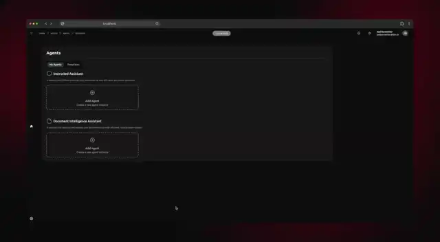
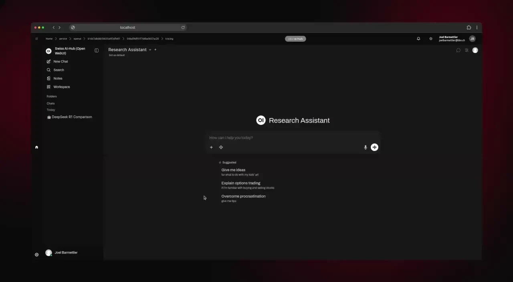
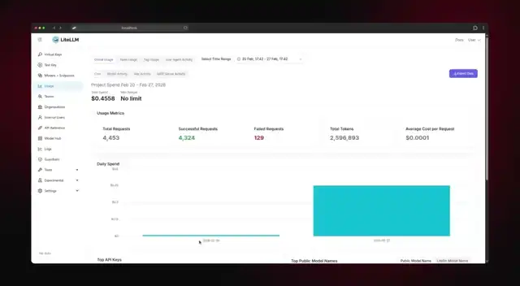

<div align="center">


# Swiss AI-Hub

**The open-source AI infrastructure stack for swiss enterprises.**

We connect, orchestrate, and monitor best-in-class open-source tools to deliver\
what cloud AI platforms promise -- but you own every layer.

[](https://github.com/bbvch-ai/aihub-core/releases)
[](LICENSE)
[](https://python.org)
[](https://docs.docker.com/compose/)
[](https://bbvch-ai.github.io/aihub-core/)
[](https://discord.gg/wArT8zDB)

[Get started](#quick-start) · [Documentation](https://bbvch-ai.github.io/aihub-core/) ·
[Discord](https://discord.gg/wArT8zDB) · [Releases](https://github.com/bbvch-ai/aihub-core/releases)

</div>

______________________________________________________________________

## Platform tour

**Upload documents to the knowledge base.** Drag files into the admin UI — the platform parses, chunks, embeds, and
indexes them automatically. Supports PDF, DOCX, PPTX, XLSX, and plain text. For production, connect SharePoint,
OneDrive, Google Drive, or any of 70+ cloud storage providers via Rclone for continuous sync.

<p align="center" width="100%">

</p>

**Track every step of the data pipeline.** Dagster provides full lineage from source document to vector embedding. See
which files were processed, how they were chunked, when embeddings were created, and what ended up in Milvus — with
automatic retry and failure handling.

<p align="center" width="100%">

</p>

**Create agents without writing code.** Developers publish agent blueprints — the workflow logic, form schema, and
default configuration. Administrators create agent profiles from those blueprints through a no-code configurator: pick a
blueprint, fill in the form (knowledge base, LLM model, temperature, system prompt), and the agent goes live. One
blueprint can power many profiles — an "Expert RAG Agent" blueprint becomes your HR policy agent, legal FAQ agent, and
IT support agent, each with different knowledge bases and instructions.

<p align="center" width="100%">

</p>

**Ask questions grounded in your data.** Agents retrieve relevant documents from the knowledge base, generate answers
with full source attribution, and stream responses in real-time. Every interaction is traced end-to-end in Langfuse —
from the user's question through retrieval, reranking, and LLM generation.

<p align="center" width="100%">

</p>

**Control costs and model routing.** LiteLLM provides a unified dashboard for all LLM usage across the platform. Set
spending limits per user, team, or model. Route requests between local models and cloud providers. Monitor token
consumption, latency, and cost per request — all from a single pane of glass.

<p align="center" width="100%">

</p>

______________________________________________________________________

## Our bet

We believe the best AI platform is one you don't build from scratch.

Open-WebUI ships a better chat interface than we could ever build -- and it improves every week. Milvus handles vector
search at scale, backed by a global community. Dagster already solved pipeline orchestration, scheduling, and data
lineage. Rclone connects to 70+ cloud storage providers. Keycloak handles every SSO scenario you can throw at it.
LiteLLM unifies every LLM provider behind a single API. Langfuse gives you observability that most AI platforms charge a
premium for.

**We bet on these projects.** We bet that Open-WebUI will innovate faster than Microsoft Copilot's chat interface. We
bet that Rclone will connect more data sources than Azure Data Factory. We bet that Milvus will outperform any
proprietary vector database. And when these projects ship new features, you get them -- no vendor approval needed, no
license upgrade required.

**Our job is to make them work together.** We wire these tools into an opinionated, production-ready stack: integrated
authentication, unified observability, secure networking, cost tracking, and a shared event protocol that lets every
component talk to every other. Then we give you SDKs to extend it, because every out-of-the-box platform will inherently
limit your use cases. Only a truly open and extensible platform guarantees your long-term success.

**Why this matters in Switzerland.** Professionals bound by Art. 321 StGB (lawyers, doctors, fiduciaries) and
organizations subject to the nDSG cannot send client data to US-headquartered cloud providers without confronting the
CLOUD Act. Standard "region Switzerland" hosting from hyperscalers does not fully resolve this -- operational access
often originates outside Switzerland. Swiss AI-Hub eliminates this risk: deploy on your own servers, run local models,
and keep every byte under Swiss jurisdiction.

Swiss AI-Hub is the sovereign, secure, and fully owned alternative to big-tech AI platforms -- without sacrificing
features or functionality. Production-ready from day one, solving the day-two problems that enterprises face:
authentication, cost control, compliance, multi-model routing, data pipelines, and observability.

**Predictability + Visibility + Control = Trust.** Agents follow bounded, step-by-step workflows -- not open-ended
loops. Every decision is logged with full context. You choose where data lives. This is not a black box you hope works
correctly; it's inspectable, auditable infrastructure you own.

## What you get

**The infrastructure stack (ships ready to run)**

One `docker compose up` starts ~30 containers, fully integrated. Every component listed below is included, configured,
and wired together.

<p align="center" width="100%">
<em>Tier 2 architecture — every component connected, from LLM providers to data sources</em><br><br>

</p>

**LLM gateway & inference**

| Component                       | Powered by                                          | Role in the stack                                                                                                                                                              |
| ------------------------------- | --------------------------------------------------- | ------------------------------------------------------------------------------------------------------------------------------------------------------------------------------ |
| LLM proxy                       | [LiteLLM](https://github.com/BerriAI/litellm)       | Unified OpenAI-compatible gateway that routes requests to any model provider (local vLLM, Swiss LLM Cloud, Azure OpenAI) with built-in cost tracking per user, team, and model |
| Local chat & text generation    | [vLLM](https://github.com/vllm-project/vllm)        | High-throughput OpenAI-compatible inference server that runs chat models locally on GPU, eliminating cloud API dependency for organizations requiring full data sovereignty    |
| Local embeddings                | [vLLM](https://github.com/vllm-project/vllm)        | Dedicated vLLM instance serving BGE-M3 embedding models locally so document vectorization never sends data outside the network                                                 |
| Local reranking                 | [vLLM](https://github.com/vllm-project/vllm)        | Dedicated vLLM instance serving BGE reranker models locally to re-score retrieval results without external API calls                                                           |
| Speech-to-text & text-to-speech | [Speaches](https://github.com/speaches-ai/speaches) | OpenAI-compatible audio server powered by Faster Whisper (STT) and Piper/Kokoro (TTS) -- enables voice input and audio responses in the chat UI without cloud audio APIs       |

**Agent memory**

| Component          | Powered by                             | Role in the stack                                                                                                                                              |
| ------------------ | -------------------------------------- | -------------------------------------------------------------------------------------------------------------------------------------------------------------- |
| Long-term memory   | [Mem0](https://github.com/mem0ai/mem0) | Extracts, consolidates, and retrieves facts from conversations so agents remember user preferences and organizational context across sessions                  |
| Memory graph store | [Neo4j](https://neo4j.com/)            | Graph database backing Mem0's relationship memory -- stores entities as nodes and relationships as edges to capture how people, projects, and concepts connect |

**Document processing**

| Component               | Powered by                                            | Role in the stack                                                                                                                                                                       |
| ----------------------- | ----------------------------------------------------- | --------------------------------------------------------------------------------------------------------------------------------------------------------------------------------------- |
| PDF & image parsing     | [MinerU](https://github.com/opendatalab/MinerU)       | Transforms complex PDFs into clean, LLM-readable markdown with accurate extraction of tables, formulas, and multi-column layouts -- supports OCR for scanned documents in 109 languages |
| Office document parsing | [MarkItDown](https://github.com/microsoft/markitdown) | Microsoft library that converts DOCX, PPTX, XLSX, and Outlook messages into markdown, including embedded image extraction                                                               |

**Data pipelines**

| Component              | Powered by                                       | Role in the stack                                                                                                                                                  |
| ---------------------- | ------------------------------------------------ | ------------------------------------------------------------------------------------------------------------------------------------------------------------------ |
| Pipeline orchestration | [Dagster](https://github.com/dagster-io/dagster) | Asset-based data orchestration framework that schedules ingestion runs, tracks data lineage from source document to vector embedding, and provides a monitoring UI |
| Cloud storage sync     | [Rclone](https://rclone.org/)                    | Connects to 70+ cloud storage backends (SharePoint, OneDrive, Google Drive, S3, Azure Blob, SFTP, Dropbox) to pull documents into the ingestion pipeline           |

**Vector & semantic search**

| Component       | Powered by                                    | Role in the stack                                                                                                                           |
| --------------- | --------------------------------------------- | ------------------------------------------------------------------------------------------------------------------------------------------- |
| Vector database | [Milvus](https://github.com/milvus-io/milvus) | Purpose-built vector database that stores document embeddings and serves low-latency approximate nearest neighbor queries for RAG retrieval |
| Milvus admin UI | [Attu](https://github.com/zilliztech/attu)    | Web-based management interface for inspecting Milvus collections, indexes, and query performance during development and debugging           |

**Databases & storage**

| Component           | Powered by                                                                                   | Role in the stack                                                                                                                                                           |
| ------------------- | -------------------------------------------------------------------------------------------- | --------------------------------------------------------------------------------------------------------------------------------------------------------------------------- |
| Relational database | [PostgreSQL](https://www.postgresql.org/) + [pgvector](https://github.com/pgvector/pgvector) | Central SQL database (4 instances: OpenWebUI, Langfuse, Dagster, LiteLLM) with vector extension for services that need embedded similarity search alongside relational data |
| Document database   | [FerretDB](https://www.ferretdb.com/)                                                        | MongoDB-compatible API backed by PostgreSQL -- stores conversations, agent configs, process state, and app data without adding a separate MongoDB deployment                |
| Object storage      | [SeaweedFS](https://github.com/seaweedfs/seaweedfs)                                          | S3-compatible distributed file system for uploaded documents, pipeline artifacts, parsed outputs, and Langfuse media -- replaces AWS S3 for self-hosted deployments         |
| Metadata consensus  | [etcd](https://etcd.io/)                                                                     | Distributed key-value store providing the metadata backend for both Milvus (collection metadata) and SeaweedFS (filer metadata)                                             |

**Caching & messaging**

| Component       | Powered by                   | Role in the stack                                                                                                                                         |
| --------------- | ---------------------------- | --------------------------------------------------------------------------------------------------------------------------------------------------------- |
| Message broker  | [NATS](https://nats.io/)     | Central event bus with JetStream persistence -- all agent workflow events, process orchestration, discovery, and real-time UI streaming flow through NATS |
| Ephemeral cache | [Valkey](https://valkey.io/) | Redis-compatible in-memory store for ephemeral agent state, workflow step tracking, and conversation context that doesn't need persistence                |

**Observability & tracing**

| Component           | Powered by                                                                           | Role in the stack                                                                                                                                             |
| ------------------- | ------------------------------------------------------------------------------------ | ------------------------------------------------------------------------------------------------------------------------------------------------------------- |
| AI observability    | [Langfuse](https://github.com/langfuse/langfuse)                                     | Captures every LLM call with full prompt/response, per-trace cost tracking, RAG retrieval analysis, and evaluation datasets -- purpose-built for AI workloads |
| Analytics backend   | [ClickHouse](https://clickhouse.com/)                                                | Column-oriented database powering Langfuse's analytics queries -- handles high-volume trace aggregation with sub-second response times                        |
| Distributed tracing | [OpenTelemetry](https://opentelemetry.io/)                                           | Vendor-neutral tracing standard that propagates trace context across all services, connecting a user request to every downstream call                         |
| OTEL Collector      | [OpenTelemetry Collector](https://github.com/open-telemetry/opentelemetry-collector) | Receives, processes, and exports telemetry data -- forwards traces to Langfuse and optionally to external OTEL backends                                       |

**Security & networking**

| Component          | Powered by                                                   | Role in the stack                                                                                                                                   |
| ------------------ | ------------------------------------------------------------ | --------------------------------------------------------------------------------------------------------------------------------------------------- |
| SSO & identity     | [Keycloak](https://www.keycloak.org/) / any OIDC provider    | Handles single sign-on via OpenID Connect -- supports Azure AD, Google, Okta, or any standards-compliant identity provider                          |
| PII detection      | [Presidio Analyzer](https://github.com/microsoft/presidio)   | Scans text for personally identifiable information (emails, phone numbers, passport numbers, credit cards) before it reaches external LLM providers |
| PII anonymization  | [Presidio Anonymizer](https://github.com/microsoft/presidio) | Redacts, masks, or replaces detected PII entities so sensitive data never leaves the organization's network                                         |
| Reverse proxy      | [Traefik](https://traefik.io/)                               | Production-grade reverse proxy handling TLS termination, automatic Let's Encrypt certificates, route prioritization, and security headers           |
| Connection pooling | [PgBouncer](https://www.pgbouncer.org/)                      | Multiplexes PostgreSQL connections from all services through a single pooler, preventing connection exhaustion under load                           |

**Bot integrations**

| Component             | Powered by                                                             | Role in the stack                                                                                                                          |
| --------------------- | ---------------------------------------------------------------------- | ------------------------------------------------------------------------------------------------------------------------------------------ |
| MS Teams & Slack bots | [Microsoft Agents SDK](https://github.com/microsoft/Agents-for-python) | Connects the platform to Microsoft Teams, Slack, and web chat channels so users interact with agents in their existing collaboration tools |

**Utility services**

| Component              | Powered by                                                                        | Role in the stack                                                                                                                            |
| ---------------------- | --------------------------------------------------------------------------------- | -------------------------------------------------------------------------------------------------------------------------------------------- |
| Code execution sandbox | [Jupyter](https://jupyter.org/)                                                   | Provides a sandboxed Python environment for Open-WebUI's code interpreter feature -- user code runs isolated in a container, not on the host |
| Browser automation     | [Playwright](https://playwright.dev/)                                             | Headless browser running in a container for Open-WebUI's web search feature -- agents can fetch and parse live web pages                     |
| Docker socket proxy    | [Tecnativa Docker Socket Proxy](https://github.com/Tecnativa/docker-socket-proxy) | Secures Docker API access for Traefik by exposing only read-only container metadata, preventing container escape attacks                     |

<br>

**The SDKs (build on top, never hit a wall)**

Every turnkey platform eventually limits you. A use case doesn't fit the UI. A workflow needs a step the vendor didn't
anticipate. An integration requires access the platform doesn't expose.

That's why Swiss AI-Hub ships SDKs, not just a product:

- **Agent SDK** -- Build custom agents with decorated workflow steps, dependency injection, and automatic platform
  integration (streaming, tracing, auth, cost tracking)
- **Pipeline SDK** -- Create Dagster data pipelines with source templates for any Rclone-supported provider
- **Process SDK** -- Orchestrate multi-step workflows across agents, humans, and external systems

Your code plugs into the platform and inherits everything: SSO, observability, the chat UI, admin dashboards, cost
tracking, and the event protocol. No REST APIs to build, no WebSocket plumbing, no auth logic to write.

On a single NVIDIA RTX 6000 Pro (96GB VRAM), the platform runs chat, embeddings, reranking, OCR, and speech-to-text
locally. No API keys needed, no egress traffic, no cloud bills. When cloud access is available, Swiss LLM Cloud or any
OpenAI-compatible provider scales you further without code changes.

### Pre-configured models

The platform ships pre-configured models for every AI task. On GPU hardware, all inference runs locally via
[vLLM](https://github.com/vllm-project/vllm) and [Speaches](https://github.com/speaches-ai/speaches) -- no data leaves
the machine, suitable for fully airgapped environments. Without a GPU, the platform routes to
[Swiss LLM Cloud](https://swissllmcloud.ch/), a Swiss-hosted OpenAI-compatible API where all models run in Swiss data
centers under Swiss jurisdiction with stateless request processing: no prompts are stored, no data is used for training,
and no request content leaves Switzerland. Critically, both profiles use the same embedding and reranking models
(BGE-M3, BGE-Reranker-v2-M3) -- so you can migrate between local and cloud deployment without re-embedding your vector
database. Your agents find exactly the same data regardless of where inference runs. Additional model providers can be
added through LiteLLM configuration.

**Local models (airgapped / GPU deployment)**

| Task                   | Model                                                                                      |    Open-weight     | Served by        |
| ---------------------- | ------------------------------------------------------------------------------------------ | :----------------: | ---------------- |
| Chat & text generation | [Qwen3-VL-30B-A3B-Instruct-FP8](https://huggingface.co/Qwen/Qwen3-VL-30B-A3B-Instruct-FP8) | :white_check_mark: | Local vLLM       |
| Text embeddings        | [BGE-M3](https://huggingface.co/BAAI/bge-m3)                                               | :white_check_mark: | Local vLLM       |
| Reranking              | [BGE-Reranker-v2-M3](https://huggingface.co/BAAI/bge-reranker-v2-m3)                       | :white_check_mark: | Local vLLM       |
| Document parsing (OCR) | [MinerU 2.5 1.2B](https://huggingface.co/opendatalab/MinerU2.5-2509-1.2B)                  | :white_check_mark: | Local MinerU VLM |
| Speech-to-text         | [Faster Whisper Large v3](https://huggingface.co/Systran/faster-whisper-large-v3)          | :white_check_mark: | Local Speaches   |
| Text-to-speech         | Piper / Kokoro                                                                             | :white_check_mark: | Local Speaches   |

**Swiss LLM Cloud models (cloud deployment)**

| Task                   | Model                                                                                         |    Open-weight     | Served by       |
| ---------------------- | --------------------------------------------------------------------------------------------- | :----------------: | --------------- |
| Chat & text generation | GPT-OSS 120B                                                                                  | :white_check_mark: | Swiss LLM Cloud |
| Chat & text generation | [Qwen3-VL-235B-A22B-Instruct](https://huggingface.co/Qwen/Qwen3-VL-235B-A22B-Instruct)        | :white_check_mark: | Swiss LLM Cloud |
| Chat & text generation | [Apertus 70B Instruct](https://huggingface.co/swiss-ai/Apertus-70B-Instruct-2509)             | :white_check_mark: | Swiss LLM Cloud |
| Chat & text generation | [Kimi K2.5](https://huggingface.co/moonshotai/Kimi-K2.5)                                      | :white_check_mark: | Swiss LLM Cloud |
| Chat & text generation | [Mistral Small 3.2 24B](https://huggingface.co/mistralai/Mistral-Small-3.2-24B-Instruct-2506) | :white_check_mark: | Swiss LLM Cloud |
| Text embeddings        | [BGE-M3](https://huggingface.co/BAAI/bge-m3)                                                  | :white_check_mark: | Swiss LLM Cloud |
| Reranking              | [BGE Reranker](https://huggingface.co/BAAI/bge-reranker-v2-m3)                                | :white_check_mark: | Swiss LLM Cloud |
| Document parsing (OCR) | [MinerU 2.5 1.2B](https://huggingface.co/opendatalab/MinerU2.5-2509-1.2B)                     | :white_check_mark: | Swiss LLM Cloud |
| Speech-to-text         | [Whisper Large v3](https://huggingface.co/openai/whisper-large-v3)                            | :white_check_mark: | Swiss LLM Cloud |

## Adoption tiers

The platform scales with your ambition. Start with secure chat, expand into RAG and process orchestration as trust
builds.

| Tier        | Capability              | What it gives you                                                        |
| ----------- | ----------------------- | ------------------------------------------------------------------------ |
| **Tier 1**  | Secure AI access        | Chat UI, LLM gateway, cost tracking, admin dashboard                     |
| **Tier 1+** | Channel integrations    | MS Teams, Slack, Outlook -- same security policies across all channels   |
| **Tier 2**  | Contextual intelligence | RAG pipelines, knowledge bases, specialized agents grounded in your data |
| **Tier 3**  | Process orchestration   | Multi-step workflows coordinating agents, humans, and external systems   |

Each tier builds on the previous one. An organization can run Tier 1 in production within an hour and add Tier 2
capabilities weeks later -- no re-architecture, no migration.

## Quick start

### Production deployment

```bash
curl -fsSL https://raw.githubusercontent.com/bbvch-ai/aihub-core/main/install.sh | bash
```

The installer downloads the latest release, auto-detects GPU hardware, extracts the bundle, and generates all secrets.
Then:

```bash
cd swiss-ai-hub
# Edit .env — set DOMAIN, OAuth credentials, and LLM provider keys
docker compose up -d
```

On a GPU machine, this starts ~35 containers including local inference (vLLM, Whisper, MinerU). Without a GPU, it routes
inference to Swiss LLM Cloud or any OpenAI-compatible endpoint.

| Flag                | Default          | Description               |
| ------------------- | ---------------- | ------------------------- |
| `--version VERSION` | latest           | Pin to a specific release |
| `--gpu` / `--cpu`   | auto-detect      | Force hardware bundle     |
| `--dir PATH`        | `./swiss-ai-hub` | Installation directory    |

```bash
# Force CPU bundle, custom directory
curl -fsSL https://raw.githubusercontent.com/bbvch-ai/aihub-core/main/install.sh | bash -s -- --cpu --dir /opt/aihub

# Pin a specific version
curl -fsSL https://raw.githubusercontent.com/bbvch-ai/aihub-core/main/install.sh | bash -s -- --version v0.269.2

# Upgrade an existing installation (backs up .env, replaces bundle, restores .env)
curl -fsSL https://raw.githubusercontent.com/bbvch-ai/aihub-core/main/install.sh | bash -s -- --dir ./swiss-ai-hub
```

### Local development

```bash
git clone https://github.com/bbvch-ai/aihub-core.git
cd aihub-core
cp .env.dev .env
mkcert -install && make local-cert  # Self-signed TLS for localhost
docker compose -f docker-compose.dev.yml up -d
```

## Build with the SDK

Every platform has boundaries. Ours gives you SDKs to push past them.

Install the SDK packages for the components you need:

```bash
pip install swissaihub-agent    # Agent development
pip install swissaihub-pipeline # Data pipelines (Dagster)
pip install swissaihub-process  # Process orchestration
```

### Agents

An agent is a stateless, event-driven workflow. Each `@step` declares what it consumes and produces — the runtime
handles dispatch, dependency injection, state persistence, and horizontal scaling. Steps communicate through typed
events, not function calls.

This agent retrieves documents from the knowledge base, answers with an LLM when context is found, and escalates to a
human expert via Teams or Slack when it isn't — pausing the workflow until the expert responds:

```python
from swissaihub.agent import Agent, AgentConfig, AgentRunner, step
from swissaihub.core.events import UserMessageEvent, LLMStopEvent, StopEvent
from swissaihub.core.events.semantic import RetrieverEvent
from swissaihub.core.events.guard import ContextSufficientEvent, ContextInsufficientEvent
from swissaihub.core.events.botl import BotInTheLoop
from swissaihub.core.displayers import EventDisplayer
from swissaihub.core.retrievers import KnowledgeRetriever
from swissaihub.core.i18n import LocaleString, LocaleHandler

# Agent metadata — appears in the chat UI and admin panel
class ExpertQAAgent(Agent):
    name = LocaleString(en="Expert QA", de="Experten-QA")
    description = LocaleString(en="Answers from documents or escalates to a human expert")
    icon = "mage:user-check"  # Iconify icon name for the UI

    # Step 1: triggered when a user sends a message
    # config, t, and other dependencies are injected automatically — just declare what you need
    @step()
    async def retrieve(self, event: UserMessageEvent, config: AgentConfig, t: LocaleHandler) -> RetrieverEvent:
        retriever = KnowledgeRetriever(config.retriever)  # connect to the Milvus vector store
        nodes = await retriever.retrieve(query=event.user_query, t=t)  # semantic search
        return RetrieverEvent(nodes=nodes)  # pass retrieved documents to the next step

    # Step 2: emit a guard event — the runtime routes each type to a different step
    @step()
    async def check_context(self, event: RetrieverEvent) -> ContextSufficientEvent | ContextInsufficientEvent:
        if event.nodes:
            return ContextSufficientEvent()  # documents found → routes to respond()
        return ContextInsufficientEvent()  # no documents → routes to escalate()

    # Step 3a: only triggered by ContextSufficientEvent
    # the runtime also injects RetrieverEvent and UserMessageEvent from earlier in the run
    @step()
    async def respond(
        self, _: ContextSufficientEvent, retrieval: RetrieverEvent, start: UserMessageEvent,
        config: AgentConfig, displayer: EventDisplayer,
    ) -> LLMStopEvent:
        context = "\n\n".join(node.content for node in retrieval.nodes)  # build context from documents
        messages = [ChatMessage(role="system", content=f"Answer based on:\n{context}"), *start.messages]
        async with config.llm.cost_reporting_llm(displayer) as llm:  # tracks token usage and cost
            return await displayer.display_llm_stream(config.llm, llm, messages, as_stop_step=True)  # stream to chat UI

    # Step 3b: only triggered by ContextInsufficientEvent — sends question to a Teams/Slack channel
    # BotInTheLoop pauses the workflow until the expert responds
    @step()
    async def escalate(
        self, _: ContextInsufficientEvent, start: UserMessageEvent, config: AgentConfig,
    ) -> BotInTheLoop.request:
        return BotInTheLoop.invoke(question=start.user_query, user=start.user, channel_config=config.channel)

    # Step 4: the dispatcher resumes here when the expert replies in Teams/Slack
    @step()
    async def relay_expert(self, event: BotInTheLoop.response, displayer: EventDisplayer) -> StopEvent:
        await displayer.display_chunk(f"{event.responder.user_name}: {event.response}", model_name="human-expert")
        return StopEvent()  # workflow complete

# One line to start — connects to NATS, registers with the platform, and listens for events
runner = AgentRunner(agent_type=ExpertQAAgent, agent_config=AgentConfig.as_form())
await runner.run_forever()
```

On startup, the agent registers itself — it appears in the chat UI, gets a configuration form in the admin panel, and
receives full distributed tracing through Langfuse. The runtime routes `ContextSufficientEvent` to `respond` and
`ContextInsufficientEvent` to `escalate` — steps never call each other. `BotInTheLoop` sends the question to a
configured Teams or Slack expert channel and pauses the workflow; when the expert responds there, the dispatcher resumes
at `relay_expert`. No REST endpoints, WebSocket management, or auth code needed.

### Data pipelines

Pipelines use a two-stage architecture: Stage 1 pulls files from external sources via Rclone into SeaweedFS, Stage 2
processes them through MinerU parsing, chunking, embedding, and Milvus vector storage. The `default_definitions`
function wires everything together.

```python
from swissaihub.pipeline import default_definitions

defs = default_definitions(
    datalake_container_name="my-knowledge-base",
    embedding_model_name="embedding/bge-m3",
    llm_model_name="text-generation/qwen3-vl-30b",
    with_summary_nodes=True,        # Hierarchical RAG summaries
    with_table_refinement=True,     # LLM-powered table extraction
    with_figure_descriptions=True,  # Vision model for image descriptions
)
```

Source connectors for SharePoint, OneDrive, Google Drive, S3, Azure Blob, SFTP, and local filesystems ship as templates
with ready-to-use configuration files. Dagster provides the orchestration UI, lineage tracking, and scheduling.

## Why we built this

Over the past years, we've met dozens of Swiss companies building remarkably similar stacks -- a vector database here,
an ingestion pipeline there, an LLM gateway, some kind of chat UI. Small engineering teams doing impressive work, and
their managers rightfully excited by the speed of progress.

But from the outside, a pattern was clear: these teams consistently underestimated the day-two problems. Authentication
across services. Cost tracking per department. PII filtering before data leaves the country. Observability that connects
a user's question to the exact document chunk that answered it. Network isolation. Secret rotation. Upgrading 30
interdependent containers without downtime. The initial prototype is 10% of the work -- running it in production,
securely, at scale, is the other 90%.

A Swiss KMU with 100 employees shouldn't be building and maintaining its own AI infrastructure stack -- just as it
wouldn't write its own database or email server.

**Our vision is simple:** Stop building the same stack over and over. Collaborate on the infrastructure layer --
authentication, vector search, pipelines, observability, cost control -- and compete where it matters: your custom
agents, your domain-specific pipelines, your proprietary workflows.

AI infrastructure is not a competitive differentiator. A bank's authentication needs aren't fundamentally different from
an insurer's. Vector search works the same whether you're processing legal contracts or medical records. Yet today, each
Swiss organization either builds these capabilities separately or surrenders to a foreign cloud platform.

Swiss AI-Hub makes this infrastructure a commodity. Every improvement benefits every organization using it. When someone
contributes better document parsing, everyone's processing improves. When someone adds a security feature, everyone
becomes more secure. Costs are distributed across the ecosystem instead of duplicated by every organization.

**Where competition belongs:** Your domain expertise, your specialized agents, your proprietary data, and your business
innovation -- not authentication systems or vector databases. The platform handles the commodity layer so you can focus
on what makes you unique.

This is how Switzerland competes globally: not through individual organizations trying to match Big Tech resources, but
through collaborative infrastructure that lets every organization focus on what actually differentiates them.

## Contributing

Swiss AI-Hub is developed by [bbv Software Services](https://www.bbv.ch) and open to contributions. See
[CONTRIBUTING.md](CONTRIBUTING.md) for the full guide, or jump straight in:

- [Join the Discord](https://discord.gg/wArT8zDB) -- ask questions, share what you've built, get help
- [Open an issue](https://github.com/bbvch-ai/aihub-core/issues) -- report bugs and request features
- [Read the ADRs](https://bbvch-ai.github.io/aihub-core/arc42/) -- understand key decisions before proposing structural
  changes

## License

The Swiss AI-Hub platform is licensed under **Apache 2.0**. See [LICENSE](LICENSE) for details.

______________________________________________________________________

<div align="center">

Built in Switzerland by [bbv Software Services](https://www.bbv.ch). Runs anywhere.

</div>
