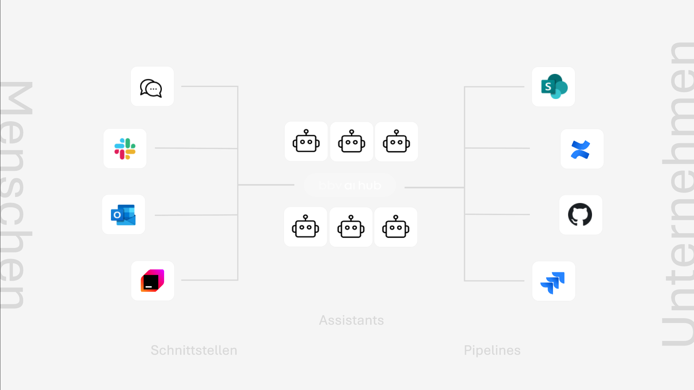
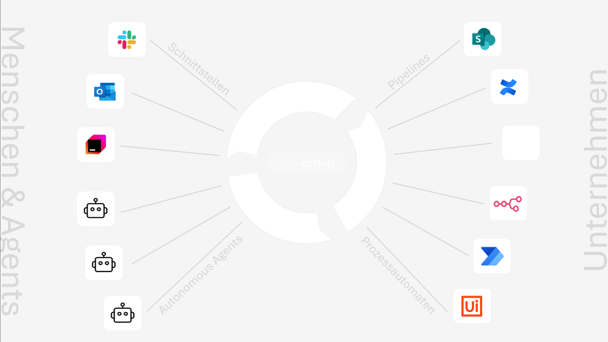

# 0 The AI-Hub – Product Pitch

> tldr; The AI-Hub connects people, enterprise data, and processes through specialized AI assistants and agents that integrate into existing work environments, focusing on specific expertise domains while maintaining human oversight.

## 0.1 The Vision: A New Form of Enterprise Organization

> tldr; The AI-Hub brings specialized AI capabilities directly to where work happens, creating an ecosystem of expert assistants rather than one-size-fits-all solutions.

In today's business world, organizations face the challenge of effectively utilizing the growing amount of data, knowledge, and digital tools. This is precisely where our vision for the AI-Hub comes into play: A central platform that serves as a bridge between people, enterprise knowledge, and digital processes.

Imagine your organization having a rich ecosystem of specialized AI assistants, each with deep expertise in specific domains – financial analysis, project tracking, code review, compliance monitoring – all available exactly where daily work takes place. These focused assistants don't try to do everything; they do one thing exceptionally well, whether analyzing documents, summarizing reports, accelerating processes, or interpreting complex relationships in their domain of expertise. The AI-Hub makes this vision a reality.

## 0.2 Core Concept: The AI-Hub as a Hub for Intelligent Collaboration

> tldr; The AI-Hub integrates domain-specific intelligence into existing workflows rather than forcing employees to adopt new interfaces.

The AI-Hub is far more than just another AI tool. It's a comprehensive platform that seamlessly integrates into the existing enterprise landscape and fundamentally improves how people work. The special feature: AI comes to the people – not the other way around.

Instead of forcing employees to switch to special applications or portals for AI support, the AI-Hub brings focused, specialized intelligence directly into familiar work environments:

- A marketing employee can consult a market research assistant in Microsoft Teams about market data scattered across various internal reports, while a separate analytics assistant helps interpret CRM data
- A developer receives contextual assistance from a code-specific assistant directly in their development environment, based on internal best practices and libraries
- A customer service representative receives relevant customer information from a customer data assistant in real-time during a phone call, while a product assistant provides detailed product specifications

The AI-Hub acts as a central orchestration layer, establishing all necessary connections: between specialized AI assistants and people, between assistants and enterprise data, and between various systems and processes.

## 0.3 The Two Evolution Stages of the AI-Hub: From Assistance to Autonomy

> tldr; The AI-Hub evolves from specialized assistants integrated into workflows to purpose-built agents that participate in redesigned business processes, each focusing on specific expertise domains.

The AI-Hub is designed as an evolutionary platform that can grow with the needs of the organization. This evolution can be divided into two main stages:

## 0.3.1 Stage 1: Reactive AI Assistants – Specialized Support for Specific Needs

> tldr; Purpose-built AI assistants provide domain-specific support across work environments, each focusing on clear areas of expertise while maintaining transparent access to enterprise systems.

In the first stage, the AI-Hub enables seamless integration of specialized AI assistants into daily work activities. Rather than creating generic "do-everything" assistants, the AI-Hub promotes a ecosystem of focused experts, each designed for specific types of tasks or knowledge domains.

**Domain-Specific Expertise:** Each AI assistant is purpose-built for a specific function:
- Finance assistants focus exclusively on financial data, analysis, and reporting
- HR assistants specialize in policy questions, employee processes, and recruiting workflows
- Technical assistants have deep knowledge of specific systems, codebases, or infrastructure
- Each assistant is designed to excel within its defined boundaries and will defer to humans or other assistants when questions fall outside its expertise

**Beyond Knowledge Retrieval:** These assistants do more than just find information:
- They can interact with business applications to retrieve or update data
- They can trigger authorized workflows in enterprise systems
- They can coordinate with other assistants when complex questions span multiple domains
- They can access the internet for appropriate external information when authorized

**Deep Enterprise Integration:** Each assistant has carefully controlled access to relevant resources:
- They connect to specific document repositories, databases, and business applications related to their domain
- Complex queries are handled by coordinating multiple specialized assistants rather than building "all-knowing" assistants
- Historical data and current business context are combined to provide relevant, timely information

**Governance and Control:** All assistant activities are tightly governed:
- Each assistant operates within clearly defined permission boundaries
- Every action and data access is logged and auditable
- Assistants will explicitly state when they reach the limits of their knowledge or authority

A scenario example: A product team discusses a launch issue in a Microsoft Teams channel:

1. **Product Manager:** "We need to delay the Henderson launch by two weeks. What impact will this have on our Q3 targets?"

2. **Product Manager:** "@Finance-Assistant can you analyze the Q3 impact based on Henderson delay?"

3. **Finance Assistant:** "Analyzing Q3 impact... Based on current pipeline forecast, a two-week delay would shift approximately $120K in revenue from Q3 to Q4. This represents about 4% of our quarterly target."

4. **Marketing Lead:** "Can we still meet our launch announcement commitments?"

5. **Marketing Lead:** "@Project-Assistant what are our external commitments for Henderson?"

6. **Project Assistant:** "Checking commitments... We don't have specific dates communicated externally, but we did promise a 'summer release' in the April newsletter and on our website."

7. **Marketing Lead:** "That's right, but we also told TechDaily we'd have it ready for their August 15th product showcase."

8. **Project Assistant:** "I don't have that commitment in my records. It may have been discussed in a meeting not captured in our documentation."

9. **Technical Lead:** "@Dev-Assistant what's the status of the critical bugs?"

10. **Dev Assistant:** "Checking bug tracker... There are currently 3 critical bugs open. Based on historical resolution times, the team would need approximately 8 working days to address them with current staffing levels."

11. **Product Manager:** "Thanks everyone. So we need the two weeks for technical reasons, we can still meet our 'summer release' promise, but we have a potential issue with TechDaily. @Sarah, could you reach out to them about possibly adjusting that timeline?"

In this realistic scenario:
- Each assistant focuses exclusively on its area of expertise
- No assistant attempts to answer questions outside its domain
- The assistants clearly indicate when they're accessing systems and what they find
- Human team members contribute unique knowledge not captured in systems
- The assistants acknowledge information gaps when encountered
- The final decision-making remains with the human team members

This interaction pattern demonstrates how specialized AI assistants integrate into existing workflows, providing deep expertise in specific domains without overstepping their boundaries.

### 0.3.2 Stage 2: Autonomous AI Agents – Rethinking Enterprise Processes

> tldr; Stage 2 reimagines business processes as a collaboration between humans, specialized AI agents, and automation tools, with each component handling tasks best suited to its capabilities while maintaining human oversight.

The second evolutionary stage of the AI-Hub goes far beyond reactive assistance. Here, enterprise processes are fundamentally rethought: as a dynamic interplay between humans, purpose-built AI agents, and traditional process automation tools.

**Process Reconceptualization:** The decisive paradigm shift is that we don't simply digitize or automate processes, but fundamentally redesign them:
- Processes are no longer primarily designed around humans, but as hybrid workflows where each step is assigned to the most suitable actor
- Specialized AI agents handle steps requiring intelligent analysis and contextual understanding within their domain of expertise
- Process automation tools (like Power Automate or n8n) handle deterministic, rule-based tasks
- Humans focus on decisions, creative aspects, and quality assurance

**Tightly Scoped Agents:** Like assistants, agents are designed with clear boundaries:
- Each agent focuses on specific process steps rather than trying to handle entire workflows
- Agents have well-defined capabilities and explicitly recognize their limitations
- Multiple specialized agents collaborate on complex processes, each handling aspects within their expertise

**Beyond Knowledge to Action:** Agents go further than assistants by:
- Autonomously initiating actions based on triggers or schedules
- Coordinating with other agents and systems to move processes forward
- Making recommendations that humans can approve or modify
- Adapting to changing conditions within their defined parameters

**Human-Centered Control:** Despite their autonomy, agents remain firmly under human control:
- Critical decisions always require human approval
- All agent actions are completely transparent and traceable
- Humans can intervene, redirect, or pause agent activities at any time
- The system is designed for collaboration rather than replacement

A scenario example: The HR application process is redesigned through the AI-Hub:
1. A **process automation tool** (Power Automate) captures incoming applications via email and transfers the data to the HR system
2. A **Document Analysis Agent** specializing in resume evaluation analyzes the application:
   - Extracts key qualifications, experience, and skills
   - Structures the information in a standardized format
   - Flags any missing information or inconsistencies
3. A separate **Job Matching Agent** then:
   - Compares the structured applicant data against current job descriptions from SharePoint
   - Calculates match scores for different open positions
   - Identifies strengths and potential gaps
   - Creates a structured summary with recommendations
4. The **HR employee** receives the analysis in Microsoft Teams and makes the decision to invite or decline
5. Based on this decision, a **Communication Agent** creates a personalized response proposal, which the HR employee reviews and approves
6. The **process automation tool** sends the final email and updates the status in the HR system

In this process, each component handles the tasks for which it is best suited: automation tools for simple, rule-based steps; specialized AI agents for domain-specific intelligent analysis; humans for qualitative assessments and final decisions. No single agent attempts to handle the entire process – instead, multiple purpose-built agents collaborate while respecting clear boundaries.

## 0.4 The Architecture of the AI-Hub: Integration, Intelligence, and Transparency

> tldr; The AI-Hub architecture consists of five interconnected layers handling communication, intelligence orchestration, data integration, governance, and process design, creating a secure framework for specialized AI components.

To fulfill its function as a central hub, the AI-Hub has a thoughtful architecture with several key components that work together seamlessly:

### 0.4.1 Communication and Interaction Layer

> tldr; This layer brings specialized AI capabilities to existing work environments, routing queries to appropriate assistants while capturing essential context.

This layer forms the bridge between people and the AI-Hub:

- **Omnipresent Access Points:** The specialized assistants are available where people work:
  - Native integration into Microsoft Teams, Slack, and other collaboration platforms
  - Integration into email clients and specialized applications
  - Web-based chat interface for direct access
  - Optional: Voice integration for telephone assistance

- **Context-Aware Interaction:** The interfaces capture not only the text of a request but also the broader context:
  - Who is asking? (Role, permissions, department)
  - In what context? (Meeting, project, customer conversation)
  - With what history? (Previous interactions, ongoing discussions)

- **Intelligent Routing:** The system directs requests to the most appropriate specialized assistant based on:
  - The content and intent of the request
  - The user's role and past interactions
  - The specific expertise domains of available assistants

The communication layer ensures that interaction with specialized assistants is as natural and smooth as possible, without additional learning effort for users.

### 0.4.2 Intelligence and Reasoning Layer

> tldr; This layer orchestrates specialized assistants and agents, ensuring each operates within its defined expertise boundaries while enabling secure inter-assistant collaboration.

The heart of the AI-Hub is the intelligence layer, responsible for understanding, reasoning, and generating responses and actions:

- **AI Engine:** Based on advanced language models (LLMs) such as GPT or Claude models, the AI Engine understands natural language and can generate contextually relevant, precise answers within defined domains

- **Specialized Agent System:** Manages the ecosystem of AI assistants and agents:
  - Defines and enforces their specific capabilities and expertise boundaries
  - Orchestrates collaboration between different specialized assistants
  - Monitors their execution and performance
  - Ensures they operate only within authorized parameters

- **Workflow Engine:** Controls the execution of processes:
  - Defines workflows as sequences of steps
  - Assigns steps to humans or appropriate specialized agents
  - Tracks the progress and status of processes
  - Maintains clear boundaries between different agent responsibilities

The intelligence layer combines the strengths of modern AI with structured workflows to enable both specialized assistance and reliable process automation, all while maintaining clear boundaries of expertise and authority.

### 0.4.3 Data Integration and Knowledge Layer

> tldr; This layer provides controlled access to enterprise data sources, ensuring each assistant can access only relevant information while maintaining comprehensive security.

This layer connects the AI-Hub with the collective knowledge and data of the organization:

- **Universal Connectors:** Enable selective, controlled connection to various data sources:
  - Document management systems (SharePoint, OneDrive, etc.)
  - Databases and data warehouses
  - CRM and ERP systems
  - Project management tools (Jira, Azure DevOps, etc.)
  - Code repositories (GitHub, Azure Repos, etc.)

- **Knowledge Preparation:** Transforms raw data into usable knowledge:
  - Indexing of documents for semantic search
  - Creation of knowledge graphs for relationships
  - Vectorization of content for similarity-based queries

- **Granular Permission Management:** Ensures that information is only accessible to authorized assistants and users:
  - Each assistant has access only to data sources relevant to its domain
  - All data access respects existing permission structures
  - Every data retrieval is logged transparently
  - Sensitive information is protected by multiple security layers

Through the knowledge layer, each specialized assistant becomes an expert in its domain without compromising security or enabling inappropriate access to information.

### 0.4.4 Governance and Transparency Layer

> tldr; This layer ensures complete accountability through comprehensive logging, visualization of decision paths, and control mechanisms for all assistant and agent activities.

This essential component ensures control, traceability, and trust:

- **Comprehensive Activity Logging:** Documents all actions in the system:
  - What requests were made to which assistants?
  - Which data sources were consulted?
  - What decisions were made by agents?
  - What actions were executed in connected systems?

- **Transparency Dashboard:** Provides complete insight into how each assistant or agent operates:
  - Visualizes decision paths and reasoning foundations
  - Shows information sources used for each response
  - Enables tracing of conclusions and recommendations
  - Highlights when assistants collaborate or hand off tasks

This layer is crucial for the trustworthy adoption of the AI-Hub, as it ensures that every AI component always acts transparently, controllably, and in accordance with company policies.

### 0.4.5 Process Design and Monitoring

> tldr; This component enables the creation, monitoring, and adaptation of hybrid workflows combining specialized AI capabilities with human expertise.

This component enables the design and monitoring of hybrid human-AI processes:

- **Real-time Monitoring:** Provides overview of ongoing processes:
  - Status and progress of all workflows
  - Identification of bottlenecks and delays
  - Performance indicators for process optimization
  - Visibility into which specialized agents are handling which steps

This component bridges traditional process management and AI-supported automation by providing a holistic view of hybrid workflows while maintaining clear boundaries between different specialized AI components.

## 0.5 Benefits of the AI-Hub: Transformation at Multiple Levels

> tldr; The AI-Hub delivers targeted benefits across the organization through specialized AI capabilities that complement human expertise rather than attempting to replace it.

The described architecture of the AI-Hub brings significant benefits for organizations at various levels:

### For Employees:
- **Immediate Access to Domain-Specific Expertise:** Specialized assistants provide focused support in their areas of knowledge
- **Focus on Value-Creating Activities:** Freedom from repetitive, time-consuming tasks within well-defined boundaries
- **Contextually Relevant Support:** Precise assistance exactly when needed from the most appropriate specialized assistant
- **Lower Entry Barrier:** Using specialized AI without technical knowledge or additional applications

### For Leaders:
- **Accelerated Processes:** Significant reduction in throughput times through targeted automation
- **Data-Driven Decision Making:** Better decisions through contextualized information from domain-expert assistants
- **Scalable Efficiency Gains:** Relief for teams without staff increases through strategic deployment of specialized agents
- **Process Transparency:** Clear insights into workflows, including which specialized agents handle which steps

### For the Organization:
- **Competitive Advantage through Agiliy:** Faster response to market requirements through specialized expertise on demand
- **Targeted Knowledge Activation:** Focused assistants that excel in specific domains rather than generic solutions
- **Continuous Optimization:** Learning processes that continuously improve within their expertise boundaries
- **Sustainable Growth:** Scaling through addition of specialized capabilities without exponential complexity increases

## 0.6 Security and Compliance: Trust as a Fundamental Principle

> tldr; Security and compliance are core design principles, with specialized assistants operating under strict access controls and comprehensive auditing.

The AI-Hub was developed from the ground up with security and compliance as central design principles:

- **Data Sovereignty:** All data remains within the company environment or is processed according to strict guidelines
- **Granular Permission Concept:** Each assistant operates within tightly defined access boundaries
- **End-to-End Encryption:** Secure data transfer at all levels
- **Comprehensive Audit Trail:** Complete documentation of all activities for compliance and traceability
- **Risk Graduation:** Multi-layered controls depending on the sensitivity of data and processes

## 0.7 Conclusion: The AI-Hub as a Pioneer for the Intelligent Organization

> tldr; The AI-Hub creates a hybrid organization where humans collaborate with specialized AI assistants and agents, each contributing their unique strengths while maintaining clear boundaries.

The AI-Hub represents a fundamental change in how organizations activate knowledge, design processes, and empower people. It bridges the gap between isolated data silos and daily work, between rigid automation solutions and flexible human processes.

With its evolutionary architecture – from specialized assistants integrated into daily work to purpose-built agents that collaborate on reimagined processes – the AI-Hub offers a pragmatic way to integrate AI gradually and controllably into the organization. The result is a new form of hybrid organization, where humans work alongside specialized AI components, each focusing on what they do best.

The AI-Hub is thus not just a technical platform, but a strategic enabler for companies that want to succeed in an increasingly data-driven and complex business world – with people always at the center, supported by intelligent, trustworthy AI technology that excels within clear boundaries rather than attempting to do everything.