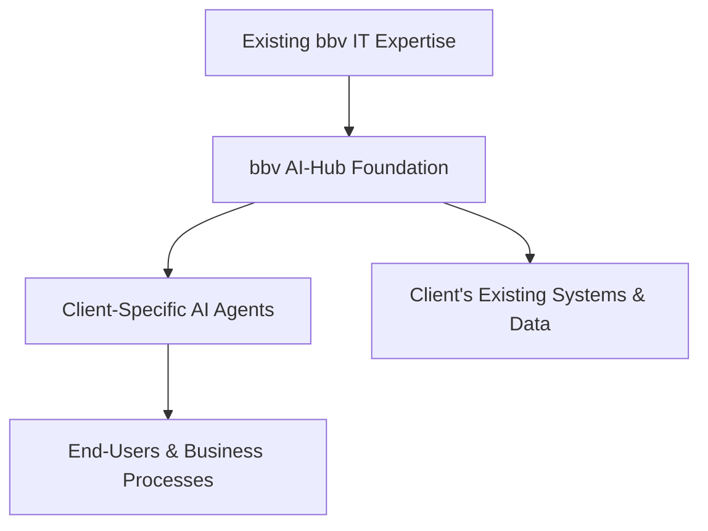
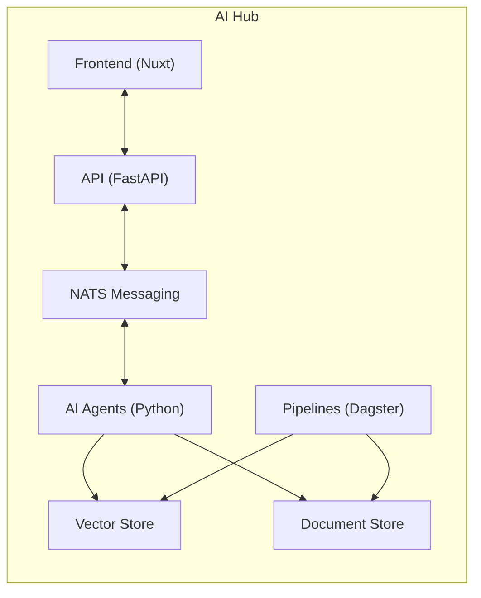

# 1. Introduction

## 1.1 What is the AI-Hub?

> tldr; The AI-Hub is more than just a code repository; it is a carefully crafted and evolving platform that encapsulates best practices, standardizes common functionalities, and allows bbv to deliver AI solutions with greater agility and reliability. As you progress through the subsequent sections—for instance, understanding the deeper reasoning behind AI agents in Section 1.2 or the foundational principles of how the AI-Hub approaches workflows and autonomy in Section 2—you will see how the core ideas introduced here form the bedrock of the entire AI-Hub ecosystem.

The **bbv AI-Hub** is a foundational software framework designed and developed by bbv Software Services AG to accelerate and streamline the creation of AI-driven solutions, specifically AI agents, within enterprise contexts. It serves as a robust starting point for new AI projects, providing a standardized, tested, and maintainable backbone that can be extended and adapted to meet the unique challenges of different client use cases.

**Key Idea:** Instead of starting each AI project from scratch—setting up infrastructure, integrating language models, implementing workflows, and ensuring compliance with enterprise requirements—the AI-Hub offers a common ground where most of these foundational components are already in place. Over time, as teams build client-specific solutions on top of the AI-Hub, they take advantage of a cumulative body of best practices, stable architecture, and proven approaches, leading to higher efficiency, reliability, and trust in AI projects.

### Overview

At a high level, the AI-Hub can be thought of as a **core platform** that enables bbv and its clients to quickly conceptualize, prototype, and implement AI-driven agents without having to solve the same foundational problems repeatedly. While future sections—such as [Section 2: Core Concepts and Philosophy](2_core_concepts_and_philosophy.md) or [Section 4: Architectural Overview](4_architectural_overview.md)—will introduce the underlying architecture, workflows, event-driven systems, and other technical details, at this introductory stage we focus on the essential rationale behind the AI-Hub and how it fits into bbv’s service landscape.

**Core Motivations:**

1. **Reusability & Standardization:**  
   Many AI-driven projects share similar foundational needs—like integrating with language models, orchestrating steps in a workflow, handling data ingestion, maintaining traceability, and ensuring compliance with security and privacy standards. The AI-Hub abstracts these commonalities into a base repository and libraries that can be reused across multiple projects.  
   
2. **Reduced Complexity at Onset:**  
   Instead of spending precious time setting up infrastructure and basic plumbing for every new AI agent project, developers can start from a working baseline. This includes well-defined building blocks, such as defined steps for agents, initial pipeline templates for data ingestion, and integration points with external tools or services. The result is a significant reduction in the complexity that developers face at project kick-off.

3. **Faster Iteration & Time-to-Value:**  
   With foundational components readily available, teams can jump directly to tackling the client-specific business problem. This leads to quicker proof-of-concept implementations and shorter time-to-value, as the overhead of foundational work is minimized.

4. **Quality, Reliability, & Maintainability:**  
   By centralizing best practices, architectural patterns, and proven design decisions within the AI-Hub, bbv ensures consistency and reliability across projects. The AI-Hub codebase undergoes continuous improvement, guided by lessons learned from diverse client engagements. Over time, this stable, well-engineered core helps maintain a high level of code quality and reduces the risk of reinventing potentially error-prone solutions.

### Positioning Within bbv’s Portfolio

The AI-Hub complements bbv’s longstanding expertise in **IT consulting, software engineering, and digital transformation services.** As many clients now look toward leveraging advanced AI capabilities—such as language model-based reasoning, automated decision-making, or knowledge retrieval—bbv positions the AI-Hub as the go-to starting point for these endeavors.

**How the AI-Hub fits into bbv’s ecosystem:**

- **Alignment with bbv’s IT Services:**  
  bbv’s portfolio includes extensive custom software development, cloud integrations, project management, and digital solution consulting. The AI-Hub naturally extends these services into the realm of AI-based solutions. It is not a stand-alone product that replaces established IT offerings, but rather one that augments them. Clients engaging with bbv for traditional software development or modernization efforts can now seamlessly incorporate AI functionalities into their solutions without a steep technical learning curve.

- **Synergy with Ongoing Client Relationships:**  
  bbv often maintains long-term partnerships with clients, understanding their domains, challenges, and IT landscapes in depth. The AI-Hub leverages this intimate knowledge, acting as a neutral yet adaptable foundation. When a trusted client expresses interest in exploring AI-driven solutions—such as automating support tasks, improving document retrieval processes, or building specialized industry-tailored assistants—the AI-Hub can be quickly introduced into their environment. This stands in contrast to solutions that require a complex and lengthy onboarding phase.

- **A Bridge between Experimentation and Enterprise-Grade Solutions:**  
  Clients curious about AI often begin with small proofs of concept or exploratory workshops. The AI-Hub allows these experiments to rapidly materialize into tangible, interactive prototypes (refer to [Section 3: Project Phases and Client Engagement](3_project_phases_and_client_engagement.md) for details on workshops and PoCs). As these prototypes mature, the AI-Hub seamlessly scales to production-grade deployments, ensuring that the initial experimental phase does not become throwaway work, but rather an incremental step toward a robust final solution.

**In essence, the AI-Hub is positioned as:**
- A **foundation** for building AI solutions with confidence and speed.
- A **connector** between bbv’s existing IT capabilities and cutting-edge AI functionalities.
- A **catalyst** that shortens the path from AI vision to actual business value.

### Illustrative High-Level View

While deep architectural details and workflow mechanisms belong to later sections (notably [Section 4: Architectural Overview](#) for infrastructure details and [Section 5: Agents in Detail](5_agents_in_detail.md) for understanding workflows), we can visualize the AI-Hub as a central pillar in bbv’s AI offerings.

- **Existing bbv IT Expertise (A):** Represents bbv’s broad IT services and best practices.
- **bbv AI-Hub Foundation (B):** The core platform for rapidly building and integrating AI agents.
- **Client-Specific AI Agents (C):** These are agents tailored to solve a client’s particular challenges. (Explained in-depth in later sections, especially around AI agents’ workflows in [Section 5](5_agents_in_detail.md).)
- **Client’s Existing Systems & Data (D):** The AI-Hub integrates smoothly with current systems and data repositories, ensuring minimal friction and leveraging existing assets.
- **End-Users & Business Processes (E):** Ultimately, the solutions built on top of the AI-Hub serve the client’s end-users and business operations, delivering tangible value.

## 1.2 Why AI Agents?

> tldr; AI agents, positioned between the deterministic world of traditional software and the adaptive reasoning of human intelligence, unlock new levels of automation and efficiency. Understanding their fundamental role sets the groundwork for deeper technical insights. As the documentation moves forward, you’ll discover how these agents are practically built ([Section 5](5_agents_in_detail.md)), integrated into broader workflows ([Section 2](2_core_concepts_and_philosophy.md)), and harmonized with existing IT infrastructures ([Section 4](4_architectural_overview.md)). This initial conceptual understanding of *why AI agents matter* will frame how we approach their design, implementation, and ongoing evolution throughout the rest of the AI-Hub ecosystem.

In recent years, the capabilities of Artificial Intelligence—especially those powered by Large Language Models (LLMs)—have advanced to a point where they can perform tasks that previously required human-level interpretation, reasoning, or decision-making. Traditional algorithms, while excellent at performing predefined, rule-based computations, often struggle when faced with ambiguity, changing contexts, or unstructured data. AI agents, on the other hand, bridge this gap by combining the deterministic efficiency of algorithms with the adaptive, context-sensitive intelligence that characterizes human problem-solving.

Whereas Section [1.1](#11-what-is-the-ai-hub) focused on the rationale behind the AI-Hub itself, we now zoom in on the conceptual role of AI agents, which stand at the heart of this platform. Understanding *why AI agents are necessary and useful* sets the stage for the more detailed explanations that will appear later in the documentation—for instance, how agents are structured and orchestrated in [Section 5: Agents in Detail](5_agents_in_detail.md) and how they fit into broader workflows discussed in [Section 2: Core Concepts and Philosophy](2_core_concepts_and_philosophy.md).

### The Concept of AI Agents

**From Rigid Algorithms to Adaptive Intelligence:**
- Traditional software solutions rely on explicitly defined instructions. They follow static rules, perform data transformations, or handle structured input/output scenarios with great speed and reliability. Yet, as soon as the problem becomes less clearly defined—such as understanding a vague customer request, sifting through large volumes of heterogeneous documents, or making sense of partially known contexts—these rigid rules begin to falter.
- Humans excel at such scenarios because they interpret context, handle ambiguities, infer missing pieces, and adapt strategies as new information emerges. **AI agents approximate this kind of flexible, context-aware reasoning**. They are not strictly defined by hard-coded instructions; instead, they harness intelligence (often provided by LLMs or other advanced AI models) to reason about tasks, break them down into subtasks, and select appropriate actions from a toolkit of capabilities.

**Filling the Gap:**
- **Without AI Agents:** Businesses rely heavily on manual interventions or over-engineered algorithms that struggle to cope with slight deviations from expected inputs.  
- **With AI Agents:** The workflow can be partially or fully automated in a way that was previously not feasible. An AI agent can observe a problem, reason about potential solutions, interact with tools or data sources, and generate the desired outcome with minimal human guidance.

**Controlled Autonomy:**
- Unlike a “black-box” AI system that attempts to solve everything in a fully unsupervised manner, AI agents (especially those built atop the AI-Hub) operate within defined workflows. While they possess intelligence to handle nuances, they also work within boundaries, ensuring that their actions remain transparent, traceable, and compliant with business rules. This concept of blending autonomy with control will be elaborated in [Section 2](2_core_concepts_and_philosophy.md).

### Use Cases for AI Agents

**1. Autonomous Workflows and Task Automation:**  
In many organizations, routine tasks—like routing incoming support emails, extracting information from documents, summarizing reports, or performing quality checks on data—consume valuable employee time. AI agents can shoulder these responsibilities by autonomously executing predefined workflows:
- **Example:** An AI agent in a support scenario receives a customer’s question (in natural language), decides which department should handle it, forwards relevant details internally, and even attempts to draft a solution based on the company’s knowledge base. This reduces human intervention to more complex cases only.
- **Further Exploration:** Details about designing such step-by-step workflows can be found in [Section 5: Agents in Detail](5_agents_in_detail.md).

**2. Business-Specific Knowledge Tasks:**  
In many industries—healthcare, finance, manufacturing, legal—experts spend significant effort navigating dense bodies of domain-specific knowledge. AI agents excel at searching, retrieving, and synthesizing this information quickly:
- **Example:** For a medical organization, an AI agent could swiftly scan a large regulatory handbook, answer questions about changes in tariffs or policies, and highlight which internal guidelines need to be updated. (This kind of scenario is reminiscent of the FMH example hinted at in [Section 1.1](#11-what-is-the-ai-hub), though details on that project’s agents will appear in later sections.)
- **Outcome:** Doctors, administrators, or compliance officers can spend less time paging through documents and more time focusing on value-added decision-making.

**3. Intelligent Document Processing and Content Management:**  
When dealing with large volumes of unstructured data—reports, invoices, emails, research articles—AI agents can be tasked with extracting relevant information, indexing documents, or summarizing content:
- **Example:** A private bank’s AI agent might read incoming regulatory newsletters, determine if they’re relevant to the bank, identify which internal rules may need updating, and propose draft amendments. This scenario was mentioned briefly when discussing how AI agents can move beyond chatbot interfaces to act autonomously in the background. Details on such autonomous behaviors and triggers will be explored in later chapters on pipelines and workflows.

**4. Enhanced Human-in-the-Loop Experiences:**  
Sometimes, complete autonomy isn’t the goal. AI agents can assist humans by acting as first-level “intelligent filters” that propose solutions or insights which humans then refine. This is particularly attractive in domains where ultimate accountability rests with a human decision-maker, but the grunt work of sifting through data can be partially offloaded:
- **Example:** An AI agent might draft a complex email response or a summary report, which a human professional then reviews, edits, and finalizes. This collaborative model is further discussed when we talk about human-in-the-loop steps and agent workflows in [Section 5](5_agents_in_detail.md).

### Key Advantages in Real-World Scenarios

When implemented through the AI-Hub, AI agents offer:

- **Scalability:** Instead of hiring more staff to handle increased workload, deploy additional instances of an AI agent to process more tasks in parallel.
- **Consistency and Quality:** AI agents apply the same logic and reasoning patterns every time, minimizing the risk of human error or oversight.
- **Cost Efficiency:** By handling repetitive or knowledge-intensive tasks autonomously, AI agents free up skilled professionals to focus on strategic, creative, or interpersonal aspects of their roles.
- **Faster Adaptation to Change:** AI agents can quickly learn from or adjust to updated policies, product lines, or compliance requirements, ensuring that the business remains agile in dynamic environments.

## 1.3 High-Level Architecture

> tldr; The high-level architecture of the AI-Hub is designed to provide a coherent framework where agents (the intelligent core) interact seamlessly with an API (the coordinator), a frontend (the user-facing interface), and pipelines (the data backbone). Under the hood, an array of technologies—Python, NATS, Azure services, Vue/Nuxt, and more—power this integration. This architectural understanding sets the stage for the more in-depth technical explanations that follow. As you progress to subsequent sections—such as [Section 2: Core Concepts and Philosophy](2_core_concepts_and_philosophy.md) to learn about guiding principles, or [Section 4: Architectural Overview](4_architectural_overview.md) for a detailed breakdown of services—you will see how each of these components and technologies fits together to form a robust, flexible, and scalable AI solution.

As we’ve explored in [Section 1.1](#11-what-is-the-ai-hub) and [Section 1.2](#12-why-ai-agents), the AI-Hub serves as a foundation for building AI-driven solutions. At the heart of these solutions lie **AI agents**—intelligent components that operate within structured workflows. However, these agents do not exist in isolation. They interact with users, data sources, and other systems through a carefully designed architecture composed of multiple interrelated components.

This section provides a high-level, conceptual overview of the **core components** that make up the AI-Hub’s architecture and the **technologies** enabling them. Later sections—particularly [Section 4: Architectural Overview](4_architectural_overview.md) for a deeper technical insight—will delve into these details more thoroughly, but for now, we’ll map out the major building blocks and their roles.

### Core Components of the AI-Hub

At its core, the AI-Hub can be visualized as a system of four main pillars working in concert: **Agents, API, Frontend, and Pipelines.** These pillars provide distinct but complementary functionalities, ensuring that the overall solution is both versatile and robust.

1. **Agents:**  
   The primary drivers of AI-driven logic, agents encapsulate the “brains” of the system. As introduced in [Section 1.2](#12-why-ai-agents), these entities can understand instructions, break down tasks, retrieve and process information, and autonomously navigate through well-defined workflows.
   
   - **What Agents Do (Conceptually):**  
     They represent the intelligence layer, taking an input (such as a user request, a document, or an event) and producing an output after a series of reasoning steps.  
   - **Controlled Autonomy:**  
     While agents may use AI models to reason, they operate within constraints to ensure consistency, reliability, and compliance.
   - **References in Later Sections:**  
     [Section 5: Agents in Detail](5_agents_in_detail.md) will unpack how agents are implemented, configured, and scaled.

2. **API (Backend):**  
   The API acts as a communication and coordination hub. It connects the frontend to the agents, manages event flows, handles authentication, and ensures data integrity.
   
   - **Role of the API:**  
     Think of it as the central dispatcher that receives user requests (e.g., a question in a chat-like interface), passes them to the relevant agent, and returns the agent’s response back to the user.  
   - **Key Points:**  
     The API ensures that only authorized users access the system, coordinates data retrieval or storage, and orchestrates multiple agents if needed.
   - **Deeper Technical Details:**  
     More on API endpoints, authentication mechanisms, and integration with underlying technologies will be covered in [Section 8: Backend / API](8_backend_api.md).

3. **Frontend (Web UI):**  
   The frontend provides a user-friendly interface for interacting with agents and viewing results. While AI agents themselves are backend processes, their usefulness often hinges on how easily end-users (or other systems) can access their capabilities.
   
   - **User Experience:**  
     The frontend might appear as a chat interface, a dashboard for reviewing documents, or even a document editing workspace. It adapts to the scenario at hand.  
   - **Flexibility:**  
     By representing AI-agent outputs as event streams, the frontend can handle various interaction paradigms—from chat-like Q&A to document-centric workflows.  
   - **Technical Foundations:**  
     Written with Vue/Nuxt and TypeScript, the frontend aligns with modern web development standards. Future details will appear in [Section 7: Frontend](7_frontend.md).

4. **Pipelines (Data & Workflow Automation):**  
   Pipelines automate the ingestion, processing, and indexing of data. Before agents can reason about a company’s documents or policies, those materials must be properly parsed, transformed, and made accessible.
   
   - **Purpose:**  
     Pipelines ensure that the raw data (e.g., PDFs, Word docs, structured databases) are continuously fed into the system, enriched, and transformed into a format agents can use—such as vectorized representations for semantic search.  
   - **Resilience & Transparency:**  
     Pipelines can run periodically, handle incremental updates, and maintain full traceability of data flows. They help ensure that agents always have the latest, highest-quality information at their disposal.  
   - **Further Reading:**  
     More specific pipeline logic and best practices are covered in [Section 6: Pipelines](6_pipelines.md).

### Technologies in Use

The AI-Hub leverages a well-curated technology stack that balances performance, scalability, and developer productivity. This stack is designed to integrate smoothly into enterprise IT environments and supports both cloud-based and on-premises deployments.

**Backend and Agents:**
- **Python:**  
  Python serves as the primary language for implementing agents, the backend API, and the pipeline logic. Its rich ecosystem, combined with libraries for machine learning and data processing, makes it a natural fit.
- **NATS & JetStream:**  
  NATS, a high-performance messaging system, along with its JetStream persistence layer, provides the event-driven backbone of the AI-Hub. Agents, pipelines, and the API communicate by publishing and subscribing to events, ensuring a scalable and decoupled architecture. NATS is crucial for orchestrating distributed workflows.

**Integration with Azure and Other Services:**
- **Azure Cognitive Services & Hosting Options:**  
  Language models, speech-to-text, document parsing (e.g., Azure Document Intelligence), and other AI capabilities may be sourced from Microsoft Azure.  
  While Azure integration is common, the AI-Hub is flexible and can integrate with various cloud providers or on-prem systems depending on client needs.
- **Vector Databases and Document Stores:**  
  Storing vector embeddings for semantic search or caching processed documents often involves specialized databases (e.g., vector stores or MongoDB). Such databases play a crucial role in retrieval-augmented generation and other advanced AI techniques.

**Frontend Stack:**
- **Vue & Nuxt 3:**  
  Modern frontend frameworks that support rapid development of interactive and dynamic user interfaces.
- **Tailwind CSS:**  
  A utility-first CSS framework that helps maintain consistent, responsive designs.
- **Pinia & Other Vue Ecosystem Tools:**  
  State management, internationalization, and other frontend capabilities are implemented using well-established Vue ecosystem tools.

**Additional Tools and Processes:**
- **CI/CD Pipelines & Testing Frameworks:**  
  Automated testing, linting, and type checks ensure code quality. Tools like `black`, `mypy`, `eslint`, and `ruff` standardize coding practices and help maintain a high standard of quality.
- **Infrastructure as Code (IaC) with Pulumi:**  
  By defining infrastructure in code, deployments to Azure or other environments become reproducible, reliable, and easy to manage.

### High-Level Architecture Diagram

The following mermaid diagram provides a top-level view of how the four main pillars integrate, highlighting the event-driven nature and the flow of data between components:

