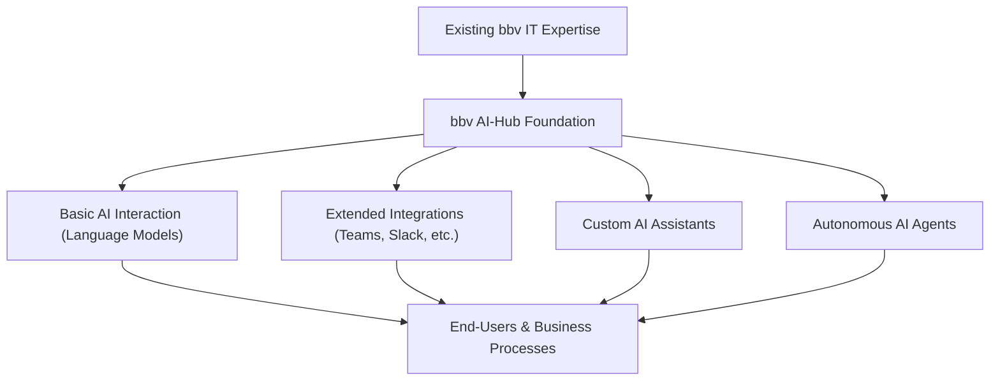
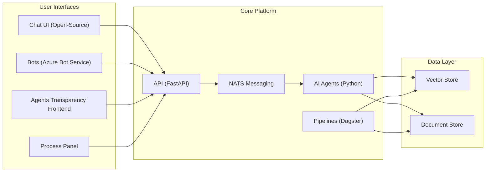

# 1. Introduction

## 1.1 What is the AI-Hub?

> tldr; The AI-Hub is much more than just a code repository; it is a dynamic, multi-tiered platform that encapsulates best practices, standardizes core functionalities, and delivers a scalable suite of AI solutions—from basic language model access to custom-developed autonomous agents. As you progress through later sections—for instance, exploring the reasoning behind AI agents in Section 1.2 or the guiding workflow principles in Section 2—you’ll understand how these core ideas form the bedrock of the entire AI-Hub ecosystem.

The **bbv AI-Hub** is a foundational software framework designed and developed by bbv Software Services AG to accelerate and streamline the creation of AI-driven solutions in enterprise environments. Originally established as a robust starting point for new AI projects, the AI-Hub has evolved into a comprehensive offering delivered in four tiers, each building on the previous one to meet increasingly sophisticated business needs:

1. **Basic Tier:**  
   Enterprises gain company-wide access to advanced language models—ranging from commercial solutions like GPT to cutting-edge open source options. Through a modern web interface (comparable to leading platforms), users can start and archive chats, organize conversations into folders, and leverage features such as voice input/output, code and image generation, and interactive video interactions. This foundational tier is available at a competitive licensing rate, ensuring that organizations can immediately benefit from high-quality AI capabilities.

2. **Basic+ Tier:**  
   Beyond the web interface, this level extends the AI-Hub’s reach by offering API integrations with collaboration tools such as Microsoft Teams, Slack, email, and SMS. This integration allows organizations to embed AI-driven interactions directly into their everyday workflows, enabling a more natural and ubiquitous use of language models across the enterprise.

3. **Assistant Package:**  
   Leveraging our framework, bbv rapidly develops custom AI assistants tailored to an organization’s unique processes. These reactive, chat-based assistants are designed to offer context-aware support and include an integrated transparency module—empowering employees to trace how answers are generated, which data sources were used, and which tools contributed to the response. Typically delivered as a project-based engagement, this package ensures that the AI solution aligns precisely with the client’s operational needs.

4. **Agent Package:**  
   The most advanced tier focuses on building fully autonomous AI agents that proactively participate in business processes. Unlike reactive assistants, these agents are designed to analyze workflows, autonomously determine process steps, and execute tasks with minimal human intervention. To maintain control and build trust, the platform includes an admin panel and comprehensive tracing mechanisms, ensuring that every decision and action is transparent and compliant with enterprise standards.

Instead of starting each AI project from scratch—setting up infrastructure, integrating language models, designing workflows, and ensuring regulatory compliance—the AI-Hub offers a pre-built, scalable platform. This foundation not only accelerates development but also allows organizations to evolve their AI capabilities over time, transitioning seamlessly from basic model interactions to sophisticated, process-automating agents.

The AI-Hub ensures that all tiers—whether interacting with basic language models, custom‑developed AI assistants, or fully autonomous agents—are accessible through a unified user interface. This consistency minimizes the learning curve and allows employees to use the same platform (via web, Teams, Slack, etc.) across all AI functionalities.

> **Note:**  
> **AI Assistants** are custom‑developed, reactive, chat‑based solutions designed to provide context‑aware support when prompted by a user. In contrast, **AI Agents** are built for autonomous process automation—they monitor workflows and execute tasks proactively, with human oversight built into critical process steps.

### Overview

At its core, the AI-Hub is a **platform of platforms**—a cohesive ecosystem that empowers bbv and its clients to rapidly conceptualize, prototype, and implement AI-driven solutions across a spectrum of complexity. Whether you’re beginning with basic language model access or scaling up to custom-developed assistants and autonomous agents, the AI-Hub provides the standardized, robust backbone needed to meet modern enterprise challenges. Future sections—such as [Section 2: Core Concepts and Philosophy](2_core_concepts_and_philosophy.md) and [Section 4: Architectural Overview](4_architectural_overview.md)—will delve into the underlying architectures, workflows, and event-driven systems that support this vision.

**In essence, the AI-Hub is positioned as:**
- A **foundation** for rapidly building and scaling AI solutions.
- A **connector** that integrates bbv’s IT expertise with advanced AI functionalities.
- A **catalyst** that evolves with your organization—from enabling basic interactions to automating complex business processes.

### Positioning Within bbv’s Portfolio

The AI-Hub not only complements bbv’s longstanding expertise in **IT consulting, software engineering, and digital transformation services**, but also embodies a forward-thinking, tiered approach to AI adoption. Organizations can start with basic language model access—delivering a rich chat interface and seamless integration with everyday workflows—and then progressively evolve their AI capabilities toward custom assistants and fully autonomous agents that drive process automation. This tiered offering ensures that companies can experiment with AI, refine their needs, and ultimately deploy enterprise-grade, transparent, and fully traceable AI solutions tailored to their specific business challenges.

**How the AI-Hub fits into bbv’s ecosystem:**

- **Alignment with bbv’s IT Services:**  
  bbv’s portfolio spans custom software development, cloud integrations, project management, and digital solution consulting. The AI-Hub augments these services by providing a scalable, adaptable AI framework that supports everything from basic model interactions to advanced assistant and agent solutions. This enables clients to integrate AI functionalities seamlessly into their existing IT landscapes without a steep technical learning curve.

- **Synergy with Ongoing Client Relationships:**  
  With long-term partnerships and deep industry expertise, bbv leverages the AI-Hub as a neutral yet adaptable foundation. Whether a client is looking to quickly automate support tasks, enhance document processing, or develop specialized, custom-tailored AI assistants and agents, the AI-Hub can be rapidly customized and deployed—minimizing onboarding friction and accelerating the realization of business value.

- **A Bridge between Experimentation and Enterprise-Grade Solutions:**  
  Many organizations begin their AI journey with exploratory workshops or small proofs of concept. The AI-Hub facilitates these initial experiments with a robust base model that can later be expanded—through integrations with tools like Teams or Slack and by introducing custom-built assistants and autonomous agents—into a comprehensive solution. This evolutionary approach ensures that early AI initiatives lay the groundwork for transformative, long-term digital strategies.

**In essence, the AI-Hub is positioned as:**
- A **foundation** for building AI solutions with confidence and speed.
- A **connector** that integrates bbv’s traditional IT expertise with evolving AI functionalities.
- A **catalyst** that empowers organizations to transition smoothly from basic model interactions to comprehensive, process-automating agents.

### Illustrative High-Level View

The AI-Hub is built as a central pillar in bbv’s AI offerings, seamlessly bridging traditional IT expertise with innovative AI capabilities. Whether deploying a basic language model interface, integrating with collaboration tools, or rolling out custom assistants and fully autonomous agents, the AI-Hub adapts to meet a wide range of enterprise needs. The diagram below illustrates this integrated ecosystem:

- **Existing bbv IT Expertise (A):** Represents bbv’s rich background in IT services, software engineering, and digital transformation.
- **bbv AI-Hub Foundation (B):** The core platform that rapidly delivers AI solutions across multiple tiers.
- **Basic AI Interaction (C):** Entry-level access to advanced language models via an intuitive web interface.
- **Extended Integrations (D):** API and collaboration tool integrations that embed AI into daily workflows (e.g., via Teams, Slack, email, or SMS).
- **Custom AI Assistants (E):** Tailored, reactive assistants designed to augment human work with transparency and traceability.
- **Autonomous AI Agents (F):** Fully automated agents that proactively drive business processes with comprehensive oversight.
- **End-Users & Business Processes (G):** Ultimately, all layers of the AI-Hub serve to enhance productivity and decision-making across the organization.

## 1.2 Why LLM Access, Assistants, and Agents?

> tldr; In today’s evolving AI landscape, organizations begin with direct access to powerful Large Language Models (LLMs) that enable rich conversational interactions. Building on this foundation, reactive AI assistants provide context-aware, transparent support for day-to-day tasks, and fully autonomous AI agents take a proactive role in automating complex business processes. Together, these layers unlock unprecedented efficiency and adaptability, bridging the gap between traditional software and human-like reasoning.

Recent advances in Artificial Intelligence—especially through LLMs—have transformed the way businesses interact with technology. Direct LLM access offers an immediate gateway to advanced natural language capabilities, enabling users to interact naturally with machines. However, while raw LLM access is transformative, it serves as the first step in a broader evolution toward more integrated and effective AI solutions.

**LLM Access:**  
At the most basic level, the AI-Hub provides seamless access to state-of-the-art language models. This entry point empowers organizations with a modern, intuitive chat interface—featuring functionalities such as voice input/output, code and image generation, and interactive video interactions. By democratizing access to these powerful models, every user in an organization can experience the benefits of advanced natural language processing without the need for complex setup or specialized training.

**AI Assistants:**  
Building on the foundation of LLM access, AI assistants introduce a layer of tailored, context-aware support. These reactive agents are designed to help users complete specific tasks by integrating business-specific data and workflows. With built-in transparency features, users can trace how responses are generated, ensuring accountability and trust. Furthermore, AI assistants extend beyond the web interface, seamlessly integrating with collaboration tools like Microsoft Teams, Slack, email, and SMS—bringing AI support directly into the daily tools and communications that drive business.

**AI Agents:**  
Taking automation to the next level, AI agents represent a shift from reactive support to proactive process automation. Unlike assistants that respond to user prompts, agents are engineered to autonomously engage with business processes. They analyze workflows, determine necessary actions, and execute tasks with minimal human intervention. Despite their autonomy, these agents are equipped with comprehensive logging and transparency modules that allow organizations to monitor, control, and audit their actions—ensuring that the drive toward automation never comes at the expense of oversight and compliance.

Whereas Section [1.1](#11-what-is-the-ai-hub) introduced the overall vision of the AI-Hub, this section zooms in on the spectrum of AI-driven capabilities—from the foundational LLM access, through context-rich assistants, to fully autonomous agents. Understanding why each layer is necessary—and how they build upon one another—sets the stage for the detailed technical discussions that follow in [Section 5: Agents in Detail](5_agents_in_detail.md) and [Section 2: Core Concepts and Philosophy](2_core_concepts_and_philosophy.md).

In essence, the evolution from LLM access to assistants and ultimately to autonomous agents represents a strategic journey toward creating AI solutions that are increasingly adaptive, efficient, and deeply integrated into enterprise workflows.

## 1.2.1 LLM Access: Empowering Discovery Through Direct AI Interaction

#### Overview

At the most basic tier of the AI-Hub, every employee gains direct access to advanced Large Language Models (LLMs). This entry-level offering is designed as a sandbox for learning and experimentation—allowing users to explore what AI is capable of without any pre-configured integrations, specialized knowledge bases, or tool access. In this tier, the focus is solely on interacting with the raw power of LLMs, letting users discover and understand their capabilities firsthand.

#### Key Features

- **Direct LLM Interaction:**  
  Users engage directly with advanced language models (such as ChatGPT, DeepSeek, or Llama) through a secure, modern web interface. There are no embedded knowledge bases or process integrations—just a pure conversational experience.
  
- **Learning and Experimentation Environment:**  
  This tier encourages employees to learn how to interact with AI. They can explore various interaction modes (text, voice, code, and images) and discover how the LLM responds to different inputs and prompts.
  
- **Cost-Effective and Versatile:**  
  Offered at a low licensing cost, this tier makes advanced AI accessible to every user. It supports both cutting-edge commercial models and robust open source alternatives, providing flexibility to suit diverse organizational needs.
  
- **Secure and Scalable Access:**  
  Built on a secure foundation, this access layer is designed to scale across the organization, ensuring that all users can benefit from experimenting with AI in a controlled and safe environment.

#### What It’s Not

- **No Process or API Integrations:**  
  In this tier, the LLMs operate in isolation. They are not connected to external knowledge bases, APIs, or any process automation tools. Employees must explore and learn to leverage these AI capabilities independently.
  
- **No Pre-Tuned Business Context:**  
  The models are not customized for specific business processes or enriched with domain-specific data. This tier is solely about getting acquainted with the fundamental interactions of conversational AI.

#### Why This Matters

By starting with direct LLM access, organizations empower their workforce to:
- **Build AI Literacy:** Gain firsthand experience in communicating with AI, understanding its strengths and limitations.
- **Explore Potential Use Cases:** Identify where AI might add value before committing to more integrated solutions.
- **Establish a Foundation for Future Innovation:** Once users become comfortable with the capabilities of LLMs, they are better prepared to adopt more advanced, process-integrated solutions in higher tiers of the AI-Hub.

This foundational step is a low-cost, versatile, and secure way for employees to get acquainted with the transformative power of AI.

### 1.2.2 Assitant Package: Context-Aware Support

#### The Concept of AI Assistants

**From Raw Interaction to Context-Aware Support:**
- While direct LLM access offers powerful, general-purpose conversational capabilities, it may lack the domain-specific context and tailored logic that businesses require for day-to-day operations.
- **AI Assistants** are built on top of LLM access, integrating business rules, custom data, and specialized workflows to provide reactive, context-aware support. They serve as an intelligent intermediary, translating generic language model outputs into actionable insights and tailored responses.

**Filling the Gap:**
- **Without AI Assistants:**  
  Users relying solely on raw LLM interactions may encounter responses that are accurate in language but not finely tuned to specific business needs. This often results in outputs that require significant manual refinement or further clarification.
- **With AI Assistants:**  
  Organizations benefit from assistants that are designed to understand the nuances of their processes. These assistants can handle routine queries, draft initial responses, and process information in a way that reflects the unique context of the enterprise. They also integrate with popular collaboration tools (e.g., Microsoft Teams, Slack, email, SMS), ensuring that support is available right where it’s needed.

**Enhanced Context and Integration:**
- AI Assistants are tailored in collaboration with clients to incorporate specific business vocabulary, operational procedures, and relevant data sources. This customization enables them to deliver responses that are not only linguistically sound but also operationally relevant.
- With built-in transparency modules, AI Assistants document their reasoning and data usage, allowing users to trace how decisions and responses were generated. This builds trust and facilitates continuous improvement.

#### Use Cases for AI Assistants

**1. Human-Led Customer Service Enhancement:**  
In customer service environments, AI assistants support human agents rather than fully replacing them. The assistant analyzes incoming customer queries, suggests initial response templates, and gathers relevant customer data from integrated systems. Human agents then review, modify if necessary, and send out responses—ensuring that all interactions benefit from AI insights while retaining the essential human touch.

**2. Internal Workflow Support:**  
Employees can use AI assistants to streamline routine tasks such as scheduling meetings, drafting emails, or retrieving specific information from internal databases. By handling these tasks contextually and intelligently, the assistant improves overall efficiency while leaving final decision-making in the hands of human users.

**3. Document Drafting and Summarization:**  
In sectors like legal, finance, or healthcare, AI assistants can generate draft documents, summarize lengthy reports, or extract key insights from large volumes of text. This functionality allows professionals to focus on analysis and decision-making, relying on the assistant to quickly compile and organize information.

**4. Enhanced Collaboration in Digital Workspaces:**  
Integrated with collaboration tools such as Microsoft Teams or Slack, AI assistants can participate in group discussions by providing real-time contextual data, suggested actions, and supporting information. This ensures that team interactions are more informed and efficient, with human oversight remaining central to the final decisions and responses.

#### Key Advantages in Real-World Scenarios

- **Context-Aware Responsiveness:**  
  By incorporating tailored business knowledge and operational data, AI assistants deliver more precise and relevant responses than generic LLM interfaces.
  
- **Operational Efficiency:**  
  Automating routine tasks and generating initial drafts or summaries, AI assistants reduce the burden on human employees, freeing them to focus on strategic and creative work.
  
- **Seamless Integration:**  
  Designed to work within existing digital ecosystems, AI assistants embed naturally into current communication channels and workflow tools, enhancing productivity without disrupting established processes.
  
- **Transparency and Trust:**  
  With comprehensive logging and traceability features, AI assistants ensure that every interaction is documented, fostering accountability and enabling organizations to continuously refine their AI solutions.

### 1.2.3 Agent Package: Collaborative Process Automation

The Agent Package is the culmination of the AI-Hub’s evolution—where automation is reimagined as a true collaboration between humans and AI agents. In this tier, every process is modeled around human expertise first, with AI agents joining in as equal partners. The goal is not to remove humans from the process but to enhance the workflow by integrating agents that can support, and in some cases, take over routine tasks—all while keeping human oversight central.

- **Human-Centric Process Modeling:**  
  Every process begins by capturing how work is naturally performed by humans. Our process modeling framework documents existing workflows, identifying opportunities where AI agents can support or even partially replace human tasks. The result is a system that respects the human perspective—an “eye-to-eye” collaboration between people and agents.

- **Collaborative Automation:**  
  AI agents are designed to work hand-in-hand with human team members. They proactively monitor the workflow and execute routine tasks, but when critical decisions or complex judgments are required, the process remains in human hands. This blend ensures that the benefits of automation are realized without sacrificing human insight.

- **Adaptive and Transparent Integration:**  
  Every decision and action taken by an AI agent is logged and made visible via the Agents Transparency Frontend. This transparency ensures that both human and agent contributions can be reviewed, audited, and optimized over time, fostering trust and continuous improvement.

- **Unified Process Interface:**  
  The Process Panel provides a comprehensive, real-time view of the entire workflow. It clearly distinguishes between steps performed by humans and those executed by AI agents, enabling organizations to fine-tune the balance between automated efficiency and human judgment.

#### The Concept of Collaborative AI Agents for Process Automation

**From Human-Led Processes to Hybrid Collaboration:**  
- Instead of imposing rigid, pre-defined rules, our approach starts with an in-depth understanding of how humans perform their tasks. Based on this understanding, AI agents are carefully introduced as collaborative partners.  
- **Collaborative AI Agents** are designed to support human workflows—taking over repetitive, predictable tasks while leaving nuanced or critical decisions to people.

**Bridging the Automation Gap with Human Collaboration:**  
- **Without Collaborative Agents:**  
  Organizations rely solely on manual processes or overly simplistic automation that fails to capture the dynamic nature of human work.
- **With Collaborative Agents:**  
  The AI-Hub embeds agents within the existing human process. These agents work in parallel with humans, handling routine steps, providing data-driven suggestions, and ensuring that the entire process runs smoothly and efficiently.

**Transparent, Controlled Autonomy:**  
- While agents can operate autonomously in well-defined process steps, their actions remain fully transparent and subject to human review. This controlled autonomy ensures that even as automation increases, the human remains “in the loop” at every critical juncture.

#### Use Cases for Collaborative AI Agents

**1. End-to-End Process Collaboration:**  
AI agents work alongside human teams to manage complex workflows such as order fulfillment or support ticket escalation. Agents take care of routine, data-driven tasks while human experts handle strategic decisions—ensuring the process is both efficient and responsive.

**2. Intelligent Document and Data Processing:**  
In environments with large volumes of unstructured data, AI agents collaborate with human analysts to extract, analyze, and organize information. The agents highlight key insights and automate repetitive tasks, allowing humans to focus on higher-level analysis and decision-making.

**3. Proactive Process Optimization:**  
Agents continuously monitor operational workflows to identify bottlenecks and inefficiencies. They suggest and, when appropriate, autonomously implement routine improvements, while humans review the changes and manage exceptions—fostering a dynamic, continuously optimized process.

**4. Hybrid Human-Agent Task Management:**  
For tasks such as candidate screening in recruitment, AI agents can pre-process applications, extract relevant data, and prepare initial evaluations. Human recruiters then review these outputs and make final decisions, creating a seamless integration of automated efficiency with human judgment.

### Key Advantages in Real-World Scenarios

- **Enhanced Efficiency and Productivity:**  
  By automating routine, repetitive tasks, AI agents free up human experts to focus on complex decision-making and strategic initiatives. This collaboration reduces process bottlenecks and accelerates overall workflow execution.

- **Increased Transparency and Trust:**  
  Every action taken by an AI agent is logged and accessible through the Agents Transparency Frontend. This comprehensive audit trail fosters accountability, helps build trust, and ensures that all decisions remain compliant with internal policies and regulatory requirements.

- **Scalability and Adaptability:**  
  The collaborative process model allows organizations to scale their operations seamlessly. As business needs evolve, AI agents can be gradually introduced or expanded within workflows without overhauling existing human-centric processes.

- **Improved Decision-Making:**  
  By providing real-time data insights and context-driven recommendations, AI agents enhance the quality of decisions made by human teams. This results in more informed, agile responses to dynamic business challenges.

- **Cost Reduction:**  
  Automating repetitive and predictable tasks reduces manual workload and minimizes the risk of human error. This leads to significant cost savings while maintaining high service levels and operational quality.

- **Seamless Workflow Integration:**  
  The unified process interface ensures that AI agents integrate naturally with existing workflows. This preserves the continuity of human-led processes while augmenting them with automated support, resulting in a harmonious human-agent collaboration.

- **Resilient and Adaptive Operations:**  
  AI agents continuously monitor operational data to detect and respond to process deviations in real time. This proactive approach enhances operational resilience, allowing organizations to quickly adapt to unexpected challenges.

## 1.3 High-Level Architecture

> tldr; The AI-Hub is a multi-layered platform that unifies AI agents, a robust API, data pipelines, and several specialized frontends into a coherent ecosystem. In addition to its core components (agents, API, and pipelines), the AI-Hub now includes a Bots module (powered by the Microsoft Azure Bot Framework) for seamless integration with communication channels like Slack, Teams, and email; a dedicated Chat UI for intuitive user interactions; an Agents Transparency Frontend for detailed monitoring and traceability; and a Process Panel for modeling and managing workflows that involve both humans and agents. This architecture underpins a flexible, scalable, and transparent AI solution.

The AI-Hub’s architecture has evolved to not only deliver intelligent automation but also to provide comprehensive interaction and oversight capabilities. The system comprises several interrelated components that work together to create a full-featured enterprise AI platform:

### Core Components of the AI-Hub

1. **Agents:**  
   The intelligent core that drives AI-based logic. These agents process inputs, execute reasoning steps, and autonomously perform tasks based on defined workflows. They interact with data sources, trigger actions, and operate in a controlled yet adaptive manner, ensuring that every decision is transparent and auditable.

2. **API (Backend):**  
   Serving as the central communication hub, the API manages interactions between the agents and all other components. It handles authentication, data management, and event routing, providing a seamless bridge between the core processing engines and the various user-facing interfaces and integrations.

3. **Pipelines (Data & Workflow Automation):**  
   Responsible for the ingestion, processing, and transformation of raw data, pipelines ensure that agents have access to enriched, up-to-date information. They handle tasks such as vectorization for semantic search and data enrichment, forming the reliable data backbone necessary for accurate agent reasoning.

4. **Bots (Integration via Microsoft Azure Bot Framework):**  
   This module integrates AI agents into everyday communication tools. Leveraging the Microsoft Azure Bot Framework, bots facilitate interactions across platforms such as Slack, Microsoft Teams, email, and SMS. This ensures that AI-driven support is accessible directly within the communication channels that employees use daily.

5. **Chat UI:**  
   A dedicated, open-source based chat interface that provides an intuitive user experience. The Chat UI connects to the AI-Hub through the API, offering features like conversation archiving, multi-modal input (text, voice, code, images), and a tailored enterprise experience—making advanced AI interactions both accessible and user-friendly.

6. **Agents Transparency Frontend:**  
   A specialized interface for monitoring and auditing the activities of AI agents. This transparency layer allows administrators and stakeholders to inspect agent decisions, review detailed logs, and ensure that every action conforms to established compliance and quality standards. It builds trust by making the inner workings of agent processes visible and accountable.

7. **Process Panel:**  
   A process modeling and monitoring tool that visualizes the collaboration between humans and AI agents. The Process Panel supports the design, simulation, and continuous improvement of automated workflows. It enables a human-in-the-loop approach, ensuring that critical decision points are monitored and that agent actions harmonize seamlessly with human oversight.

8. **Chatbots (Integration into Chat Interfaces):**  
   Chatbots provide a way for users to interact with AI agents over the same channels they use for human-to-human communication. This integration can be crucial for seamless user experiences and for embedding AI capabilities into existing workflows.

### Technologies in Use

The AI-Hub leverages a well-curated technology stack that balances performance, scalability, and developer productivity. This stack is designed to integrate smoothly into enterprise IT environments and supports both cloud-based and on-premises deployments.

**Backend and Agents:**
- **Python:**  
  Python serves as the primary language for implementing agents, the backend API, and the pipeline logic. Its rich ecosystem, combined with libraries for machine learning and data processing, makes it a natural fit.
- **NATS & JetStream:**  
  NATS, a high-performance messaging system, along with its JetStream persistence layer, provides the event-driven backbone of the AI-Hub. Agents, pipelines, and the API communicate by publishing and subscribing to events, ensuring a scalable and decoupled architecture. NATS is crucial for orchestrating distributed workflows.

**Integration with Azure and Other Services:**
- **Azure Cognitive Services & Hosting Options:**  
  Language models, speech-to-text, document parsing (e.g., Azure Document Intelligence), and other AI capabilities may be sourced from Microsoft Azure.  
  While Azure integration is common, the AI-Hub is flexible and can integrate with various cloud providers or on-prem systems depending on client needs.
- **Vector Databases and Document Stores:**  
  Storing vector embeddings for semantic search or caching processed documents often involves specialized databases (e.g., vector stores or MongoDB). Such databases play a crucial role in retrieval-augmented generation and other advanced AI techniques.

**Frontend Stack:**
- **Vue & Nuxt 3:**  
  Modern frontend frameworks that support rapid development of interactive and dynamic user interfaces.
- **Tailwind CSS:**  
  A utility-first CSS framework that helps maintain consistent, responsive designs.
- **Pinia & Other Vue Ecosystem Tools:**  
  State management, internationalization, and other frontend capabilities are implemented using well-established Vue ecosystem tools.

**Chatbot Integration:**
- **Azure Bot Service:**  
  For integrating AI agents into chat interfaces, Azure Bot Service provides a robust platform for building, deploying, and managing chatbots across multiple channels.
- **Python & Microsoft Bot Framework SDK:**  
  Custom chatbot logic can be implemented in Python using the Microsoft Bot Framework SDK, allowing for seamless integration with the AI-Hub’s backend services.

**Additional Tools and Processes:**
- **CI/CD Pipelines & Testing Frameworks:**  
  Automated testing, linting, and type checks ensure code quality. Tools like `black`, `mypy`, `eslint`, and `ruff` standardize coding practices and help maintain a high standard of quality.
- **Infrastructure as Code (IaC) with Pulumi:**  
  By defining infrastructure in code, deployments to Azure or other environments become reproducible, reliable, and easy to manage.

### High-Level Architecture Diagram

The following mermaid diagram provides an updated, top-level view of the AI-Hub’s architecture, now incorporating the new modules for bots, chat UI, agent transparency, and process modeling. It illustrates how the core components—agents, API, and pipelines—integrate with these specialized frontends and the underlying data stores in an event-driven environment.

### Hosting and Deployment

The AI-Hub is hosted within the customer’s own organizational infrastructure. This approach ensures that data remains secure and compliant with local regulations while allowing the customer to scale and integrate additional language models as needed.
