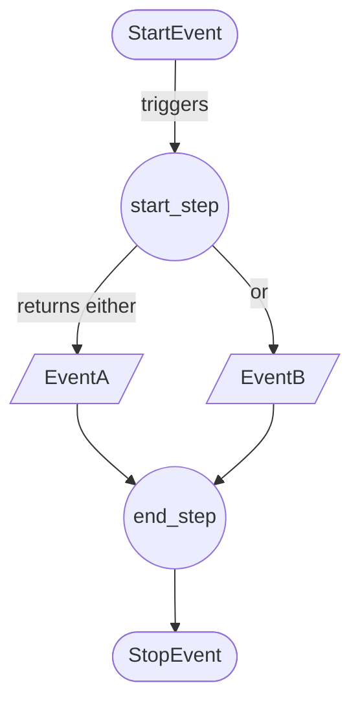
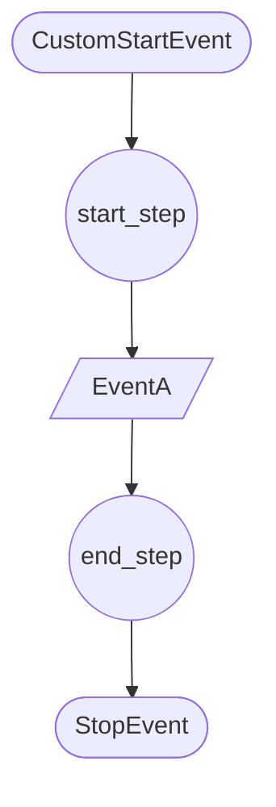
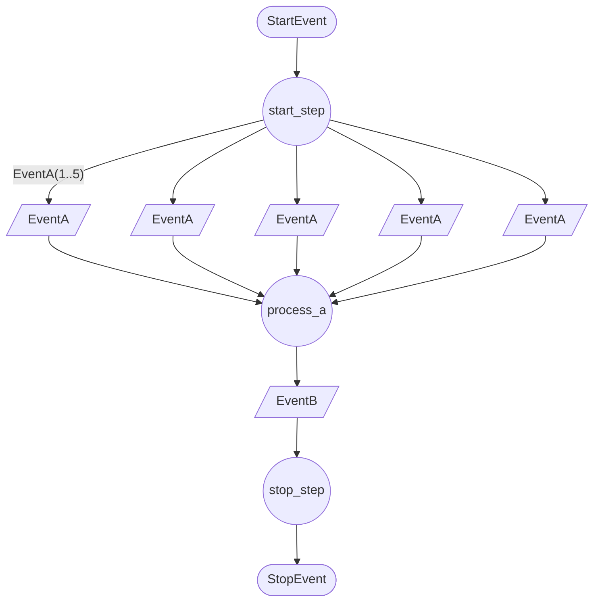
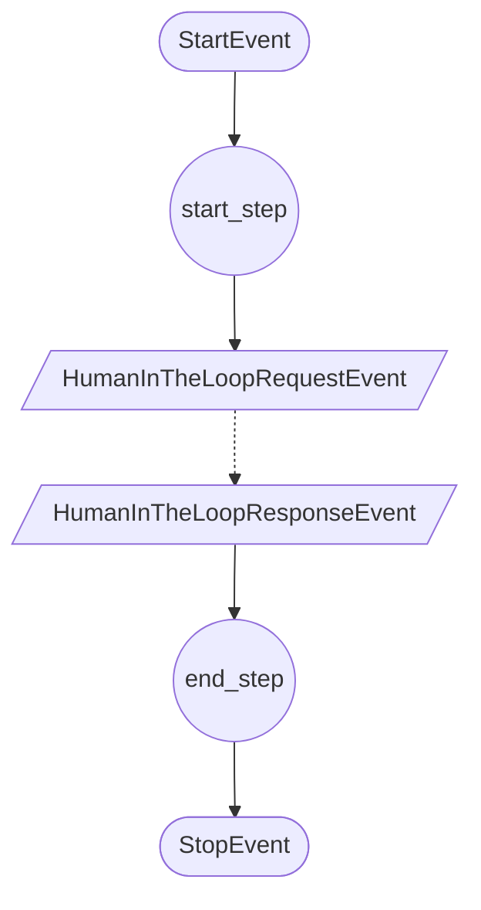
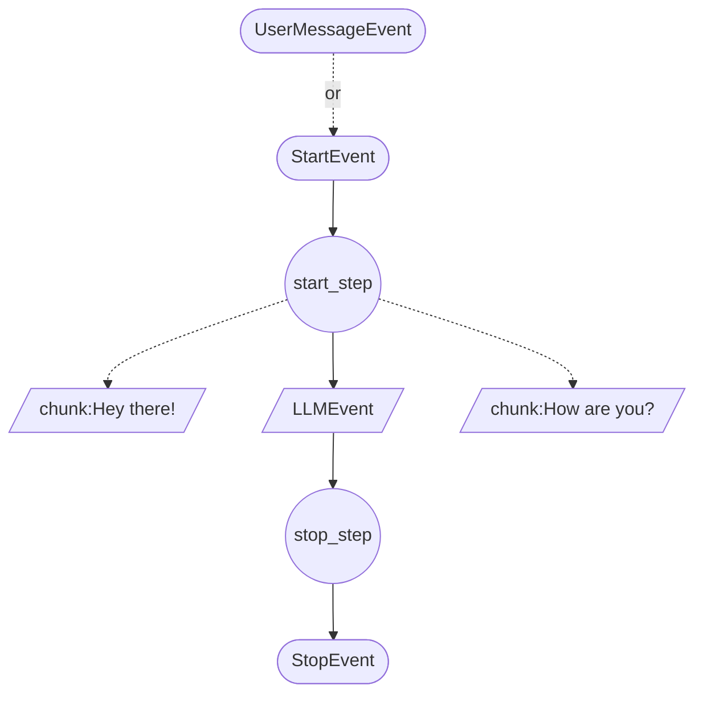

# 5. Agents in Detail

## 5.1 Defining Agents and Steps

> tldr; Defining agents through annotated steps and structured events is the heart of the AI-Hub’s philosophy. It delivers a powerful combination of clarity, control, and adaptability:
>
> - **Clarity:** Developers can see at a glance which steps an agent takes, in what order, and with what data.
> - **Control:** Strict typing and event classification ensure that workflows are deterministic and testable.
> - **Adaptability:** Incremental changes to the workflow—adding new steps, introducing more flexible events, or allowing dynamic tool selection—enable agents to evolve over time.
> 
> With this foundation set, subsequent sections in Chapter 5 will delve deeper into agent configuration, human-in-the-loop scenarios, coordination between multiple agents, and more, building upon the principles established here.


As established in [Section 2.1 (AI Agents as Workflows)](2_core_concepts_and_philosophy.md#21-ai-agents-as-workflows), the AI-Hub conceptualizes AI agents as structured workflows composed of discrete steps. Each step takes certain inputs, performs logic, and produces outputs as events. This design ensures that agents are transparent, testable, and gradually adjustable in complexity and autonomy.

In this section, we focus on the practical aspects of defining agents—how developers create new agents, specify their steps, and distinguish between different kinds of events. By the end, you will understand the building blocks that enable an agent to handle everything from a simple classification task to a complex, multi-step domain-specific workflow like the ones discussed in [Section 2.2 (Use Cases and Example Projects)](2_core_concepts_and_philosophy.md#22-use-cases-and-example-projects).

### Step Decorators and Input/Output Events

**Rationale for Step-Based Design:**
- Steps break down the agent’s logic into smaller, well-defined units. Instead of one massive function handling all logic, you have multiple steps—each responsible for a single aspect of the workflow.
- This modularity makes it easier to develop, debug, and test parts of the workflow independently. For instance, one step might classify an input, another might query the vector database, and yet another might generate a response using an LLM.

**Defining a Step:**
- Steps in the AI-Hub are typically defined as annotated Python methods within a class that inherits from a base `Agent` class.
- A common approach is to use Python decorators to declare a method as a “step” and specify the events it expects as input and what events it can produce as output.

**Example (Conceptual):**
```python
class MyAgent(Agent):

    @step()
    async def start_step(self, event: StartEvent) -> ClassificationEvent:
        # Logic: classify the user question, return a ClassificationEvent
        ...

    @step()
    async def classify_and_answer(self, event: ClassificationEvent) -> AnswerEvent:
        # Logic: use classification result to pick a retrieval strategy, generate an answer
        ...

    @step()
    async def finalize(self, event: AnswerEvent) -> StopEvent:
        # Logic: return a final answer to the user, represented as a StopEvent
        ...
```

**Input/Output Events:**
- Each step declares its input and output event types using type hints. When the agent receives an event that matches a step’s input requirements, that step is triggered automatically.
- The framework handles the routing of events to the appropriate steps based on their defined input types. This event-driven dispatching mechanism, introduced in [Section 4.2 (Event-Driven Architecture)](4_architectural_overview.md#42-event-driven-architecture), ensures that you don’t need complicated “if/else” logic to figure out which step to run next.

**Isolation and Testability:**
- Because steps are well-defined and typed, you can unit-test each step independently. By feeding it test input events, you can verify that it produces the correct output events. This aligns perfectly with the incremental approach discussed throughout the documentation—start with rigid workflows, gain confidence, and then gradually introduce more autonomy.

### Semantic Events & Control Events

Events are not all the same. The AI-Hub differentiates between various kinds of events to maintain clarity, ensure traceability, and provide a rich debugging and auditing experience. Two major categories stand out: **Control Events** and **Semantic Events.** There are also **Display Events**, which the frontend uses to present results to users. Understanding these distinctions is key to designing well-structured workflows.

**Control Events:**
- **Definition:** Events that influence the flow of the workflow. They represent steps being triggered, runs starting or stopping, or other execution-related signals.
- **Examples:**
  - **StartEvent:** Marks the beginning of a run.
  - **StopEvent:** Signals that the agent has produced a final answer or result for a given run.
  - **ExceptionEvent:** Indicates an error or unexpected condition, allowing the system to halt execution gracefully or trigger fallback logic.
- **Role:** Control events ensure the workflow’s structure and logic are transparent. They make it clear when a run starts, how it progresses, and when it concludes.

**Display Events:**
- **Purpose:** While not a separate fundamental category, “display events” are often used to communicate information back to the frontend or other user interfaces. They provide an end-user-friendly representation of the agent’s output at various steps.
- **Example:**
  - Chunks of an LLM’s streamed response might be sent as display events so the user can see the answer as it’s being formed.
- **Frontend Integration:** The UI listens for these events and updates the display accordingly, as described in [Section 4.1 (Frontend)](4_architectural_overview.md#41-components-of-the-ai-hub).

**Semantic Events:**
- **Definition:** Special type of events that convey certain type of often occuring information, such as documents retrieved from a database, re-ranked documents, or the output of a large language model. The payload schema of these events is not only well-known to the frontend, but also to our tracing tool [Arize Phoenix](https://phoenix.arize.com/).
- **Examples:**
  - **RetrievalEvent:** Contains documents retrieved from the vector database, along with their metadata.
  - **RerankerEvent:** Reflects a step where documents were re-ranked based on relevance.
  - **LLMEvent:** Represents the output of a Large Language Model processing a user query.
- **Role:** Semantic events provide the substance of the workflow. They carry the actual data and insights that drive the agent’s reasoning steps. They can be used for traceability, as described in [Section 4.2](4_architectural_overview.md#42-event-driven-architecture), and to understand which documents or rules were considered when forming the final answer.

### Differentiating Event Types in Practice

A typical agent workflow involves multiple event types working together:
1. **StartEvent (Control):**  
   Initiates a run when the user asks a question.
2. **ClassificationEvent (Control):**  
   Indicates how the user’s query was classified.
3. **DocumentRetrievalEvent (Semantic):**  
   Carries documents fetched from the vector store.
4. **LLMEvent (Semantic):**  
   Conveys the final AI-generated answer, which can be displayed to the user and also marks logical progression.
5. **StopEvent (Control + Display):**  
   Ends the run, signifying that the agent has completed its workflow and published the final result.

By carefully choosing which events are control vs. semantic vs. display, developers ensure that workflows remain understandable, debuggable, and user-friendly.

### Enforcing Structure and Incremental Autonomy

The use of step decorators and typed input/output events means that:
- **Rigid at First:** Initially, workflows can be extremely rigid, with predefined steps and no flexibility.
- **Gradual Relaxation:** Over time, steps can become more open-ended. For example, a step might choose from multiple tools or strategies (all represented as events) as trust in the agent grows, reflecting the strategy discussed in [Section 2.1](2_core_concepts_and_philosophy.md#21-ai-agents-as-workflows) about incremental autonomy.
- **Transparency Throughout:** Regardless of the level of autonomy, the presence of events ensures a complete audit trail. Inspecting the sequence of events reveals precisely how the agent arrived at its conclusion.


## 5.2 Context Handling

> tldr; By leveraging RunContext and ThreadContext, developers control exactly how and where state is maintained within an agent’s workflow. This enables more sophisticated, stateful interactions without overcomplicating the code.
>
> When paired with Human-in-the-Loop steps, the AI-Hub’s architecture becomes not only intelligent but also highly adaptive and safe. Agents can handle ever more complex scenarios—like regulatory updates or intricate support tasks—knowing that they can always rely on contextual memory and human oversight to guide them toward correct, compliant, and efficient outcomes.
> 
> This understanding of context handling and HITL sets the stage for the concrete examples that follow in [Section 5.3](#53-concrete-examples-of-agents) [5.4](#54-running-an-agent-with-the-agentrunner)—where you’ll see how these concepts appear in actual agent code, enabling a wide range of real-world use cases.

A significant advantage of the AI-Hub’s agent architecture is the ability to persist and share state across steps, runs, and even entire threads. As introduced in [Section 4.2 (Event-Driven Architecture)](4_architectural_overview.md#42-event-driven-architecture), the AI-Hub provides two special contexts to facilitate state management: **RunContext** and **ThreadContext**.

Additionally, the AI-Hub supports **Human-in-the-Loop (HITL)** steps, allowing agents to pause execution and wait for human decisions. By combining contextual memory with the option to incorporate human judgment, workflows become more dynamic, trustworthy, and aligned with business requirements.

### Run Context vs. Thread Context

**RunContext:**
- **Scope and Lifetime:**  
  The RunContext is tied to a single run—a single execution cycle from the `StartEvent` to the corresponding `StopEvent`.
- **Ephemeral State:**  
  As soon as the run completes, the RunContext is cleared. This makes it perfect for storing temporary data that’s only needed within a single interaction or task execution.  
- **Example Usage:**  
  If an agent is answering a single user query, it might store intermediate results, classification outcomes, or retrieved documents in the RunContext. Once the answer is delivered (StopEvent), these details are discarded to keep the system clean and memory usage low.

**ThreadContext:**
- **Scope and Lifetime:**  
  The ThreadContext persists across multiple runs within the same thread. A thread can be conceptualized as a conversation history or a logical grouping of related workflows.
- **Long-Term Memory:**  
  Because the ThreadContext survives beyond individual runs, it can remember important details across multiple user interactions.  
- **Example Usage:**  
  Consider a scenario where the user asks follow-up questions over time. Storing relevant documents or previously established facts in the ThreadContext allows the agent to maintain continuity, providing richer and more context-aware answers without having to re-derive the same information each time.

**Practical Implications of Context Handling:**
- **Efficiency:**  
  Storing frequently accessed information in ThreadContext saves time and computation. An agent doesn’t have to re-fetch data from external sources for each new run if the data is already cached.
- **Controlled State Management:**  
  Both contexts enforce a structured approach to state handling. Developers explicitly decide what goes into RunContext and ThreadContext, maintaining clarity and avoiding uncontrolled data growth or leakage.

### Human-in-the-Loop Steps

While AI agents can achieve impressive autonomy, certain decisions may still require human judgment. The AI-Hub’s design accommodates **Human-in-the-Loop (HITL)** steps, where the workflow pauses and awaits external input—usually from a human operator—before proceeding.

**Why Human-in-the-Loop?**
- **Quality Assurance:**  
  Certain steps might be too critical to leave fully autonomous. A human might need to confirm a billing rule change, approve a sensitive communication, or validate the correctness of retrieved information.
- **Incremental Autonomy Introduction:**  
  HITL steps can serve as transitional safeguards. Early in a project, every output might be manually approved. As trust in the agent grows, these checks can be scaled back or removed.

**How HITL Steps Work:**
1. **Invocation:**  
   A special event is emitted to indicate that a human decision is needed. This event is often displayed to a human operator via the frontend, or integrated with an external system like a ticketing tool.
   
2. **Pause in Workflow:**  
   The agent does not proceed until a corresponding human response event arrives. The agent effectively “waits” for the user’s input. This pause in the workflow also means that the run is paused and therefore the RunContext stays open.
   
3. **Continuation After Approval:**  
   Once the response is received (e.g., “Yes, proceed” or “No, revise”), the workflow resumes. Steps triggered by the human’s decision can now execute, confident that the path chosen aligns with organizational policies or domain expert insight.

**Integration with Contexts:**
- While waiting for human input, the agent can rely on RunContext or ThreadContext to remember what was asked, or what’s at stake. When the human’s decision arrives, the agent retrieves any needed information from the context to pick up exactly where it left off.
- This combination of human-in-the-loop steps and context memory allows agents to handle complex, multi-run workflows that span manual reviews, follow-up queries, and iterative refinements over time.

### Benefits of Context and HITL

**Context Handling:**
- **Simplifies Workflows:**  
  Instead of passing the same data between every step via events, use RunContext or ThreadContext to store it once and read it from wherever needed.
  
- **Improves User Experience:**  
  The agent can “remember” past queries or user preferences, leading to more personalized and efficient interactions.

**Human-in-the-Loop:**
- **Ensures Reliability and Compliance:**  
  Sensitive decisions get the human validation they need. This fosters trust between stakeholders and the AI system.
  
- **Smooth Transition to Autonomy:**  
  Start with many HITL steps for safety. Gradually remove some as trust and maturity in the system grows, as discussed in [Section 2.1 (AI Agents as Workflows)](2_core_concepts_and_philosophy.md#21-ai-agents-as-workflows).


### 5.3 Concrete Examples of Agents

> tldr; These examples illustrate the flexibility and clarity of the AI-Hub’s approach to building agents. By using step decorators, typed input/output events, and integrating concepts like human-in-the-loop steps, contextual memory, and parallel execution, developers can craft agents that address a wide range of business scenarios—while maintaining transparency, testability, and room for incremental growth in autonomy.

To solidify the concepts discussed above, let’s review some concrete agent examples. Each example demonstrates a specific feature of the workflow-oriented approach—such as branching logic, leveraging context, parallel steps, human-in-the-loop integration, or working with semantic events. These examples use the `@step()` decorator, typed events, and the various event types introduced earlier.

**Note:** The code snippets shown here are simplified. In actual projects, agents will often have additional configuration, error handling, and integration details. Nonetheless, these examples provide a clear illustration of the foundational principles.

#### Example 1: Conditional Logic with `ConditionalAgent`

This agent demonstrates how an agent can conditionally produce different output events. Based on a random value, the start step returns either `EventA` or `EventB`. The next step (`end_step`) then proceeds depending on which event it receives.

```python
import random

class ConditionalAgent(Agent):

    @step()
    async def start_step(self, event: StartEvent) -> EventA | EventB:
        if random.random() > 0.5:
            print("[ConditionalAgent.start_step] Sent Event A")
            return EventA()
        print("[ConditionalAgent.start_step] Sent Event B")
        return EventB()

    @step()
    async def end_step(self, event: EventA | EventB) -> StopEvent:
        print(f"[ConditionalAgent.end_step] Received {event.__class__.__name__}")
        return StopEvent()
```

**Key Takeaways:**
- **Conditional Flow:** The agent chooses one path based on a condition (in this case random, but could be domain logic).
- **Typed Input/Output Events:** The `end_step` can handle either `EventA` or `EventB` without complex conditional logic in the step itself.  
- **Transparency:** Observing which event was returned is easy, as each event type is distinct.




#### Example 2: Utilizing Context with `ContextAgent`

Context is crucial for maintaining state between steps (RunContext) and even across multiple runs in the same thread (ThreadContext). The `ContextAgent` shows how steps can access and store data in these contexts.

```python
class ContextAgent(Agent):

    @step()
    async def start_step(self, event: CustomStartEvent, thread_context: ThreadContext, run_context: RunContext) -> EventA:
        thread_count = await thread_context.get("count", 0)
        run_count = await run_context.get("count", 0)
        print(f"[ContextAgent.start_step] Payload is '{event.payload}'")
        print(f"[ContextAgent.start_step] Called {thread_count} times in thread, {run_count} times in run")
        await thread_context.set("count", thread_count + 1)
        await run_context.set("count", run_count + 1)
        return EventA()

    @step()
    async def end_step(self, event: EventA, thread_context: ThreadContext, run_context: RunContext) -> StopEvent:
        payload = await run_context.get("payload", [])
        print(f"[ContextAgent.end_step] Payload is '{payload}'")

        thread_count = await thread_context.get("count", 0)
        run_count = await run_context.get("count", 0)
        print(f"[ContextAgent.end_step] Called {thread_count} times in thread, {run_count} times in run")
        return StopEvent()
```

**Key Takeaways:**
- **RunContext vs. ThreadContext:**  
  - **RunContext** persists only within a single run.
  - **ThreadContext** persists across multiple runs, enabling long-term memory in a conversation or workflow sequence.
- **State Management:** The agent increments counters and retrieves payloads, demonstrating how context can be read and written at runtime.



#### Example 3: Parallel Execution with `FanOutAgent`

This example illustrates how an agent can “fan out” multiple events and then recombine their results. The `start_step` returns a list of `EventA` instances, which can be processed in parallel by subsequent steps.

```python
class FanOutAgent(Agent):

    @step()
    async def start_step(self, event: StartEvent) -> List[EventA]:
        print("[FanOutAgent.start_step]", event)
        return [EventA(payload=str(i)) for i in range(1,6)]  # Events A1, A2, A3, A4, A5

    @step()
    async def process_a(self, event: EventA) -> EventB:
        print("[FanOutAgent.process_a]", event)
        return EventB(payload=event.payload)

    @step()
    async def stop_step(self, events: FixedList(EventB, 5)) -> StopEvent:
        print("[FanOutAgent.stop_step]", events)
        return StopEvent()
```

**Key Takeaways:**
- **Parallelism:** Multiple `EventA` instances can trigger multiple `process_a` executions in parallel.
- **Collecting Results:** The `stop_step` expects a fixed list of 5 `EventB` events. Once all are produced, it aggregates them and concludes the run.
- **Flexibility:** This pattern is useful for batch processing tasks or concurrently querying multiple data sources.



#### Example 4: Human-in-the-Loop with `HumanInTheLoopAgent`

Some workflows require human approval or input. The `HumanInTheLoopAgent` requests confirmation from a human before proceeding. This pattern can enhance trust and safety in cases where AI-generated decisions must be vetted.

```python
class HumanInTheLoopAgent(Agent):

    @step()
    async def start_step(self, event: StartEvent) -> HumanInTheLoop.request:
        print("[HumanInTheLoopAgent.start_step]")
        return HumanInTheLoop.invoke(question="Shall I continue?")

    @step()
    async def end_step(self, event: HumanInTheLoop.response) -> StopEvent:
        print("[HumanInTheLoopAgent.end_step]", event.request_event.question, event.response)
        return StopEvent()
```

**Key Takeaways:**
- **Explicit User Involvement:** The agent pauses for a human response before continuing.
- **Controlled Autonomy:** Even though the agent has intelligence, the workflow can mandate human approval at critical steps, ensuring accountability.
  


#### Example 5: Integrating LLMs with `LlamaIndexAgent`

This example shows how an agent might call an LLM step during a run to generate answers. The agent uses a `LLMEvent` to incorporate AI model reasoning into the workflow.

```python
class LlamaIndexAgent(Agent):

    @step()
    async def start_step(self, event: StartEvent | UserMessageEvent, agent_config: LlamaIndexAgentConfig, displayer: EventDisplayer) -> LLMEvent:
        print("[LlamaIndexAgent.start_step]")
        async with agent_config.llm.cost_reporting_llm(displayer) as llm:
            return await displayer.display_llm_stream(agent_config.llm, llm, event.messages)

    @step()
    async def stop_step(self, event: LLMEvent) -> StopEvent:
        return StopEvent()
```

**Key Takeaways:**
- **LLM Integration:** The agent retrieves messages from the user and uses a language model to produce a response.
- **Display Events:** The `displayer.display_llm_stream()` method can stream partial responses as display events, providing real-time feedback in the frontend.



#### Example 6: Semantic Events with `SemanticEventAgent`

This agent shows how semantic events carry rich domain-specific information (like retrieved documents or reranked results).

```python
class SemanticEventAgent(Agent):

    @step()
    async def retriever_step(self, event: StartEvent) -> RetrieverEvent:
        return RetrieverEvent(
            documents=[
                Document(
                    id="1",
                    content="This is the Content of some important Document!",
                    score=0.9,
                    metadata={"title": "Must Read"},
                ),
                Document(
                    id="2",
                    content="This is even more important content!",
                    score=0.85,
                    metadata={"title": "Must-must Read"},
                ),
            ],
        )

    @step()
    async def rerank_step(self, event: RetrieverEvent) -> RerankerEvent:
        # Rerank the documents (just reverse for demonstration)
        return RerankerEvent(
            input_documents=event.documents,
            output_documents=list(reversed(event.documents)),
            query="Which document is more important",
            rerank_model_name="Azure AI Search Reranker",
            top_k=5,
        )

    @step()
    async def llm_step(self, event: RerankerEvent) -> LLMStopEvent:
        # Provide an answer summarizing the reranked results
        return LLMStopEvent(
            input_messages=[Message(role="user", content="Given these documents, what do you want to tell me?")],
            output_messages=[Message(role="agent", content="Everything is important!")],
            invocation_parameters={"temperature": 0.7},
            chat_model_name="gpt-4o",
            provider="azure",
            token_count_prompt=10,
            token_count_completion=25,
            token_count_total=35,
        )
```

**Key Takeaways:**
- **Semantic Information Flow:** The agent retrieves documents, reranks them, and then generates a final answer, showing how semantic events carry meaningful domain data through the workflow.
- **Modular Steps:** Each step focuses on a single task, such as retrieving documents, reranking, or calling the LLM.


### 5.4 Running an Agent with the AgentRunner

> tldr; The `AgentRunner` (and its variants like `AgentTestRunner`) provides a crucial bridge between agent definition and practical, real-world usage. By offering a standard way to launch, observe, and interact with agents, the runner supports iterative development, testing, and refinement—ensuring that by the time an agent is deployed in a production environment, it is robust, reliable, and well-understood.

Defining and implementing agents is only part of the story. Once you have created an agent and its workflow steps, you need a way to start it and interact with it in a controlled, testable environment. The AI-Hub provides tooling for this purpose, such as the `AgentTestRunner` or other `AgentRunner` classes.

These runners create the necessary runtime environment, initialize the agent’s configuration, connect to NATS, and start listening for events. They essentially stand up the agent as a microservice, ready to process incoming events, making it straightforward to test or simulate agent behavior before deploying into a client environment.

**Key Ideas:**
- The runner sets up the infrastructure needed for the agent—like connecting to NATS streams—and ensures the agent subscribes to the correct topics.
- Once the runner is started, you can simulate incoming `StartEvent`s or other control events, and observe how the agent responds.
- `AgentRunner` classes often provide convenience methods for logging, configuration, and graceful shutdown.

#### Example: Running a DevAgent with `AgentTestRunner`

Below is an example snippet (adapted from provided code) illustrating how to run an agent using a test runner. This agent might be a developmental agent used to explore new features or test configurations.

```python
import asyncio
from aihub_agent.runners.AgentTestRunner import AgentTestRunner
from aihub_lib.generative_ai.llms.models.chat.azure.AzureOpenAILLMConfig import AzureOpenAILLMConfig,

AzureOpenAIParameter
from aihub_lib.i18n.LocaleString import LocaleString
from aihub_lib.testing.logging.logger import enable_logging
from playground.DevAgent.DevAgent import DevAgent
from playground.DevAgent.DevAgentConfig import DevAgentConfig

enable_logging()


async def main():
    runner = AgentTestRunner(
        agent_type=DevAgent,
        agent_config=DevAgentConfig(
            agent_id="dev_agent",
            name=LocaleString(en="Dev Agent"),
            description=LocaleString(en="This is an agent that can be used to develop the frontend"),
            system_prompt=LocaleString(en="You are an agent"),
            llm=AzureOpenAILLMConfig(
                name="gpt-4o",
                api_endpoint="https://aihub-dev-openai-che.openai.azure.com/",
                api_version="2023-12-01-preview",
                prompt_tokens_costs_per_thousand=0.0045,
                completion_tokens_costs_per_thousand=0.0133,
                default_parameter=AzureOpenAIParameter(temperature=0.0)
            )
        ),
    )

    # The run_forever() method starts the agent and keeps it running.
    # The agent now listens for events. You can trigger events (e.g., StartEvents)
    # by publishing them to NATS or using the testing utilities to simulate them.
    await runner.run_forever()


if __name__ == "__main__":
    asyncio.run(main())
```

**What’s Happening Here:**
- **Logging & Configuration:**  
  `enable_logging()` initializes structured logging, making it easy to follow the agent’s execution steps.
  
- **AgentTestRunner Configuration:**  
  The `AgentTestRunner` is instantiated with:
  - `agent_type=DevAgent`: Specifies which agent to run.
  - `agent_config=DevAgentConfig(...)`: Supplies the agent configuration, including model endpoints, prompts, and other runtime parameters.

- **LLM Integration:**  
  The `AzureOpenAILLMConfig` demonstrates how you might configure a language model backend. This ensures that when the agent runs, it can call the LLM with the correct parameters and track token costs if needed.

- **Run Forever:**  
  `await runner.run_forever()` starts the agent’s event loop and NATS subscriptions, essentially bringing the agent online as a microservice. From this point on, if a `StartEvent` is published to the relevant NATS subject, the agent will receive it and begin executing its defined workflow steps.

**Testing and Interactions:**
- To test this locally, you might run this script in one terminal and then, in another, use command-line tools or a simple Python script to publish a `StartEvent` to the NATS topic the agent listens on.  
- As events flow in, you can watch the console logs to see which steps are executed, which events are produced, and confirm that the agent’s logic behaves as expected.

**Real-World Application:**
- Before deploying into a customer’s Azure environment (as discussed in [Section 3.2](3_project_phases_and_client_engagement.md#32-the-role-of-the-ai-hub-in-projects)), the team can run this agent in a controlled setting.
- This approach allows developers to verify that workflows are correctly implemented, that the agent handles unexpected inputs gracefully, and that integrations with vector databases or LLMs are functioning as intended.


## 5.5 Multi-Agent Coordination

> tldr; Multi-agent coordination is a natural extension of the AI-Hub’s workflow philosophy. By composing multiple specialized agents, you build solutions that are modular, robust, and adaptable to evolving requirements. The event-driven architecture ensures agents remain loosely coupled yet capable of forming sophisticated workflows.
> 
> The dispatcher logic, message passing, and topic-based routing enable agents to cooperate without hard-coded dependencies. Each agent focuses on its domain, and together they solve complex business challenges more effectively than any single, monolithic system could.


As AI projects grow in complexity, a single agent might not be enough to handle every aspect of a workflow. Different parts of a solution may require specialized expertise—one agent may be optimized for knowledge retrieval, another for applying domain-specific rules, and another for generating natural language responses. Coordinating multiple agents allows the AI-Hub to tackle intricate scenarios by combining these complementary capabilities.

This section focuses on how multiple agents can collaborate to solve complex tasks. We’ll explore **agent composition**—the practice of orchestrating multiple agents within a larger workflow—and examine **message passing and event dispatching**—the low-level mechanisms that ensure agents can work together seamlessly.

### Agent Composition: Coordinating Multiple Agents

**Why Multiple Agents?**
- **Modularity and Reusability:**  
  Separating logic into multiple agents encourages clean design. For example, one agent specializes in retrieving relevant documents (RAG agent), another applies domain-specific billing rules (rules agent), and a third composes a final user-facing answer (coordinating agent).
- **Scalability and Parallelism:**  
  Different agents can run in parallel or scale independently. If a particular subtask becomes a bottleneck, you can scale out the agent responsible for that task without affecting others.
- **Domain Specialization:**  
  Agents can be tailored to specific domains or data sources. For example, one agent might handle general policy questions while another focuses solely on tariff details, as seen in the FMH scenario described in [Section 2.2 (Use Cases and Example Projects)](2_core_concepts_and_philosophy.md#22-use-cases-and-example-projects).

**Coordinating Agents in a Workflow:**
- A **coordinating agent** oversees which sub-agent to call first, how to merge results, and when to terminate the workflow.
- Each agent is still defined as a set of steps and events. The difference is that the coordinating agent may produce start events for other agents. When those agents complete their runs (producing stop events), the coordinating agent consumes these final events, aggregates the results, and proceeds accordingly.

**Example (Conceptual):**
- The user asks a complex tariff-related question. The coordinating agent:
  1. Sends a start event to the RAG agent to gather conceptual information from a handbook.
  2. Once the RAG agent returns a stop event with retrieved context, the coordinating agent triggers the rules agent to apply domain-specific rules.
  3. Finally, it uses the collected information from both agents to produce a well-grounded answer.
  
By composing multiple agents, the system breaks down complex logic into smaller, maintainable units, each agent excelling at its niche task.

### Message Passing and Event Dispatching

Under the hood, multiple agents communicate through the same event-driven architecture discussed in [Section 4.2](4_architectural_overview.md#42-event-driven-architecture). This architecture ensures that message passing remains consistent, scalable, and transparent, regardless of how many agents are involved.

**Event-Based Coordination:**
- **NATS & JetStream:**  
  As described before, NATS acts as a central nervous system for all message passing. Agents subscribe to specific topics, and when an event is published, the right agent receives it.
- **Subjects and Topic Naming:**  
  Each agent has its own subscriber group, and events are published under subjects that encode the run ID, thread ID, and event type. This naming scheme ensures that each agent only receives the events intended for it.

**Workflow Dispatcher:**
- **Step Dispatching:**  
  Inside each agent, the dispatcher logic matches incoming events to steps based on their input types. This ensures that events from other agents, if relevant, seamlessly trigger the next steps in the coordinating agent’s workflow.
- **Orchestration without Hardcoding:**  
  Since everything flows through NATS, the coordinating agent doesn’t need to “know” the internal structure of other agents. It merely publishes start events to topics those agents subscribe to, and waits for their stop events. The dispatcher ensures that when a stop event is emitted, it returns to the coordinating agent’s workflow.

**Handling Parallelism and Failures:**
- **Parallel Runs:**  
  Multiple agents can be triggered simultaneously. For example, a coordinating agent might launch two different retrieval agents in parallel, each searching a different database. When both return their results, the coordinating agent aggregates them.
- **Error Handling and Timeouts:**  
  If one sub-agent fails or times out, the coordinating agent can detect this (e.g., by not receiving a stop event within an expected timeframe) and handle the situation gracefully—either retrying the request, skipping that sub-agent’s contribution, or producing a fallback answer.

### Real-World Example: Revisited FMH Scenario

In the FMH example:
1. **Handbook Agent (RAG Agent):**  
   Retrieves conceptual information about the new tariff.
2. **Rules Agent:**  
   Checks specific billing constraints and allowable combinations.
3. **Coordinating Agent:**  
   Decides which agent to call first and how to merge their answers. If the user’s question mentions a tariff code, the coordinating agent first queries the handbook agent for context, then queries the rules agent to confirm allowable billing options, and finally returns a combined, fully reasoned response.

This interplay demonstrates how multi-agent coordination can tackle tasks that exceed the scope of any single agent, all while preserving transparency, testability, and incremental autonomy.
