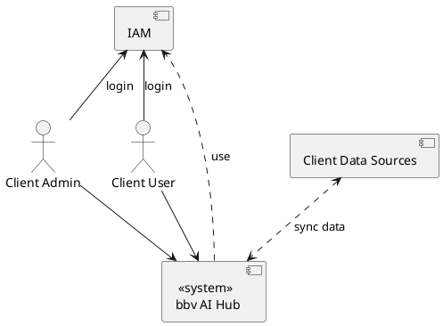
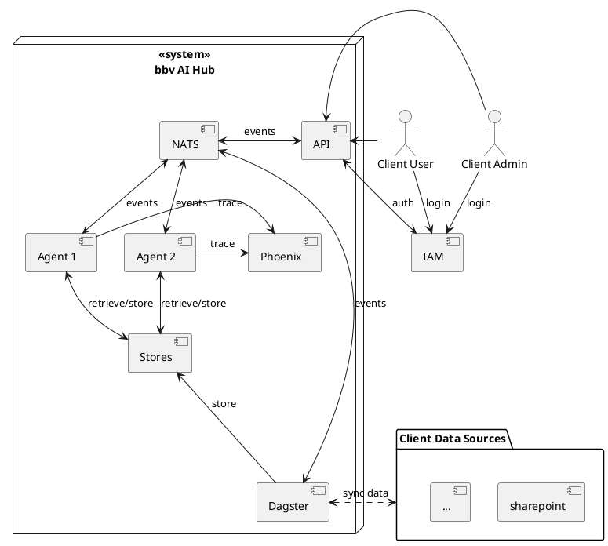
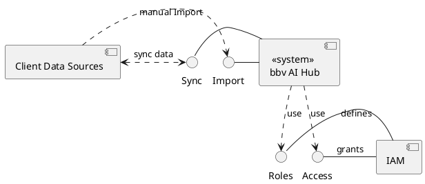

# Kontextabgrenzung

<!--
> **How to arc42:** 💡
>
>**Inhalt**
>
>Die Kontextabgrenzung grenzt das System gegen alle Kommunikationspartner
>(Nachbarsysteme und Benutzerrollen) ab. Sie legt damit die externen
>Schnittstellen fest und zeigt damit auch die Verantwortlichkeit (scope)
>Ihres Systems: Welche Verantwortung trägt das System und welche
>Verantwortung übernehmen die Nachbarsysteme?
>
>Differenzieren Sie fachlichen (Ein- und Ausgaben) und technischen
>Kontext (Kanäle, Protokolle, Hardware), falls nötig.
>
>**Motivation**
>
>Die fachlichen und technischen Schnittstellen zur Kommunikation gehören
>zu den kritischsten Aspekten eines Systems. Stellen Sie sicher, dass Sie
>diese komplett verstanden haben.
>
>**Form**
>
>Verschiedene Optionen:
>
>-   Diverse Kontextdiagramme
>
>-   Listen von Kommunikationsbeziehungen mit deren Schnittstellen
>
>Siehe [Kontextabgrenzung](https://docs.arc42.org/section-3/) in der
>online-Dokumentation (auf Englisch!).
-->

Diese simple Ansicht zeigt auf welche externe Systeme verwendet werden und welche Aktoren es für den bbv AI Hub gibt.

Hier noch eine etwas detailliertere Ansicht auf die verschiedenen Systeme.

| Aktor/System        | Beschreibung                                                                                                                                                                                              |
|---------------------|-----------------------------------------------------------------------------------------------------------------------------------------------------------------------------------------------------------|
| bbv AI Hub          | Die gesamte Applikation des AI Hubs mit Frontend und Backend als eine Einheit welche intern auf llama-index und weiteren packages aufbaut.                                                                |
| Client Admin        | Administrator des Kunden der verantwortlich ist für die Infrastruktur und das Access Management                                                                                                           |
| Client User         | Der effektive Verwender beim Kunden welche die KI Agenten nutzen möchte                                                                                                                                   |
| Client Data Sources | Verschiedenste Datenquellen des Kunden welche Informationen speichern welche für die KI relevant sind. Diese sollten der KI zugänglich gemacht werden und unter Umständen auch durch KI angepasst werden. |
| Cloud Services      | Verschiedene Cloud Services welche für den bbv AI Hub nützlich sind                                                                                                                                       |
| IAM                 | Identity Access Management System des Kunden das die authentifizierung der User vornimmt.                                                                                                                 |

## Fachlicher Kontext

> **How to arc42:** 💡
>
>**Inhalt**
>
>Festlegung **aller** Kommunikationsbeziehungen (Nutzer, IT-Systeme, …)
>mit Erklärung der fachlichen Ein- und Ausgabedaten oder Schnittstellen.
>Zusätzlich (bei Bedarf) fachliche Datenformate oder Protokolle der
>Kommunikation mit den Nachbarsystemen.
>
>**Motivation**
>
>Alle Beteiligten müssen verstehen, welche fachlichen Informationen mit
>der Umwelt ausgetauscht werden.
>
>**Form**
>
>Alle Diagrammarten, die das System als Blackbox darstellen und die
>fachlichen Schnittstellen zu den Nachbarsystemen beschreiben.
>
>Alternativ oder ergänzend können Sie eine Tabelle verwenden. Der Titel
>gibt den Namen Ihres Systems wieder; die drei Spalten sind:
>Kommunikationsbeziehung, Eingabe, Ausgabe.
>
>**&lt;Diagramm und/oder Tabelle>**
>
>**&lt;optional: Erläuterung der externen fachlichen Schnittstellen>**

## Technischer Kontext

<!--
> **How to arc42:** 💡
>
>**Inhalt**
>
>Technische Schnittstellen (Kanäle, Übertragungsmedien) zwischen dem
>System und seiner Umwelt. Zusätzlich eine Erklärung (*mapping*), welche
>fachlichen Ein- und Ausgaben über welche technischen Kanäle fließen.
>
>**Motivation**
>
>Viele Stakeholder treffen Architekturentscheidungen auf Basis der
>technischen Schnittstellen des Systems zu seinem Kontext.
>
>Insbesondere bei der Entwicklung von Infrastruktur oder Hardware sind
>diese technischen Schnittstellen durchaus entscheidend.
>
>**Form**
>
>Beispielsweise UML Deployment-Diagramme mit den Kanälen zu
>Nachbarsystemen, begleitet von einer Tabelle, die Kanäle auf
>Ein-/Ausgaben abbildet.
>
>**&lt;Diagramm oder Tabelle>**
>
>**&lt;optional: Erläuterung der externen technischen Schnittstellen>**
>
>**&lt;Mapping fachliche auf technische Schnittstellen>**
> 
-->

