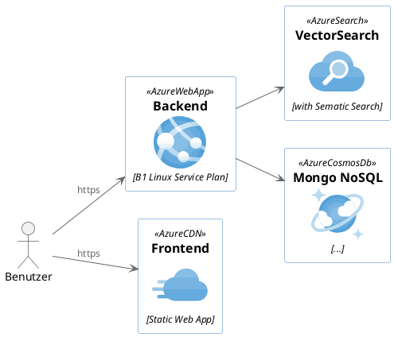

# Lösungsstrategie

> **How to arc42:** 💡
>
>**Inhalt**
>
>Kurzer Überblick über die grundlegenden Entscheidungen und
>Lösungsansätze, die Entwurf und Implementierung des Systems prägen.
>Hierzu gehören:
>
>-   Technologieentscheidungen
>
>-   Entscheidungen über die Top-Level-Zerlegung des Systems,
>    beispielsweise die Verwendung gesamthaft prägender Entwurfs- oder
>    Architekturmuster,
>
>-   Entscheidungen zur Erreichung der wichtigsten Qualitätsanforderungen
>    sowie
>
>-   relevante organisatorische Entscheidungen, beispielsweise für
>    bestimmte Entwicklungsprozesse oder Delegation bestimmter Aufgaben
>    an andere Stakeholder.
>
>**Motivation**
>
>Diese wichtigen Entscheidungen bilden wesentliche „Eckpfeiler“ der
>Architektur. Von ihnen hängen viele weitere Entscheidungen oder
>Implementierungsregeln ab.
>
>**Form**
>
>Fassen Sie die zentralen Entwurfsentscheidungen **kurz** zusammen.
>Motivieren Sie, ausgehend von Aufgabenstellung, Qualitätszielen und
>Randbedingungen, was Sie entschieden haben und warum Sie so entschieden
>haben. Vermeiden Sie redundante Beschreibungen und verweisen Sie eher
>auf weitere Ausführungen in Folgeabschnitten.
>
>Siehe [Lösungsstrategie](https://docs.arc42.org/section-4/) in der
>online-Dokumentation (auf Englisch!).

## Architekturstil

### Aufteilung

## Testing

## Security

## Backup

## Monitoring

## Eingesetzte Services

### Topology

