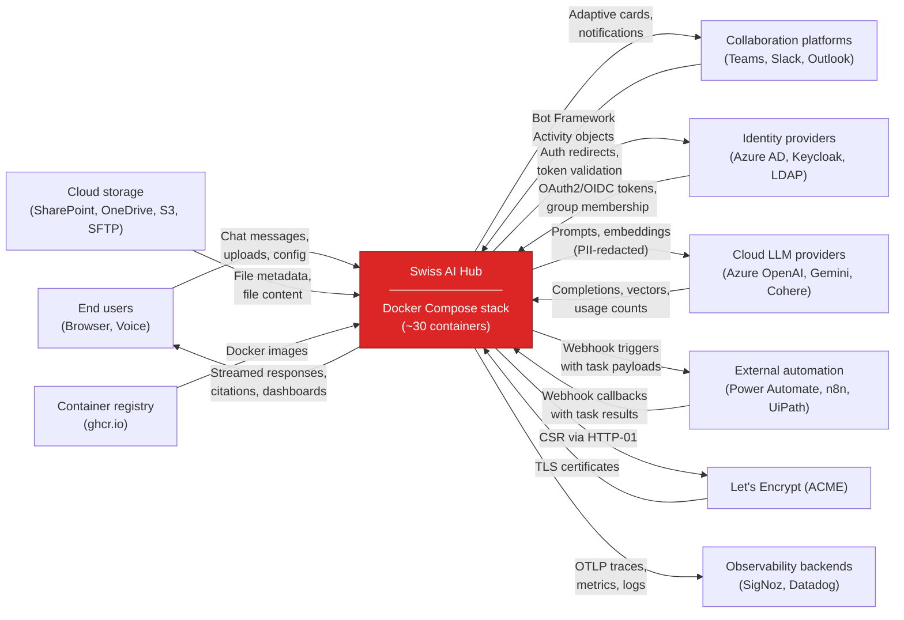

# Context and scope

## Business context

The following diagram and table show the Swiss AI Hub as a black box and list every external actor or system that
communicates with it. "External" means outside the Docker Compose deployment boundary. Internal components (databases,
message broker, vector store) are covered in the technical context.

| Communication partner                                                                           | Inputs to the platform                                                                                                                                                                           | Outputs from the platform                                                                                                                                                                                    |
| ----------------------------------------------------------------------------------------------- | ------------------------------------------------------------------------------------------------------------------------------------------------------------------------------------------------ | ------------------------------------------------------------------------------------------------------------------------------------------------------------------------------------------------------------ |
| **End users** (employees in client organizations)                                               | Chat messages, document uploads, voice input, process task responses, agent configuration via Admin UI. Access through web browser or collaboration tools.                                       | Streamed agent responses, retrieved documents with source citations, process task assignments, cost and usage dashboards, audit trail views.                                                                 |
| **Collaboration platforms** (Microsoft Teams, Slack, Outlook, Telegram, WeChat)                 | User messages and file attachments routed through the Azure Bot Framework. Each platform normalizes its message format into Bot Framework Activity objects before delivery.                      | Agent responses formatted for the target platform (adaptive cards in Teams, markdown in Slack), typing indicators, proactive notifications, bot-in-the-loop questions posted to channels for human response. |
| **Identity providers** (Azure AD / Entra ID, Keycloak, LDAP)                                    | OAuth2/OIDC tokens on user login.                                                                                                                                                                | Authentication redirect requests. Token validation requests. The platform never writes back to the identity provider.                                                                                        |
| **Cloud LLM providers** (Azure OpenAI, Google Gemini, Cohere)                                   | Prompts constructed by agents, embedding requests from the ingestion pipeline, reranking requests for RAG retrieval. All requests are routed through LLM Gateway.                                | Model completions (streamed or batched), embedding vectors, reranking scores, token usage counts. The platform tracks cost per request.                                                                      |
| **Cloud storage sources** (SharePoint, OneDrive, Google Drive, Azure Blob, S3-compatible, SFTP) | File metadata (change notifications, directory listings) and file content. Rclone monitors these sources and downloads new or modified files into the platform's internal data lake (SeaweedFS). | Read-only access. The platform does not write back to source systems. Authentication uses OAuth2 (SharePoint, OneDrive, Google Drive) or access keys (S3, Azure Blob, SFTP).                                 |
| **External automation systems** (Power Automate, n8n, UiPath)                                   | Webhook callbacks with task results. When the process engine delegates a step to an external system, that system posts its result back to the platform via HTTP webhook.                         | HTTP webhook triggers containing structured task payloads. The process engine initiates outbound calls when a workflow step requires an external action (RPA execution, flow trigger, system integration).   |
| **Let's Encrypt** (ACME)                                                                        | TLS certificate issuance responses.                                                                                                                                                              | Certificate signing requests via HTTP-01 challenge on port 80. Only active in production deployments where Traefik handles SSL termination.                                                                  |
| **Container registry** (ghcr.io)                                                                | Docker images for platform services, pulled during deployment or updates.                                                                                                                        | Image pull requests authenticated with registry credentials. No push operations from production deployments.                                                                                                 |
| **Observability backends** (optional external SigNoz, Datadog, Grafana Cloud)                   | Configuration only (collector endpoint URL and auth headers).                                                                                                                                    | OpenTelemetry traces, metrics, and logs exported by the OTEL Collector. This is optional; the platform ships with self-hosted Langfuse for LLM-specific observability.                                       |

### Boundary between platform and SDK

The platform (everything inside the Docker Compose deployment) and the SDK (agent, pipeline, and process code built by
developers) communicate exclusively through two interfaces:

The first is NATS. Agents, pipelines, and processes built with the SDK subscribe to NATS topics and publish events
according to the Swiss AI Agent Protocol. The API gateway discovers running agents by broadcasting a
ClassDiscoveryRequestEvent on NATS every 60 seconds; agents respond with their event schemas and configuration. No HTTP
registration endpoint exists.

The second is the shared library aihub_lib, which provides base classes, event definitions, and infrastructure clients
(Milvus, MongoDB, Valkey, LiteLLM) that SDK-built code uses to interact with platform services. SDK code never connects
to platform databases directly; it goes through aihub_lib abstractions.

## Technical context
