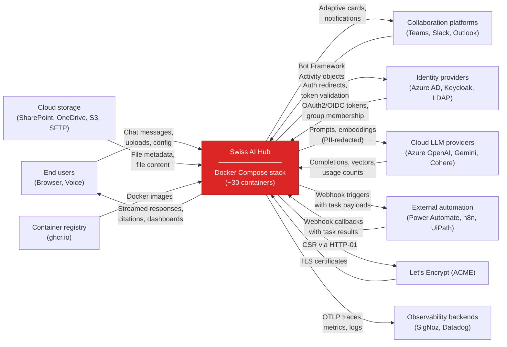
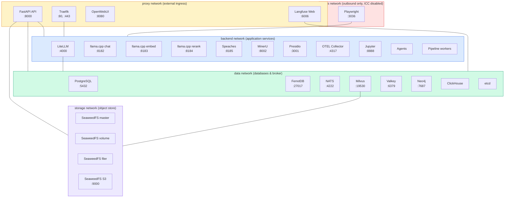

# Context and scope

## Business context

The following diagram and table show the Swiss AI Hub as a black box and list every external actor or system that
communicates with it. "External" means outside the Docker Compose deployment boundary. Internal components (databases,
message broker, vector store) are covered in the technical context.

| Communication partner                                                                           | Inputs to the platform                                                                                                                                                                                                                | Outputs from the platform                                                                                                                                                                                    |
| ----------------------------------------------------------------------------------------------- | ------------------------------------------------------------------------------------------------------------------------------------------------------------------------------------------------------------------------------------- | ------------------------------------------------------------------------------------------------------------------------------------------------------------------------------------------------------------ |
| **End users** (employees in client organizations)                                               | Chat messages, document uploads, voice input, process task responses, agent configuration via Admin UI. Access through web browser (OpenWebUI at port 8080, Admin UI at port 3000) or collaboration tools.                            | Streamed agent responses, retrieved documents with source citations, process task assignments, cost and usage dashboards, audit trail views.                                                                 |
| **Collaboration platforms** (Microsoft Teams, Slack, Outlook, Telegram, WeChat)                 | User messages and file attachments routed through the Azure Bot Framework. Each platform normalizes its message format into Bot Framework Activity objects before delivery.                                                           | Agent responses formatted for the target platform (adaptive cards in Teams, markdown in Slack), typing indicators, proactive notifications, bot-in-the-loop questions posted to channels for human response. |
| **Identity providers** (Azure AD / Entra ID, Keycloak, LDAP)                                    | OAuth2/OIDC tokens on user login. Group membership and role information from directory queries (Microsoft Graph API for Azure AD).                                                                                                    | Authentication redirect requests. Token validation requests. The platform never writes back to the identity provider.                                                                                        |
| **Cloud LLM providers** (Azure OpenAI, Google Gemini, Cohere)                                   | Prompts constructed by agents, embedding requests from the ingestion pipeline, reranking requests for RAG retrieval. All requests are routed through LiteLLM. Presidio optionally redacts PII before the request leaves the platform. | Model completions (streamed or batched), embedding vectors, reranking scores, token usage counts. The platform tracks cost per request via LiteLLM.                                                          |
| **Cloud storage sources** (SharePoint, OneDrive, Google Drive, Azure Blob, S3-compatible, SFTP) | File metadata (change notifications, directory listings) and file content. Rclone monitors these sources and downloads new or modified files into the platform's internal data lake (SeaweedFS).                                      | Read-only access. The platform does not write back to source systems. Authentication uses OAuth2 (SharePoint, OneDrive, Google Drive) or access keys (S3, Azure Blob, SFTP).                                 |
| **External automation systems** (Power Automate, n8n, UiPath)                                   | Webhook callbacks with task results. When the process engine delegates a step to an external system, that system posts its result back to the platform via HTTP webhook.                                                              | HTTP webhook triggers containing structured task payloads. The process engine initiates outbound calls when a workflow step requires an external action (RPA execution, flow trigger, system integration).   |
| **Let's Encrypt** (ACME)                                                                        | TLS certificate issuance responses.                                                                                                                                                                                                   | Certificate signing requests via HTTP-01 challenge on port 80. Only active in production deployments where Traefik handles SSL termination.                                                                  |
| **Container registry** (ghcr.io)                                                                | Docker images for platform services, pulled during deployment or updates.                                                                                                                                                             | Image pull requests authenticated with registry credentials. No push operations from production deployments.                                                                                                 |
| **Observability backends** (optional external SigNoz, Datadog, Grafana Cloud)                   | Configuration only (collector endpoint URL and auth headers).                                                                                                                                                                         | OpenTelemetry traces, metrics, and logs exported by the OTEL Collector. This is optional; the platform ships with self-hosted Langfuse for LLM-specific observability.                                       |

### Boundary between platform and SDK

The platform (everything inside the Docker Compose deployment) and the SDK (agent, pipeline, and process code built by
developers) communicate exclusively through two interfaces:

The first is NATS. Agents, pipelines, and processes built with the SDK subscribe to NATS topics and publish events
according to the Swiss AI Agent Protocol. The API gateway discovers running agents by broadcasting a
ClassDiscoveryRequestEvent on NATS every 60 seconds; agents respond with their event schemas and configuration. No HTTP
registration endpoint exists.

The second is the shared library aihub_lib, which provides base classes, event definitions, and infrastructure clients
(Milvus, MongoDB, Valkey, LiteLLM) that SDK-built code uses to interact with platform services. SDK code never connects
to platform databases directly; it goes through aihub_lib abstractions.

## Technical context

The platform runs as a Docker Compose stack of approximately 30 containers organized into five isolated networks. The
following diagram shows the network zones and key services assigned to each. The tables that follow describe each
component's protocol, port, and communication partners in detail.

### Network zones

| Network | Internal | ICC | Purpose                                                                                                                                                                  |
| ------- | -------- | --- | ------------------------------------------------------------------------------------------------------------------------------------------------------------------------ |
| proxy   | No       | Yes | Traefik reverse proxy and services that need external HTTP access (API, OpenWebUI, Langfuse web UI).                                                                     |
| backend | Yes      | Yes | Application services that process requests but should not be directly reachable from outside (LiteLLM, llama.cpp inference, MinerU, Presidio, OTEL Collector, Jupyter).  |
| data    | Yes      | Yes | Databases, caches, and the message broker (PostgreSQL, FerretDB, Milvus, Neo4j, Valkey, NATS, ClickHouse, etcd).                                                         |
| storage | Yes      | Yes | SeaweedFS distributed storage cluster (master, volume servers, filer, S3 gateway).                                                                                       |
| egress  | No       | No  | Outbound internet access only. Inter-container communication is disabled. Used by Playwright (web scraping) to prevent lateral movement if the container is compromised. |

Services are assigned only the networks they require. The API service connects to proxy, backend, data, and storage
because it must accept external requests, communicate with application services, query databases, and access file
storage. A database like PostgreSQL connects only to data.

### Component channels

The table below maps every internal component to its communication protocol, port, and the other components it talks to.

**User-facing services**

| Component         | Port | Protocol        | Communicates with                                                                                                                                                                  |
| ----------------- | ---- | --------------- | ---------------------------------------------------------------------------------------------------------------------------------------------------------------------------------- |
| OpenWebUI         | 8080 | HTTP            | API (SSE streams and REST), LiteLLM (OpenAI-compatible pipeline for direct model access). Two internal pipelines: event-based agent pipeline and OpenAI-compatible model pipeline. |
| Admin UI (Nuxt 3) | 3000 | HTTP, WebSocket | API only. Uses a generated TypeScript SDK (HeyAPI) for REST calls and a single WebSocket connection for real-time Display Events.                                                  |
| Process UI        | 3000 | HTTP, WebSocket | API only. Shares the Nuxt application with Admin UI. Renders workflow visualizations and human task queues.                                                                        |

**API gateway**

| Component   | Port | Protocol                          | Communicates with                                                                                                                                                                                                                                                                                                                                                        |
| ----------- | ---- | --------------------------------- | ------------------------------------------------------------------------------------------------------------------------------------------------------------------------------------------------------------------------------------------------------------------------------------------------------------------------------------------------------------------------ |
| FastAPI API | 8000 | HTTP (REST, SSE), WebSocket, NATS | Inbound: HTTP requests from frontends and bots, WebSocket connections from Admin UI. Outbound: publishes Control Events to NATS, subscribes to Display Events for SSE/WebSocket broadcast. Queries FerretDB for persisted events and thread history. Connects to Valkey for session and WebSocket state. Exposes MCP server at /mcp for AI coding assistant integration. |

**LLM and inference services**

| Component             | Port  | Protocol                          | Communicates with                                                                                                                                                                                                                                                                                                         |
| --------------------- | ----- | --------------------------------- | ------------------------------------------------------------------------------------------------------------------------------------------------------------------------------------------------------------------------------------------------------------------------------------------------------------------------- |
| LiteLLM               | 4000  | HTTP (OpenAI-compatible)          | Inbound: all LLM requests from agents, OpenWebUI, bots. Outbound: forwards to configured model providers (Azure OpenAI, Gemini, local llama.cpp, Speaches). Connects to PostgreSQL for usage tracking and API key management. Connects to Valkey for response caching. Runs Presidio guardrails before external requests. |
| llama.cpp (chat)      | 8182  | HTTP (OpenAI-compatible)          | LiteLLM only. Runs Gemma-3-4B (dev) or Gemma-3-12B (production with GPU).                                                                                                                                                                                                                                                 |
| llama.cpp (embedding) | 8183  | HTTP (OpenAI-compatible)          | LiteLLM only. Runs Qwen3-0.6B for vector embeddings.                                                                                                                                                                                                                                                                      |
| llama.cpp (reranker)  | 8184  | HTTP (OpenAI-compatible)          | LiteLLM only. Runs Qwen3-Reranker-0.6B for RAG result reranking.                                                                                                                                                                                                                                                          |
| Speaches              | 8185  | HTTP (OpenAI-compatible)          | LiteLLM only. Whisper-small for speech-to-text, Kokoro-82m for text-to-speech.                                                                                                                                                                                                                                            |
| MinerU API            | 8002  | HTTP (REST)                       | Inbound: pipeline workers send documents for parsing. Outbound: routes VLM inference to LiteLLM (which forwards to the local MinerU VLM container or a cloud endpoint). Runs in a separate container for AGPL license isolation.                                                                                          |
| MinerU VLM            | 30000 | HTTP (OpenAI-compatible via vLLM) | LiteLLM only (registered as model text-generation/ocr). GPU-only container running MinerU2.5-2509-1.2B.                                                                                                                                                                                                                   |
| Presidio Analyzer     | 3001  | HTTP (REST)                       | LiteLLM (pre-call guardrail for PII detection).                                                                                                                                                                                                                                                                           |
| Presidio Anonymizer   | 3002  | HTTP (REST)                       | LiteLLM (pre-call guardrail for PII masking/blocking).                                                                                                                                                                                                                                                                    |

**Message broker**

| Component | Port | Protocol            | Communicates with                                                                                                                                                                                             |
| --------- | ---- | ------------------- | ------------------------------------------------------------------------------------------------------------------------------------------------------------------------------------------------------------- |
| NATS      | 4222 | NATS protocol (TCP) | All agents, process engine, API gateway, pipeline workers. Provides JetStream for durable event streams and NATS Core for ephemeral request-reply (config RPC, agent discovery). Monitoring API on port 8222. |

**Data stores**

| Component  | Port  | Protocol                 | Communicates with                                                                                                                                                                                         |
| ---------- | ----- | ------------------------ | --------------------------------------------------------------------------------------------------------------------------------------------------------------------------------------------------------- |
| PostgreSQL | 5432  | PostgreSQL wire protocol | Hosts four databases: openwebui (chat history), langfuse (trace data), dagster (pipeline state), litellm (usage tracking, API keys). FerretDB uses a separate PostgreSQL instance as its storage backend. |
| FerretDB   | 27017 | MongoDB wire protocol    | API gateway (thread/event persistence), agents (conversation history), process engine (workflow state). Backed by its own PostgreSQL instance.                                                            |
| Milvus     | 19530 | gRPC                     | Agents (semantic search during RAG), pipeline workers (embedding storage), mem0 (memory vector storage). Metadata stored in etcd. Data stored in SeaweedFS via S3.                                        |
| Neo4j      | 7687  | Bolt                     | mem0 (graph-based entity relationship storage for agent memory).                                                                                                                                          |
| Valkey     | 6379  | Redis protocol           | API gateway (WebSocket state, session cache), agents (ephemeral RunContext/ThreadContext), LiteLLM (response cache), Langfuse worker (job queue).                                                         |
| ClickHouse | 8123  | HTTP                     | Langfuse worker (analytics event storage).                                                                                                                                                                |
| etcd       | 2379  | gRPC                     | Milvus (metadata), SeaweedFS filer (directory metadata).                                                                                                                                                  |

**Storage**

| Component                                        | Ports                  | Protocol       | Communicates with                                                                                                                                                                                                                 |
| ------------------------------------------------ | ---------------------- | -------------- | --------------------------------------------------------------------------------------------------------------------------------------------------------------------------------------------------------------------------------- |
| SeaweedFS (master + volume + filer + S3 gateway) | 9333, 8080, 8888, 9000 | HTTP, gRPC, S3 | Pipeline workers (document storage), Milvus (vector data backend), Langfuse (trace artifact storage), OpenWebUI (file uploads), agents (document retrieval). S3 gateway on port 9000 provides the primary programmatic interface. |

**Data pipeline**

| Component                    | Port | Protocol                         | Communicates with                                                                                                                                                                                                                                   |
| ---------------------------- | ---- | -------------------------------- | --------------------------------------------------------------------------------------------------------------------------------------------------------------------------------------------------------------------------------------------------- |
| Dagster (webserver + daemon) | 3002 | HTTP (UI), gRPC (code locations) | Coordinates pipeline workers. Stores run state in PostgreSQL. Workers connect to Rclone (source sync), MinerU (document parsing), LiteLLM (embedding generation), Milvus (vector storage), SeaweedFS (data lake), and FerretDB (document metadata). |
| Rclone                       | 5572 | HTTP (RC API)                    | Dagster pipeline workers (triggered sync operations). Outbound connections to cloud storage sources (SharePoint, OneDrive, Google Drive, S3, SFTP).                                                                                                 |

**Observability**

| Component               | Port       | Protocol          | Communicates with                                                                                                                                                                                                              |
| ----------------------- | ---------- | ----------------- | ------------------------------------------------------------------------------------------------------------------------------------------------------------------------------------------------------------------------------ |
| Langfuse (web + worker) | 6006       | HTTP              | Inbound: OpenTelemetry traces from OTEL Collector, API calls from LangfuseProvisioner (agent auto-registration). Uses PostgreSQL for metadata, ClickHouse for analytics, Valkey for job queue, SeaweedFS for artifact storage. |
| OTEL Collector          | 4317, 4318 | gRPC, HTTP (OTLP) | Receives traces from all instrumented services. Exports to Langfuse. Optionally exports to external backends (SigNoz, Datadog).                                                                                                |

**Utility services**

| Component   | Port | Protocol        | Communicates with                                                                                                                               |
| ----------- | ---- | --------------- | ----------------------------------------------------------------------------------------------------------------------------------------------- |
| Jupyter Lab | 8888 | HTTP, WebSocket | Agents (code execution sandbox). Isolated environment for running user-submitted code.                                                          |
| Playwright  | 3036 | WebSocket (CDP) | Agents (web scraping, browser automation). Runs on the egress network with ICC disabled, so it can reach the internet but not other containers. |
| Attu        | 3003 | HTTP            | Milvus only. Admin UI for inspecting vector collections.                                                                                        |

### Channel mapping summary

The platform uses four primary communication patterns:

**NATS pub/sub** for all agent workflow communication. Control Events drive workflow state transitions; Display Events
provide real-time observability. Events follow the Swiss AI Agent Protocol's hierarchical topic structure:
`agent.{class}.{id}.{thread}.{display}.{run}.{event_type}.{event_name}.{event_id}`. W3C Trace Context is propagated in
NATS message headers.

**HTTP REST** for synchronous request-response interactions. The API gateway exposes REST endpoints for CRUD operations
on threads, agents, processes, knowledge, files, and models. LiteLLM exposes an OpenAI-compatible HTTP API that all
model requests pass through. Inter-service REST calls connect the API to FerretDB, LiteLLM to Presidio, pipeline workers
to MinerU, and Dagster to Rclone.

**Server-Sent Events (SSE)** for unidirectional streaming from the API to OpenWebUI. When a user sends a message, the
API publishes a Control Event to NATS, holds the HTTP connection open, and streams Display Events back as SSE data
frames until the agent publishes a StopEvent.

**WebSocket** for bidirectional real-time communication between the Admin UI and the API. The frontend authenticates
with a Bearer token on the first message, then receives ContextualizedAgentEvent objects wrapping Display Events. The
frontend pushes new events directly into its Pinia-Colada cache without refetching.
