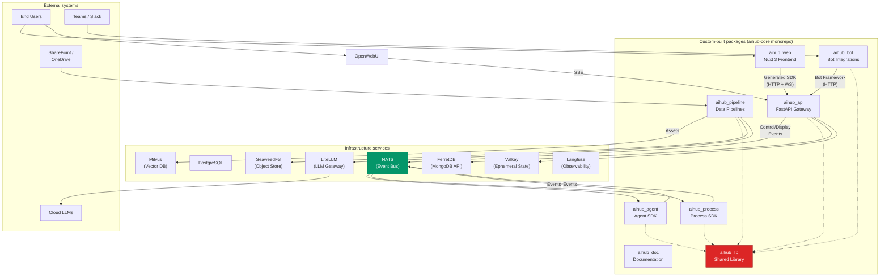

# Building block view

## Level 1: overall system

The platform decomposes into eight custom-built packages and a set of third-party infrastructure services. The packages
live in a single Git repository (aihub-core). Direct imports between packages are prohibited; all inter-package
communication flows through the shared library aihub_lib or through NATS events.

### Custom-built packages

| Building block | Responsibility                                                                                                                                                                                                                                                                                                              |
| -------------- | --------------------------------------------------------------------------------------------------------------------------------------------------------------------------------------------------------------------------------------------------------------------------------------------------------------------------- |
| aihub_lib      | Shared library consumed by all other packages. Provides the event type hierarchy, workflow engine, authentication, authorization, internationalization, persistence entities, infrastructure client configuration, and the Controller base class for the API.                                                               |
| aihub_agent    | Agent SDK. Contains the Agent base class, the `@step` decorator, the AgentDispatcher, the AgentRunner, pre-built agents (RAGAgent, LLMWrappingAgent, ExpertAskingAgent, FewShotAgent, and others), and the RunContext/ThreadContext state management classes.                                                               |
| aihub_process  | Process orchestration SDK. Contains the AgenticProcess base class, the `@process_step` decorator, the entity delegation system (Agent, Human, Program, Process delegators), the ProcessDispatcher, and the ProcessRunner.                                                                                                   |
| aihub_api      | REST API gateway. FastAPI application that bridges HTTP, SSE, and WebSocket connections to the NATS event bus. Contains 22 domain-specific controller groups, the dynamic agent/process endpoint discovery service, WebSocket management, event persistence, and NATS RPC responders for agent and process configuration.   |
| aihub_pipeline | Data ingestion pipelines built on Dagster. Implements the two-stage pipeline pattern: Stage 1 monitors external sources and downloads files to the data lake; Stage 2 parses, chunks, embeds, and indexes documents into Milvus. Contains asset factories, operations, I/O managers, and resources for document processing. |
| aihub_bot      | Collaboration platform integrations. Bridges Microsoft Teams, Slack, and Web Chat to platform agents via the Azure Bot Framework. Contains the BaseChatBot activity handler, the CompletionHandler strategy pattern, the Bot-in-the-Loop handler for human expert escalation, and per-channel content extraction.           |
| aihub_web      | Frontend application. Nuxt 3 SPA providing the admin UI and process UI. Contains Vue 3 components organized by domain, Pinia-Colada composables for server state, a generated TypeScript SDK from the API's OpenAPI spec, WebSocket integration for real-time Display Events, and FormKit dynamic form rendering.           |
| aihub_doc      | Documentation site. VitePress-based docs with arc42 architecture documentation, ADRs, auto-synced code deep dives from package READMEs, and automated English-to-German translation.                                                                                                                                        |

### Infrastructure services

The platform deploys approximately 30 third-party containers organized into five Docker network zones. The following
table groups them by function. Protocols and ports are documented in chapter 3 (Technical context).

**Data stores**

| Building block | Responsibility                                                                                                                                                                           |
| -------------- | ---------------------------------------------------------------------------------------------------------------------------------------------------------------------------------------- |
| PostgreSQL     | Relational database hosting four schemas: openwebui (chat history), langfuse (trace metadata), dagster (pipeline state), litellm (usage tracking). A separate instance backs FerretDB.   |
| FerretDB       | MongoDB-compatible document store over PostgreSQL. Stores conversation history, agent and process configuration, persisted events, and application state. Avoids MongoDB's SSPL license. |
| Milvus         | Vector database for semantic search. Stores document embeddings generated by the ingestion pipeline. Uses etcd for metadata and SeaweedFS (via S3) for data persistence.                 |
| Neo4j          | Graph database for mem0 agent memory. Stores entity relationships extracted from conversations for long-term agent context.                                                              |
| Valkey         | Redis-compatible ephemeral store. Holds RunContext, ThreadContext, WebSocket state, session data, LiteLLM response cache, and Langfuse job queues. All data has a 30-day TTL.            |
| ClickHouse     | Columnar analytics database. Backend for Langfuse event analytics and cost aggregation dashboards.                                                                                       |
| etcd           | Key-value store for cluster coordination. Serves as metadata backend for both Milvus and SeaweedFS.                                                                                      |

**Message broker**

| Building block | Responsibility                                                                                                                                                                                                                                                           |
| -------------- | ------------------------------------------------------------------------------------------------------------------------------------------------------------------------------------------------------------------------------------------------------------------------ |
| NATS           | Central event bus. JetStream provides durable streams for Control Events (workflow state). NATS Core provides ephemeral pub/sub for Display Events (observability) and request-reply for configuration RPC. All inter-service workflow communication flows through NATS. |

**Storage**

| Building block | Responsibility                                                                                                                                                                                                                                                    |
| -------------- | ----------------------------------------------------------------------------------------------------------------------------------------------------------------------------------------------------------------------------------------------------------------- |
| SeaweedFS      | S3-compatible distributed object storage. Four components (master, volume servers, filer, S3 gateway) provide the data lake for ingested documents, the storage backend for Milvus vector data, artifact storage for Langfuse, and file uploads from the chat UI. |

**LLM and inference**

| Building block        | Responsibility                                                                                                                                                                                                                                            |
| --------------------- | --------------------------------------------------------------------------------------------------------------------------------------------------------------------------------------------------------------------------------------------------------- |
| LiteLLM               | LLM gateway. Exposes an OpenAI-compatible API that routes requests to cloud providers (Azure OpenAI, Google Gemini) or local models (llama.cpp, Speaches). Tracks token consumption and cost per request. Runs Presidio guardrails before external calls. |
| llama.cpp (chat)      | Local chat model inference. Runs Gemma-3-4B (development) or Gemma-3-12B (production). Registered in LiteLLM as an OpenAI-compatible endpoint.                                                                                                            |
| llama.cpp (embedding) | Local embedding model. Runs Qwen3-0.6B for vector embeddings used by the ingestion pipeline and RAG retrieval.                                                                                                                                            |
| llama.cpp (reranker)  | Local reranking model. Runs Qwen3-Reranker-0.6B for multi-stage retrieval result reranking.                                                                                                                                                               |
| Speaches              | Local audio model. Runs Whisper for speech-to-text and Kokoro-82M for text-to-speech. Registered in LiteLLM alongside other models.                                                                                                                       |
| MinerU                | Document parser with OCR and structural extraction. Runs in an isolated container due to AGPL licensing. Communicates with the platform only via REST API. An optional VLM container (MinerU VLM) provides vision-based document understanding.           |
| Presidio              | PII detection and anonymization. Two containers (analyzer, anonymizer) intercept LLM requests as LiteLLM pre-call guardrails, masking or blocking sensitive entities before they reach external providers.                                                |

**User-facing services**

| Building block | Responsibility                                                                                                                                                                                                         |
| -------------- | ---------------------------------------------------------------------------------------------------------------------------------------------------------------------------------------------------------------------- |
| OpenWebUI      | Chat interface for end users. Provides a web-based LLM interaction surface with file upload, code execution (via Jupyter), and agent access. Connects to the API via SSE for streaming responses.                      |
| Traefik        | Reverse proxy. Handles TLS termination (Let's Encrypt in production, mkcert in development), HTTP routing to backend services, rate limiting, and service discovery from Docker labels. Not deployed in the dev stage. |

**Observability**

| Building block | Responsibility                                                                                                                                                                                      |
| -------------- | --------------------------------------------------------------------------------------------------------------------------------------------------------------------------------------------------- |
| Langfuse       | LLM observability platform. Captures full prompt/response pairs, token counts, cost attribution per user and agent, RAG retrieval details, and evaluation datasets. Self-hosted via Docker Compose. |
| OTEL Collector | OpenTelemetry trace collector. Receives gRPC and HTTP traces from all instrumented services and exports them to Langfuse. Can optionally forward to external backends (SigNoz, Datadog).            |

**Utility services**

| Building block | Responsibility                                                                                                                                                                                          |
| -------------- | ------------------------------------------------------------------------------------------------------------------------------------------------------------------------------------------------------- |
| Dagster        | Pipeline orchestration. Webserver provides the monitoring UI; daemon runs scheduled sensors and automation conditions. Pipeline workers execute the actual asset materializations.                      |
| Rclone         | Cloud storage synchronization. Provides a unified API across 70+ storage backends (SharePoint, OneDrive, Google Drive, S3, SFTP). Used by Stage 1 pipeline assets to monitor and download source files. |
| Jupyter Lab    | Code execution sandbox. Isolated Python environment where user-submitted code runs. Integrated with OpenWebUI for inline code interpretation.                                                           |
| Playwright     | Headless browser. Provides web scraping and content extraction for agent web search capabilities. Runs on the egress network with inter-container communication disabled to prevent lateral movement.   |
| Attu           | Milvus administration UI. Read-only tool for inspecting vector collections, debugging embedding quality, and monitoring index performance.                                                              |

### Key interfaces

Four communication patterns connect the building blocks, as described in chapter 3 (Channel mapping summary). The most
architecturally significant interfaces are:

**Swiss AI Agent Protocol (NATS):** The event contract between all SDK-built code (agents, processes, pipelines) and the
platform. Events follow the hierarchical topic structure
`agent.{class}.{id}.{thread}.{display}.{run}.{event_type}.{event_name}.{event_id}`. Control Events and Display Events
are the two event categories. All event types are defined in aihub_lib and registered automatically via Pydantic's
subclass hooks.

**Agent discovery protocol (NATS request-reply):** The API gateway broadcasts a ClassDiscoveryRequestEvent periodically.
Online agents respond with an AgentDiscoveryResponseEvent containing their event schemas, configuration schema, and
workflow graph. The gateway dynamically generates REST endpoints from these responses. No static registry exists.

**Generated TypeScript SDK (HTTP):** The frontend consumes the API exclusively through a TypeScript client generated
from the API's OpenAPI specification by HeyAPI. This keeps the type contract between backend and frontend synchronized
without manual maintenance.

**WebSocket event stream:** The admin UI maintains a single WebSocket connection to the API. Display Events received by
the API from NATS are wrapped in ContextualizedAgentEvent objects and pushed to connected clients. The frontend inserts
these events directly into its Pinia-Colada cache without refetching.

## Level 2: aihub_lib

aihub_lib is the foundation that all other packages build on. It is decomposed into the following subsystems.

### Event system

The event system defines all event types used across the platform. Every event inherits from BaseEvent, which provides
automatic subclass registration, polymorphic deserialization, unique event identifiers, nanosecond-precision timestamps,
and trace context propagation.

The type hierarchy branches into three categories. ControlEvent drives workflow execution and is the only event type
that can trigger agent steps. DisplayEvent provides observability data for frontends and tracing systems but never
influences workflow logic. ControlAndDisplayEvent serves both roles simultaneously (StartEvent, StopEvent, and the
human/agent/bot-in-the-loop events are in this category).

Specialized event families include SemanticEvent (OpenInference-compatible tracing for LLM calls, retrieval, embedding,
reranking, and tool use), ProcessEvent (workflow orchestration), WorkEvent and WorkRequestEvent (process entity
delegation), and discovery events (agent and process advertisement). The event registry contains approximately 100 event
types organized into 26 subdirectories.

### Form system

The form system implements the form duality pattern where a single Pydantic model serves as both a UI form definition
and a runtime data model. In form mode, fields contain FormkitElement instances (InputText, InputNumber, Select,
Checkbox, and 25 other element types) that the admin UI renders as interactive controls. In data mode, the same fields
contain primitive values. The Form base class auto-registers subclasses and provides methods to extract the FormKit
schema and generate a submission validation model.

Domain-specific form elements (AgentSelector, ModelSelect, KnowledgeDatabaseSelector, VectorStoreInput) extend the base
elements with platform-aware behavior. LocaleInput supports multi-language string entry across all four supported
locales.

### Workflow engine

The workflow engine provides the execution model for both agents and processes. DispatchableWorkflow is the abstract
base class. Methods decorated with `@step` or `@process_step` become executable workflow steps. The engine extracts
input and output event types from method signatures, builds a step dependency graph, and exposes methods to query which
steps are waiting for a given event type.

BaseDispatcher orchestrates execution. It receives events, identifies which steps are ready to run, resolves
dependencies via type-annotated parameter injection, executes the step method, and publishes the output events. The
dispatcher holds no in-memory state; all execution state is stored externally in Valkey (step completion tracking) and
NATS JetStream (event history for replay).

### NATS communication

Publishers and subscribers provide the transport layer for events. AbstractPublisher and AbstractSubscriber are generic
base classes parameterized by event type. JSPublisher and JSSubscriber handle durable JetStream communication for
Control Events. NCPublisher and NCSubscriber handle ephemeral NATS Core communication for Display Events. Agent-specific
and process-specific subscriber variants add scoping and trace context handling.

The topic system defines structured NATS subjects. Topic is the abstract base class with automatic subclass registration
and polymorphic subject parsing. AgentTopicManager and ProcessTopicManager build subjects with the correct hierarchy and
provide methods to construct subscription patterns at different scoping levels (class-wide, instance-wide,
thread-specific).

RPC clients (AgentConfigClient, ProcessConfigClient) use NATS request-reply to fetch runtime configuration from the API
without embedding configuration data in events.

### Authentication and authorization

AuthHandler is the abstract base for extracting credentials from HTTP requests and returning a UserIdentity. Concrete
implementations support OAuth2/OIDC (Azure AD), bearer tokens, OpenWebUI session tokens, and a development-only handler
that bypasses authentication entirely. IdentityProvider retrieves full user details (roles, profile, group membership)
from external directories. MultiStrategyIdentityProvider chains multiple providers with fallback.

AccessChecker implements hierarchical permission matching using dot-notation rules
(`aihub.[user|admin].<resource>.<subresource>.<id>`) with four wildcard types: `*` (single-level any), `>` (multi-level
any), `?*` (single-level with implicit value check), and `?>` (multi-level with implicit value check). Admin rules
implicitly grant user access.

### Persistence

Persistence entities follow the active record pattern using MongoEngine. Each entity is a Document subclass that
combines schema definition with repository classmethods. Key entities include RoleEntity (roles, access rules, usage
limits), ThreadEntity (conversation threads with embedded user and agent references), AgentConfigEntity and
ProcessConfigEntity (persisted configuration), PersistedAgentEventEntity and PersistedProcessEventEntity (event
storage), and UserEntity (user profiles).

### Infrastructure configuration

Infrastructure settings classes use Pydantic BaseSettings to load configuration from environment variables with
validation. Over 20 settings classes cover NATS, MongoDB, Redis, Milvus, S3, Neo4j, Langfuse, LiteLLM, MinerU, Rclone,
SharePoint, OpenTelemetry, and other services. LangfuseProvisioner handles automatic agent registration in Langfuse at
startup. LiteLLMService provides a unified client for all model operations including budget tracking.

### Internationalization

LocaleString is a multi-language container holding values for German, English, French, and Italian. LocaleHandler
resolves translations from YAML files organized by scope (lib, bot, api, agent, process) with a fallback chain from the
requested locale to German to the first available translation. All user-facing strings in the platform flow through this
system.

### Event display

EventDisplayer publishes Display Events during agent execution. It provides methods to stream LLM output as ChunkEvents,
surface reasoning as ThoughtEvents, and report costs as LLMCostEvents. StreamProcessor handles the buffering and
flushing of streaming content, with TagParser splitting `<think>` tags to separate reasoning from regular output.

### Controller base class

Controller is the abstract base for all API endpoint groups. It provides authenticated route registration, hierarchical
permission injection via FastAPI's `Security()` mechanism, automatic OpenTelemetry span enrichment, and a fluent builder
API where each endpoint method returns `Self` for chaining.

## Level 2: aihub_agent

aihub_agent provides the SDK for building workflow-based agents. It depends on aihub_lib for the workflow engine, event
types, and infrastructure abstractions.

### Agent base class

Agent extends DispatchableWorkflow and adds agent-specific metadata: a localized name and description
(AgentLocaleString), an icon identifier, and cached classmethods that extract the agent's start events, stop events, and
human-in-the-loop events from its step signatures. Agent is stateless; all instance-level state is externalized.

### Step decorator

The `@step` decorator marks methods as workflow building blocks. It extracts input and output event types from the
method's type annotations and stores them as function attributes. Configuration parameters include
`max_executions_per_run` (prevents infinite loops), `stop_on_error` (fail-fast behavior), `precondition` (an async
function that must return true before the step can execute), and localized name, description, and icon for UI rendering.
The decorator does not modify the function itself; it only attaches metadata.

### AgentDispatcher

AgentDispatcher extends BaseDispatcher with agent-specific behavior. On receiving a StartEvent, it fetches runtime
configuration from the API via NATS RPC and deep-merges it with deployment-specific non-configurable values. It resolves
step parameters by type annotation, injecting events from the execution history, the merged configuration, RunContext,
ThreadContext, EventDisplayer, LocaleHandler, AgentMemory, and topic information. It tracks step execution to prevent
duplicate processing of the same event and cleans up RunContext on workflow completion.

### AgentRunner

AgentRunner initializes the production infrastructure: NATS and JetStream connections, Valkey, Milvus, and the
AgentDispatcher. It sets up a JetStream subscriber for Control Events and a NATS Core subscriber for discovery requests.
When the API broadcasts a ClassDiscoveryRequestEvent, the runner responds with an AgentClassDiscoveryResponseEvent
containing the agent's FormKit form schema, input and output event specifications, and a serialized workflow graph.
AgentTestRunner extends the runner with event observation capabilities for testing.

### Context classes

RunContext provides per-execution ephemeral state stored in Valkey with a 30-day TTL. It is scoped to a single run (one
StartEvent-to-StopEvent cycle) and cleaned up on completion. Use cases include loop counters, intermediate retrieval
results, and accumulated context. ThreadContext provides per-conversation state, also in Valkey with a 30-day TTL,
persisting across multiple runs within the same thread. Use cases include conversation history, namespace selections,
and user preferences.

### Pre-built agents

The package includes several pre-built agents that demonstrate the SDK's patterns and cover common use cases. RAGAgent
performs knowledge-based question answering with retrieval, reranking, and memory integration. LLMWrappingAgent provides
a minimal two-step passthrough to an LLM. ExpertAskingAgent escalates questions to human experts via the Bot-in-the-Loop
pattern. ExpertRagAgent combines RAG retrieval with expert fallback when retrieval confidence is low. FewShotAgent uses
example-based pattern matching with a suitability guard. NamespaceSelectionAgent routes queries to the appropriate
knowledge base using LLM-driven namespace determination. RetrievalAgent performs pure document retrieval without LLM
generation.

## Level 2: aihub_api

aihub_api is the platform's HTTP gateway. It translates between the synchronous request-response world of web clients
and the asynchronous event-driven world of NATS.

### Controller-service-DTO pattern

Each of the 22 API domains follows a three-layer structure. The controller handles HTTP routing, authentication via
`Security()`, locale injection via `Depends()`, and response serialization. The service contains business logic as
stateless `@staticmethod` methods decorated with `@trace_fn` for OpenTelemetry instrumentation. DTOs are Pydantic models
with `@classmethod` factory methods (`from_entity`, `from_discovery_event`, `from_request`) and an `in_locale(t)` method
for localized output. Controllers use a fluent builder API where each endpoint method returns `Self`, allowing the main
entry point to chain methods during registration.

The API domains cover agents, threads, processes, events, knowledge, models, users, roles, files, evaluation, memory,
notifications, tokens, translation, suites, health, internationalization, and OpenAI-compatible endpoints for chat
completions, embeddings, audio, and images.

### Discovery services

AgentEndpointsDiscoveryService runs on a 60-second interval. It broadcasts a ClassDiscoveryRequestEvent via NATS,
collects responses from online agents, and dynamically generates FastAPI routes for each agent's start, stop, and
human-in-the-loop events. ModelCreationService converts the JSON schemas from discovery responses into Pydantic models
at runtime using the jambo library, so each agent's endpoints have proper request and response validation. When agents
go offline, their endpoints are removed and the OpenAPI schema is invalidated. ProcessEndpointsDiscoveryService follows
the same pattern for processes, registering form endpoints for human input steps and data endpoints for programmatic
input.

### WebSocket management

WebSocketManager tracks active connections as a mapping from user ID to a set of WebSocket instances, supporting
multiple tabs and devices per user. WebSocketSender subscribes to Display Events on NATS, looks up thread participants
from the ThreadEntity, and broadcasts events to all connected sessions of each participant. Events are wrapped in
ContextualizedAgentEvent objects that add agent class, thread ID, and locale metadata. Connection failures trigger
automatic cleanup.

### Event persistence

EventPersister subscribes to all events on NATS and stores them in FerretDB as PersistedAgentEventEntity or
PersistedProcessEventEntity documents. This creates the immutable audit trail that the admin UI queries when rendering
thread event timelines.

### RPC responders

AgentConfigResponder and ProcessConfigResponder listen on NATS RPC subjects (`aihub.rpc.config.agent.{class}.{id}` and
`aihub.rpc.config.process.{class}.{id}`). When an agent or process fetches its configuration at the start of a run, the
responder loads the persisted configuration from FerretDB and returns it on the reply subject.

### Lifetime management

The FastAPI lifespan context manager initializes all infrastructure connections at startup: MongoDB (MongoEngine),
Valkey, Milvus, S3 (SeaweedFS), and NATS with JetStream. It then starts the event persistence subscriber, WebSocket
infrastructure, event distributors (for publishing start events and in-the-loop responses to NATS), RPC responders, and
discovery services. All resources are stored in FastAPI's `app.state` and made available to controllers through
`Depends()` functions.

## Level 2: aihub_process

aihub_process provides the SDK for orchestrating multi-entity workflows. Unlike agents, which execute work themselves,
processes delegate work to other entities: agents, humans, external programs, or other processes.

### AgenticProcess base class

AgenticProcess extends DispatchableWorkflow. Its step methods produce WorkRequestEvents (delegating work to an entity)
and consume WorkEvents (receiving completed work from an entity). The class provides cached methods to extract all
entity delegation configurations from its step signatures, enabling the runner and dispatcher to set up the correct NATS
subscriptions and response routing.

### Entity delegation system

Four entity types define how processes delegate work. Each has an In configuration (receive completed work) and an Out
configuration (delegate new work).

Agent.In and Agent.Out specify the target agent class and instance ID. When a process step produces an
AgentWorkRequestEvent, the platform publishes a StartEvent to the target agent. When the agent publishes a StopEvent,
the AgentDelegator wraps it in an AgentWorkEvent and routes it back to the process.

Human.In and Human.Out define human task routing. Out specifies target users by ID, email, or role, and whether to send
notifications. The API renders a form in the Process UI based on the event's form elements. When a human submits the
form, the result arrives as a HumanWorkEvent.

Program.In and Program.Out handle external system integration via HTTP webhooks. Process.In and Process.Out enable
process-to-process chaining, where a parent process delegates to a child process and receives the child's
ProcessStopEvent wrapped in a ProcessWorkEvent.

### ProcessDispatcher

ProcessDispatcher extends BaseDispatcher with process-specific behavior. On receiving the first WorkEvent for a new
walkthrough, it fetches configuration via NATS RPC and stores it in WalkthroughContext. It auto-injects entity-specific
fields (agent class, agent ID, user IDs, endpoint URLs) from the Out configuration into outgoing WorkRequestEvents, so
process step methods do not need to handle routing details.

## Level 2: aihub_pipeline

aihub_pipeline implements the document ingestion system as Dagster software-defined assets.

### Two-stage architecture

Stage 1 is source-specific. Observable source assets monitor external storage systems (SharePoint, OneDrive, Google
Drive, S3, SFTP via Rclone, or a local filesystem) for changes. Each file is assigned a dynamic partition key and a
DataVersion (a hash-timestamp pair) that detects both content changes and metadata updates. When changes are detected,
the pipeline downloads the file and writes it to the SeaweedFS data lake as a DataLakeFile.

Stage 2 is unified across all sources. An observable data lake asset monitors the SeaweedFS bucket for new or modified
files. Downstream assets process each file through parsing (MinerU for OCR and structural extraction, with fallbacks for
EPUB, IPYNB, and RTF), optional table refinement (LLM-powered table detection), optional figure description (vision
model alt-text generation), semantic chunking (Markdown-aware structural node parser), embedding generation (via
LiteLLM-routed models), and vector indexing into Milvus. Each processing step is a Dagster operation composed into graph
assets by factory functions.

### Asset factories

Factory functions generate the asset definitions for a given pipeline configuration. `documents_factory` composes
parsing, refinement, and document store insertion into a single graph asset. `nodes_factory` composes chunking,
embedding, and vector store insertion. `observable_rclone_factory`, `observable_share_point_factory`, and
`observable_local_file_system_factory` create the Stage 1 source monitoring assets. The `default_definitions` function
wires all factories, resources, sensors, and schedules into a complete Dagster Definitions object.

### Resources and I/O managers

Resources abstract external dependencies for Dagster's dependency injection. DocumentParserResource routes files to the
appropriate parser by type. EmbeddingModelResource and LanguageModelResource wrap LiteLLM model names. Data lake clients
(S3DataLakeClient, AzureDataLakeClient) provide cloud-agnostic storage access. SharePointResource, RcloneResource, and
LocalFileSystemResource configure source connectors.

I/O managers handle asset persistence. S3DataLakeIOManager reads and writes DataLakeFile objects to SeaweedFS with
metadata stored as S3 object tags. DocStoreIOManager persists RefDocDocument objects to MongoDB via LlamaIndex's
KVDocumentStore. VectorStoreIOManager upserts TextNode objects to Milvus with retry logic for eventual consistency.
Source-specific I/O managers (SharePointIOManager, RcloneIOManager, LocalFileSystemIOManager) provide read-only access
to external sources.

## Level 2: aihub_bot

aihub_bot bridges collaboration platforms to the platform's agent system via the Microsoft Bot Framework.

### Three-layer architecture

The routes layer consists of FastAPI controllers that receive incoming webhook requests from the Azure Bot Framework.
Each endpoint is associated with a PathEntity (stored in MongoDB) that holds the Azure AD credentials, an optional
system prompt, and channel-specific configuration like Slack OAuth tokens. A RoutesService caches CloudAdapter instances
per endpoint to avoid repeated MSAL authentication.

The bot layer contains ActivityHandler subclasses that manage the message lifecycle. BaseChatBot handles the common
flow: extract content from the incoming activity (with channel-specific logic for Teams attachments, Slack file
downloads, and HTML parsing), start a parallel typing indicator task, delegate to the completion handler, and persist
both the user message and the bot response to ConversationEntity in MongoDB. Specialized variants (AgentChatBot,
StreamAgentChatBot, OpenaiChatBot, StreamOpenaiChatBot) select streaming or non-streaming behavior and the appropriate
completion strategy.

The completion layer implements the strategy pattern. AgentCompletionHandler publishes a StartEvent to NATS and either
collects all ChunkEvents into a single response (non-streaming) or yields them as an async generator for progressive
message updates (streaming). OpenaiCompletionHandler calls LiteLLM directly for simple model access without agent
workflows.

### Bot-in-the-Loop

The Bot-in-the-Loop pattern enables agents to ask questions in collaboration channels and wait for human responses. The
BotInTheLoopHandler subscribes to BotInTheLoopRequestEvents from all agents. When an agent needs human input, the
handler sends the question proactively to a configured Slack channel or Teams conversation. When a human replies, the
BotInTheLoopBot matches the reply to the original thread, extracts the response, and publishes a
BotInTheLoopResponseEvent back to NATS, resuming the agent's workflow.

## Level 2: aihub_web

aihub_web is the Nuxt 3 frontend application that provides the admin UI and process UI.

### Component architecture

Components are organized by domain (Agent, Thread, Process, Knowledge, Event, Dashboard, and others) with approximately
113 Vue components in total. Structural layout primitives (Screen, Column, Substructure) provide a consistent
master-detail pattern: a list view on the left, a detail panel on the right, with nested routing for sub-tabs. Event
display components (26 types) render the real-time agent event timeline. Each event type maps to a specific Vue
component via a resolver that walks the event's parent type chain for inheritance-based matching.

FormKit dynamic forms render agent and process configuration. The backend publishes FormKit schemas as part of the
discovery response. The frontend transforms these schemas into interactive forms using custom input components
(AgentSelector, ModelSelect, VectorStoreInput, KnowledgeDatabaseSelector, IconSelector, LocaleInput) that extend FormKit
with platform-aware behavior.

### State management

Pinia-Colada manages all server state as reactive queries (GET operations) and mutations (POST/PUT/DELETE operations).
Queries define cache keys, stale times, and fetch functions that call the generated TypeScript SDK. Mutations invalidate
affected query keys on success, triggering automatic refetches. WebSocket events from the API bypass the query/fetch
cycle entirely: incoming ContextualizedAgentEvents are pushed directly into the Pinia-Colada cache using `setQueryData`,
providing real-time updates without HTTP round trips.

### Generated SDK and API contract

The TypeScript SDK in `sdk/client/` is generated from the API's OpenAPI specification using HeyAPI and is never edited
manually. It provides typed request functions and response types for all API endpoints. All API calls in composables
pass `composable: '$fetch'` to use Nuxt's native fetch adapter. This generation step is the sole mechanism for keeping
frontend types aligned with backend types.
