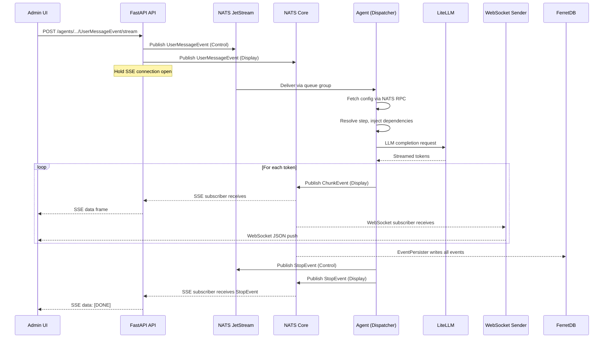
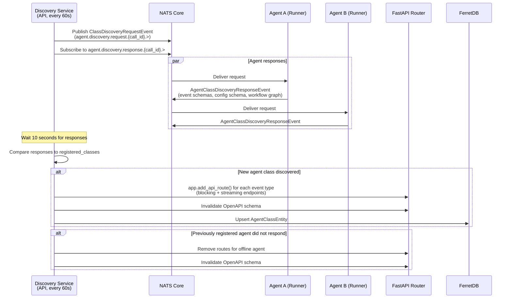

# Runtime view

This chapter describes six runtime scenarios that illustrate how the platform's building blocks interact during
execution. The scenarios were selected because each exercises a different communication pattern and a different subset
of infrastructure components. Together they cover the four primary runtime concerns: synchronous request handling,
asynchronous event-driven workflows, batch data processing, and failure recovery.

## User message to agent response

This scenario traces the full path of a user message from the browser to an agent and back. It is the most common
runtime interaction and exercises the SSE, WebSocket, JetStream, and NATS Core communication channels simultaneously.

### API receives the message

The user sends a message through one of three transport mechanisms. The Admin UI sends an HTTP POST to a dynamically
registered SSE streaming endpoint at `/agents/classes/{AgentClass}/instances/{agent_id}/{EventName}/stream`. OpenWebUI
sends the same payload through its OpenAI-compatible pipeline, which calls `ChatService` internally. The Admin UI also
maintains a persistent WebSocket connection at `/events/ws` for receiving display events.

The streaming endpoint was not defined at compile time. It was registered at runtime by `AgentEndpointsDiscoveryService`
after discovering the agent class on NATS (described in the next scenario). The endpoint closure calls
`AgentService.send_agent_input_event_stream()`, which returns a `StreamingResponse` wrapping an SSE generator.

### Event distribution to NATS

`ExternalAgentEventDistributor.distribute_event()` bridges the HTTP boundary into the event-driven world. For a
`StartEvent` (which `UserMessageEvent` is), the distributor generates a fresh `run_id`, constructs an
`AgentThreadTopicManager` for each agent assigned to the thread, and publishes the event to JetStream on subject
`agent.{class}.{id}.{thread}.{display}.{run}.control.{event_name}.{event_id}`. Because `UserMessageEvent` is both a
`StartEvent` and a `DisplayEvent`, the distributor also publishes it to NATS Core on the display subject so that the
user's own message appears immediately in the event stream.

JetStream publication is durable. If the agent is temporarily offline, the message persists in the stream and will be
delivered when the agent reconnects.

### Agent dispatches the event to a step

The agent's `AgentJSSubscriber` receives the event from JetStream. A queue group (`agent_runner_{agent_class}`) ensures
that only one agent instance processes each event, even when multiple instances are running for horizontal scaling.

`AgentDispatcher.handle_event()` performs several operations before any step executes. It stores the event in
`JetStreamEventStore` for replay. It creates `RunContext` and `ThreadContext` objects backed by Valkey. Because this is
a `StartEvent`, it fetches the agent's configuration via NATS RPC (`AgentConfigClient.fetch_config()` sends a request to
`aihub.rpc.config.agent.{class}.{id}`, and `AgentConfigResponder` in the API replies with the configuration from
MongoDB). The dispatcher deep-merges the fetched user-configured values with the agent's non-configurable defaults and
validates the result into a typed `AgentConfig` Pydantic model stored in `RunContext`.

The dispatcher then calls `agent.get_steps_waiting_for_event(type(event))` to find all `@step`-annotated methods whose
input type annotations include the incoming event type. For each candidate, `is_step_ready()` checks that all required
input events are present in the event store, that the step has not exceeded its `max_executions_per_run` limit, and that
any declared precondition function returns true. Ready steps are launched as `asyncio.create_task()` calls, allowing
independent steps to execute concurrently within the same run.

### Step execution and display event publishing

`execute_step()` instantiates a fresh agent object (agents are stateless; no in-memory state carries between steps) and
injects dependencies through type-annotation-based resolution. Parameters annotated with `RunContext`, `ThreadContext`,
`AgentConfig`, `EventDisplayer`, `AgentMemory`, or `AgentLocaleHandler` are constructed and passed automatically. An
idempotency check (`StepStore.was_called_with_events()`) hashes the input event IDs and skips execution if the same
combination was already processed, preventing duplicate work under JetStream's at-least-once delivery guarantee.

During execution, the step publishes display events through `EventDisplayer`. `display_chunk()` emits `ChunkEvent`
objects containing streaming LLM tokens. `display_thought()` emits `ThoughtEvent` objects exposing agent reasoning. RAG
steps emit `RetrieverEvent` and `RerankerEvent` with retrieval results. All display events are published to NATS Core
(ephemeral, fire-and-forget) on the display subject. Control events returned by the step (the next workflow event) are
published to JetStream (durable), where they trigger the next step in the workflow graph.

### Response streams back to the frontend

Display events reach the frontend through two independent paths that operate simultaneously.

The first path serves the SSE connection that initiated the request. When `AgentService` started the interaction, it
created a per-request `AgentNCSubscriber` scoped to the thread's display subject. Each display event arriving on this
subscriber is placed into an `asyncio.Queue`. The SSE generator drains the queue and yields each event as a
`data: {json}\n\n` frame. When a `StopEvent` or `ExceptionEvent` arrives, the generator emits `data: [DONE]\n\n` and
closes the connection.

The second path serves the WebSocket. The API's `WebSocketSender`, started during the API lifetime, subscribes to all
agent display events (`agent.*.*.*.*.*.display.>`). For each event, it looks up the thread's participant user IDs
(cached with a 60-second TTL), wraps the event in a `ContextualizedAgentEvent` (adding agent class, thread ID, run ID,
and localized display names), and sends it as JSON to every active WebSocket connection for each participant.
`WebSocketManager` tracks connections per user ID and prunes stale connections lazily when a `send_json` call fails.

The `EventPersister`, also started during the API lifetime, subscribes to all agent events (`agent.>`) on a separate
NATS Core subscription and writes every event to MongoDB as a `PersistedAgentEventEntity`. This creates the audit trail
that the Admin UI uses to render the complete event timeline for any thread.

## Agent discovery and dynamic endpoint registration

This scenario describes how the API gateway learns about available agents at runtime without any static configuration or
registration endpoint. It runs continuously in the background and determines the platform's API surface.

### Discovery broadcast

`AgentEndpointsDiscoveryService` runs a loop every 60 seconds. Each iteration generates a unique `call_id`, subscribes
to `agent.discovery.response.{call_id}.>` on NATS Core, and publishes a `ClassDiscoveryRequestEvent` to
`agent.discovery.request.{call_id}.>`. It then waits 10 seconds for responses to accumulate before stopping the
subscriber.

### Agent response

Each running agent has a NATS Core subscriber for discovery requests, registered during `AgentRunner.start()`. When the
request arrives, the handler inspects the agent class to collect its start events, stop events, human-in-the-loop
events, workflow graph (built by `WorkflowVisualizer`), and configuration schema (built by `AgentConfigSpecs` from the
agent's Pydantic form model). It packages this metadata into an `AgentClassDiscoveryResponseEvent` and publishes it back
on the response subject.

The response includes an `is_conversational` flag, set to true when any of the agent's start events is a subclass of
`UserMessageEvent`. This tells the frontend whether to render a chat interface for this agent.

### Dynamic route registration

Back in the API, the discovery service iterates over the collected responses. For each agent class not already in the
`registered_classes` set, it calls `_register_class_endpoints()`, which uses `app.add_api_route()` to create FastAPI
routes for each start event and each human-in-the-loop response event. Each event type gets two routes: a blocking
endpoint that returns the `StopEvent` as JSON, and a streaming endpoint that returns an SSE `text/event-stream`
response. The route paths follow the pattern `/agents/classes/{AgentClass}/instances/{agent_id}/{EventName}[/stream]`.

After registering new routes, the service sets `app.openapi_schema = None` to invalidate the cached OpenAPI
specification. The next request to the OpenAPI endpoint regenerates the schema, which now includes the new agent's
endpoints. The generated TypeScript SDK in the frontend is built from this schema.

For agent classes that were previously registered but did not respond in this discovery cycle,
`_deregister_endpoints_for_class()` removes their routes. Agent class metadata (name, description, icon, event schemas,
configuration schema, workflow graph) is upserted into MongoDB via `AgentClassEntity.create_or_update()`, and the
`last_discovered` timestamp determines whether the class is considered online.

The same discovery pattern applies to processes, with `ProcessEndpointsDiscoveryService` broadcasting
`ProcessClassDiscoveryRequestEvent` and dynamically registering process-specific routes.

## Document ingestion pipeline

This scenario describes how a document moves from an external source into the Milvus vector store where agents can
retrieve it. The pipeline runs as a Dagster deployment with two stages: source-specific download and source-agnostic
processing.

### Stage 1: change detection and download

Each data source is represented as a Dagster observable source asset. The asset's `observe` function polls the source
for file metadata and returns a `DataVersionsByPartition` mapping, where each partition key is a file path and each data
version encodes enough information to detect changes. For Rclone-backed sources (OneDrive, Google Drive, Dropbox, and
70+ other backends), the data version is the file's content hash if available from the backend, falling back to
`mtime:{modified}-{size}` for backends that do not provide hashes. For SharePoint sources, the data version combines the
file's etag with its last modified date.

All sources use `DynamicPartitionsDefinition`. The `replace_partition_keys()` utility adds new partitions and removes
deleted ones, capped at 1000 changes per observation tick to prevent memory issues in large repositories.

When Dagster detects a new or changed data version for a partition, `AutomationCondition.eager()` on the downstream
`data_lake_file` graph asset triggers materialization. The asset downloads the file content through the source-specific
I/O manager (`RcloneIOManager` calls the Rclone RC API, `SharePointIOManager` calls the Microsoft Graph API) and writes
it to SeaweedFS via the `S3DataLakeIOManager` with metadata stored as S3 object tags.

Three independent triggers ensure documents are processed reliably. The eager automation sensor polls every 60 seconds
for upstream changes. A NATS sensor (`nats_document_uploaded_sensor`) listens for `SourceUpdatedEvent` messages
published by the API when users upload documents through the web UI. A daily cron schedule re-observes all sources as a
backstop against missed events.

### Stage 2: parse, chunk, embed, index

Stage 2 assets consume `DataLakeFile` objects regardless of their origin. The chain is:

The `documents` graph asset sends the file to MinerU (or Docling) for OCR and structural extraction, optionally
generates figure descriptions using a vision LLM, optionally refines table structures with an LLM, and inserts the
resulting `RefDocDocument` into the MongoDB document store via `DocStoreIOManager`.

The `nodes` graph asset takes the parsed document, deletes any existing nodes for that document in Milvus, chunks the
document using a Markdown-aware structural node parser, generates embeddings by calling the embedding model through
LiteLLM (which routes to the local Qwen3-0.6B llama.cpp instance at port 8183), and upserts the nodes into Milvus via
`VectorStoreIOManager`. An optional `summary_nodes` asset generates recursive hierarchical summaries for multi-level
retrieval.

A separate `removed_documents` asset runs on a daily schedule (default 03:00). It compares the current data lake
contents against the MongoDB document store and deletes orphaned documents and their vectors from both MongoDB and
Milvus.

Each document is an independent Dagster partition. A failure in one document's processing does not block any other
document. The entire chain from observable source to Milvus index runs without manual intervention once the source is
configured.

## Process orchestration with human-in-the-loop

This scenario describes how the process engine coordinates a multi-step workflow that delegates work to an agent, waits
for a human decision, and completes. It exercises the process dispatcher, entity delegators, and the bidirectional
bridge between process events and agent events.

### Process start

A process can start from three sources: a human submitting a form at a configured HTTP route, an external program
calling an API endpoint, or an agent completing work whose `StopEvent` maps to a `ProcessStartEvent`. In all cases, the
initiating event arrives as a `WorkEvent` on a JetStream subject following the pattern
`process.{class}.{id}.{walkthrough_id}.work.{event_name}.{event_id}`.

When `ProcessDispatcher` receives the first `WorkEvent` for a new walkthrough, it fetches the process configuration via
NATS RPC (`ProcessConfigClient.fetch_config()` on subject `aihub.rpc.config.process.{class}.{id}`), deep-merges it with
non-configurable defaults, and stores it in `WalkthroughContext` (a Valkey-backed store keyed by walkthrough ID with a
30-day TTL).

### Step execution and agent delegation

The dispatcher finds steps whose `@process_step` input annotations match the incoming `WorkEvent` type, checks readiness
(all required inputs present, idempotency guard passes), and launches execution as an async task. The step method
receives its dependencies through the same type-annotation-based injection used by agents: `WalkthroughContext`,
`ProcessConfig` subclasses, and `ProcessLocaleHandler` are resolved and passed automatically.

When a step returns an `AgentWorkRequestEvent`, the `AgentDelegator` intercepts it. The delegator creates a new MongoDB
`ThreadEntity` associating a fresh thread with the process class, process ID, and walkthrough ID. It wraps the agent's
`StartEvent` into an `ExternalAgentEvent` and distributes it through `ExternalAgentEventDistributor`, which publishes it
to JetStream on the agent's control subject. The agent processes the event through its normal step-based workflow,
unaware that it was triggered by a process.

The `AgentDelegator` subscribes at startup to the `StopEvent`s of every agent class referenced in the process's step
annotations. When the agent completes and publishes its `StopEvent`, the delegator looks up the originating
`process_walkthrough_id` from the thread entity, wraps the `StopEvent` in a `WorkEvent`, and publishes it to JetStream
on the process's work subject. The process dispatcher receives this event and routes it to the next step. The delegator
verifies that the thread belongs to the correct process class before forwarding, preventing cross-process contamination
when the same agent serves multiple processes.

### Human task assignment and response

When a step returns a `HumanWorkRequestEvent`, the event carries user targeting information injected from the
`Human.Out` annotation: user IDs, email addresses, roles, and a notification flag. The API subscribes to
`HumanWorkRequestEvent` events and creates a task entry visible in the Process UI for the specified users. The task
renders a form defined by the `HumanWorkEvent` subclass's FormKit schema.

When the human submits the form, the API validates the input, constructs a `HumanWorkEvent` with the submitted data and
the user's identity, and publishes it to JetStream on the process's work subject. The dispatcher receives the event,
matches it to the waiting step, and continues execution.

### Process completion

When the final step returns a `ProcessStopEvent`, the dispatcher cleans up the `WalkthroughContext` in Valkey, deletes
the event history and step store entries for the walkthrough, and the process is complete. If any step raises an
exception and the step's `stop_on_error` flag is set, a `ProcessExceptionEvent` terminates the walkthrough and triggers
the same cleanup.

## Platform startup

This scenario describes the order in which the platform's components initialize and the dependency relationships that
determine that order. Understanding the startup sequence matters because it reveals which components are prerequisites
for others and which failures block the entire system.

### Infrastructure layer

Docker Compose `depends_on` with health checks defines the startup order. The foundation layer starts in parallel:
PostgreSQL (two instances, one for application databases and one for FerretDB), NATS, Valkey, ClickHouse, and etcd. Each
declares a health check (PostgreSQL uses `pg_isready`, Valkey uses `valkey-cli ping`, ClickHouse responds to HTTP
`/ping`). NATS is configured with `healthcheck: test: ["NONE"]` and starts immediately without waiting for health
confirmation.

Once the foundation is healthy, the second layer starts: FerretDB (depends on its PostgreSQL backend), SeaweedFS master
(self-contained), and `etcd-init` (enables authentication on etcd). The third layer brings up SeaweedFS volume and filer
servers, the Langfuse worker, and LiteLLM (which depends on PostgreSQL and the Presidio containers). The fourth layer
starts SeaweedFS S3 gateway, Milvus (depends on etcd and SeaweedFS S3), and the Langfuse web UI. The fifth layer
initializes S3 buckets, starts the OTEL Collector (depends on Langfuse), and starts MinerU (depends on LiteLLM for VLM
inference).

OpenWebUI starts after PostgreSQL, SeaweedFS S3, LiteLLM, Jupyter, and Playwright are healthy. It runs with
`network_mode: "host"` because it needs to reach localhost services.

### API initialization

The API, agents, and pipeline workers run locally outside Docker in development. The API's `lifetime_manager` connects
to infrastructure services in a fixed sequence: MongoDB (FerretDB) via synchronous MongoEngine, then Valkey via an async
Redis client, then Milvus, then two S3 clients (one internal, one public for presigned URLs), then NATS with JetStream.

After connections are established, the lifetime manager starts six subscriber groups. Two `EventPersister` subscribers
(one for agents, one for processes) subscribe to all events on wildcard subjects and write every event to MongoDB for
the audit trail. A `WebSocketSender` subscriber listens to all agent display events and routes them to connected
WebSocket clients. Two `ExternalAgentEventDistributor` instances (one for agents, one for processes) handle publishing
user- initiated events from HTTP into NATS. Two RPC responders (`AgentConfigResponder` and `ProcessConfigResponder`)
subscribe to configuration request subjects and reply with agent and process configurations from MongoDB.

The lifetime manager then starts the discovery services, which begin their 60-second broadcast loop. It initializes
default roles and the superuser in MongoDB (idempotent operations) and provisions Langfuse. At this point the API is
ready to serve requests.

### Agent initialization

Each agent starts independently. `AgentRunner.start()` connects to NATS (with a 60-second timeout and 10,000 max pending
async publishes), Valkey, Milvus, and MongoDB. It creates an `AgentDispatcher` and calls `dispatcher.start()`, which
initializes the `JetStreamEventStore`. The event store replays all historical events from JetStream in batches of 100
using a temporary consumer with `DeliverPolicy.ALL`, populating an in-memory TTL cache. This replay is what enables
crash recovery: if the agent was restarted mid-run, the replayed events allow the dispatcher to determine which steps
have already executed.

After replay, the runner subscribes to control events on JetStream (with a durable queue group for load balancing) and
to discovery requests on NATS Core. It starts an HTTP health check server. The agent is now ready to receive events.

## Error handling and recovery

This scenario describes what happens when components fail and how the platform recovers. The event-driven architecture
and externalized state design make most failures recoverable without data loss.

### Step failure

When a step raises an exception, the dispatcher catches it, records the error in the OpenTelemetry span via
`AgentRunTracer.trace_step_error()`, and checks the step's `stop_on_error` flag. If the flag is true (the default), the
dispatcher publishes an `ExceptionEvent` with the error message and an HTTP status code. `ExceptionEvent` is both a
control event and a display event. As a control event published to JetStream, it reaches the dispatcher's own
`handle_event()` method, which marks the run as crashed in Valkey's `StepStore`, deletes the `RunContext` and event
store entries, and prevents any further step execution for that run. As a display event published to NATS Core, it
reaches the `WebSocketSender` and the SSE generator, which surface the error to the user and close the response stream.

If `stop_on_error` is false, the step fails silently. The run continues and other steps that do not depend on the failed
step's output can still execute.

### Agent crash and recovery

If an agent process crashes mid-run (hardware failure, out-of-memory kill, deployment restart), no data is lost. All
workflow state lives outside the agent: control events in JetStream, ephemeral run and thread context in Valkey (30-day
TTL), and step execution records in Valkey's `StepStore`.

When the agent restarts, `JetStreamEventStore.start()` replays all historical events from JetStream. The dispatcher
reconstructs which events have been published and which steps have executed. For any run that was interrupted, JetStream
redelivers the unacknowledged control events. The dispatcher's idempotency check (`StepStore.was_called_with_events()`)
prevents re-execution of steps that already completed before the crash. Steps that had not yet started execute normally.
The run resumes from where it left off.

For runs where an `ExceptionEvent` was published before the crash, the `StepStore` crash flag persists in Valkey and
blocks further execution on restart.

### NATS disconnection

The NATS Python client has built-in automatic reconnection with exponential backoff. Subscribers hold references to the
connection and resume receiving messages once the connection is restored. JetStream guarantees redelivery of messages
published during a brief disconnect, so no control events are lost. Display events published to NATS Core during a
disconnect are lost, but this is acceptable by design: display events are ephemeral observability data, and the audit
trail in MongoDB (written by `EventPersister` when the subscriber was connected) provides the durable record.

### WebSocket disconnection

When a WebSocket connection drops, `WebSocketManager` detects the failure on the next `send_json` attempt and removes
the stale connection from `active_connections`. If the user reconnects (opens a new tab, refreshes the page), a new
WebSocket handshake and authentication exchange creates a fresh connection entry. Any display events published between
disconnection and reconnection are not retroactively delivered over WebSocket, but the frontend can fetch the complete
event history from the REST API (`PersistedAgentEventEntity` in MongoDB) to fill any gaps.

### LLM provider failure

LLM errors propagate through the same step failure mechanism. LiteLLM handles retry and fallback logic at the proxy
level based on its configuration. If the LLM call ultimately fails after LiteLLM's retries are exhausted, the exception
propagates up to the agent step, which publishes an `ExceptionEvent` (if `stop_on_error=True`) and terminates the run.
The user sees the error message in the chat interface.
