# Deployment view

The platform ships as a Docker Compose stack generated from a single Jinja2 template. Five deployment stages (dev,
local, build, nightly, latest) produce different compose files from the same source, each with appropriate network
isolation, TLS configuration, resource allocations, and service inclusion. This chapter describes the infrastructure
topology that results from this generation process, the network isolation model, and the mechanisms that differ between
development and production deployments.

## Infrastructure level 1

### Deployment stages

A Python generator (`deployment/generate_compose.py`) renders the Jinja2 template
(`deployment/templates/docker-compose.yml.j2`) against a configuration file (`deployment/compose-config.yml`) to produce
10 Docker Compose files: one per stage, each with an optional GPU variant. The stages differ in which services are
included, how TLS is handled, and where container images come from.

The **dev** stage includes only infrastructure services (databases, message broker, storage, inference servers). The
API, agents, pipeline workers, and frontend run locally outside Docker, connecting to the containerized infrastructure
through exposed ports. No reverse proxy is deployed. This stage is for day-to-day development where developers need to
iterate on application code without rebuilding containers.

The **local** stage adds all first-party services as containers using their `latest` image tags from the container
registry. Traefik serves as a reverse proxy with mkcert-generated self-signed certificates for `*.127.0.0.1.nip.io`
domains. This stage is for testing the full stack locally without building from source.

The **build** stage is identical to local except that first-party services are built from source using `docker build`
instead of pulling pre-built images. This stage is for verifying that Dockerfiles and build contexts produce working
containers.

The **nightly** stage targets pre-production environments. Traefik uses Let's Encrypt ACME for real TLS certificates.
First-party services use their `nightly` image tags. GPU variants deploy larger models (Gemma-3-12B instead of
Gemma-3-4B for chat inference). NATS is configured with production-scale limits (2 GB memory, 50 GB disk for JetStream,
256 max connections). OpenWebUI disables password authentication and requires SSO. SeaweedFS volume limits increase from
1 GB to 29 GB.

The **latest** stage is production. It is identical to nightly except that first-party services use `latest` image tags
instead of `nightly`. Promoting a version to production is a manual operation (`set-latest.yml` workflow) that retags
Docker images and moves the `latest` git tag.

### Container inventory

The stack comprises approximately 30 containers organized by role. The exact count varies by stage because some services
are conditionally included.

Infrastructure services are present in all stages: PostgreSQL (two instances, one for application databases with
pgvector and one as FerretDB's storage backend), FerretDB, NATS with JetStream, Valkey, Milvus, etcd, Neo4j, ClickHouse,
and the SeaweedFS cluster (master, volume server, filer, S3 gateway). Three init containers (etcd-init, seaweedfs-init,
openwebui-init) run once at startup and exit.

LLM inference services are present in the dev stage (CPU models for local development) and in GPU variants of the
nightly and latest stages. They include three llama.cpp instances (chat, embedding, reranker), Speaches for
speech-to-text and text-to-speech, and optionally MinerU VLM for vision-based document parsing. Presidio analyzer and
anonymizer run in all stages for PII detection.

Application services (API, Admin UI, agents, pipeline workers, bot) are absent from the dev stage and present in all
others. Their image source depends on the stage: pre-built from the registry in local, nightly, and latest; built from
source in build.

Reverse proxy and authentication services (Traefik, docker-socket-proxy, OAuth2 proxy sidecars, PgBouncer) are absent
from dev and present in all other stages. OAuth2 proxy sidecars protect administrative UIs (Dagster, Attu, SeaweedFS
filer) behind OIDC authentication.

Observability services (Langfuse web and worker, OTEL Collector) and utility services (Jupyter Lab, Playwright, Attu,
Rclone) are present in all stages.

### Network topology

The following diagram shows the production deployment topology with all five network zones and the services assigned to
each. Services that span multiple zones appear at the boundary. The API is the most connected service, attaching to four
networks.

```mermaid
graph TB
    Internet["Internet / Users"]

    subgraph host["Single Docker Host"]
        subgraph proxy["proxy  · external ingress"]
            Traefik["Traefik :80/:443"]
            API["FastAPI API :8000"]
            OWUI["OpenWebUI :8080"]
            LfWeb["Langfuse Web :6006"]
            SWS3ext["SeaweedFS S3 :9000"]
        end

        subgraph backend["backend  · application services"]
            LiteLLM["LiteLLM :4000"]
            Chat["llama.cpp chat :8182"]
            Embed["llama.cpp embed :8183"]
            Rerank["llama.cpp rerank :8184"]
            Speech["Speaches :8185"]
            MinerU2["MinerU :8002"]
            Pres["Presidio :3001"]
            OTELc["OTEL Collector"]
            Jupy["Jupyter :8888"]
            AgentC["Agent containers"]
            PipeC["Pipeline workers"]
        end

        subgraph data["data  · databases & broker"]
            PG["PostgreSQL :5432<br/>(4 DBs)"]
            PG2["PostgreSQL<br/>(FerretDB backend)"]
            FDB["FerretDB :27017"]
            NATS2["NATS :4222<br/>(JetStream)"]
            Milv["Milvus :19530"]
            Valk["Valkey :6379"]
            Neo["Neo4j :7687"]
            CH2["ClickHouse"]
            etcd2["etcd"]
        end

        subgraph storage["storage  · object store"]
            SWM["SeaweedFS master"]
            SWV["SeaweedFS volume"]
            SWF["SeaweedFS filer"]
            SWS3int["SeaweedFS S3 gw"]
        end

        subgraph egress["egress  · outbound only, ICC disabled"]
            PW["Playwright :3036"]
        end
    end

    Internet -->|":443 HTTPS"| Traefik
    Traefik --> API
    Traefik --> OWUI
    Traefik --> LfWeb

    API --- NATS2
    API --- FDB
    API --- Valk
    API --- SWS3int

    AgentC --- NATS2
    AgentC --- Valk
    AgentC --- Milv
    PipeC --- SWS3int
    PipeC --- MinerU2
    PipeC --- LiteLLM
    PipeC --- Milv

    LiteLLM --- Chat
    LiteLLM --- Embed
    LiteLLM --- Rerank
    LiteLLM --- Speech
    LiteLLM --- Pres

    Milv --- etcd2
    Milv --- SWS3int
    SWF --- etcd2
    FDB --- PG2

    OTELc --> LfWeb
    LfWeb --- PG
    LfWeb --- CH2
    LiteLLM --- PG

    PW -->|"outbound only"| Internet

    style proxy fill:#fef3c7,stroke:#d97706
    style backend fill:#dbeafe,stroke:#2563eb
    style data fill:#d1fae5,stroke:#059669
    style storage fill:#ede9fe,stroke:#7c3aed
    style egress fill:#fee2e2,stroke:#dc2626
    style host fill:#f8fafc,stroke:#64748b
```

Five Docker networks isolate services by role. Each service connects only to the networks it requires.

The **proxy** network carries external ingress traffic. In non-dev stages, Traefik listens on ports 80 and 443 and
routes requests to backend services. Services that need to be directly reachable from outside (API, OpenWebUI, Langfuse
web UI, SeaweedFS S3 gateway) attach to this network.

The **backend** network connects application services that process requests but should not be directly reachable from
outside. LiteLLM, the llama.cpp inference servers, Speaches, Presidio, MinerU, OTEL Collector, Jupyter, and all agents
and pipeline workers communicate over this network. Traefik also attaches to backend so it can forward proxied requests.

The **data** network connects databases, caches, and the message broker: PostgreSQL (both instances), FerretDB, Milvus,
Neo4j, ClickHouse, NATS, Valkey, and etcd. Services that need database access (API, Langfuse, Dagster, LiteLLM) attach
to both backend and data.

The **storage** network connects the SeaweedFS cluster components (master, volume, filer, S3 gateway) and services that
use SeaweedFS for data persistence (Milvus for vector segment storage, Langfuse for trace artifacts, the API for file
uploads). etcd attaches to storage because SeaweedFS filer uses it for directory metadata.

The **egress** network provides outbound internet access with inter-container communication disabled
(`com.docker.network.bridge.enable_icc: "false"`). Only Playwright attaches to this network. A compromised Playwright
container can reach the internet (necessary for web scraping) but cannot reach any other container.

In the dev stage, the backend, data, and storage networks are not marked as internal, allowing services running on the
host (API, agents, pipeline workers) to connect to containerized infrastructure through exposed ports. In all other
stages, these three networks are `internal: true`, and all external traffic must pass through Traefik on the proxy
network.

The API service is the most connected, attaching to four networks (proxy, backend, data, storage) because it must accept
external requests, communicate with application services, query databases, and access file storage. A database like
PostgreSQL attaches only to data. Playwright attaches to backend (for agent communication) and egress (for internet
access).

### Health checks and startup ordering

Docker Compose `depends_on` with health check conditions enforces a layered startup order. Infrastructure services with
no dependencies start first: PostgreSQL, NATS, Valkey, ClickHouse, and etcd. Each declares a health check appropriate to
its technology (PostgreSQL uses `pg_isready`, Valkey uses `valkey-cli ping`, ClickHouse responds to HTTP `/ping`, etcd
uses `etcdctl endpoint health`).

The second layer starts after foundation services are healthy: FerretDB (depends on its PostgreSQL backend), SeaweedFS
master, and the etcd-init container that enables etcd authentication. The third layer brings up SeaweedFS volume and
filer servers, the Langfuse worker, and LiteLLM. The fourth layer starts the SeaweedFS S3 gateway, Milvus (depends on
etcd and SeaweedFS S3 for its storage backend), and the Langfuse web UI. The fifth layer initializes S3 buckets via the
seaweedfs-init container, starts the OTEL Collector, and starts MinerU.

AI inference servers use longer start periods because model loading takes time. llama.cpp chat allows 120 seconds,
embedding and reranker allow 60 seconds, Speaches allows 30 seconds, and MinerU VLM allows 300 seconds (5 minutes) for
GPU model initialization. Milvus allows 90 seconds for index loading.

Init containers run with `restart: no` and downstream services use the `service_completed_successfully` condition to
wait for them. etcd-init enables authentication idempotently (creating root role and user, then enabling auth; exits
cleanly if auth is already enabled). seaweedfs-init creates S3 buckets (open-webui, milvus, langfuse, and optionally
knowledge buckets) and configures CORS; it skips existing buckets. openwebui-init waits for the OpenWebUI database's
function table to exist, then registers pipeline functions by inserting Python files directly into PostgreSQL.

NATS is configured with `healthcheck: test: ["NONE"]` because it starts quickly and downstream services handle
reconnection themselves.

## Infrastructure level 2

### TLS and reverse proxy

Traefik is deployed in all stages except dev. It listens on ports 80 and 443 and routes requests to backend services
based on Docker container labels. For security, Traefik never accesses the Docker socket directly. A docker-socket-proxy
(Tecnativa) container exposes a filtered API that only allows container and network queries, blocking all write
operations.

In the local and build stages, TLS certificates are generated with mkcert for `localhost`, `*.localhost`,
`127.0.0.1.nip.io`, and `*.127.0.0.1.nip.io`. The certificates are bind-mounted into Traefik's dynamic configuration
directory. The `websecure` entrypoint forces TLS on all routes using the self-signed certificate as the default store
certificate.

In the nightly and latest stages, Traefik uses Let's Encrypt ACME with the HTTP-01 challenge. The ACME storage file
(`acme.json`) is bind-mounted from the host at `/srv/app/traefik/`. An ACME challenge router at priority 9000 ensures
that Let's Encrypt validation requests on port 80 reach Traefik before the HTTP-to-HTTPS redirect rule at priority 10.

All non-dev stages apply a security headers middleware to every route: HSTS with a one-year max-age and subdomain
inclusion, frame options set to DENY, content type nosniff, XSS filter, and strict-origin-when-cross-origin referrer
policy.

Traefik routes use a priority hierarchy to prevent routing conflicts. System routes (ACME challenges) use priorities
around 9000. API routes use priority 6000. Application routes (Admin UI, Process UI) use priority 4000. Static asset
routes use priority 2000. Subdomain-based routing and catch-all rules use priorities below 1000.

Administrative UIs that should not be publicly accessible (Dagster, Attu, SeaweedFS filer) sit behind OAuth2 proxy
sidecars in non-dev stages. Traefik routes to the OAuth2 proxy, which authenticates the user via OIDC (Azure AD) before
forwarding the request to the actual service.

### Persistence and storage

All persistent data is stored under a configurable volume root (default `.docker-volumes/` in the repository). Every
stateful service uses bind mounts to this directory, making backups a matter of copying a single directory tree.
ClickHouse is the only exception: in the dev stage it uses named Docker volumes because its atomic rename operations
require Linux filesystem semantics that are not available on all host filesystems. In non-dev stages, ClickHouse also
uses bind mounts.

The storage layer uses purpose-specific technologies. PostgreSQL with pgvector hosts four databases (OpenWebUI,
Langfuse, Dagster, LiteLLM) from a single instance, initialized at first start by an `init-multiple-dbs.sh` script
mounted into the Docker entrypoint directory. A separate PostgreSQL instance (postgres-documentdb) serves as FerretDB's
storage backend, providing the MongoDB wire protocol over PostgreSQL. Milvus stores vector embeddings with metadata in
etcd and data segments in SeaweedFS via S3. SeaweedFS provides S3-compatible object storage across four containers
(master for cluster coordination, volume server for data blocks, filer for directory abstraction, S3 gateway for the
API). NATS persists JetStream streams to disk. Valkey persists snapshots every 30 seconds.

Configuration files (LiteLLM config, Milvus config, NATS config, Dagster workspace definitions, Traefik routing rules,
OTEL collector config) are generated by the same Jinja2 template system that produces the compose files and are
bind-mounted read-only into their respective containers. This ensures that configuration is always consistent with the
deployment stage.

All services use json-file logging with a 10 MB maximum size and 2 file rotation, preventing unbounded log growth on the
host filesystem.

### GPU support

Each deployment stage has a GPU variant (e.g., `docker-compose.nightly.gpu.yml`) that adds NVIDIA GPU access to
inference services. GPU support uses Docker's `deploy.resources.reservations.devices` with the NVIDIA driver and GPU
capability.

The GPU flag affects different services in different ways. In the dev stage, the GPU variant only adds the MinerU VLM
container (vision model for document parsing) because dev runs CPU-based inference models for chat, embedding, and
reranking regardless of GPU availability. In the nightly and latest stages, the GPU variant switches llama.cpp to CUDA
images, upgrades the chat model from Gemma-3-4B to Gemma-3-12B with full GPU offloading (`-ngl -1`), enables partial GPU
offloading for the reranker (`-ngl 10`), switches Speaches to a CUDA image, and adds MinerU VLM.

All GPU services are pinned to device 0 (`device_ids: ['0']`). Multi-GPU deployments require manual configuration
changes to distribute services across devices.

### Container registry and release pipeline

Custom images are published to `ghcr.io/bbvch-ai/aihub-core/`. Infrastructure images (PostgreSQL, Milvus, NATS, etc.)
are mirrored to the same registry at fixed versions. The compose configuration references all images through the
registry prefix, so deployments never depend on Docker Hub or other third-party registries at runtime.

The release pipeline has three phases. When a pull request is merged to main, the `add-tag.yml` workflow computes a
semver bump from the PR's version label (major, minor, or patch), creates a git tag, generates a changelog, and
dispatches a `release-ready` event. Build workflows (`build-api-and-bot.yml`, `build-agents.yml`, `build-web.yml`,
`build-dagster.yml`, `build-pipelines.yml`) respond to this event by building Docker images and pushing them with the
version tag and a `nightly` secondary tag. Agent discovery is dynamic: `build-agents.yml` parses `compose-config.yml` to
find all entries marked as `localbuild` whose names end with `_agent`, so adding a new agent to the configuration file
is sufficient to include it in the build pipeline.

Promoting a release to production is always manual. The `set-latest.yml` workflow accepts a source tag, discovers all
first-party images from the compose configuration, pulls each image at the source tag, and pushes it with both a
`latest` tag and a `{version}-latest` tag. It also moves the `latest` git tag. This separation ensures that production
deployments only update when an operator explicitly promotes a tested nightly build.

### Environment configuration

Environment variables are defined in `.env.dev` (development defaults) and `.env.prod` (production template with
placeholder secrets). The compose template enforces a strict convention: no `${VAR:-default}` fallback syntax is
permitted. All defaults are defined in the `.env` files, and a missing variable causes an explicit error rather than
silently falling back to a potentially incorrect value.

Variables are organized into categories: API keys for LLM providers, OAuth2/OIDC settings for authentication, database
credentials, service-specific configuration, and infrastructure endpoints. In development, endpoint variables point to
`localhost` ports for services running outside Docker. In production, they point to Docker-internal hostnames. Internal
Docker hostnames for inter-container communication are hardcoded as Jinja2 variables in the template (e.g.,
`NATS_ENDPOINT = "nats://nats:4222"`), not exposed as environment variables, because they are deployment invariants that
should never be overridden.

Production differs from development in several security-relevant ways. Password-based authentication is disabled in
OpenWebUI and Langfuse (SSO only). Rclone requires HTTP basic authentication for its RC API. The Traefik dashboard
requires basic authentication. NATS debug and trace logging are disabled. All secret values in `.env.prod` are set to
`REPLACE_WITH_RANDOM_STRING` placeholders that the operator must replace before first deployment.
