# Deployment view

The platform ships as a Docker Compose stack generated from a single Jinja2 template. Five deployment stages (dev,
local, build, nightly, latest) produce different compose files from the same source, each with appropriate network
isolation, TLS configuration, resource allocations, and service inclusion. This chapter describes the infrastructure
topology that results from this generation process, the network isolation model, and the mechanisms that differ between
development and production deployments.

## Infrastructure level 1

### Network topology

The following diagram shows the production deployment topology with all five network zones and the services assigned to
each. Services that span multiple zones appear at the boundary. The API is the most connected service, attaching to four
networks.

```mermaid
graph TB
    Internet["Internet / Users"]

    subgraph host["Single Docker Host"]
        subgraph proxy["proxy  · external ingress"]
            Traefik["Traefik :80/:443"]
            API["FastAPI API :8000"]
            OWUI["OpenWebUI :8080"]
            LfWeb["Langfuse Web :6006"]
            SWS3ext["SeaweedFS S3 :9000"]
        end

        subgraph backend["backend  · application services"]
            LiteLLM["LiteLLM :4000"]
            vLLM["vLLM :8182 (GPU only)"]
            vLLMEmbed["vLLM BGE-M3 :8183 (GPU only)"]
            vLLMRerank["vLLM BGE-Reranker :8184 (GPU only)"]
            Speech["Speaches :8185 (GPU only)"]
            MinerU2["MinerU :8002 (GPU only)"]
            Pres["Presidio :3001"]
            OTELc["OTEL Collector"]
            Jupy["Jupyter :8888"]
            AgentC["Agent containers"]
            PipeC["Pipeline workers"]
        end

        subgraph data["data  · databases & broker"]
            PG["PostgreSQL :5432<br/>(4 DBs)"]
            PG2["PostgreSQL<br/>(FerretDB backend)"]
            FDB["FerretDB :27017"]
            NATS2["NATS :4222<br/>(JetStream)"]
            Milv["Milvus :19530"]
            Valk["Valkey :6379"]
            Neo["Neo4j :7687"]
            CH2["ClickHouse"]
            etcd2["etcd"]
        end

        subgraph storage["storage  · object store"]
            SWM["SeaweedFS master"]
            SWV["SeaweedFS volume"]
            SWF["SeaweedFS filer"]
            SWS3int["SeaweedFS S3 gw"]
        end

        subgraph egress["egress  · outbound only, ICC disabled"]
            PW["Playwright :3036"]
        end
    end

    Internet -->|":443 HTTPS"| Traefik
    Traefik --> API
    Traefik --> OWUI
    Traefik --> LfWeb

    API --- NATS2
    API --- FDB
    API --- Valk
    API --- SWS3int

    AgentC --- NATS2
    AgentC --- Valk
    AgentC --- Milv
    PipeC --- SWS3int
    PipeC --- MinerU2
    PipeC --- LiteLLM
    PipeC --- Milv

    LiteLLM --- vLLM
    LiteLLM --- vLLMEmbed
    LiteLLM --- vLLMRerank
    LiteLLM --- Speech
    LiteLLM --- Pres

    Milv --- etcd2
    Milv --- SWS3int
    SWF --- etcd2
    FDB --- PG2

    OTELc --> LfWeb
    LfWeb --- PG
    LfWeb --- CH2
    LiteLLM --- PG

    PW -->|"outbound only"| Internet

    style proxy fill:#fef3c7,stroke:#d97706
    style backend fill:#dbeafe,stroke:#2563eb
    style data fill:#d1fae5,stroke:#059669
    style storage fill:#ede9fe,stroke:#7c3aed
    style egress fill:#fee2e2,stroke:#dc2626
    style host fill:#f8fafc,stroke:#64748b
```

Five Docker networks isolate services by role. Each service connects only to the networks it requires.

The **proxy** network carries external ingress traffic. In non-dev stages, Traefik listens on ports 80 and 443 and
routes requests to backend services. Services that need to be directly reachable from outside (API, OpenWebUI, Langfuse
web UI, SeaweedFS S3 gateway) attach to this network.

The **backend** network connects application services that process requests but should not be directly reachable from
outside. LiteLLM, the vLLM inference servers (GPU only), Speaches, Presidio, MinerU, OTEL Collector, Jupyter, and all
agents and pipeline workers communicate over this network. Traefik also attaches to backend so it can forward proxied
requests.

The **data** network connects databases, caches, and the message broker: PostgreSQL (both instances), FerretDB, Milvus,
Neo4j, ClickHouse, NATS, Valkey, and etcd. Services that need database access (API, Langfuse, Dagster, LiteLLM) attach
to both backend and data.

The **storage** network connects the SeaweedFS cluster components (master, volume, filer, S3 gateway) and services that
use SeaweedFS for data persistence (Milvus for vector segment storage, Langfuse for trace artifacts, the API for file
uploads). etcd attaches to storage because SeaweedFS filer uses it for directory metadata.

The **egress** network provides outbound internet access with inter-container communication disabled
(`com.docker.network.bridge.enable_icc: "false"`). Only Playwright attaches to this network. A compromised Playwright
container can reach the internet (necessary for web scraping) but cannot reach any other container.

The API service is the most connected, attaching to four networks (proxy, backend, data, storage) because it must accept
external requests, communicate with application services, query databases, and access file storage. A database like
PostgreSQL attaches only to data. Playwright attaches to backend (for agent communication) and egress (for internet
access).

## Infrastructure level 2

### TLS and reverse proxy

Traefik is deployed in all stages except dev. It listens on ports 80 and 443 and routes requests to backend services
based on Docker container labels. For security, Traefik never accesses the Docker socket directly. A docker-socket-proxy
(Tecnativa) container exposes a filtered API that only allows container and network queries, blocking all write
operations.

In the local and build stages, TLS certificates are generated with mkcert for `localhost`, `*.localhost`,
`127.0.0.1.nip.io`, and `*.127.0.0.1.nip.io`. The certificates are bind-mounted into Traefik's dynamic configuration
directory. The `websecure` entrypoint forces TLS on all routes using the self-signed certificate as the default store
certificate.

In the production stages, Traefik uses Let's Encrypt ACME with the HTTP-01 challenge. The ACME storage file
(`acme.json`) is bind-mounted from the host at `/srv/app/traefik/`. An ACME challenge router at priority 9000 ensures
that Let's Encrypt validation requests on port 80 reach Traefik before the HTTP-to-HTTPS redirect rule at priority 10.

### GPU support

Each deployment stage has a GPU variant (e.g., `docker-compose.nightly.gpu.yml`). The GPU variant is the only mode that
runs local inference — non-GPU compose files contain no local model containers and route all inference through Swiss LLM
Cloud instead.

The target hardware is an **NVIDIA RTX 6000 Pro with 96 GB VRAM**. The GPU variant deploys five inference containers,
each with an explicit `--gpu-memory-utilization` budget: vLLM with Qwen3-VL-30B for text generation and vision (85%),
vLLM with BGE-M3 for embeddings (3%), vLLM with BGE-Reranker-v2-m3 for reranking (3%), Speaches with Whisper Large v3
for transcription (~4%), and MinerU VLM for document OCR (~5%). Total allocation is ~95% of the 96 GB budget.

All GPU services are pinned to device 0 (`device_ids: ['0']`). Multi-GPU deployments require manual configuration
changes to distribute services across devices.
