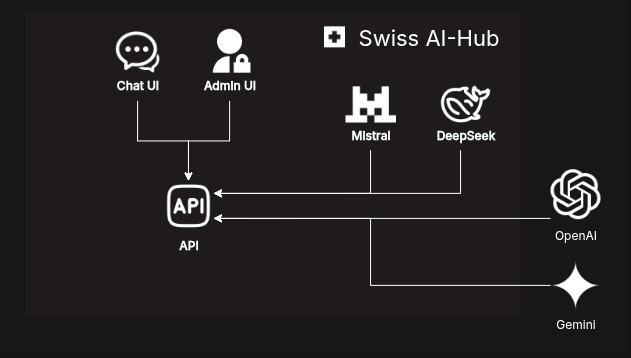
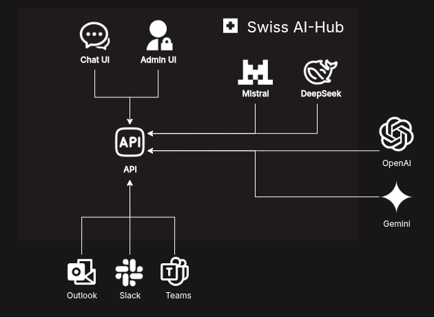
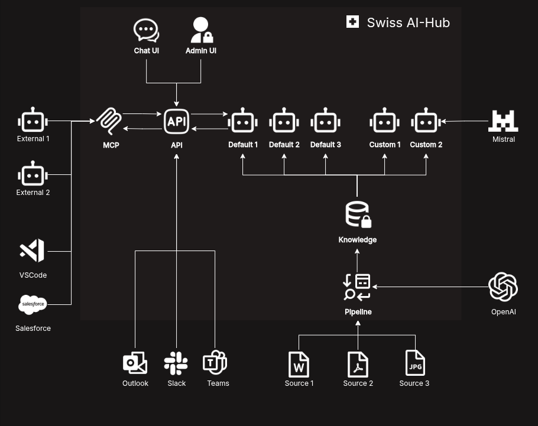
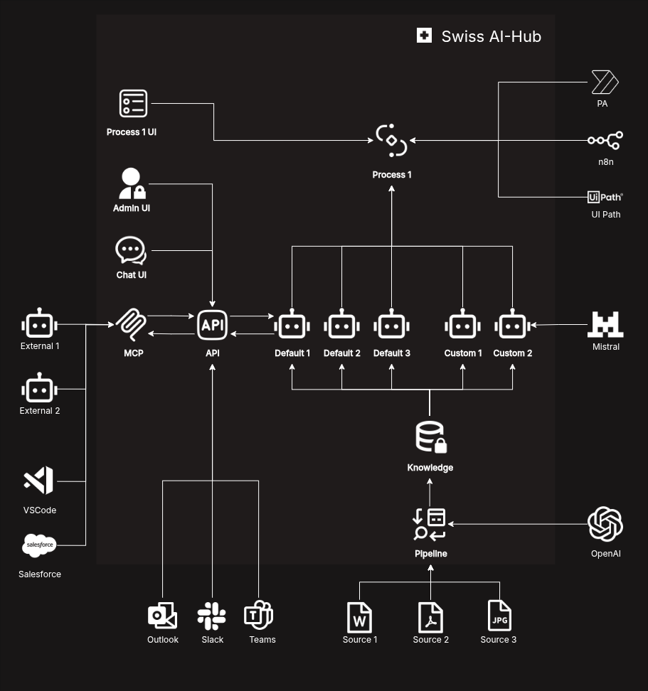

# Vision of the Swiss AI-Hub :rocket:

## 🏢 A New Form of Enterprise Organization

In today's business world, organizations face the challenge of effectively utilizing their growing amount of data, knowledge, and digital tools. This is precisely where our vision for the **Swiss AI-Hub** comes into play: a central platform that serves as a bridge between people, enterprise knowledge, and digital processes.

Imagine your organization having a rich ecosystem of specialized AI assistants, each with deep expertise in specific domains—financial analysis, project tracking, compliance monitoring—all available exactly where daily work takes place. The Swiss AI-Hub makes this vision a reality, embedding intelligence into the fabric of your operations with the trust and reliability implicit in its Swiss origins.

## 🧠 Core Concept: Intelligence Where You Work

The Swiss AI-Hub is far more than just another AI tool. It is a comprehensive platform designed to seamlessly integrate into your existing enterprise landscape.

::: danger What we believe
Our core principle is simple but transformative: **AI comes to the people, not the other way around.**
:::

Instead of forcing employees to switch to special applications for AI support, the Swiss AI-Hub brings focused, specialized intelligence directly into familiar work environments like Microsoft Teams or Slack. It acts as a central orchestration layer, establishing all necessary connections: between specialized AI and people, between your data and AI, and between your various systems and processes.

## 🎯 The Journey to an Intelligent Enterprise: Our Four Tiers

The Swiss AI-Hub is designed to grow with your organization's needs. We offer a clear, evolutionary journey, allowing you to adopt AI at a pace that makes sense for you, ensuring control and maximizing value at every stage.

:::info
Our approach ensures a gradual, low-risk adoption, moving from secure experimentation to full-scale process transformation.
:::

### 🔐 Tier 1: Basic Tier – Your Secure Gateway to AI

It all starts with a secure foundation. This tier provides your entire company with access to advanced large language models (LLMs) like GPT through a modern, secure web interface. It’s a safe, experimental environment where your team can begin to explore the power of generative AI, all within your company's secure perimeter.

### 🔗 Tier 2: Basic+ Tier – AI in Your Daily Workflow

Next, we embed AI directly into your daily workflows. This tier extends the platform’s reach with API integrations into the collaboration tools your employees already use, such as Microsoft Teams, Slack, and email. This step makes AI a readily available resource, removing friction and increasing adoption.

### 🤖 Tier 3: Assistant Package – Specialized Expertise on Demand

In this stage, we move from general-purpose AI to highly specialized, custom **AI Assistants**.

::: tip
**AI Assistants** are *reactive*. They provide context-aware support when prompted by a user, acting as powerful, on-demand experts within their specific domain.
:::

We work with you to build a powerful ecosystem of specialists, such as a finance assistant or an HR assistant. They are deeply integrated with your data and include a transparency module so users can always trace how an answer was generated.

:::details Click here to see an example Assistant scenario
A product team discusses an issue in a Microsoft Teams channel:

1.  **Product Manager:** "We need to delay the Henderson launch. @Finance-Assistant, can you analyze the Q3 impact?"
2.  **Finance Assistant:** "Analyzing... Based on the pipeline forecast, a two-week delay would shift approximately $120K in revenue from Q3 to Q4."
3.  **Marketing Lead:** "@Project-Assistant, what are our external commitments for Henderson?"
4.  **Project Assistant:** "Checking commitments... We promised a 'summer release' in the April newsletter. I don't see the TechDaily commitment in my records; it may have been discussed in a meeting."
5.  **Technical Lead:** "@Dev-Assistant, what's the status of the critical bugs?"
6.  **Dev Assistant:** "Checking the bug tracker... There are 3 critical bugs open. Based on historical data, the team needs approximately 8 working days to address them."
7.  **Product Manager:** "Thanks, everyone. The path forward is clear."

In this scenario, each AI Assistant acts as a domain expert, providing precise, auditable information while acknowledging its limitations, allowing the human team to make the final strategic decisions.
:::

### 🌟 Tier 4: Agentic Process Automation – Redefining How Work Gets Done {#agentic-process-automation}

This is the most advanced tier, where we go beyond reactive assistance to fundamentally rethink your business processes. This stage introduces intelligent **Agentic Processes** that orchestrate seamless collaboration between humans, AI agents, and your existing tools.

::: tip
**Agentic Process Automation** focuses on *orchestration, not execution*. Rather than replacing humans or existing systems, we create intelligent coordinators that delegate tasks to the most appropriate entity—whether that's a human for strategic decisions, an AI agent for intelligent analysis, or an external program for deterministic tasks.
:::

We don't just automate old processes; we redesign them as a transparent, controlled collaboration between humans, specialized AI agents, and your existing programs and software. Humans remain in complete control, with full visibility into every step and the ability to guide the process at any time.

:::details Example: The HR Application Process, Redesigned with Agentic Process Automation
Consider how a traditional HR application process is transformed through Agentic Process Automation:

When a job application arrives via email, an existing automation tool (such as Power Automate) extracts the application and routes it into the HR system. At this point, the intelligent orchestration begins: a **Document Analysis Agent** reviews the CV and cover letter, extracting key qualifications and flagging any potential issues or inconsistencies. Next, a **Job Matching Agent** compares the candidate's profile against open positions, calculating match scores and identifying the most suitable roles.

The HR employee then receives a comprehensive analysis with clear recommendations, allowing them to make an informed hiring decision quickly. Once the decision is made, a **Communication Agent** drafts a personalized response—whether an interview invitation or a polite decline—tailored to the specific candidate and position. The HR employee reviews and approves this communication before the original automation tool sends the final email.

Throughout this process, each component handles the task for which it is best suited: automation tools manage data flow, AI agents provide intelligent analysis and content generation, and the HR employee maintains complete strategic control over hiring decisions. This creates a workflow that is faster, more intelligent, and more efficient while keeping humans firmly in control of critical business decisions.
:::

## 🏗️ The Swiss AI-Hub Architecture: Built on Trust and Control

To deliver on this vision, the Swiss AI-Hub is built on a philosophy of **human-centric collaboration**. We understand that for businesses to embrace AI, it must enhance human capabilities while maintaining complete transparency and control.

::: danger AI Agents as Structured Workflows
Our agents are not monolithic, unpredictable entities. They are implemented as clear, step-by-step workflows. This approach ensures that every agent action is testable, traceable, and auditable. You get the benefits of intelligent automation while maintaining full visibility and control.
:::

:::danger Orchestration, Not Replacement
The Swiss AI-Hub acts as an intelligent orchestrator that connects rather than replaces. Our processes don't eliminate existing tools or human expertise; they **delegate** tasks to the most appropriate entity—be it a human for strategic decisions, your existing automation tools for deterministic tasks, or a specialized AI agent for intelligent analysis. This integration-first approach respects your current investments while adding AI intelligence exactly where it delivers the most value.
:::

## 🎉 Conclusion: Your Partner for a New Era of Work

The Swiss AI-Hub represents a fundamental shift in how organizations activate knowledge, design processes, and empower people. With our evolutionary, tiered architecture, we provide a pragmatic and secure path to integrating AI deep into your organization while respecting your existing investments and expertise.

We begin by providing safe access to intelligence, then integrate it into daily work, evolve it into specialized assistance, and ultimately transform your business processes through intelligent orchestration that connects humans, AI agents, and your existing tools. The result is a more agile, efficient, and intelligent organization, where people remain firmly in control, supported by transparent AI that enhances rather than replaces human judgment, working seamlessly with the automation tools you already trust.