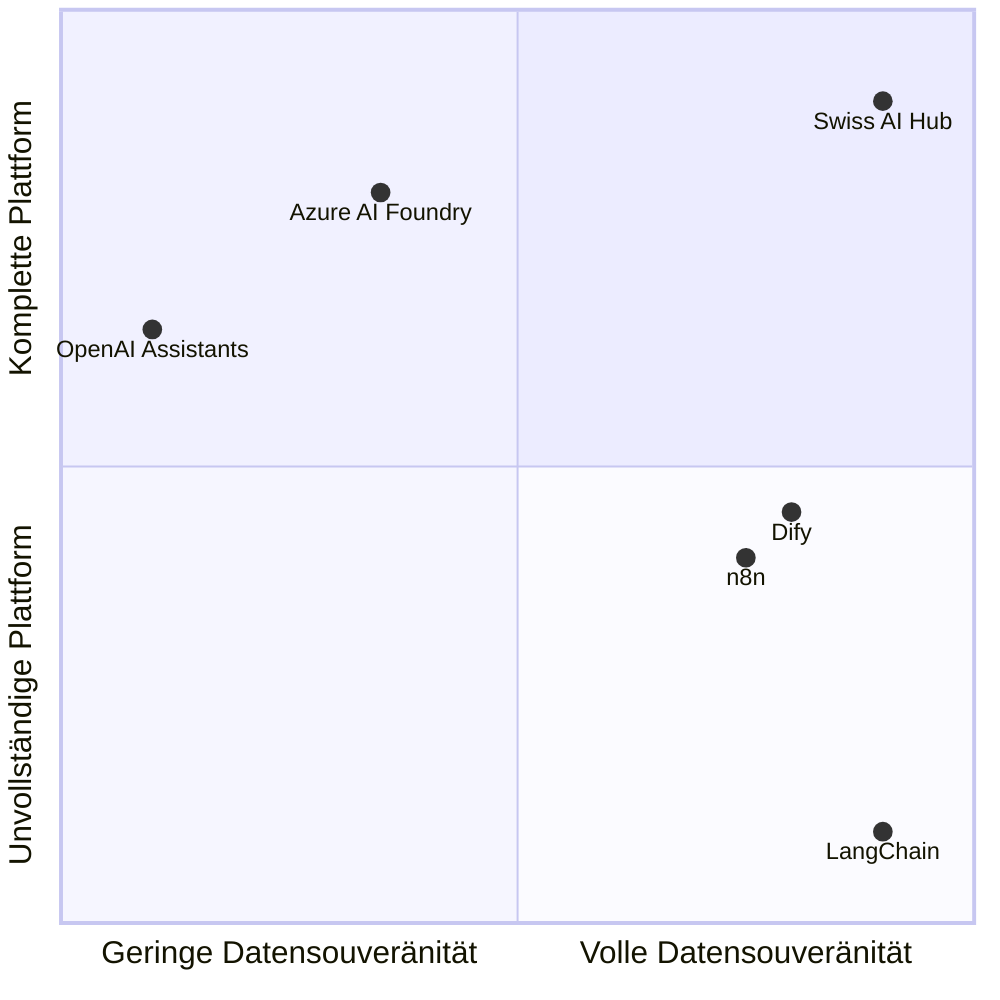

# Vergleichsmatrix: Wo der Swiss AI Hub passt

Unterschiedliche Organisationen benötigen unterschiedliche KI-Lösungen. Einige priorisieren Benutzerfreundlichkeit, andere benötigen vollständige Kontrolle. Das Verständnis dieser Kompromisse hilft Ihnen, den richtigen Ansatz für Ihre Anforderungen zu wählen.

## Marktpositionierung (TL;DR)

Dieses Kapitel erläutert, wann der Swiss AI Hub die richtige Lösung ist und wann nicht. Wenn Sie jedoch die stark vereinfachte Version wünschen:

Große Cloud-Plattformen bieten Ihnen alles out-of-the-box – Authentifizierung, Monitoring, Schnittstellen, alles. Aber Sie besitzen nichts und zahlen für immer.

Programmier-Frameworks wie LangChain ermöglichen Ihnen die Bereitstellung überall und Sie besitzen den Code. Aber es sind nur Bibliotheken. Authentifizierung, Bereitstellung, Monitoring und Schnittstellen müssen Sie selbst übernehmen.

Der Swiss AI Hub befindet sich im Quadranten „Alles selbst besitzen“: eine komplette, sofort einsatzbereite Plattform, die Sie selbst bereitstellen und besitzen. Sie erhalten die Vollständigkeit von Cloud-Plattformen mit dem Besitz von Open-Source-Frameworks.

Der Rest dieses Kapitels erläutert die spezifischen Kompromisse. Lesen Sie weiter für das nuancierte Bild, aber falls Sie wenig Zeit haben: **Wir bieten Ihnen eine komplette Plattform ohne Vendor Lock-in**.

## Die 12 KI-Anforderungen von Unternehmen

Wir haben zwölf entscheidende Anforderungen identifiziert, mit denen Organisationen bei der Einführung von KI konfrontiert sind:

| Anforderung                          | Was es bedeutet                                            | Warum es wichtig ist                               |
| :----------------------------------- | :--------------------------------------------------------- | :------------------------------------------------- |
| **Datensouveränität**                | Kontrolle darüber, wo Daten gespeichert und verarbeitet werden | Rechtliche Compliance und Richtlinienanforderungen |
| **Kalkulierbare Kosten**             | Transparente Preise ohne Überraschungen                    | Budgetplanung und ROI-Berechnung                   |
| **Vertrauen in Ergebnisse**          | Transparenz der KI-Argumentation und -Entscheidungen       | Risikomanagement und Benutzerakzeptanz             |
| **Time to Value**                    | Geschwindigkeit von der Bereitstellung zum funktionierenden System | Nachweis des ROI und Aufrechterhaltung der Dynamik |
| **Tool-Integration**                 | Kompatibilität mit bestehender Infrastruktur               | Vermeidung von Workflow-Unterbrechungen            |
| **Zugänglichkeit für verschiedene Kompetenzen** | Ermöglichen, dass Teams ohne KI-Expertise arbeiten können | Demokratisierung der KI-Entwicklung                |
| **Skalierbarkeit**                   | Wachsende Nutzung ohne Komplexität                         | Unterstützung der unternehmensweiten Einführung   |
| **Anbieterunabhängigkeit**           | Vermeidung von Lock-in und Aufrechterhaltung der Kontrolle | Langfristige Flexibilität und Verhandlungsmacht    |
| **Einheitliche Governance**          | Konsistente Sicherheit und Compliance                      | Erfüllung von Unternehmensanforderungen            |
| **Produktionssicherheit**            | Konsistente Leistung für kritische Operationen             | Geschäftsfortführung                               |
| **Visuelle Entwicklung**             | Drag-and-Drop-Workflow-Erstellung                          | Befähigung von Citizen Developern                  |
| **Keine Wartung**                    | Vollständig verwalteter Betrieb                           | Fokus auf Anwendungsfälle, nicht auf Infrastruktur |

## Vergleich der verschiedenen Ansätze

### Position des Swiss AI Hub

Der Swiss AI Hub bietet:

- **Volle Punktzahl** für Souveränität, Kostenkontrolle, Vertrauen, Unabhängigkeit und Governance durch selbst gehostete, Open-Source-Architektur
- **Starke Fähigkeiten** in Integration, Kompetenzbrückenbildung, Skalierung und Zuverlässigkeit durch Plattformvollständigkeit
- **Schnelle Bereitstellung** mit vorgefertigten Komponenten, die jedoch eine gewisse anfängliche Einrichtung erfordert
- **Code-First-Ansatz** anstatt visueller Entwicklungstools

### Bibliotheken und Frameworks

Tools wie **LangChain**, **LlamaIndex** und **Semantic Kernel** eignen sich hervorragend für die Bereitstellung von Abstraktionen für die KI-Entwicklung, überlassen die Infrastruktur jedoch vollständig Ihnen. Sie bieten Anbieterunabhängigkeit durch Open Source, erfordern aber den Aufbau von allem anderen: Bereitstellung, Monitoring, Authentifizierung, Benutzeroberflächen und Governance. Diese Tools lösen das Problem der KI-Logik, schaffen aber ein Infrastrukturproblem.

### Managed Cloud-Plattformen

Dienste wie **Azure AI Foundry**, **Google Vertex AI** und **AWS Bedrock** bewältigen die Komplexität der Infrastruktur und bieten Unternehmensfunktionen. Sie tauschen Souveränität und Unabhängigkeit gegen operative Einfachheit ein. Ihre Daten leben in ihrer Cloud (auch wenn regionenwählbar), Sie zahlen ihre Margen auf unbestimmte Zeit und arbeiten innerhalb ihrer Einschränkungen. Sie lösen das Infrastrukturproblem, schaffen aber Vendor Lock-in.

### Visuelle Entwicklungsplattformen

Plattformen wie **Dify** und **Flowise** demokratisieren KI durch Drag-and-Drop-Oberflächen. Sie machen KI für Nicht-Entwickler zugänglich, oft mangelt es ihnen jedoch an Unternehmensanforderungen wie Governance, detaillierter Observability und Produktionssicherheit. Diese Plattformen eignen sich hervorragend für schnelles Prototyping, stoßen aber bei komplexen, produktionsreifen Workflows, die Code-Level-Kontrolle erfordern, an ihre Grenzen.

### Automatisierungsplattformen mit KI

Tools wie **n8n** und **Zapier AI** sind Workflow-Automatisierungsplattformen, die KI-Funktionen hinzugefügt haben. Sie eignen sich hervorragend zum Verbinden von Systemen und zur Befähigung nicht-technischer Benutzer, behandeln KI jedoch als Black-Box-Komponenten. Es mangelt ihnen an tiefer KI-Observability, einheitlicher Modellverwaltung und der Transparenz, die für eine vertrauenswürdige KI-Bereitstellung erforderlich ist.

## Der detaillierte Vergleich

| Framework                   | Datensouveränität | Kalkulierbare Kosten | Vertrauen in Ergebnisse | Time to Value | Tool-Integration | Zugänglichkeit für verschiedene Kompetenzen | Skalierbarkeit | Anbieterunabhängigkeit | Einheitliche Governance | Produktionssicherheit | Visuelle Entwicklung | Keine Wartung |
| :-------------------------- | :---------------: | :------------------: | :--------------------: | :-----------: | :--------------: | :-----------------------------------------: | :------------: | :--------------------: | :---------------------: | :--------------------: | :------------------: | :-------------: |
| **Swiss AI Hub**            |        ✅         |          ✅          |           ✅           |      ⚠️       |        ✅        |             ✅              |       ✅       |           ✅           |            ✅             |           ✅           |          ❌          |        ❌         |
| **LangChain**               |        ⚠️         |          ❌          |           ⚠️           |      ❌       |        ✅        |             ⚠️              |       ❌       |           ✅           |            ❌             |           ❌           |          ⚠️          |        ❌         |
| **Azure AI Foundry**        |        ⚠️         |          ⚠️          |           ⚠️           |      ⚠️       |        ✅        |             ⚠️              |       ✅       |           ❌           |            ✅             |           ✅           |          ✅          |        ✅         |
| **OpenAI Assistants**       |        ❌         |          ⚠️          |           ⚠️           |      ✅       |        ✅        |             ✅              |       ✅       |           ❌           |            ❌             |           ✅           |          ⚠️          |        ✅         |
| **Dify**                    |        ✅         |          ✅          |           ⚠️           |      ✅       |        ⚠️        |             ✅              |       ⚠️       |           ✅           |            ⚠️             |           ⚠️           |          ✅          |        ✅         |
| **n8n**                     |        ✅         |          ✅          |           ❌           |      ✅       |        ✅        |             ✅              |       ⚠️       |           ✅           |            ❌             |           ⚠️           |          ✅          |        ⚠️         |

> **Legende**\
> ✅ Volle Funktionalität\
> ⚠️ Teilweise Funktionalität\
> ❌ Nicht adressiert

## Die richtige Wahl treffen

Der Vergleich zeigt klare Muster auf:

**Wählen Sie Bibliotheken** (LangChain, LlamaIndex), wenn Sie über starke Engineering-Teams verfügen, die Infrastruktur aufbauen und warten können. Sie erhalten maximale Flexibilität, müssen aber jede Produktionsherausforderung selbst lösen.

**Wählen Sie Managed Platforms** (Azure, Google, AWS), wenn operative Einfachheit die Souveränitätsbedenken überwiegt. Sie erhalten Zuverlässigkeit und Skalierbarkeit, akzeptieren aber Vendor Lock-in und laufende Kosten.

**Wählen Sie visuelle Plattformen** (Dify, Flowise), wenn schnelles Prototyping und Citizen Development Prioritäten sind. Sie erhalten Zugänglichkeit, können aber in Produktionsszenarien an Grenzen stoßen.

**Wählen Sie Automatisierungsplattformen** (n8n, Zapier), wenn KI eine Erweiterung bestehender Workflows und nicht die Kernfunktion ist. Sie erhalten eine breite Integration, aber eine begrenzte KI-Tiefe.

**Wählen Sie den Swiss AI Hub**, wenn Sie die Vollständigkeit einer Managed Platform mit der Kontrolle einer selbst gehosteten Infrastruktur benötigen. Sie erhalten Unternehmensfunktionen, volle Souveränität und Anbieterunabhängigkeit, müssen sich aber selbst um Bereitstellung und Betrieb kümmern.

Der Swiss AI Hub nimmt eine einzigartige Position ein: eine komplette Plattform, die Sie besitzen und kontrollieren. Dieser Ansatz erfordert mehr anfänglichen Einrichtungsaufwand als Managed Services, bietet aber langfristige Vorteile in Bezug auf Souveränität, Kostenkontrolle und Flexibilität, die sich im Laufe der Zeit summieren.
