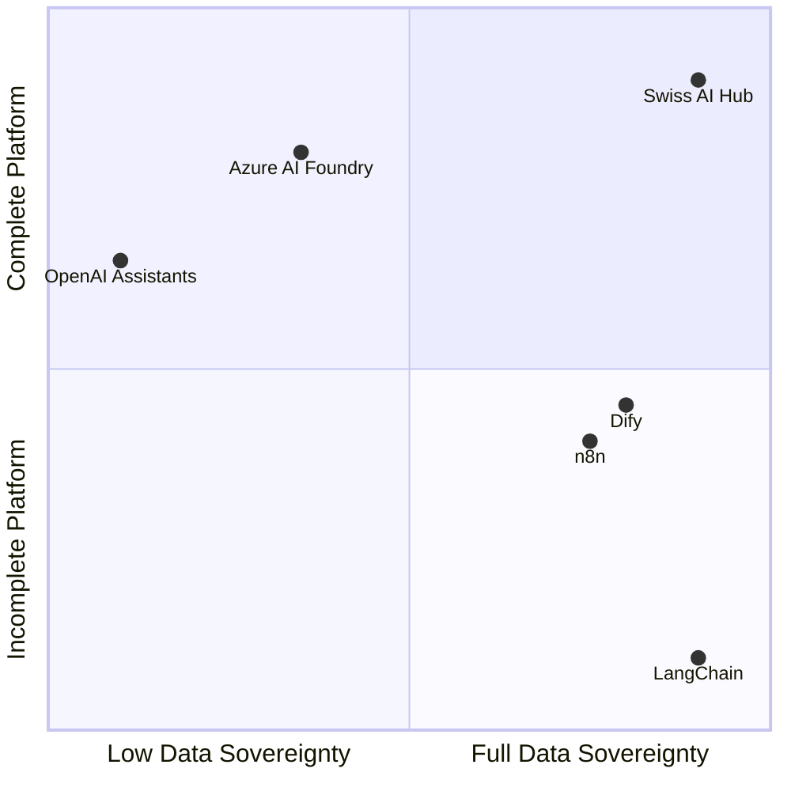

# Vergleichsmatrix: Wo Swiss AI Hub passt

Verschiedene Organisationen benötigen unterschiedliche KI-Lösungen. Einige legen Wert auf Benutzerfreundlichkeit, andere
benötigen vollständige Kontrolle. Das Verständnis dieser Kompromisse hilft Ihnen, den richtigen Ansatz für Ihre
Anforderungen zu wählen.

## Marktpositionierung (Kurzfassung)

Dieses Kapitel erklärt, wann Swiss AI Hub die richtige Lösung ist und wann nicht. Aber wenn Sie die stark vereinfachte
Version möchten:

Große Cloud-Plattformen bieten Ihnen alles out-of-the-box – Authentifizierung, Monitoring, Schnittstellen, alles. Aber
Sie besitzen nichts und zahlen für immer.

Programmier-Frameworks wie LangChain ermöglichen Ihnen die Bereitstellung überall und Sie besitzen den Code. Aber sie
sind nur Bibliotheken. Sie kümmern sich selbst um Authentifizierung, Bereitstellung, Monitoring und Schnittstellen.

Swiss AI Hub befindet sich im Quadranten „Alles selbst besitzen“: eine vollständige Plattform mit allem, was dazugehört,
die Sie selbst bereitstellen und besitzen. Sie erhalten die Vollständigkeit von Cloud-Plattformen mit der
Eigentümerschaft von Open-Source-Frameworks.

Der Rest dieses Kapitels beschreibt die spezifischen Kompromisse. Lesen Sie weiter für das nuancierte Bild, aber wenn
Sie wenig Zeit haben: **wir bieten Ihnen eine vollständige Plattform ohne Vendor Lock-in**.

## Die 12 KI-Anforderungen für Unternehmen

Wir haben zwölf kritische Anforderungen identifiziert, denen Organisationen bei der Einführung von KI gegenüberstehen:

| Anforderung                        | Was es bedeutet                                                    | Warum es wichtig ist                                       |
| :--------------------------------- | :----------------------------------------------------------------- | :--------------------------------------------------------- |
| **Datensouveränität**              | Kontrolle darüber, wo Daten gespeichert und verarbeitet werden     | Rechtliche Compliance und Richtlinienanforderungen         |
| **Vorhersehbare Kosten**           | Transparente Preisgestaltung ohne Überraschungen                   | Budgetplanung und ROI-Berechnung                           |
| **Vertrauen in Ergebnisse**        | Einblick in KI-Argumentation und -Entscheidungen                   | Risikomanagement und Benutzerakzeptanz                     |
| **Time to Value**                  | Geschwindigkeit von der Bereitstellung zum funktionierenden System | ROI demonstrieren und Dynamik aufrechterhalten             |
| **Tool-Integration**               | Kompatibilität mit bestehender Infrastruktur                       | Vermeidung von Workflow-Störungen                          |
| **Zugänglichkeit von Fähigkeiten** | Ermöglichung für Teams ohne KI-Expertise                           | Demokratisierung der KI-Entwicklung                        |
| **Skalierbarkeit**                 | Wachsende Nutzung ohne Komplexität                                 | Unterstützung der unternehmensweiten Einführung            |
| **Herstellerunabhängigkeit**       | Vermeidung von Lock-in und Aufrechterhaltung der Kontrolle         | Langfristige Flexibilität und Verhandlungsstärke           |
| **Einheitliche Governance**        | Konsistente Sicherheit und Compliance                              | Erfüllung von Unternehmensanforderungen                    |
| **Produktionszuverlässigkeit**     | Konsistente Leistung für kritische Operationen                     | Geschäftskontinuität                                       |
| **Visuelle Entwicklung**           | Drag-and-Drop-Workflow-Erstellung                                  | Ermöglichung für Citizen Developer                         |
| **Wartungsfreiheit**               | Vollständig verwaltete Operationen                                 | Konzentration auf Anwendungsfälle, nicht auf Infrastruktur |

## Wie sich verschiedene Ansätze vergleichen

### Position des Swiss AI Hub

Der Swiss AI Hub bietet:

- **Volle Punktzahl** für Souveränität, Kostenkontrolle, Vertrauen, Unabhängigkeit und Governance durch selbst
  gehostete, Open-Source-Architektur
- **Starke Fähigkeiten** in Integration, Kompetenzvermittlung, Skalierung und Zuverlässigkeit durch
  Plattformvollständigkeit
- **Schnelle Bereitstellung** mit vorgefertigten Komponenten, erfordert jedoch eine initiale Einrichtung
- **Code-First-Ansatz** anstelle von visuellen Entwicklungstools

### Bibliotheken und Frameworks

Tools wie **LangChain**, **LlamaIndex** und **Semantic Kernel** zeichnen sich durch die Bereitstellung von Abstraktionen
für die KI-Entwicklung aus, überlassen Ihnen aber die Infrastruktur vollständig. Sie bieten Herstellerunabhängigkeit
durch Open Source, erfordern aber den Aufbau von allem anderen: Bereitstellung, Monitoring, Authentifizierung,
Benutzeroberflächen und Governance. Diese Tools lösen das Problem der KI-Logik, schaffen aber ein Infrastrukturproblem.

### Verwaltete Cloud-Plattformen

Dienste wie **Azure AI Foundry**, **Google Vertex AI** und **AWS Bedrock** bewältigen die Infrastrukturkomplexität und
bieten Unternehmensfunktionen. Sie tauschen Souveränität und Unabhängigkeit gegen operative Einfachheit ein. Ihre Daten
leben in deren Cloud (auch wenn die Region wählbar ist), Sie zahlen deren Margen auf unbestimmte Zeit und Sie arbeiten
innerhalb ihrer Beschränkungen. Sie lösen das Infrastrukturproblem, schaffen aber einen Vendor Lock-in.

### Visuelle Entwicklungsplattformen

Plattformen wie **Dify** und **Flowise** demokratisieren KI durch Drag-and-Drop-Oberflächen. Sie machen KI für
Nicht-Entwickler zugänglich, oft mangelt es ihnen aber an Unternehmensanforderungen wie Governance, detaillierter
Observability und Produktionszuverlässigkeit. Diese Plattformen eignen sich hervorragend für schnelles Prototyping,
kämpfen aber mit komplexen, produktionsreifen Workflows, die Code-Level-Kontrolle erfordern.

### Automatisierungsplattformen mit KI

Tools wie **n8n** und **Zapier AI** sind Workflow-Automatisierungsplattformen, die KI-Funktionen hinzugefügt haben. Sie
eignen sich hervorragend zum Verbinden von Systemen und zur Befähigung nicht-technischer Benutzer, behandeln KI aber als
Black-Box-Komponenten. Es mangelt ihnen an tiefer KI-Observability, vereinheitlichtem Modellmanagement und der
Transparenz, die für eine vertrauenswürdige KI-Bereitstellung erforderlich ist.

## Der detaillierte Vergleich

| Framework             | Datensouveränität | Vorhersehbare Kosten | Vertrauen in Ergebnisse | Time to Value | Tool-Integration | Zugänglichkeit von Fähigkeiten | Skalierbarkeit | Herstellerunabhängigkeit | Einheitliche Governance | Produktionszuverlässigkeit | Visuelle Entwicklung | Wartungsfreiheit |
| :-------------------- | :---------------: | :------------------: | :---------------------: | :-----------: | :--------------: | :----------------------------: | :------------: | :----------------------: | :---------------------: | :------------------------: | :------------------: | :--------------: |
| **Swiss AI Hub**      |        ✅         |          ✅          |           ✅            |      ⚠️       |        ✅        |               ✅               |       ✅       |            ✅            |           ✅            |             ✅             |          ❌          |        ❌        |
| **LangChain**         |        ⚠️         |          ❌          |           ⚠️            |      ❌       |        ✅        |               ⚠️               |       ❌       |            ✅            |           ❌            |             ❌             |          ⚠️          |        ❌        |
| **Azure AI Foundry**  |        ⚠️         |          ⚠️          |           ⚠️            |      ⚠️       |        ✅        |               ⚠️               |       ✅       |            ❌            |           ✅            |             ✅             |          ✅          |        ✅        |
| **OpenAI Assistants** |        ❌         |          ⚠️          |           ⚠️            |      ✅       |        ✅        |               ✅               |       ✅       |            ❌            |           ❌            |             ✅             |          ⚠️          |        ✅        |
| **Dify**              |        ✅         |          ✅          |           ⚠️            |      ✅       |        ⚠️        |               ✅               |       ⚠️       |            ✅            |           ⚠️            |             ⚠️             |          ✅          |        ✅        |
| **n8n**               |        ✅         |          ✅          |           ❌            |      ✅       |        ✅        |               ✅               |       ⚠️       |            ✅            |           ❌            |             ⚠️             |          ✅          |        ⚠️        |

> **Legende**\
> ✅ Volle Funktionalität\
> ⚠️ Teilweise Funktionalität\
> ❌ Nicht adressiert

## Die richtige Wahl treffen

Der Vergleich zeigt klare Muster:

**Wählen Sie Bibliotheken** (LangChain, LlamaIndex), wenn Sie über starke Engineering-Teams verfügen, die Infrastruktur
aufbauen und warten können. Sie erhalten maximale Flexibilität, müssen aber jede Produktionsherausforderung selbst
lösen.

**Wählen Sie verwaltete Plattformen** (Azure, Google, AWS), wenn operative Einfachheit wichtiger ist als
Souveränitätsbedenken. Sie erhalten Zuverlässigkeit und Skalierbarkeit, akzeptieren aber Vendor Lock-in und laufende
Kosten.

**Wählen Sie visuelle Plattformen** (Dify, Flowise), wenn schnelles Prototyping und Citizen Development Prioritäten
sind. Sie erhalten Zugänglichkeit, können aber in Produktionsszenarien an Grenzen stoßen.

**Wählen Sie Automatisierungsplattformen** (n8n, Zapier), wenn KI eine Erweiterung bestehender Workflows und nicht die
Kernfunktion ist. Sie erhalten eine breite Integration, aber eine begrenzte KI-Tiefe.

**Wählen Sie Swiss AI Hub**, wenn Sie die Vollständigkeit einer verwalteten Plattform mit der Kontrolle einer selbst
gehosteten Infrastruktur benötigen. Sie erhalten Unternehmensfunktionen, volle Souveränität und
Herstellerunabhängigkeit, müssen aber Bereitstellung und Betrieb selbst übernehmen.

Der Swiss AI Hub nimmt eine einzigartige Position ein: eine komplette Plattform, die Sie besitzen und kontrollieren.
Dieser Ansatz erfordert mehr initiale Einrichtung als verwaltete Dienste, bietet aber langfristige Vorteile in Bezug auf
Souveränität, Kostenkontrolle und Flexibilität, die sich im Laufe der Zeit verstärken.
