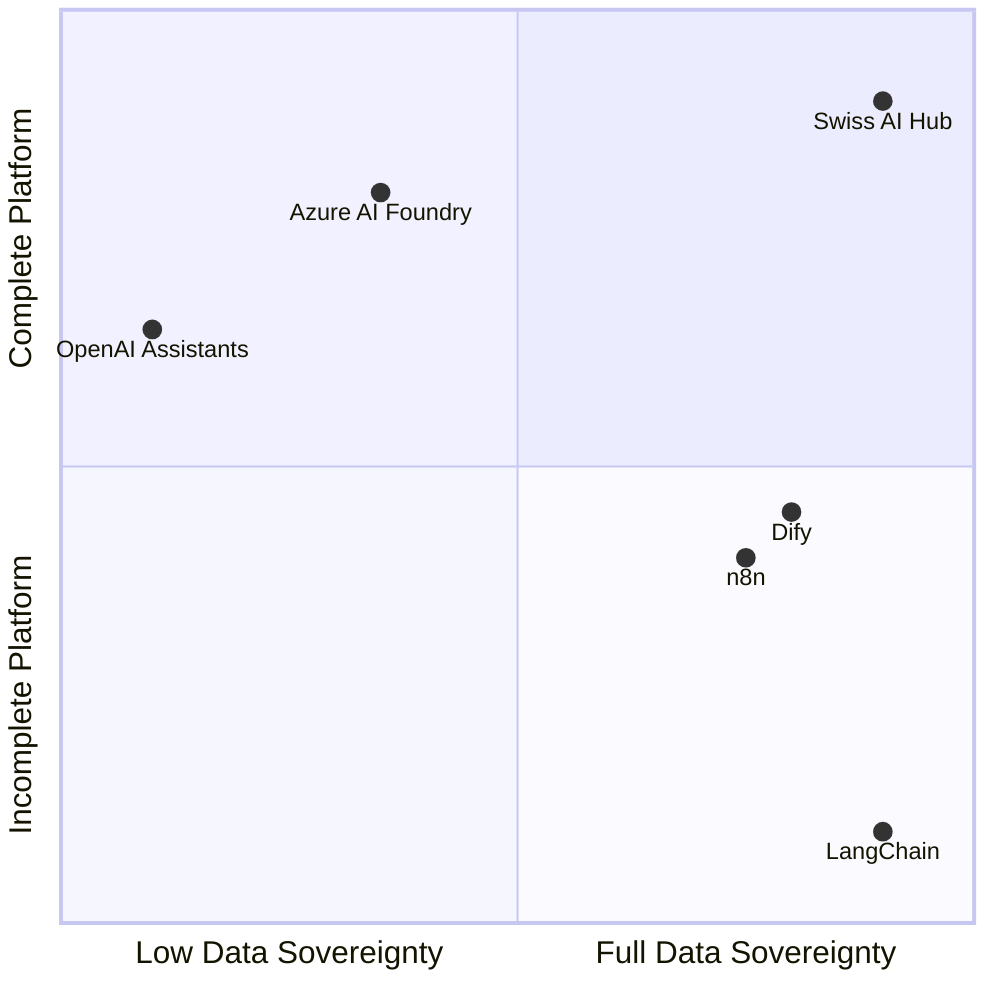

# Comparison matrix: Where Swiss AI Hub fits

Different organizations need different AI solutions. Some prioritize ease of use, others need complete control.
Understanding these trade-offs helps you choose the right approach for your requirements.

## Market positioning (TL;DR)

This chapter explains when Swiss AI Hub is the right solution and when it isn't. But if you want the oversimplified
version:

Big cloud platforms give you everything out-of-the-box - authentication, monitoring, interfaces, the works. But you own
nothing and pay forever.

Programming frameworks like LangChain let you deploy anywhere and own the code. But they're just libraries. You handle
authentication, deployment, monitoring, and interfaces yourself.

Swiss AI Hub sits in the "Own Everything" quadrant: a complete, batteries-included platform that you deploy and own. You
get the completeness of cloud platforms with the ownership of open-source frameworks.

The rest of this chapter details the specific trade-offs. Read on for the nuanced picture, but if you're short on time:
**we give you a complete platform without vendor lock-in**.

## The 12 enterprise AI needs

We've identified twelve critical needs organizations face when adopting AI:

| Need                       | What it means                                  | Why it matters                              |
| -------------------------- | ---------------------------------------------- | ------------------------------------------- |
| **Data sovereignty**       | Control where data is stored and processed     | Legal compliance and policy requirements    |
| **Predictable costs**      | Transparent pricing without surprises          | Budget planning and ROI calculation         |
| **Trust in outputs**       | Visibility into AI reasoning and decisions     | Risk management and user adoption           |
| **Time to value**          | Speed from deployment to working system        | Demonstrating ROI and maintaining momentum  |
| **Tool integration**       | Compatibility with existing infrastructure     | Avoiding workflow disruption                |
| **Skill accessibility**    | Enabling teams without AI expertise            | Democratizing AI development                |
| **Scalability**            | Growing usage without complexity               | Supporting organization-wide adoption       |
| **Vendor independence**    | Avoiding lock-in and maintaining control       | Long-term flexibility and negotiating power |
| **Unified governance**     | Consistent security and compliance             | Meeting enterprise requirements             |
| **Production reliability** | Consistent performance for critical operations | Business continuity                         |
| **Visual development**     | Drag-and-drop workflow creation                | Enabling citizen developers                 |
| **Zero maintenance**       | Fully managed operations                       | Focusing on use cases, not infrastructure   |

## How different approaches compare

### Swiss AI Hub position

The Swiss AI Hub provides:

- **Full marks** for sovereignty, cost control, trust, independence, and governance through self-hosted, open-source
  architecture
- **Strong capabilities** in integration, skill bridging, scaling, and reliability through platform completeness
- **Quick deployment** with pre-built components while requiring some initial setup
- **Code-first approach** rather than visual development tools

### Libraries and frameworks

Tools like **LangChain**, **LlamaIndex**, and **Semantic Kernel** excel at providing AI development abstractions but
leave infrastructure entirely to you. They offer vendor independence through open source but require building everything
else: deployment, monitoring, authentication, user interfaces, and governance. These tools solve the AI logic problem
but create an infrastructure problem.

### Managed cloud platforms

Services like **Azure AI Foundry**, **Google Vertex AI**, and **AWS Bedrock** handle infrastructure complexity and
provide enterprise features. They trade sovereignty and independence for operational simplicity. Your data lives in
their cloud (even if region-selectable), you pay their margins indefinitely, and you work within their constraints. They
solve the infrastructure problem but create vendor lock-in.

### Visual development platforms

Platforms like **Dify** and **Flowise** democratize AI through drag-and-drop interfaces. They make AI accessible to
non-developers but often lack enterprise requirements like governance, detailed observability, and production
reliability. These platforms excel at rapid prototyping but struggle with complex, production-grade workflows that need
code-level control.

### Automation platforms with AI

Tools like **n8n** and **Zapier AI** are workflow automation platforms that added AI capabilities. They excel at
connecting systems and enabling non-technical users but treat AI as black-box components. They lack deep AI
observability, unified model management, and the transparency needed for trusted AI deployment.

## The detailed comparison

| Framework             | Data sovereignty | Predictable costs | Trust in outputs | Time to Value | Tool integration | Skill accessibility | Scalability | Vendor independence | Unified governance | Production reliability | Visual development | Zero maintenance |
| :-------------------- | :--------------: | :---------------: | :--------------: | :-----------: | :--------------: | :-----------------: | :---------: | :-----------------: | :----------------: | :--------------------: | :----------------: | :--------------: |
| **Swiss AI Hub**      |        ✅        |        ✅         |        ✅        |      ⚠️       |        ✅        |         ✅          |     ✅      |         ✅          |         ✅         |           ✅           |         ❌         |        ❌        |
| **LangChain**         |        ⚠️        |        ❌         |        ⚠️        |      ❌       |        ✅        |         ⚠️          |     ❌      |         ✅          |         ❌         |           ❌           |         ⚠️         |        ❌        |
| **Azure AI Foundry**  |        ⚠️        |        ⚠️         |        ⚠️        |      ⚠️       |        ✅        |         ⚠️          |     ✅      |         ❌          |         ✅         |           ✅           |         ✅         |        ✅        |
| **OpenAI Assistants** |        ❌        |        ⚠️         |        ⚠️        |      ✅       |        ✅        |         ✅          |     ✅      |         ❌          |         ❌         |           ✅           |         ⚠️         |        ✅        |
| **Dify**              |        ✅        |        ✅         |        ⚠️        |      ✅       |        ⚠️        |         ✅          |     ⚠️      |         ✅          |         ⚠️         |           ⚠️           |         ✅         |        ✅        |
| **n8n**               |        ✅        |        ✅         |        ❌        |      ✅       |        ✅        |         ✅          |     ⚠️      |         ✅          |         ❌         |           ⚠️           |         ✅         |        ⚠️        |

> **Legend**\
> ✅ Full capability\
> ⚠️ Partial capability\
> ❌ Not addressed

## Making the right choice

The comparison reveals clear patterns:

**Choose libraries** (LangChain, LlamaIndex) when you have strong engineering teams who can build and maintain
infrastructure. You get maximum flexibility but must solve every production challenge yourself.

**Choose managed platforms** (Azure, Google, AWS) when operational simplicity outweighs sovereignty concerns. You get
reliability and scale but accept vendor lock-in and ongoing costs.

**Choose visual platforms** (Dify, Flowise) when rapid prototyping and citizen development are priorities. You get
accessibility but may hit limitations in production scenarios.

**Choose automation platforms** (n8n, Zapier) when AI is an enhancement to existing workflows rather than the core
capability. You get broad integration but limited AI depth.

**Choose Swiss AI Hub** when you need the completeness of a managed platform with the control of self-hosted
infrastructure. You get enterprise features, full sovereignty, and vendor independence, but must handle deployment and
operations yourself.

The Swiss AI Hub occupies a unique position: a complete platform that you own and control. This approach requires more
initial setup than managed services but provides long-term benefits in sovereignty, cost control, and flexibility that
compound over time.
