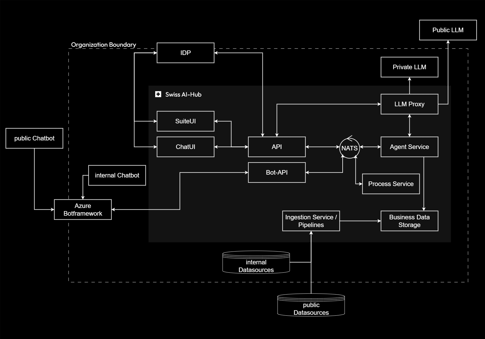

# System Overview

## Platform and Model: A Strategic Separation

The Swiss AI-Hub is **not** a Large Language Model-it is an enterprise platform that orchestrates and manages LLMs. This
architectural separation delivers a fundamental advantage: **you control the platform while freely choosing which models
to use**.

Connect to OpenAI, Google, or Anthropic today. Switch to Swiss-hosted private models tomorrow. Use multiple models
simultaneously for different tasks. The platform remains stable and unchanged regardless of your model choices,
eliminating vendor lock-in while ensuring you can always adopt the best available AI technology.

This separation directly addresses the core concerns organizations face with AI adoption:

- **Data Sovereignty**: Your data never leaves your control. The platform runs in your infrastructure.
- **Technology Evolution**: Adopt new models immediately without platform changes or user retraining.
- **Cost Control**: Choose cost-effective models for routine tasks, premium models for critical operations, or self-host
  to eliminate per-token costs.

---

## System Architecture

The architecture diagram illustrates two fundamental zones: the **Organization Boundary** containing everything under
your control, and external **LLM access** through a standardized proxy.

### Within Your Organization

**User Interfaces**: Employees access AI through a comprehensive web application (SuiteUI), a conversational interface
(ChatUI), or directly within Microsoft Teams through bot integration. External users interact through public chatbots
connected via Azure Bot Framework. The platform adapts to your workflow rather than forcing workflow changes.

**Core Services**: Python-based backend services orchestrate all operations. The API handles authentication,
authorization, and request routing. The Agent Service executes autonomous workflows - structured sequences of
intelligent operations. The Process Service coordinates complex multi-agent collaborations and long-running business
processes. A Bot-API manages conversational interactions within collaboration platforms like Microsoft Teams. All
services communicate through NATS, an event-driven message bus providing reliable, asynchronous communication with
persistent event streams.

**Knowledge Management**: Your documents and data remain entirely within your infrastructure. Data ingestion pipelines
orchestrated by Dagster process internal and public data sources, transforming documents into searchable indexes.
Business data storage combines vector databases (semantic search), document stores (conversation history), and
relational databases (structured information). This enables RAG (Retrieval-Augmented Generation) where AI answers are
grounded in your actual documents without exposing raw data externally.

**Security Layer**: Authentication flows through your existing Identity Provider (Azure AD, LDAP, custom systems).
Role-based access control ensures users interact only with authorized resources.

**Observability**: OpenTelemetry integration provides comprehensive monitoring of all platform operations. Phoenix
specializes in LLM-specific observability, capturing prompts, responses, token usage, and performance metrics. Combined
with cloud monitoring stacks, this enables real-time operational visibility and complete audit trails.

### External LLM Access

**LLM Proxy**: LiteLLM serves as a centralized gateway providing a unified OpenAI-compatible interface to any language
model. It handles model selection, cost tracking, rate limiting, automatic fallback, and guardrails (PII detection and
anonymization). You configure which models to use through simple configuration; the platform manages routing, failover,
and compliance.

**Public LLMs**: Connect to commercial providers (OpenAI, Google, Anthropic) through encrypted APIs. Models operate
statelessly - they process prompts and return responses without storing data.

**Private LLMs**: Self-host models in Swiss data centers for complete data sovereignty. Eliminates external API calls
entirely, ensuring no data leaves your infrastructure.

---

## Data Flow

Understanding how data moves through the system clarifies the security model:

**Knowledge Preparation** (one-time): Internal documents are processed within your infrastructure, chunked into
searchable segments, converted to vector embeddings, and indexed. This creates a searchable knowledge base entirely
under your control.

**User Interaction** (real-time): When a user asks a question, the platform searches your indexed knowledge for relevant
information, constructs a prompt combining the question with retrieved context, sends this prompt to the selected LLM
through the proxy, receives a response, and delivers the answer to the user. The LLM sees only the specific excerpts
needed to answer the question - never your complete document repository.

**Critical security point**: Language models operate statelessly. They process your prompt and return a response without
storing anything. Your full document repository, user identities, and conversation histories remain entirely within your
infrastructure.

---

## Multi-Tenancy Architecture

Each tenant (municipality, department, organization) receives a **complete, isolated instance** of the Swiss AI-Hub:

**Isolation**: Separate databases, independent configuration, isolated security, and private conversation history. Your
data never mixes with other tenants. A municipality's interactions are completely invisible to neighboring
municipalities.

**Resource Efficiency**: While platform instances are isolated, LLM access is shared through the proxy. Since LLMs
operate statelessly, multiple tenants safely use the same model infrastructure without security concerns. This
dramatically reduces costs - you pay for API calls made, not for dedicated model hosting per tenant.

---

## Core Benefits

**Data Sovereignty and Security**

- Platform operates entirely within your specified infrastructure (on-premise, Swiss private cloud, or hybrid)
- Documents and conversation history remain under your jurisdiction
- Compliance with Swiss data protection requirements by design
- Complete audit trails for regulatory requirements

**Operational Flexibility**

- Deploy on-premise for complete control, in Swiss private cloud for managed infrastructure, or hybrid for optimal
  balance
- Standard container-based deployment using familiar tools
- Rolling updates with zero downtime
- Comprehensive observability through OpenTelemetry

**Cost Optimization**

- Granular token usage tracking per user, department, and operation
- Mix cost-effective and premium models based on task requirements
- Self-hosting option eliminates per-token charges for high-volume scenarios
- Shared LLM infrastructure reduces per-tenant costs

**Vendor Independence**

- Switch LLM providers through configuration changes alone
- No platform modifications or user retraining required
- Adopt emerging AI technologies immediately
- Data exports in standard formats - no proprietary lock-in

**Enterprise Integration**

- Authentication through existing identity systems (OAuth2, SAML, LDAP)
- API access for custom applications and integrations
- Bot framework integration with Microsoft Teams
- Connections to organizational data sources and business applications

This architecture positions AI as a strategic capability under your control, not a vendor service creating dependencies.
