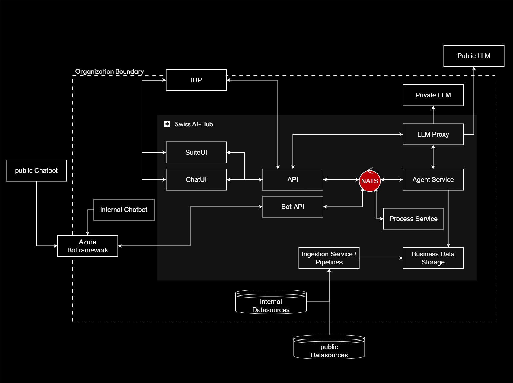

# Event System

The Swiss AI-Hub's event-driven architecture provides the communication backbone for all platform operations. This
fundamental infrastructure enables asynchronous, observable, and scalable interactions between agents, services, and
users while maintaining comprehensive audit trails essential for enterprise AI deployment.

## Concept and Strategic Benefits

The event system addresses unique challenges of autonomous AI operations that must function reliably over extended
periods without direct supervision. Unlike traditional request-response architectures designed for synchronous
interactions, the event-driven model supports workflows spanning minutes, hours, or even days while maintaining complete
operational transparency.

### Events as State Representation

The platform implements all communication through immutable events—structured records of facts that have occurred within
the system. A fundamental advantage of this approach is that events represent the application's state at any moment. The
status of an agent and its current workflow step can be determined by examining the sequence of events that have already
occurred. The same principle applies to agent-driven processes, which are represented as they unfold through their event
streams.

This event-sourced state model provides several benefits: workflow execution can be reconstructed for debugging or audit
purposes, system state remains consistent across restarts, and the complete history of operations is inherently
available for analysis and compliance reporting.

### Real-Time Transparency and Observability

As soon as an event occurs within the system, it can be transmitted to user interfaces and monitoring dashboards. This
real-time streaming ensures that users and administrators receive immediate information about what is happening, making
the entire system observable and transparent without requiring separate monitoring infrastructure.

The separation between control flow events (which coordinate workflow execution) and display events (which update user
interfaces) ensures that user observation does not interfere with agent operations. Users gain visibility into
long-running autonomous processes as they execute, building trust through transparency.

### Modularity and Extensibility

The event-driven architecture keeps the system highly modular while enabling straightforward extensibility. New
components can be added that react to specific events and trigger their own events, prompting actions in other
components. This loose coupling means that adding a new agent or service can be done independently of the rest of the
system—the new component simply subscribes to relevant events and publishes its own.

Components interact through well-defined events rather than direct dependencies, allowing independent evolution and
deployment of platform services. This architectural approach supports organizational agility, enabling teams to develop
and deploy services independently without coordinating changes across the entire platform.

### Horizontal Scalability

The event-driven architecture enables effortless scaling to meet fluctuating demand. When system load increases,
additional worker instances can be deployed to process events from the same streams without any modifications to the
application code or architecture. These workers automatically distribute the processing load by consuming events in
parallel.

This approach provides several operational advantages: capacity can be increased dynamically during peak periods and
reduced during quiet times, system performance remains consistent as workload grows, and there are no bottlenecks from
centralized processing. Since event processing is stateless, each worker operates independently—if one fails, others
continue processing, and the failed worker can be restarted without impacting ongoing operations.

Organizations can scale specific components based on actual demand patterns. If agent execution requires more capacity,
additional agent workers can be deployed. If data ingestion becomes a bottleneck, more pipeline workers can be added.

## Data Retention Strategy

The platform implements a tiered retention strategy balancing operational efficiency with compliance obligations:

**Ephemeral Data (30-Day Automatic Deletion)**: High-performance working memory stored in Redis expires automatically.
Execution-specific data provides a fixed 30-day window for debugging, while conversational memory employs a sliding
30-day expiration that resets with each access.

**Workflow Events (Dual Constraints)**: NATS JetStream manages workflow events with both time-based (30 days) and
capacity-based (10 million messages) limits. In high-throughput deployments, events may be deleted well before the
30-day limit when capacity is reached.

**Permanent Storage (Manual Lifecycle Management)**: NoSQL storage retains conversation history indefinitely without automatic
expiration. Organizations must implement explicit data lifecycle policies aligned with regulatory requirements and
business needs.

**Operational Implications**: Organizations have a 30-day window for forensic analysis of workflow execution details.
Critical execution information should be persisted to permanent storage before the 30-day threshold for long-term
retention. Compliance investigations requiring workflow reconstruction are limited to the available retention window.
