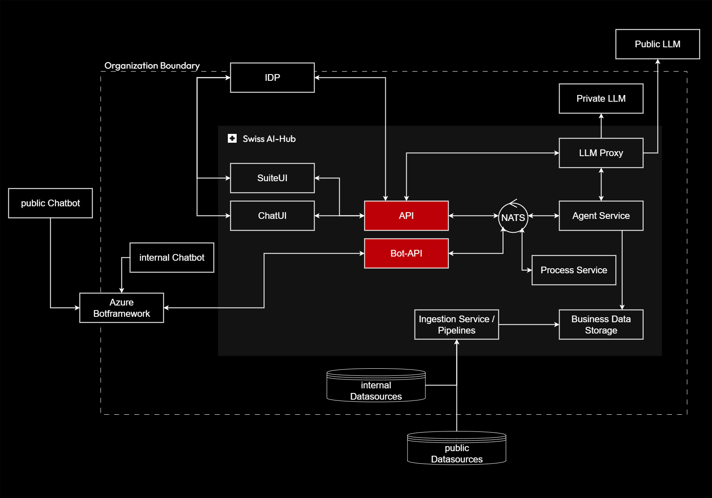

# APIs

The API layer serves as the central gateway for all external interactions with the Swiss AI-Hub platform. It provides
secure, standards-based interfaces for user applications, administrative tools, and integration endpoints.

## Purpose and Scope

The API component encompasses all programmatic interfaces that allow external systems and users to interact with the
platform. This includes REST APIs for synchronous operations, WebSocket connections for real-time communication, and
specialized endpoints for authentication, authorization, and resource management.

## Key Responsibilities

**Authentication and Authorization**: The API layer enforces security boundaries, validating user identities through
integration with organizational identity providers (OAuth2, SAML, LDAP) and enforcing role-based access control
policies.

**Request Routing**: Incoming requests are validated, authenticated, and routed to appropriate backend services. The API
acts as a facade, abstracting the complexity of the distributed service architecture from clients.

**Protocol Translation**: The API translates between external protocols (HTTP/REST, WebSocket) and internal event-driven
communication patterns, bridging synchronous client expectations with asynchronous backend processing.

**Session Management**: For conversational interfaces, the API maintains session context, managing long-lived
connections and ensuring state consistency across multiple interactions.

## Strategic Value

A well-designed API layer enables the platform to evolve independently of client applications. Internal service
implementations can change without affecting external consumers, as long as API contracts remain stable. This separation
supports gradual modernization and reduces deployment risk.

The API also serves as an integration point for custom applications, enabling organizations to build specialized tools
that leverage platform capabilities while maintaining their existing workflows and user interfaces.

## API Types and Interfaces

The Swiss AI-Hub platform exposes multiple API types, each optimized for specific interaction patterns and use cases:

### 1. OpenAI-Compatible REST API

A standards-based HTTP API that provides full compatibility with OpenAI's API specification, enabling seamless migration
and integration for applications built on OpenAI SDKs. This API supports chat completions, embeddings, image generation,
and audio processing (speech-to-text and text-to-speech).

**Primary Use Case**: Drop-in replacement for OpenAI endpoints, allowing existing applications to leverage Swiss AI-Hub
infrastructure without code changes.

**Key Features**:

- Identical endpoint structure and request/response formats as OpenAI API
- Support for both LLM models and AI-Hub assistants (agents)
- Streaming and non-streaming completion modes
- Multimodal capabilities (text, images, audio)

### 2. Agent Interaction REST API

A native HTTP API designed specifically for managing and interacting with AI agents, threads (conversations), processes,
and platform resources. This API provides comprehensive access to AI-Hub's agent lifecycle, conversation management, and
platform administration capabilities.

**Primary Use Case**: Building native AI-Hub applications that leverage the platform's full agent orchestration and
process automation capabilities.

**Key Features**:

- Agent discovery and configuration management
- Thread (conversation) lifecycle management
- Process execution and monitoring
- Event history and observability access
- User and role management

### 3. WebSocket API

A bidirectional, real-time communication channel enabling live event streaming and continuous updates for interactive
applications. The WebSocket API delivers agent events, status updates, and streaming responses as they occur.

**Primary Use Case**: Real-time user interfaces requiring immediate feedback and live updates during agent execution.

**Key Features**:

- Real-time event delivery with low latency
- Streaming agent responses for progressive display
- Connection-based session management
- Token-based authentication with automatic disconnection on authorization failure

### 4. Model Context Protocol (MCP) Server

An HTTP-based MCP server that exposes AI-Hub API endpoints as resources and tools accessible to AI development
assistants and automation tools. This enables AI coding assistants to interact directly with the platform for debugging,
testing, and development workflows.

**Primary Use Case**: AI-assisted development, allowing tools like Claude Code and Gemini CLI to query platform state,
inspect agents, and interact with the AI-Hub API during development sessions.

**Key Features**:

- Automatic resource and tool discovery from API endpoints
- Read-only access to GET endpoints as MCP resources
- Dynamic schema generation from OpenAPI specifications
- Integration with AI development toolchains

### 5. Bot Framework API (Independent Component)

A separate, independently deployable service that integrates with Microsoft Azure Bot Service, enabling AI agents to
interact with users through familiar collaboration platforms like Microsoft Teams and Slack. This component translates
bot platform messages into AI-Hub events and streams agent responses back to users.

**Primary Use Case**: Bringing AI agents directly into existing team collaboration workflows without requiring users to
switch to specialized applications.

**Key Features**:

- Azure Bot Service integration for multi-channel support (Teams, Slack, Web Chat)
- Stateful conversation tracking with configurable TTL
- Streaming and non-streaming response modes
- Bot-in-the-Loop pattern for human collaboration within agent workflows

**Deployment Model**: The Bot API is packaged as a separate Docker container and can be deployed independently from the
main API service. It connects to the AI-Hub event system via NATS messaging, maintaining loose coupling while enabling
seamless agent interactions across platforms.
