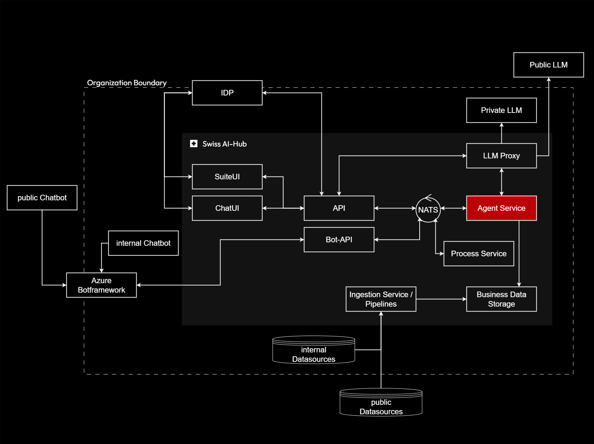

# Agents

The Agent Service provides the intelligence layer of the Swiss AI-Hub platform, executing autonomous workflows that combine large language model capabilities with structured business logic. Agents operate as specialized workers that process tasks, make intelligent decisions, and interact with users and other system components.

## Purpose and Scope

Agents transform AI capabilities into reliable, auditable business operations. Rather than providing unstructured chatbot interactions, the Agent Service implements well-defined workflows where each step's purpose, inputs, and outputs are explicitly specified. This structured approach enables transparent AI operations suitable for enterprise deployment.

## Key Responsibilities

**Workflow Execution**: Agents orchestrate multi-step processes, coordinating between LLM interactions, data retrieval, external tool invocation, and human approval steps. The workflow engine manages state, handles errors, and ensures operations proceed according to defined business rules.

**Retrieval-Augmented Generation (RAG)**: Specialized agents perform semantic search across organizational knowledge bases, combining retrieved information with LLM reasoning to provide grounded, verifiable answers. This prevents hallucination and ensures responses reflect actual organizational data.

**Intelligent Decision-Making**: Agents apply LLM capabilities to analyze information, classify content, extract structured data, and make context-aware decisions within workflow constraints. The combination of AI flexibility and workflow structure balances autonomy with control.

**Event-Driven Communication**: All agent operations communicate through asynchronous events rather than synchronous calls. This enables long-running operations, graceful degradation, and comprehensive audit trails essential for enterprise operations.

## Strategic Value

The workflow-based agent architecture directly addresses the "black box" problem that prevents AI adoption in regulated environments. Every agent operation generates observable events, making behavior transparent to auditors and operators. Organizations gain AI capabilities while maintaining the control and auditability required for production deployment.

By decomposing intelligence into reusable workflow steps, the platform enables incremental development and testing. Individual steps can be validated independently before composition into complex behaviors, dramatically reducing deployment risk compared to monolithic AI systems.
