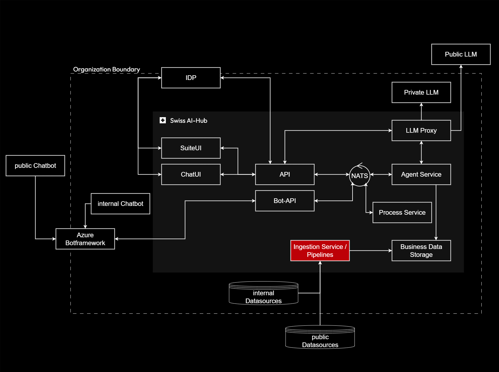

# Data Pipelines

The Data Pipeline layer transforms organizational documents and data sources into AI-ready knowledge bases. This
component orchestrates complex data ingestion, processing, and indexing workflows that enable intelligent search and
retrieval across enterprise information.

## Purpose and Scope

Data pipelines bridge the gap between raw organizational data - documents, databases, external sources - and the
structured, searchable indexes required for effective AI operations. This layer handles document parsing, chunking,
embedding generation, and vector storage, ensuring agents can access relevant information when processing user requests.

## Key Responsibilities

**Document Processing**: Pipelines ingest diverse document formats (PDF, Word, Excel, web pages), extracting text,
tables, images, and metadata. Advanced processing handles complex layouts, multi-column documents, and embedded content
while preserving semantic structure.

**Knowledge Base Construction**: Extracted content is chunked into appropriately-sized segments, converted to vector
embeddings, and indexed in specialized databases. Multiple indexing strategies (vector search, keyword search, metadata
filtering) enable diverse retrieval patterns.

**Workflow Orchestration**: Dagster orchestrates multi-stage processing workflows, managing dependencies between steps,
handling failures gracefully, and providing comprehensive observability. Pipelines can run on-demand for immediate
updates or on schedules for periodic synchronization.

**Quality Assurance**: Processing pipelines track data lineage, validate outputs, and maintain audit trails.
Organizations can verify which documents contributed to specific search results, supporting compliance requirements and
quality control.

## Strategic Value

The data pipeline architecture separates content ingestion from agent operation, enabling independent evolution of each
concern. New document types or processing techniques can be integrated without modifying agent logic, while agent
improvements leverage existing knowledge bases without reprocessing.

Orchestrated pipelines provide operational visibility essential for production deployment. When search quality issues
arise, operators can trace through processing steps to identify root causes, verify fixes, and reprocess affected
content systematically.

By centralizing data transformation logic, the platform ensures consistent handling across all agents and use cases.
Knowledge bases built by these pipelines serve multiple specialized agents, maximizing the value extracted from
organizational data.
