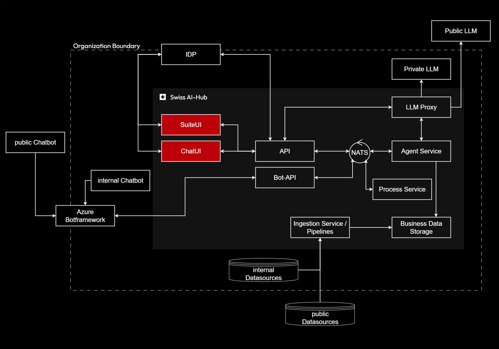

# User Interfaces

The User Interface layer provides diverse access points for interacting with the Swiss AI-Hub platform, adapting to
different user contexts and workflows. These interfaces range from comprehensive web applications for power users to
conversational chat interfaces and collaboration platform integrations.

## Purpose and Scope

User interfaces bridge the gap between AI capabilities and user needs, presenting complex platform functionality through
intuitive, context-appropriate experiences. The interface layer ensures users can access AI assistance within their
existing workflows rather than forcing adoption of new tools or processes.

## Key Responsibilities

**Suite UI**: A comprehensive web application provides administrative capabilities, knowledge management, agent
configuration, and system monitoring. This interface serves platform administrators and power users who need full
control over platform features and detailed visibility into operations.

**Chat UI**: A conversational interface optimized for quick interactions and exploratory work. Users engage with
specialized agents through natural language, receiving contextual assistance grounded in organizational knowledge. The
chat interface emphasizes simplicity and rapid iteration.

**Collaboration Platform Integration**: Integration with Microsoft Teams and other collaboration tools brings AI
assistance directly into users' daily work environments. Employees access platform capabilities without switching
applications, reducing friction and accelerating adoption.

**Responsive Design**: All interfaces adapt to different devices and screen sizes, ensuring consistent experiences
across desktop, tablet, and mobile contexts. Users maintain productivity regardless of their current work environment.

## Strategic Value

Multiple interface options reduce adoption barriers by meeting users where they work. Administrative staff access
comprehensive management tools, knowledge workers use conversational interfaces for quick queries, and embedded
integrations support frontline employees without requiring specialized training.

The separation between interface and backend logic enables interface evolution without platform changes. Organizations
can develop custom interfaces tailored to specific workflows while leveraging standard platform capabilities, maximizing
return on their interface investment.

Centralized authentication and session management across all interfaces provides seamless transitions. Users can begin
work in one interface and continue in another without reauthentication, supporting natural workflow patterns.
