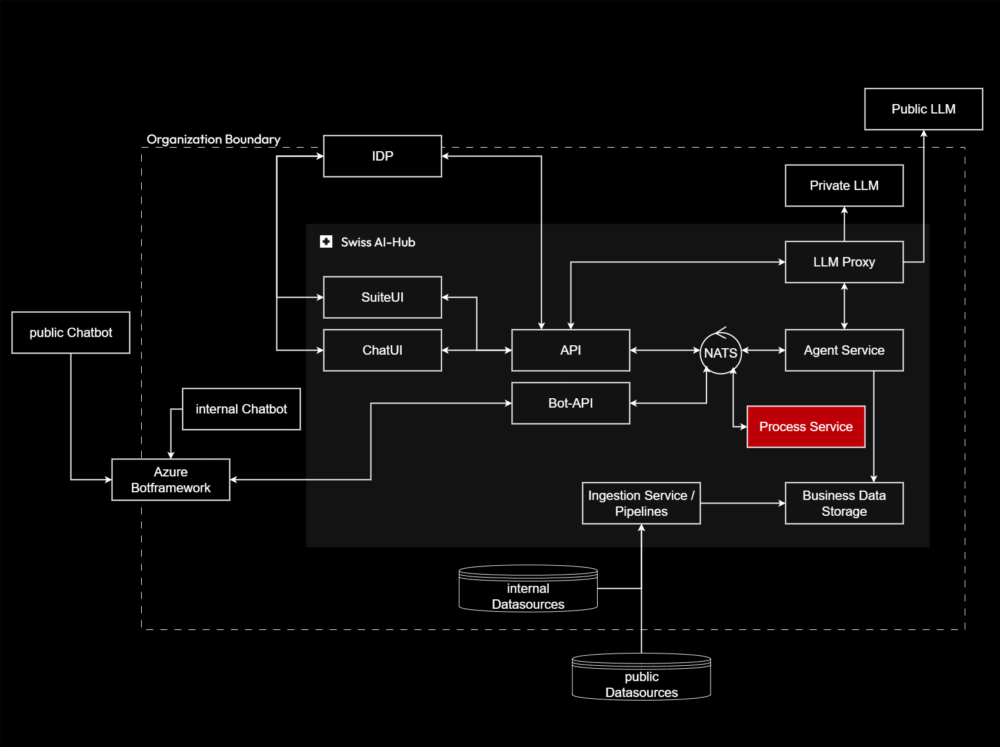

# Processes

The Process Service orchestrates complex multi-agent workflows that implement high-level business operations. Where
individual agents provide specialized capabilities, processes coordinate multiple agents, human participants, and
external systems to achieve organizational objectives.

## Purpose and Scope

Processes represent the highest level of automation within the Swiss AI-Hub platform, implementing complete business
workflows that may span hours or days and involve multiple decision points, approvals, and handoffs between different
participants. This layer transforms collections of specialized agents into cohesive business solutions.

## Key Responsibilities

**Multi-Agent Coordination**: Processes invoke multiple specialized agents in sequence or parallel, passing context
between them and aggregating results. An approval workflow might combine document analysis agents, policy compliance
agents, and notification agents into a coordinated operation.

**Human-in-the-Loop Integration**: Long-running processes seamlessly pause awaiting human input, decisions, or
approvals. When users respond - hours or days later - processes resume with full context, maintaining workflow state
across extended timelines.

**State Management**: Process definitions specify valid state transitions, ensuring operations proceed according to
business rules. Invalid state transitions are prevented, and all state changes generate audit events for compliance
verification.

**Error Handling and Compensation**: Processes implement sophisticated error recovery strategies. When individual steps
fail, compensating actions restore consistent state, notifying operators and providing intervention points for manual
resolution.

## Strategic Value

The process layer enables organizations to automate complete business operations rather than just individual tasks. A
procurement process might orchestrate vendor analysis, compliance checking, budget verification, multi-level approvals,
and contract generation - replacing workflows that previously required days of manual coordination.

Explicit process definitions serve as executable business documentation. Unlike prose descriptions that grow stale,
process definitions remain synchronized with actual operations by necessity. This living documentation aids training,
compliance verification, and continuous improvement efforts.

By separating orchestration logic from agent implementation, processes remain stable even as underlying agents evolve.
Organizations refine specialized capabilities without disrupting proven business workflows, supporting gradual
improvement while maintaining operational stability.
