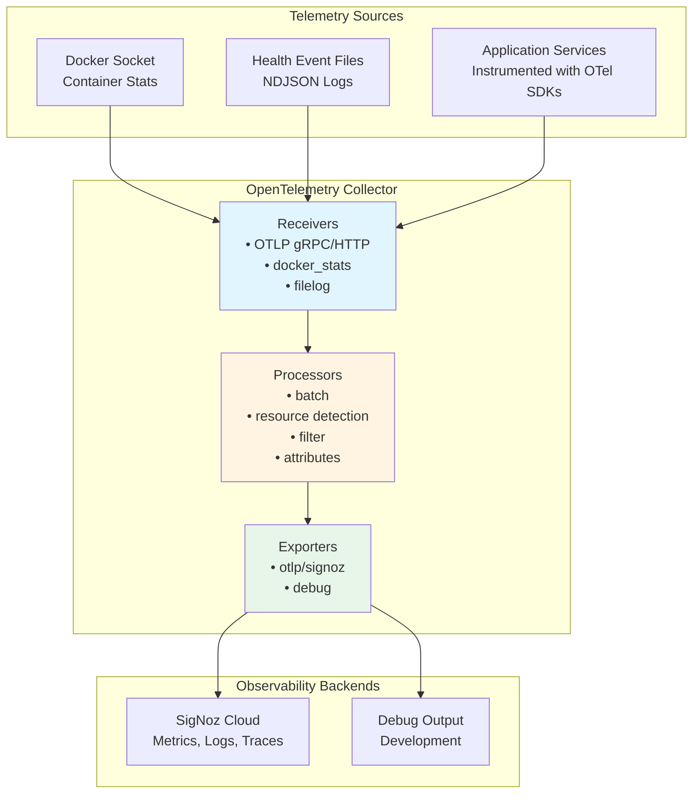

# OpenTelemetry Foundation

## Overview

**OpenTelemetry (OTel)** is the technical foundation for all observability in the Swiss AI-Hub. It provides a
vendor-neutral, industry-standard framework for collecting, processing, and exporting telemetry data across metrics,
logs, and traces.

Unlike proprietary monitoring solutions that lock you into specific vendors, OpenTelemetry ensures the platform can
integrate with any compatible observability backend. This architectural decision provides organizations with maximum
flexibility in choosing monitoring tools based on their infrastructure, compliance requirements, and operational
preferences.

---

## Why OpenTelemetry?

OpenTelemetry lets us instrument services once and keep tool choice flexible. It standardizes metrics, logs, and traces
so signals correlate by default and switchable backends remain a config change, not a rewrite.

**Benefits**

- **Vendor-neutral by design:** Use any OTLP-compatible backend (e.g., SigNoz, Datadog, Grafana, Prometheus, New Relic)
  without re-instrumentation.
- **Unified signals:** Consistent models and shared context (trace/span IDs, resource attributes) link metrics, logs,
  and traces for faster troubleshooting.
- **Proven standard:** A CNCF project with broad industry support and active development, reducing technology risk.
- **Future-ready:** Evolve platforms and policies through the OTel Collector and configuration, not application code.

---

## OpenTelemetry Collector

The **OpenTelemetry Collector** is the central telemetry processing hub for the Swiss AI-Hub.

### Architecture

### Components

**Receivers**: Collect telemetry from various sources.

**Processors**: Transform, enrich, filter, and batch telemetry before export.

**Exporters**: Send processed telemetry to observability backends.

**Extensions**: Provide auxiliary capabilities like health checks and profiling.

---

## Receivers

Receivers are intake points. They pull telemetry from apps and infrastructure into the platform.

- **OTLP receiver:** Standard entry for app telemetry. Services send metrics, logs, and traces using the OpenTelemetry
  protocol. Concept: one wire format for everything.
- **Container metrics receiver:** Collects resource usage from running containers. Concept: observe runtime health
  without touching app code.
- **File log receivers:** Ingest structured event logs like container and synthetic health checks. Concept: capture
  operational signals even when apps lack native endpoints.

Outcome: Broad coverage with minimal coupling to any single tool or runtime.

---

## Processors

Processors shape telemetry in motion. They add context, reduce noise, and prepare data for analysis.

- **Batching:** Groups data for efficient transport. Concept: lower overhead without losing fidelity.
- **Resource detection:** Auto-enriches with environment details such as host, container, or system info. Concept:
  attach who/where to every signal.
- **Attribute editing:** Normalizes tags like environment or source. Concept: consistent labels for reliable filtering
  and dashboards.
- **Resource mapping:** Translates container facts into service identities (e.g., service name, version). Concept: align
  infra reality with service views.
- **Filtering:** Drops low-value noise such as routine health checks. Concept: improve signal-to-noise and control cost.

Outcome: Clean, contextual, and analysis-ready telemetry.

---

## Exporters

Exporters deliver telemetry to destinations.

- **Primary backend exporter:** Sends data to the chosen OTLP-compatible platform. Concept: pick or change your analysis
  tool without re-instrumenting.
- **Debug exporter:** Prints or previews data for validation. Concept: verify pipelines locally before scaling.

Outcome: Pluggable outputs with safe development workflows.

---

## Telemetry Pipelines

Pipelines are end-to-end flows per signal type. Each defines which receivers, processors, and exporters to use.

- **Metrics pipelines:** Optimize for throughput and trend analysis. Enrich with service context.
- **Log pipelines:** Preserve structure and order. Extract attributes for querying and correlation.
- **Trace pipelines:** Keep parent–child relationships intact. Batch carefully to maintain trace integrity.

Concept: purpose-built lanes that keep signals consistent and linkable across the stack.

---

## Extensions

Extensions add operational capabilities around the collector itself.

- **Health checks:** Expose collector status for monitoring. Concept: treat observability as a first-class service.
- **Profiling (pprof):** Inspect performance under load. Concept: diagnose pipeline bottlenecks.
- **Diagnostics (zPages):** View internal metrics and state. Concept: faster debugging without external tools.

Outcome: A manageable, inspectable observability control plane.

---

## Integration with Platform Services

### Application Instrumentation

Services instrumented with OpenTelemetry SDKs automatically emit telemetry:

**Python Services** (API, Agents, Pipelines):

- `opentelemetry-instrumentation-*` libraries for automatic framework instrumentation
- Custom instrumentation for business logic
- OpenInference for AI/ML semantic conventions

**Instrumented Components**:

- FastAPI HTTP requests and responses
- Database operations (MongoDB, PostgreSQL, Redis, Milvus)
- HTTP client requests (httpx, aiohttp, requests)
- LlamaIndex LLM operations
- Python logging framework

### Infrastructure Integration

Non-instrumented services provide telemetry through infrastructure monitoring:

**Container Metrics**: Docker stats receiver collects resource metrics for all containers regardless of instrumentation.

**Health Monitoring**: File log receivers capture health status from both Docker events and synthetic checks.

**Network Observability**: Traefik proxy logs and metrics provide request routing visibility.

---

## Multi-Platform Support

### Vendor Flexibility

The OpenTelemetry foundation supports simultaneous export to multiple platforms:

**Supported Platforms**:

- **SigNoz**: Open-source, OpenTelemetry-native platform (current primary)
- **Datadog**: Commercial APM with comprehensive capabilities
- **Grafana Cloud**: Managed Prometheus, Loki, and Tempo
- **New Relic**: Application performance monitoring with AI insights
- **Prometheus**: Open-source time-series database
- **Elasticsearch/ELK**: Log analytics and search platform
- **Splunk**: Enterprise SIEM and observability platform

### Adding Export Destinations

New observability platforms require only collector configuration changes:

1. Define exporter in collector configuration
2. Add exporter to relevant pipelines
3. Configure authentication via environment variables

No application code changes required.

## Security

### Secure Transmission

All telemetry exports use TLS encryption preventing interception or tampering.

### Access Control

Collector configuration and access restricted to infrastructure administrators. Application services emit telemetry
through defined interfaces without collector access.

### Secret Management

Authentication keys managed via environment variables, separate from configuration files, enabling secure secret
rotation.
