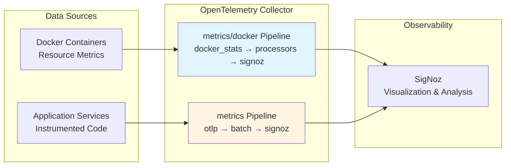

# Metrics

## Overview

Metrics provide continuous quantitative measurements of platform health, performance, and resource utilization. They
enable trend analysis, capacity planning, and performance optimization by aggregating data over time.

The Swiss AI-Hub collects metrics using **OpenTelemetry**, an industry-standard observability framework. This approach
ensures flexibility and avoids vendor lock-in. For details on the OpenTelemetry infrastructure, see
[OpenTelemetry Foundation](../0_opentelemetry/index.md).

---

## What We Measure

### Infrastructure Metrics (Operational)

Container resource utilization metrics are actively collected for all platform services:

**CPU Metrics**:

- `container.cpu.utilization`: CPU percentage per service
- `container.cpu.usage.total`: Cumulative CPU time
- `container.cpu.logical.count`: Allocated virtual CPUs

**Memory Metrics**:

- `container.memory.percent`: RAM usage relative to limits
- `container.memory.usage.total`: Absolute memory consumption
- `container.memory.usage.limit`: Configured memory constraints

**Network Metrics**:

- `container.network.io.usage.rx_bytes`: Incoming traffic
- `container.network.io.usage.tx_bytes`: Outgoing traffic
- `container.network.io.usage.rx_dropped`: Dropped incoming packets
- `container.network.io.usage.tx_dropped`: Dropped outgoing packets

**Storage Metrics**:

- `container.blockio.io_service_bytes_recursive`: Disk I/O operations

**Stability Metrics**:

- `container.restarts`: Service restart frequency

**Collection Method**: Docker stats receiver accessing the Docker socket (`/var/run/docker.sock`)

**Business Value**: These metrics enable proactive capacity management, cost optimization, and early detection of
resource constraints before user impact.

### Service Health Monitoring (Operational)

Health status for all platform services is captured through two complementary approaches:

**Docker Health Events**: Native container health checks from the Docker runtime

**Synthetic Health Checks**: HTTP/gRPC probes for services without native health endpoints (Phoenix, NATS, Attu,
Dagster, data pipelines)

Health events are logged as structured NDJSON and ingested by the OpenTelemetry Collector. See
[Health Checks](../../2_monitoring/1_health_checks/index.md) for complete health monitoring details.

**Business Value**: Comprehensive health monitoring ensures visibility into every platform component, enabling rapid
response before user-facing impact occurs.

### Application Metrics (In Progress)

Application-level instrumentation across services is ongoing. Planned metrics include:

**API Service**:

- Request rates and throughput
- Response latency percentiles (P50, P95, P99)
- Error rates and types
- Active connection counts

**AI Agents**:

- Workflow execution counts and durations
- Step-level timing and performance
- LLM token consumption tracking
- Cache effectiveness measurements

**Data Pipelines**:

- Document processing volumes and rates
- Processing duration distributions
- Success and failure rates
- Vector store operation performance

**Business Value**: Detailed application metrics enable performance optimization, cost attribution, and service level
monitoring.

---

## Metrics Collection Architecture

### Collection Pipelines

The OpenTelemetry Collector processes metrics through two specialized pipelines:

**metrics/docker**: Container resource metrics from Docker socket

- Receiver: `docker_stats`
- Processors: `resourcedetection/docker`, `resource/docker`, `batch`
- Exporter: `otlp/signoz`

**metrics**: Application-level metrics from instrumented services

- Receiver: `otlp` (gRPC port 4317, HTTP port 4318)
- Processors: `batch`
- Exporter: `otlp/signoz`

For complete OpenTelemetry architecture details, see [OpenTelemetry Foundation](../0_opentelemetry/index.md).

---

## Business Benefits

### Proactive Issue Detection

Continuous monitoring identifies problems before user impact. Climbing memory usage reveals potential leaks hours before
limits are reached. Predictable resource spikes enable proactive scaling during high-usage periods.

**Example**: Memory usage climbing from 2GB to 7GB over several hours provides warning before the 8GB limit, allowing
investigation or scaling before service degradation.

### Data-Driven Capacity Planning

Historical metrics inform infrastructure decisions. Growth trends provide lead time for capacity planning. Resource
utilization patterns identify over-provisioned components for cost savings and under-provisioned ones requiring
upgrades.

**Example**: 15% monthly growth in request rates indicates current infrastructure will reach capacity in six months,
providing sufficient lead time for budgeting and procurement.

### Performance Optimization

Metrics reveal bottlenecks and optimization opportunities. Comparing performance across components identifies
inefficiencies. Before-and-after measurements quantify optimization impact.

**Example**: Metrics showing 10-minute document processing times while ingestion handles 100 documents simultaneously
reveals processing (not ingestion) as the bottleneck.

### Cost Management

Resource consumption tracking enables usage-based cost attribution. Historical data combined with growth trends provides
accurate budget forecasting. Optimization ROI becomes measurable.

**Example**: Tracking CPU hours, memory consumption, and LLM token usage per department enables chargeback models
aligning costs with actual consumption.

### Compliance and Governance

Metrics provide evidence for service level agreements and regulatory compliance. Continuous monitoring validates
adherence to capacity and performance requirements.

**Example**: Metrics documenting 99.95% uptime and P95 response times under 500ms provide SLA compliance evidence.

---

## Accessing Metrics

Metrics are visualized and analyzed through observability platforms. The Swiss AI-Hub currently uses **SigNoz** for
metrics visualization, alerting, and analysis.

For information on dashboards, visualization, and platform options, see \[Dashboards\](../../2_monitoring/2_dashboards/
index.md).

### Key Capabilities

**Visual Dashboards**: Real-time and historical metrics displayed through intuitive charts and graphs

**Trend Analysis**: Long-term patterns reveal capacity needs and optimization opportunities

**Alert Configuration**: Threshold-based alerts enable rapid response to degraded conditions

**Correlation Analysis**: Integrated metrics, logs, and traces accelerate troubleshooting

---

## Security and Privacy

### Infrastructure Metrics

Container resource metrics contain no personally identifiable information. They measure CPU, memory, network, and
storage utilization without exposing application data or user activity.

### Application Metrics

Application-level metrics require careful instrumentation design:

**Best Practices**:

- Hash or pseudonymize user identifiers
- Aggregate patterns rather than expose individual data points
- Avoid including sensitive data in metric labels
- Use cardinality limits to prevent metric explosion

**Responsibility**: The platform provides the foundation for privacy-conscious metrics collection. Application
developers must ensure instrumentation follows privacy best practices.

### Transmission Security

All metrics transmit via encrypted channels (TLS/HTTPS) to prevent interception.

### Access Control

Observability platforms implement role-based access control. Only authorized personnel access detailed metrics, with
audit logs documenting access.

### Compliance Alignment

Vendor-neutral architecture supports data sovereignty requirements through platform selection (Swiss cloud, EU region,
on-premises).

---

## Integration with Platform Components

### Observability Ecosystem

**Unified Context with Traces**: Metrics provide system-wide context for performance investigations. When response times
degrade, metrics reveal whether the cause is high CPU utilization, database query times, or external dependencies.

**Log Correlation**: Metrics revealing increased error rates direct attention to specific time windows. Log analysis
identifies root causes.

**Event-Driven Alerting**: Metric thresholds trigger events enabling automated remediation workflows.

### Developer Workflow

**Performance Testing**: Load tests generate metrics documenting system behavior under stress. Developers validate
optimizations through before-and-after comparison.

**Capacity Planning**: Pre-release load testing generates metrics predicting production resource requirements.

**Continuous Monitoring**: Metrics integrated into CI/CD pipelines detect performance regressions before production
deployment.

---

## Future Development

### Planned Enhancements

**Application Instrumentation**: Systematic OpenTelemetry SDK integration across services for automatic metrics emission
from APIs, agents, and pipelines.

**Business Metrics**: Higher-level metrics aligned with business outcomes - cost per document processed, accuracy
trends, user satisfaction indicators.

**Predictive Analytics**: Machine learning models analyzing trends to predict capacity needs and recommend
optimizations.

**Custom Dashboards**: Pre-built visualizations for different stakeholders (operations, executives, finance, compliance)
with role-appropriate metrics.

---

## Summary

The platform's metrics collection delivers:

✅ **Operational Infrastructure Metrics**: Container resource utilization for all platform services

✅ **Comprehensive Health Monitoring**: Status tracking for services with and without native health endpoints

✅ **Standards-Based Collection**: OpenTelemetry ensures vendor flexibility and ecosystem compatibility

✅ **Production Visualization**: SigNoz Cloud providing dashboards, alerting, and analysis

✅ **Extensible Architecture**: Ready for progressive application instrumentation as services integrate OTel SDKs

✅ **Privacy-Conscious Foundation**: Infrastructure metrics contain no PII; application instrumentation requires privacy
best practices

As application instrumentation progresses, organizations gain increasingly detailed insights into platform health,
performance, and efficiency.
