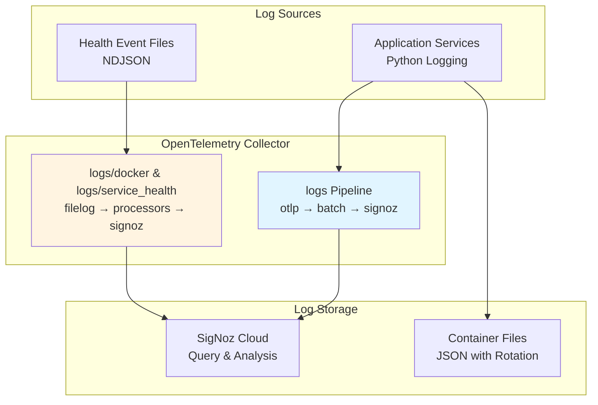

# Logs

## Overview

Logs are detailed records of platform events providing a complete historical record of system operations. Unlike metrics
that aggregate measurements over time, logs capture individual events with full context - user actions, system
decisions, errors, and state changes.

The Swiss AI-Hub implements structured logging through Python's standard logging framework combined with OpenTelemetry
for centralized collection and export. For details on the OpenTelemetry infrastructure, see [OpenTelemetry
Foundation](../0_opentelemetry/index.md).

---

## What We Capture

### Application Logs (Operational)

Python application logs are collected from all AI-Hub services using Python's standard logging framework enhanced with
colorlog for console output.

**Log Levels**:

- `DEBUG`: Detailed diagnostic information for development
- `INFO`: General informational messages about application state
- `WARNING`: Potentially problematic situations requiring attention
- `ERROR`: Error events that might allow continued operation
- `CRITICAL`: Critical errors that may cause application failure

**Configuration**: Controlled via the `LOG_LEVEL` environment variable with options: CRITICAL, FATAL, ERROR, WARN,
WARNING, INFO, DEBUG, NOTSET.

**Format**: Structured console output with timestamps, module names, function names, and colored severity levels for
improved readability during development.

**Third-Party Library Filtering**: Verbose logging from libraries (azure.identity, azure.core.pipeline, urllib3,
pymongo, httpx, httpcore) is automatically suppressed to WARNING level to reduce noise.

### Container Logs (Operational)

Docker captures all container stdout and stderr streams using the JSON file driver with automatic rotation.

**Configuration**: Maximum 10MB per file, 2 files per container (20MB total per container). Oldest files are
automatically deleted when limits are reached.

**Captured Content**: All console output from containerized services including application logs, startup messages, and
shutdown procedures.

### Health Event Logs (Operational)

Health status changes are captured as structured NDJSON log files and ingested by the OpenTelemetry Collector.

**Docker Health Events**: Native container health status changes from Docker runtime (healthy ↔ unhealthy transitions).

**Service Health Events**: Synthetic health check results for services without native health endpoints (HTTP/gRPC probe
results for Phoenix, NATS, Attu, Dagster, data pipelines).

For complete health monitoring details, see [Health Checks](../../2_monitoring/1_health_checks/index.md).

### HTTP Request Logs (Operational)

HTTP requests and responses are logged through the Python logging framework, which is integrated with OpenTelemetry via LoggingInstrumentor.

**Captured Information**:

- Request method, path, and timing
- Response status codes
- Error stack traces for failed requests

**Implementation**: Application developers are responsible for logging HTTP requests and ensuring sensitive data is not included in log messages.

### AI Model Execution Logs (Operational)

LLM and AI model operations are automatically logged through OpenTelemetry and OpenInference semantic conventions.

**Captured Information**:

- Model name and configuration
- Token counts (input and output)
- Execution latency
- Error rates and retry attempts

**Visibility**: All model executions appear in Phoenix tracing UI for detailed analysis including token usage, latency
distributions, and cost attribution.

### Security and Access Logs (Operational)

Authentication and authorization events are logged through the authentication system.

**Captured Events**:

- Login attempts (success and failure)
- OAuth2 token validation
- Permission checks and access denials
- Role assignments and modifications

**Implementation**: Security events are logged with user identifiers and resource information for audit trail purposes.

### Data Pipeline Logs (Operational)

Data processing pipelines log activities through Dagster's integrated logging system.

**Captured Events**:

- File upload and processing start
- Document parsing and chunking progress
- Vector embedding generation
- Vector store indexing operations
- Pipeline failures and retries

---

## Log Collection Architecture



### Collection Pipelines

The OpenTelemetry Collector processes logs through three specialized pipelines:

**logs**: Application logs from instrumented services

- Receiver: `otlp` (gRPC port 4317, HTTP port 4318)
- Processors: `batch`
- Exporter: `otlp/signoz`

**logs/docker**: Docker health events from container runtime

- Receiver: `filelog/docker_health_events` (reads `/var/log/docker-health/events.ndjson`)
- Processors: `resourcedetection/logs`, `attributes/docker_common`, `batch`
- Exporter: `otlp/signoz`

**logs/service_health**: Synthetic health check results

- Receiver: `filelog/service_health_events` (reads `/var/log/docker-health/service-events.ndjson`)
- Processors: `resourcedetection/logs`, `attributes/docker_common`, `batch`
- Exporters: `debug`, `otlp/signoz`

For complete OpenTelemetry architecture details, see [OpenTelemetry Foundation](../0_opentelemetry/index.md).

### Application Instrumentation

Python services emit logs through two mechanisms:

**Standard Python Logging**: Console output captured by Docker and optionally sent to OTLP endpoints when
LoggingInstrumentor is enabled.

**OpenTelemetry Logging**: Direct emission to OTLP collector when OpenTelemetry is enabled in the application.

The AihubInstrumentor automatically configures logging instrumentation across all services when `OTEL_ENABLED=true`.

---

## Business Benefits

### Comprehensive Audit Trail

Every action is recorded with precise timestamps, user information, and contextual details. This creates an audit trail
supporting compliance requirements, security audits, accountability, and governance. The immutable record provides
evidence for regulatory compliance and demonstrates adherence to organizational policies.

### Rapid Problem Diagnosis

When issues occur, logs provide the detailed context needed for root cause analysis. The sequential event record traces
problems back to their origin, dramatically reducing time needed to identify and fix issues. Error context reveals the
conditions and circumstances surrounding failures, enabling faster resolution and preventing recurrence.

### Usage Analytics

Log patterns reveal how the organization uses the platform. Feature adoption metrics show which capabilities are most
valued. User behavior analysis identifies common workflows and peak usage times. This intelligence informs product
improvements, training priorities, and resource allocation decisions.

### Security Monitoring

Log analysis enables security threat detection through anomaly identification, brute force attempt detection, and
unauthorized access tracking. Early detection of security threats through log analysis prevents data breaches and
minimizes potential damage. Policy violations are automatically identified for investigation.

### Operational Intelligence

Logs answer critical business questions: processing volumes, feature usage frequency, error rates, and service quality
metrics. This operational intelligence supports strategic planning, resource allocation, and continuous improvement
initiatives based on empirical data rather than assumptions.

---

## Accessing Logs

Logs are visualized and analyzed through observability platforms. The Swiss AI-Hub currently uses **SigNoz** for log
aggregation, search, and analysis.

For information on dashboards and visualization, see [Dashboards](../../2_monitoring/2_dashboards/index.md).

### Key Capabilities

**Unified Search**: Search across all services and log types from a single interface.

**Time-Based Filtering**: View logs from specific periods or date ranges.

**Service Selection**: Focus on particular components or applications.

**Severity Filtering**: Show only certain log levels (ERROR, WARNING, INFO, DEBUG).

**Correlation**: Connect logs with related metrics and traces for comprehensive analysis.

### Local Development Access

**Container Logs via Docker**:

```bash
# View all service logs
docker compose logs

# Follow logs from specific service
docker compose logs -f api

# View last 100 lines with timestamps
docker compose logs --tail=100 -t agent
```

**Phoenix UI for AI/ML Logs**: Navigate to `http://localhost:6006` for detailed LLM operation traces including token
usage, latency, and model performance.

---

## Log Retention

### Container Log Files

Docker automatically rotates container logs when they reach 10MB. Each container retains up to 2 files (20MB total).
This local retention supports immediate troubleshooting without overwhelming local storage.

### Centralized Log Storage

Logs exported to SigNoz are retained according to SigNoz account configuration. Organizations configure retention
policies based on compliance requirements, budget constraints, and analytical needs.

**Typical Retention Patterns**:

- Recent logs (7-30 days): Full detail for active troubleshooting
- Historical logs (30-90 days): Compliance and trend analysis
- Archive logs (90+ days): Long-term compliance and audit requirements

For detailed retention policies, see [Dashboards - Data Retention](../../2_monitoring/2_dashboards/index.md#data-retention-and-storage).

---

## Security and Privacy

### Sensitive Data Protection

**Developer Responsibility**: Application code must never log passwords, API keys, authorization tokens, or other credentials. Developers are responsible for implementing appropriate sanitization and ensuring sensitive data is not included in log messages.

### Transmission Security

All logs transmitted to external platforms use encrypted channels (TLS/HTTPS) preventing interception.

### Access Control

Log access is restricted through observability platform role-based access control. Only authorized personnel can view
detailed logs, with audit logging documenting access.

### Privacy Considerations

**Infrastructure Logs**: Container and health logs contain no personally identifiable information.

**Application Logs**: Application developers must ensure logging follows privacy best practices. User identifiers should
be hashed or pseudonymized where appropriate. Actual message content and document data should not be included in
production logs.

**GDPR Alignment**: The logging infrastructure supports GDPR requirements through configurable retention policies,
access controls, and the ability to identify and remove user-specific logs.

---

## Integration with Platform Components

### Observability Ecosystem

**Unified Context with Metrics**: When error rates spike, logs reveal the specific errors occurring while metrics show
the overall impact. Combined analysis accelerates troubleshooting.

**Trace Correlation**: Logs connect to distributed traces through shared trace IDs. When investigating slow requests,
traces show the execution flow while logs provide detailed context at each step.

**Alert Integration**: Log patterns trigger alerts when specific conditions occur, enabling automated response to
critical situations.

### Developer Workflow

**Local Development**: Console logs with color-coded severity levels provide immediate feedback during development.
Phoenix UI offers detailed AI operation visibility.

**Production Debugging**: Centralized log search enables rapid investigation of production issues without accessing
individual containers.

**Performance Analysis**: Log timing information combined with metrics reveals performance bottlenecks and optimization
opportunities.

---

## Platform Flexibility

While SigNoz is the current log aggregation platform, the OpenTelemetry foundation supports alternative platforms
through configuration changes only. No application code changes are required to switch log backends.

**Alternative Platform Options**:

- **ELK Stack** (Elasticsearch, Logstash, Kibana): Full-text search and Kibana dashboards
- **Grafana + Loki**: Label-based log aggregation with Grafana visualization
- **Splunk**: Enterprise log management with security analytics
- **Datadog**: Unified observability including logs, metrics, and traces
- **Custom Solutions**: Any platform supporting OTLP log ingestion

For complete multi-platform details, see [OpenTelemetry Foundation](../0_opentelemetry/index.md) and [Dashboards -
Multi-Platform Support](../../2_monitoring/2_dashboards/index.md#multi-platform-support).

---

## Future Development

### Planned Enhancements

**Structured Logging Expansion**: Systematic adoption of structured logging with consistent field names across all
services for improved searchability and analysis.

**Log Sampling**: Intelligent sampling for high-volume services to reduce costs while maintaining visibility into
important events.

**Automated PII Detection**: Automatic detection and filtering of personally identifiable information in log messages.

**Business Event Logging**: Higher-level business events (document processed, query completed, user onboarded) as
distinct log categories for business intelligence.

**Custom Dashboards**: Pre-built log analysis dashboards for common scenarios (error analysis, user activity, security
monitoring).

---

## Summary

The platform's logging delivers:

✅ **Operational Log Collection**: Application logs, container logs, and health events captured and centralized

✅ **Standards-Based**: OpenTelemetry ensures vendor flexibility through OTLP protocol

✅ **Production Visibility**: SigNoz Cloud providing search, analysis, and correlation with metrics and traces

✅ **Developer Friendly**: Console logs with color coding and Phoenix UI for AI/ML operations

✅ **Privacy Conscious**: Infrastructure supports privacy best practices; developers responsible for implementation

✅ **Extensible Architecture**: Ready for enhanced structured logging and additional analysis capabilities

As logging practices mature across services, organizations gain increasingly detailed insights enabling faster
troubleshooting, better security monitoring, and data-driven operational improvements.
