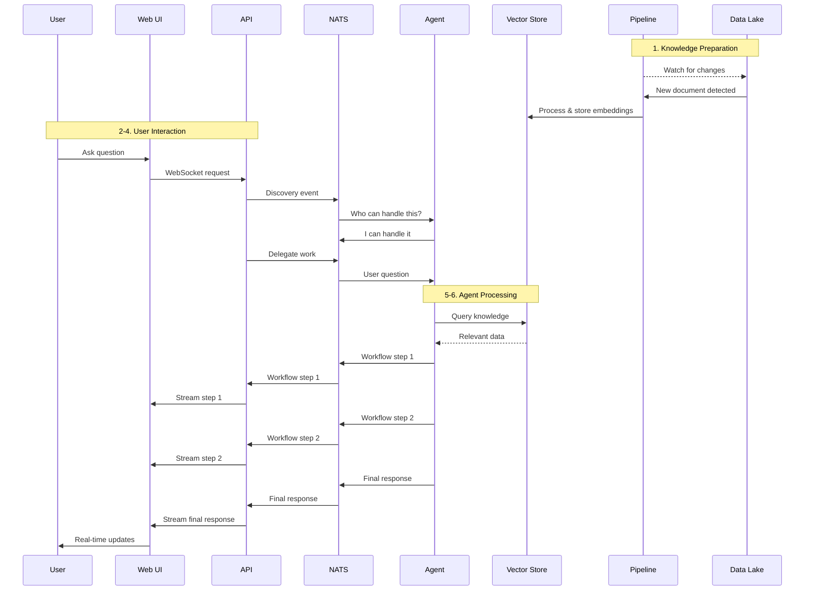
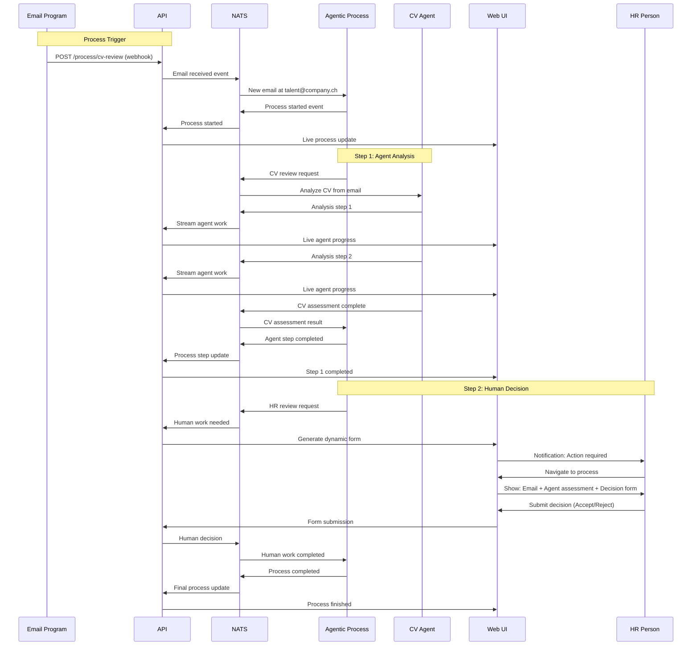

# :building_construction: Swiss AI-Hub Architecture

::: tip Architecture Overview
The Swiss AI-Hub is built as a comprehensive, event-driven platform that seamlessly integrates AI agents, business
processes, and enterprise infrastructure. This architecture enables the creation of transparent, auditable, and
sovereign AI solutions that scale from simple assistants to complex autonomous systems.
:::

## :mountain: Platform vs. Library Approach

The Swiss AI-Hub follows a **platform-first architecture** rather than a library-based approach:

- **Libraries** help you solve specific problems but leave you to build the infrastructure
- **Platforms** provide the complete environment to solve problems at scale, reliably, and sustainably

Our architecture embodies this philosophy by providing a complete, production-ready ecosystem where developers can focus
on creating business value while the platform handles security, scalability, and infrastructure.

## :building_construction: Component Architecture Overview

The Swiss AI-Hub is architected as a symphony of interconnected components, each playing a vital role in creating
intelligent, collaborative workflows. Rather than a monolithic system, we've designed a modular ecosystem where each
layer serves a specific purpose while harmoniously working together.

::: tip Architecture Philosophy
Our architecture follows the principle of **separation of concerns** with **clear interfaces** between components. This
design enables independent development, testing, and scaling of each layer while maintaining system cohesion.
:::

## :globe_with_meridians: The User Experience Layer

These components form the interface through which users interact with the AI-Hub, whether through web applications,
APIs, or collaboration platforms.

::: details AI-Hub API Gateway - The Protocol Bridge
**Your Bridge to AI Capabilities**

The API gateway serves as the universal translator between HTTP/WebSocket protocols and the NATS event system, enabling
seamless integration while maintaining the event-driven architecture.

**What makes it special:**

- **Dynamic Endpoint Generation**: Automatically creates REST endpoints based on process requirements—when a process
  needs external input, the API creates the appropriate webhook
- **Real-time Streaming**: WebSocket connections stream agent workflow steps and process updates back to users as they
  happen
- **Discovery Orchestration**: Sends discovery events to find available agents and processes, enabling dynamic system
  composition
- **Protocol Translation**: Seamlessly converts REST and WebSocket requests into NATS events that agents and processes
  understand
- **Enterprise-Grade Security**: Hierarchical permissions ensure the right users access the right resources at the right
  time
- **Developer-Friendly**: Auto-generated OpenAPI schemas and comprehensive documentation make integration seamless

**Behind the scenes:** The API doesn't orchestrate the system—it translates between protocols. When you ask a question,
the API sends a NATS event to the appropriate agent, then subscribes to the response stream, forwarding each step back
to your browser via WebSocket. For processes, it dynamically generates endpoints like `/process/cv-review` that external
systems can call, automatically translating HTTP requests into NATS events.
:::

::: details AI-Hub Web Interface - The Adaptive Command Center
**Where Intelligence Meets Intuition**

The web interface adapts to how you want to work: chat mode for direct agent conversations and process mode for
orchestrating complex workflows with multiple participants.

**What makes it special:**

- **Adaptive Interface Modes**: Seamlessly switches between chat mode for agent conversations and process dashboards for
  workflow orchestration
- **Real-time Everything**: Live updates show agent workflow steps, process progress, and system health as they happen
- **Dynamic Process UIs**: Automatically generates forms and interfaces based on what each process step needs from human
  participants
- **Complete Observability**: Inspect every step an agent took, what data it used, and how it reached its conclusions
- **Multi-Cultural**: Native support for German, French, Italian, and English ensures global accessibility

**Behind the scenes:** Built on Nuxt 3 and Vue 3, the interface receives real-time updates via WebSocket connections to
the API gateway. When agents work or processes execute, each step streams to the browser immediately. The system
auto-generates TypeScript clients from API schemas, while Pinia-Colada manages state and caching seamlessly.
:::

::: details AI-Hub Bot Integration - The Conversational Bridge
**AI in Your Workspace**

The bot layer brings AI capabilities directly into the collaboration tools your team already uses, eliminating context
switching and friction.

**What makes it special:**

- **Native Integration**: Works seamlessly within Teams, Slack, and other platforms as if it were built specifically for
  each
- **Context Awareness**: Maintains conversation history and understands threading, making interactions feel natural
- **Streaming Responses**: See AI thinking in real-time with progressive response building
- **Human-AI Collaboration**: Enables sophisticated workflows where AI agents can request human input when needed

**Behind the scenes:** The bot system uses Microsoft Bot Framework for multi-channel support, with specialized adapters
for each platform. Conversation state is persisted with configurable TTL, and the system handles the complexity of
different messaging formats automatically.
:::

## :brain: The Intelligence Layer

These components form the cognitive core of the AI-Hub, providing the reasoning, automation, and data processing
capabilities that make the system truly intelligent.

::: details AI-Hub Agent System - The AI Workforce
**Intelligent Agents That Actually Work**

The agent system creates autonomous entities that can reason, plan, and execute complex tasks with human-level
understanding and reliability.

**What makes it special:**

- **Transparent Intelligence**: Every agent decision is traceable and auditable, building trust through transparency
- **Multi-Provider Flexibility**: Seamlessly works with OpenAI, Azure, Google, and other LLM providers, with automatic
  fallback strategies
- **Knowledge Integration**: Agents can access and reason over your organization's specific knowledge through advanced
  RAG capabilities
- **Tool Integration**: Agents can interact with external systems, databases, and APIs to accomplish real tasks

**Behind the scenes:** Agents are built using workflow-based execution that makes every step visible and debuggable. The
system provides comprehensive observability through Phoenix tracing, making it easy to understand how agents reach their
conclusions.
:::

::: details AI-Hub Process Orchestration - The Collaboration Engine
**Where Human and AI Intelligence Converge**

The process orchestration layer coordinates complex workflows involving multiple agents, human participants, and
external programs, transforming outputs from one entity into valid inputs for the next.

**What makes it special:**

- **Delegation-Based Design**: Processes don't execute work themselves—they intelligently delegate to the most
  appropriate entity (agent, human, or program)
- **Entity Coordination**: Seamlessly orchestrates between agents, humans, and external programs through NATS events
- **Data Transformation**: Transforms outputs from one entity into valid inputs for the next, ensuring seamless workflow
  execution
- **Dynamic Triggering**: Processes can be triggered by external events, time schedules, or other processes
- **Live Monitoring**: Every process step is observable in real-time through the web interface

**Behind the scenes:** The process engine uses pure event-driven architecture with NATS messaging to coordinate between
all entities. Processes announce themselves through discovery events just like agents, enabling the same dynamic scaling
and hot deployment capabilities.
:::

::: details AI-Hub Data Pipelines - The Knowledge Foundation
**Turning Information into Intelligence**

The data pipeline layer operates autonomously, watching the data lake for changes and automatically transforming raw
documents into AI-ready knowledge that agents can leverage for intelligent responses.

**What makes it special:**

- **Fully Autonomous**: Watches data lake changes and processes documents without any external coordination or NATS
  communication
- **Smart Document Understanding**: Handles PDFs, Word documents, PowerPoint presentations, and more with intelligent
  parsing strategies
- **Vector Intelligence**: Converts text into high-dimensional embeddings for semantic search and reasoning
- **Zero-Coordination Architecture**: Operates independently—agents and the API gateway access the results, but
  pipelines run on their own reactive schedule
- **Observable Processing**: Built on Dagster with full observability and lineage tracking

**Behind the scenes:** Built on Dagster with observable assets that react to data lake changes. When the API gateway
uploads a file or external systems add documents, pipelines automatically detect and process them. The results flow into
vector stores and document databases where agents can access them directly—no coordination needed, pure reactive
processing.
:::

## :electric_plug: The Event-Driven Nervous System

The true power of the AI-Hub lies not in how components connect, but in how they **don't** connect. This is an
event-driven, discovery-based architecture where NATS serves as the nervous system, carrying signals between loosely
coupled components.

::: tip The Discovery Revolution
Agents and processes don't need to know about each other or the API. They simply announce their presence through NATS
events, creating a self-organizing system that scales automatically.
:::

### :zap: NATS - The Nervous System

NATS is the electrical impulse system that makes everything work:

**🔍 Discovery Events**: When the API needs to find agents, it sends a discovery event into NATS. Available agents
respond, creating a dynamic registry.

**🎯 Work Delegation**: The API translates user requests into NATS events that the right agents receive automatically.

**📡 Workflow Streaming**: Every agent workflow step publishes to NATS, creating a real-time stream of intelligence.

**🔄 Process Orchestration**: Processes use NATS to coordinate between agents, humans, and external programs.

**⚖️ Automatic Load Balancing**: Deploy multiple instances of the same agent, and NATS automatically distributes work
between them.

## :arrows_counterclockwise: Intelligence in Action: Two Core Patterns

The AI-Hub supports two fundamental interaction patterns that showcase the power of the event-driven architecture.

### 💬 Pattern 1: Direct User-Agent Communication

Let's trace a real user interaction from start to finish:

**📁 Step 1: Knowledge Preparation** An admin uploads a document to the data lake. The Data Pipeline automatically
detects this change, processes the document with AI, and ingests it into the vector store. No coordination needed—pure
reactive processing.

**💬 Step 2: User Question** A user types a question in the web interface. The browser sends this to the API via
WebSocket.

**🎯 Step 3: Agent Discovery** The API sends a discovery event into NATS: "Who can handle this type of question?"
Available agents respond with their capabilities.

**📨 Step 4: Work Delegation** The API selects the best agent and sends a NATS event with the user's question. The agent
receives and begins processing.

**🔍 Step 5: Knowledge Retrieval** The agent queries the vector store for relevant information, finding the document that
was processed earlier.

**⚡ Step 6: Real-time Streaming** As the agent works through its workflow—reasoning, retrieving, generating—each step is
published to NATS. The API subscribes to these events and streams them to the user's browser via WebSocket.

**🎉 Step 7: Live Observability** The user sees the agent's thinking process in real-time. Later, they can navigate to
the observability interface to inspect every step, every piece of data used, and how the agent reached its conclusion.

### 🔄 Pattern 2: Agentic Process Orchestration

Now let's see how the AI-Hub orchestrates complex workflows involving multiple entities. Here's a CV reviewing process
triggered by incoming emails:

**📧 Step 1: Email Trigger** An email arrives at talent@company.ch. The email program sends a POST request to the API's
dynamically generated webhook endpoint `/process/cv-review`. The API translates this HTTP request into a NATS event that
triggers the agentic process.

**🤖 Step 2: Agent Analysis** The process transforms the email into a CV review request and delegates it to the CV Agent
via NATS. The agent analyzes the CV, with each workflow step streaming live through NATS to the API, then to the Web UI.

**📊 Step 3: Process Transformation** The process receives the agent's assessment via NATS and transforms it into a
human-readable format with a decision form.

**👥 Step 4: Human Review** The HR person receives a notification in the AI-Hub interface. They navigate to the process
view and see:

- **Step 1**: The original email from the candidate
- **Step 2**: The agent's technical assessment with reasoning
- **Step 3**: A dynamic form asking for Accept/Reject decision

**✅ Step 5: Decision & Completion** The HR person submits their decision through the Web UI. The API receives this form
submission and translates it into a NATS event for the process orchestrator. The process marks the workflow as complete,
and all participants can see the final result.

**👁️ Live Observability Throughout** At every moment, the Web UI shows live updates:

- Process progress and current step
- Agent workflow steps as they happen
- Human participants and their required actions
- Complete audit trail of all decisions and reasoning

::: details Process-Driven Workflows - The Next Level
**Taking Humans Out of the Loop**

For complex workflows, Agentic Processes orchestrate everything:

**🎯 Process Definition**: Define who does what—humans provide approvals, agents do analysis, external programs handle
integrations.

**⚡ Automatic Triggers**: Processes can be triggered by time, events, or other processes. No human intervention needed.

**🔄 Dynamic Coordination**: The process sends NATS events to coordinate between all participants—agents, humans, and
external programs.

**📊 Live Monitoring**: The web interface transforms into a process dashboard, showing live progress and generating
dynamic forms for human participants.

**🎭 Complete Flexibility**: Processes are just another type of NATS participant—they can be discovered, scaled, and
coordinated just like agents.
:::

::: details The Discovery-Based Architecture
**Why This Changes Everything**

This architecture provides unprecedented flexibility:

**🔄 Hot Deployment**: Deploy new agents without system downtime. They announce themselves and immediately start
receiving work.

**⚖️ Automatic Scaling**: Deploy multiple instances of popular agents. NATS automatically load balances between them.

**🔧 Zero Configuration**: No service registries, no hard-coded connections. Components find each other dynamically.

**🎯 Loose Coupling**: Agents and processes know nothing about the API or web interface. They just respond to NATS
events.

**📈 Infinite Scalability**: Want more capacity? Deploy more instances. Want new capabilities? Deploy new agent types.
The system adapts automatically.
:::

::: details Communication Patterns - The Signal Types
**How Different Components Communicate**

**🌐 Web Interface ↔ API Gateway**: REST and WebSocket for user interactions and real-time streaming

**🤖 Bot Integration ↔ API Gateway**: HTTP requests for bot messages and responses

**📡 API Gateway ↔ NATS**: Discovery events, work delegation, response streaming, and dynamic endpoint creation

**🧠 Agent ↔ NATS**: Discovery responses, workflow step publishing, and inter-agent communication

**🔄 Process ↔ NATS**: Process orchestration, step coordination, and status updates

**💬 Agent ↔ Process**: Coordination through NATS events for complex workflows

**📊 Pipeline ↔ Data Lake**: File watching and reactive processing (autonomous, no NATS needed)

**🎯 Agent ↔ Vector Store**: Direct access for knowledge retrieval and semantic search

**💾 API Gateway ↔ Data Lake**: File uploads that trigger automatic pipeline processing

**🔗 External Programs ↔ API Gateway**: HTTP requests to dynamically generated webhook endpoints
:::

::: details Security Architecture - Trust Through Transparency
**Enterprise-Grade Security That Scales**

Security isn't an afterthought in the AI-Hub—it's woven into every layer of the architecture:

**🔐 Authentication**: Seamless integration with enterprise identity providers through OAuth2/OIDC, supporting single
sign-on and multi-factor authentication.

**🛡️ Authorization**: Hierarchical permission system with wildcard support allows fine-grained access control that
scales with organizational complexity.

**🏠 Data Sovereignty**: Complete on-premises deployment capability ensures sensitive data never leaves your control,
meeting the strictest regulatory requirements.

**📊 Audit Trails**: Comprehensive logging and traceability across all components provides the transparency needed for
compliance and debugging.
:::

## :trophy: Why This Architecture Works

This architecture isn't just technically sound—it's designed to solve real business problems and grow with your
organization.

::: details Modularity
**Independent Evolution**

Each component can be developed, tested, and deployed independently. Your API team can ship improvements without waiting
for the web team, and your data scientists can enhance agents without affecting user interfaces.
:::

::: details Scalability
**Growth That Doesn't Hurt**

Components can be scaled horizontally based on demand. Need more API capacity? Scale the API layer. Processing more
documents? Scale the pipeline layer. The architecture adapts to your needs.
:::

::: details Maintainability
**Code That Stays Clean**

Clear separation of concerns makes the system easier to understand and modify. New team members can quickly understand
their area of responsibility without needing to grasp the entire system.
:::

::: details Extensibility
**Future-Proof Design**

New components can be added without disrupting existing functionality. Want to add mobile apps? The API layer is ready.
Need new AI capabilities? The agent system is designed for expansion.
:::

::: details Testability
**Confidence in Every Change**

Each component can be tested in isolation with comprehensive test suites. Integration tests ensure components work
together correctly, while unit tests catch issues early.
:::

::: details Observability
**Visibility Into Everything**

Built-in monitoring and tracing across all components means you always know what's happening in your system. Performance
issues, bottlenecks, and errors are visible and actionable.
:::

## :gear: Architectural Principles in Action

The Swiss AI-Hub's architecture puts several key principles into practice to create a system that's both powerful and
maintainable. By combining event-driven messaging with service discovery, we've built a platform that adapts to changing
needs without requiring complex reconfiguration.

**The Result**: A system where components collaborate through well-defined interfaces, where new capabilities integrate
seamlessly with existing services, and where every operation maintains transparency and auditability.

This architecture serves as a solid foundation for building intelligent systems that can grow with your organization's
needs while maintaining the reliability and security required for business-critical applications.
