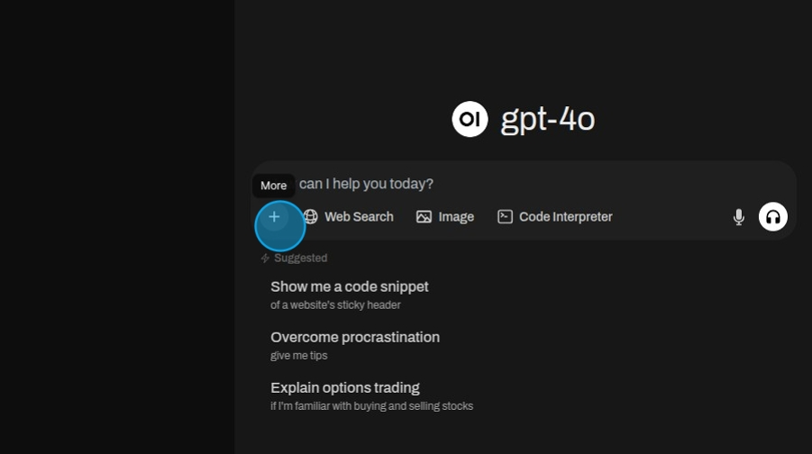
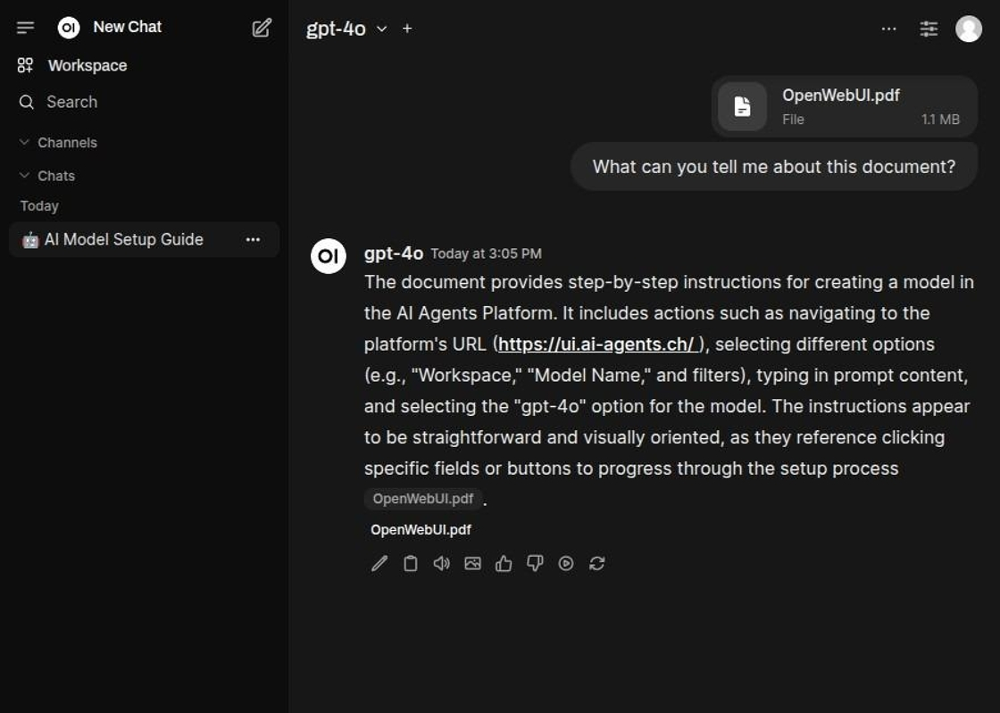

Um Dateien hochzuladen, klicken Sie auf den Button „Mehr“.

Wählen Sie dann „Dateien hochladen“ aus. Navigieren Sie im Pop-up-Fenster zu den gewünschten Dateien und laden Sie diese
hoch.

Nachdem Sie die Dateien hochgeladen haben, stellen Sie eine Frage.

Das Modell wird die Dateien verwenden, um die Frage zu beantworten.

Klicken Sie auf eine Referenz, um zu sehen, welche Teile zur Beantwortung der Frage verwendet wurden.

Die Zitation gibt einen klaren Überblick über die verschiedenen Teile, die zur Generierung der Antwort verwendet wurden.

