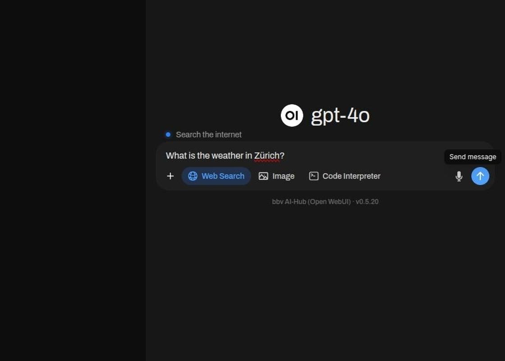
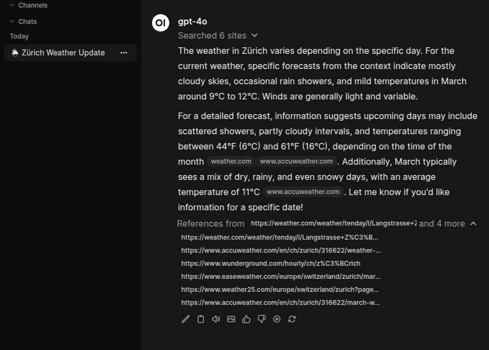

# Web-Suchfunktion

Agenten können auf Web-Informationen zugreifen, um Fragen zu beantworten, die aktuelle Daten erfordern, die über ihr
Training oder interne Wissensdatenbanken hinausgehen. Organisationen steuern dies über die Konfiguration.

Wählen Sie „Web-Suche“ aus.

Geben Sie etwas ein, wonach Sie suchen möchten.

Das Modell benötigt einige Zeit, um eine Suchanfrage zu formulieren und diese dann auszuführen. Danach wird es ausgeben,
was es gefunden hat.

Die Websites, von denen die Informationen abgerufen wurden, sind als Referenzen aufgeführt.

## Suchkonfiguration

Die Web-Suche kann pro Agent aktiviert oder deaktiviert werden. Je nach Anwendungsfall oder Benutzergruppe gelten
unterschiedliche Richtlinien.

Jeder Agent verfügt über eine unabhängige Web-Suchkonfiguration, basierend auf seinem Zweck und Risikoprofil. Die
Web-Suche kann auf bestimmte Benutzerrollen über rollenbasierte Zugriffskontrolle beschränkt werden. Suchfunktionen
können zur Laufzeit ohne Systemänderungen angepasst werden.

## Suchbeschränkungen

Organisationen können Suchanfragen auf genehmigte Domains, vertrauenswürdige Quellen oder spezifische Inhaltstypen wie
akademische Einrichtungen oder Regierungswebsites beschränken.

Suchanfragen können validiert, gefiltert oder transformiert werden, um die Einhaltung von Datenschutzrichtlinien zu
gewährleisten und das Austreten sensibler Informationen zu verhindern.

Abgerufene Webinhalte können vor der Präsentation anhand organisationaler Standards validiert werden.

Suchbeschränkungen können mit Branchenvorschriften, internen Richtlinien oder vertraglichen Verpflichtungen
übereinstimmen.

## Quellenzuschreibung

Wenn Agenten die Web-Suche nutzen, bietet das System eine nachvollziehbare Zuschreibung externer Quellen.

Benutzer sehen klare Unterscheidungen zwischen internem Wissen und externen Webquellen. Webergebnisse werden als
strukturierte, anklickbare Zitationen mit URLs, Titeln und Inhaltsvorschauen angezeigt. Benutzer erhalten Informationen
darüber, warum bestimmte Quellen abgerufen wurden.

Jede Suchanfrage, jedes abgerufene Ergebnis und jede Benutzerinteraktion wird zu Prüfzwecken erfasst. Der gesamte
Suchprozess – von der Abfragevalidierung über die Ergebnisfilterung bis zur Präsentation – ist über die
Beobachtbarkeitsinfrastruktur nachvollziehbar.

## Anwendungsfälle

Agenten ergänzen internes Wissen mit aktuellen Marktdaten, regulatorischen Updates, Branchennachrichten oder technischer
Dokumentation aus externen Quellen.

Wenn interne Wissensdatenbanken Lücken aufweisen, greifen Agenten auf externe Informationen zu und weisen die Quellen
dabei klar zu.

Agenten können interne Daten anhand maßgeblicher externer Quellen validieren.

Komplexe Forschungsaufgaben profitieren von der Orchestrierung sowohl interner als auch externer Quellen.

## Governance und Sicherheit

Organisationen können sicherstellen, dass Suchanfragen keine sensiblen Informationen an externe Anbieter weitergeben,
und zwar durch Abfragevalidierung und -filterung.

Webinhalte werden vor der Präsentation anhand organisationaler Standards validiert, um zu verhindern, dass ungeeignete
oder unzuverlässige Quellen die Benutzer erreichen.

Das Berechtigungssystem ermöglicht die Kontrolle darüber, welche Benutzer oder Gruppen die Web-Suche für welche Zwecke
verwenden dürfen.

Vollständige Audit-Trails und transparente Quellenzuschreibung unterstützen die Einhaltung von
Datengovernance-Vorschriften und Industriestandards.

Konfigurierbare Beschränkungen und Validierungsmechanismen ermöglichen es Organisationen, den Wert externer
Informationen mit ihrer Risikotoleranz und ihren Compliance-Verpflichtungen abzuwägen.
