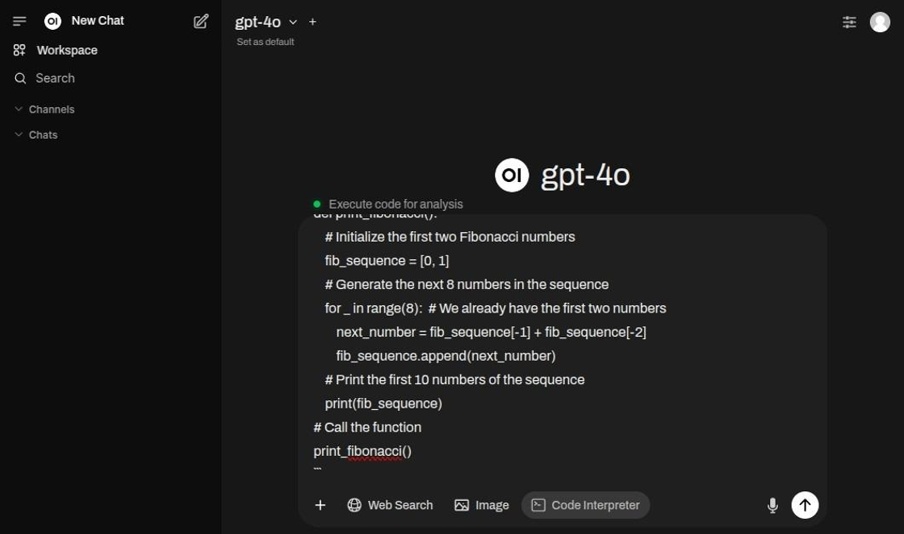

# Coding / Software Development

When it comes to coding with the help of a model, there are two main ways to do this.

1. Either the model writes the code, which can be hinted by metioning the "Pydiode environment" which is used to execute
   the code. This gives the model the indication the user wants to work with code and will try to answer the request by
   writing code.
2. Alternatively the chat can also be used to run and further develop existing code.

## Coding with the LLM

Enter a prompt mentioning the "Pydiode environment" in order to generate code.

Using the "Run" button the code can be tested directly inside the chat.

After running the code snippet prints the result below the cell.

## Executing existing code

Select "Code Interpreter".

Encase the code in back-ticks to mark it as code for execution.

When the code has run through the result is printed out.

