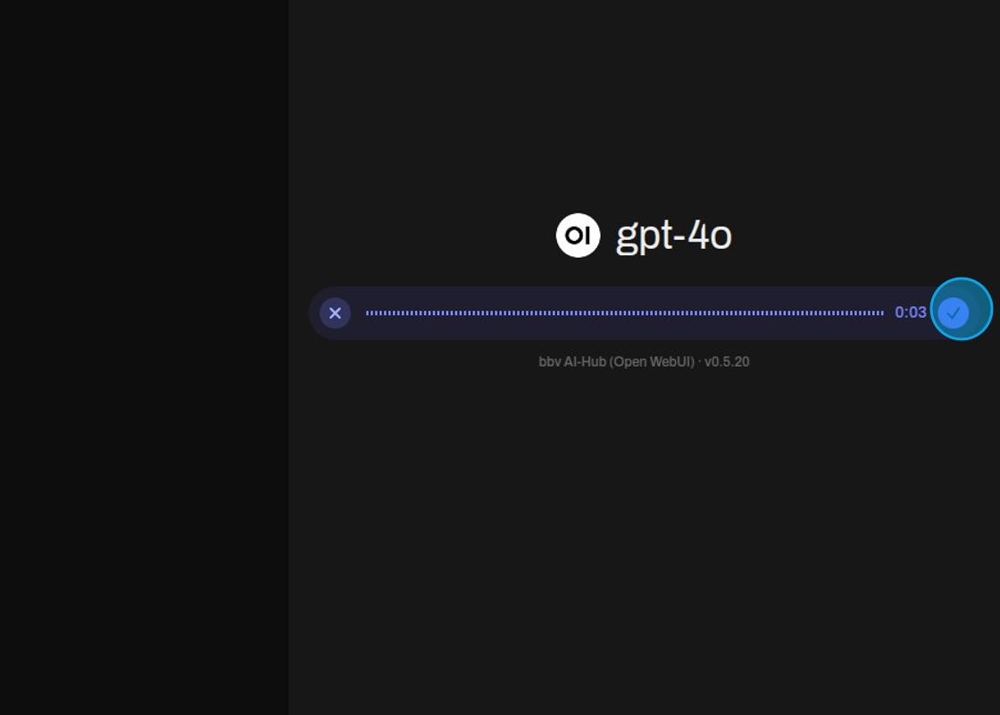
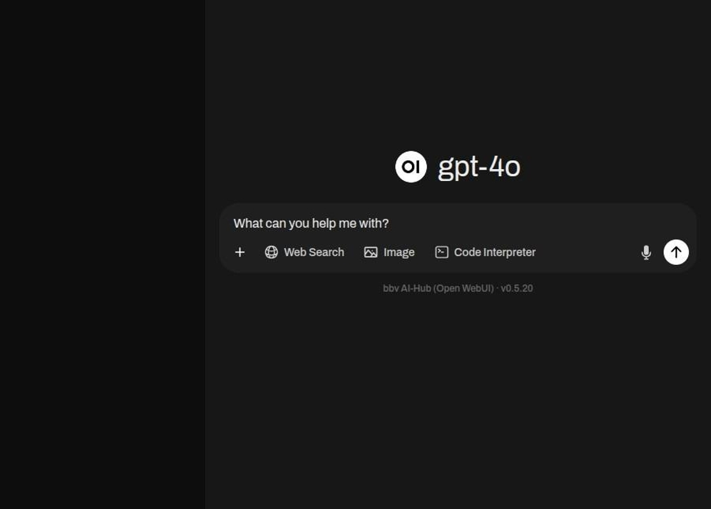

Starten Sie eine Sprachaufnahme.

Eine Zeitleiste zeigt an, wie lange die Aufnahme gedauert hat.

Um die Aufnahme abzuschließen und das Audio als Prompt zu transkribieren, wählen Sie das Häkchen.

Das aufgenommene Audio wird als Eingabe angezeigt, die geändert oder direkt an das Modell gesendet werden kann.

