# Tiefgehende Observability mit OpenTelemetry :telescope: :100:

::: info **Kurz gesagt – Was ist tiefgehende Observability?**
Der AI-Hub bietet **durchgängiges verteiltes Tracing und tiefgehende Observability** unter Verwendung von
OpenTelemetry-Standards, was Ihnen vollständige Transparenz in jeden Aspekt Ihrer KI-Workflows ermöglicht. Von einzelnen
Agenten-Schritten bis hin zu komplexen Multi-Service- Prozessen können Sie jede Komponente Ihres KI-Ökosystems mit
unternehmensgerechter Observability verfolgen, überwachen und optimieren, die sich nahtlos in branchenübliche Tools wie
Phoenix, SigNoz oder DataDog integrieren lässt.
:::

## Was ist tiefgehende Observability und wie implementiert der AI-Hub sie? :brain:

**Tiefgehende Observability** geht weit über traditionelles Logging und Monitoring hinaus. Der AI-Hub implementiert eine
umfassende Observability-Strategie, die **verteiltes Tracing**, **semantische Konventionen** und **KI-spezifische
Instrumentierung** kombiniert, um eine beispiellose Transparenz in Ihre KI-Systeme zu ermöglichen.

Die Plattform verwendet **OpenTelemetry** als ihr grundlegendes Observability-Framework, ergänzt durch
**OpenInference-semantische Konventionen** für KI/ML-Workloads. Das bedeutet, jede Interaktion, von einer einfachen
Benutzernachricht bis hin zu komplexen Multi-Agenten- Orchestrierungen, wird automatisch mit umfangreichen
Kontextinformationen getraced, darunter:

- **Vollständige Anfrageflüsse**: Verfolgen Sie eine Benutzeranfrage, während sie durch APIs, Agenten, Datenbanken und
  externe Dienste fließt
- **KI-spezifische Semantik**: Erfassen Sie LLM-Aufrufe, Embeddings, Retrievals und Modellinteraktionen mit
  spezialisierten semantischen Attributen
- **Performance-Metriken**: Verfolgen Sie Latenz, Token-Nutzung, Kostenattribution und Ressourcennutzung über alle
  Komponenten hinweg
- **Fehlerkontext**: Erhalten Sie detaillierte Fehlertraces mit vollständigem Kontext, was zu den Fehlern geführt hat
- **Service-Abhängigkeiten**: Bilden Sie automatisch ab, wie Ihre Dienste, Agenten und Prozesse in Echtzeit interagieren

Das System instrumentiert automatisch **jede Komponente**, einschließlich NATS-Messaging, Datenbankoperationen,
HTTP-Aufrufe, LLM- Interaktionen, Vektorsuchen und benutzerdefinierte Agenten-Workflows, ohne dass Codeänderungen
erforderlich sind.

## Warum dies für den Erfolg von Enterprise AI entscheidend ist :trophy:

Tiefgehende Observability verändert die Art und Weise, wie Sie KI-Systeme in der Produktion erstellen, debuggen und
skalieren:

**🔍 Vollständige Systemsichtbarkeit**: Sehen Sie genau, wie Ihre KI-Workflows in der Produktion ausgeführt werden, von
der Benutzereingabe bis zur endgültigen Ausgabe, über alle Microservices und Agenten hinweg. Keine blinden Flecken mehr
in komplexen verteilten KI-Systemen.

**🚀 Performance-Optimierung**: Identifizieren Sie Engpässe in Ihren KI-Pipelines präzise. Wissen Sie genau, welche
LLM-Aufrufe langsam sind, welche Retrievals ineffizient sind und wo Ihre Workflows für Geschwindigkeit und Kosten
optimiert werden können.

**🛡️ Proaktive Problemerkennung**: Erkennen Sie Probleme, bevor sie Benutzer beeinträchtigen. Fortgeschrittenes Tracing
enthüllt Muster, die zu Fehlern führen, sodass Sie Probleme proaktiv statt reaktiv beheben können.

**💰 Kostenattribution und -kontrolle**: Verfolgen Sie Token-Nutzung, API-Aufrufe und Compute-Kosten bis hin zu einzelnen
Benutzern, Agenten oder Workflows. Treffen Sie datengestützte Entscheidungen über Ressourcenzuweisung und
Kostenoptimierung.

**🌐 Anbieterunabhängige Flexibilität**: OpenTelemetry stellt sicher, dass Ihre Observability-Daten mit jedem
OTLP-kompatiblen Backend funktionieren. Beginnen Sie mit Phoenix für KI-spezifische Analysen und migrieren Sie dann zu
Unternehmens-Tools wie DataDog oder New Relic, ohne Daten zu verlieren oder die Instrumentierung zu ändern.

::: details **Abdeckung der automatischen Instrumentierung**
Der AI-Hub instrumentiert diese Komponenten automatisch ohne Codeänderungen:

### Kerninfrastruktur

- **NATS Messaging**: Vollständiges Nachrichtenfluss-Tracing über Microservices hinweg
- **Datenbankoperationen**: FeretDB-, ValKey- und Vektordatenbankabfragen
- **HTTP-Clients**: Alle externen API-Aufrufe und Webhooks
- **Hintergrundaufgaben**: Asynchrone Operationen und geplante Jobs

### KI-spezifische Komponenten

- **LLM-Interaktionen**: Token-Nutzung, Modellaufrufe und Antwortzeiten
- **Embeddings**: Vektorgenerierung und Ähnlichkeitssuchen
- **Retrieval**: RAG-Operationen und Wissensdatenbankabfragen
- **Agenten-Workflows**: Schrittweise Ausführungstraces mit semantischem Kontext
:::

## Erste Schritte

Um tiefgehende Observability in Ihrer AI-Hub-Bereitstellung zu aktivieren:

1. **Umgebungsvariablen konfigurieren**: Legen Sie die OTEL-Konfigurationsvariablen für Ihr Ziel-Observability-Backend
   fest
2. **Mit aktiviertem Tracing deployen**: Starten Sie Ihre AI-Hub-Dienste neu, um die automatische Instrumentierung zu
   aktivieren
3. **Auf Ihr Observability-Dashboard zugreifen**: Zeigen Sie Traces, Metriken und Analysen in Ihrer gewählten
   Observability-Plattform an

Das System erfordert keine Codeänderungen – die gesamte Instrumentierung erfolgt automatisch und folgt den
OpenTelemetry-Standards für maximale Kompatibilität und minimale Performance-Auswirkungen.

# Traces

## Überblick

Traces verfolgen einzelne Anfragen durch die AI Hub-Plattform und zeigen den vollständigen Pfad von Anfang bis Ende.
Jede Operation erhält automatisch eine eindeutige Trace-ID, die alle zugehörigen Aktivitäten über Dienste hinweg
verbindet und genau aufzeigt, was passiert ist, wo Zeit verbracht wurde und wie Komponenten zusammengearbeitet haben.

Der Swiss AI-Hub verwendet OpenTelemetry für das Tracing mit spezialisierter Unterstützung für KI-Operationen durch
OpenInference- semantische Konventionen.

---

## Was wir erfassen

### Agenten-Workflow-Ausführung (Operational)

Agenten-Läufe werden mit hierarchischen Span-Strukturen getraced, die den vollständigen Workflow zeigen:

**Agenten-Spans**: Root-Span, der den Beginn einer Agenten-Ausführung mit Benutzereingabe und Agenten-Identifikation
markiert.

**Chain-Spans**: Langlebiger Span, der die gesamte Laufzeit vom Start bis zur endgültigen Ausgabe erfasst.

**Step-Spans**: Einzelne Workflow-Schritte, die Eingaben, Ausgaben, Verarbeitungszeit und semantische Ereignisse zeigen.

**Trace-Attribute**:

- Sitzungs-/Thread-Identifikatoren für den Konversationskontext
- Eingabe- und Ausgabewerte im JSON-Format
- OpenInference Span-Typen (AGENT, CHAIN, TOOL, LLM, RETRIEVER)
- Tags zur Filterung (thread_id, display_id, run_id)

**Implementierung**: Der `AgentRunTracer` erstellt einen Zwei-Span-Ansatz mit einem anfänglichen AGENT-Span als Eltern
und einem abschließenden CHAIN-Span, der die Gesamtdauer erfasst.

### KI-Modelloperationen (Operational)

LLM-Operationen werden automatisch durch die LlamaIndex-Instrumentierung getraced:

**LLM-Aufrufe**: Modellauswahl, Prompt-Konstruktion, Token-Nutzung und Antwortgenerierung.

**Retrieval-Operationen**: Vektordatenbankabfragen, Dokumentenabruf und Kontextzusammenstellung.

**Embeddings**: Texterzeugung für Dokumentenindizierung und Ähnlichkeitssuche.

**Semantische Ereignisse**: KI-spezifische Operationen senden semantische Ereignisse mit detaillierten Metadaten
(Token-Anzahl, Modellnamen, abgerufene Dokumente), die Traces mit domänenspezifischen Informationen anreichern.

**Sichtbarkeit**: Alle KI-Operationen erscheinen in der Phoenix-Tracing-Benutzeroberfläche mit spezialisierten Ansichten
für die LLM-Performance-Analyse.

### HTTP- und Datenbankoperationen (Operational)

Instrumentierte Bibliotheken erstellen automatisch Spans für externe Service-Aufrufe:

**HTTP-Clients**: HTTPX- und aiohttp-Anfragen mit Methode, URL, Statuscode und Zeitmessung.

**Datenbanken**: FerretDB-, PostgreSQL- und ValKey-Operationen mit Abfrageinformationen.

**Vektordatenbank**: Milvus-Ähnlichkeitssuchen und Indizierungsoperationen.

**Filterung**: Health Checks, Metrik-Endpunkte und hochvolumige Datenbankabfragen werden aus den Traces gefiltert, um
Rauschen zu reduzieren.

---

## Trace-Sammlungsarchitektur

### Sammlungspipelines

Der OpenTelemetry Collector verarbeitet Traces über zwei spezialisierte Pipelines:

**traces/cloud**: Sendet alle Traces an das Cloud-Backend

- Receiver: `otlp` (gRPC-Port 4317, HTTP-Port 4318)
- Prozessoren: `filter/noise` (entfernt Health Checks, Metrik-Endpunkte, routinemäßige DB-Abfragen), `batch`
- Exporter: `otlp/cloud`

**traces/phoenix**: Sendet KI-spezifische Traces an das lokale Phoenix

- Receiver: `otlp` (gRPC-Port 4317, HTTP-Port 4318)
- Prozessoren: `filter/phoenix` (behält nur OpenInference-Spans), `transform/phoenix` (fügt Projektmetadaten hinzu),
  `batch`
- Exporter: `otlp/phoenix` (Port 6007)

### Instrumentierung

Dienste senden automatisch Traces über die OpenTelemetry-Instrumentierung, die von `AihubInstrumentor` konfiguriert
wird:

**Automatische Instrumentierung** (via `AihubInstrumentor`):

- `AsyncioInstrumentor`: Asynchrone Operationen und Aufgaben-Ausführung
- `HTTPXClientInstrumentor` / `AioHttpClientInstrumentor`: HTTP-Anfragen
- `PymongoInstrumentor` / `RedisInstrumentor` / `MilvusInstrumentor`: Datenbankoperationen
- `LlamaIndexInstrumentor`: LLM- und RAG-Operationen mit OpenInference-Konventionen

**Benutzerdefiniertes Tracing** (via `AgentRunTracer`):

- Agenten-Workflow-Ausführung mit Detail auf Schritt-Ebene
- Hierarchische Span-Strukturen für komplexe Workflows
- Kontext-Propagation über verteilte Agenten-Operationen hinweg

**Smart Tracing**: Der `SmartTracer` respektiert den `suppress_instrumentation`-Kontext, was eine selektive
Tracing-Steuerung ermöglicht.

---

## Geschäftliche Vorteile

### Performance-Optimierung

Traces zeigen genau, wo in jeder Operation Zeit verbraucht wird. Die Identifizierung von Engpässen wird präzise statt
spekulativ. Wenn der Dokumentenabruf drei Sekunden dauert, während die KI-Verarbeitung 500 ms benötigt, werden die
Optimierungsprioritäten klar.

### Kostenmanagement

KI-Operationen umfassen Token-Nutzung und Kostenattribution durch semantische Ereignisse. Die Verfolgung, welche
Operationen, Benutzer oder Abteilungen die meisten KI-Ressourcen verbrauchen, ermöglicht datengestützte Entscheidungen
über Modellauswahl und Feature-Preise.

### Ursachenanalyse

Fehlgeschlagene Operationen bewahren den vollständigen Kontext und zeigen genau, wo und warum Fehler auftraten.
Fehler-Traces umfassen Stack- Traces, Eingabedaten und die Abfolge der Ereignisse, die zum Fehler führten, wodurch die
Problembehebungszeit drastisch reduziert wird.

### KI-Transparenz

Traces zeigen, welche Informationen die KI bei der Generierung von Antworten berücksichtigte. Abgerufene Dokumente,
Token-Nutzung und Modell- auswahl werden sichtbar, was die Einhaltung gesetzlicher Vorschriften unterstützt und das
Vertrauen der Benutzer aufbaut.

---

## Zugriff auf Trace-Informationen

### Phoenix UI (Entwicklung)

Phoenix bietet spezialisierte LLM-Observability unter `http://localhost:6006`:

**Funktionen**:

- Zeitachsenansichten, die Span-Dauer und Beziehungen zeigen
- Token-Nutzung und Kostenverfolgung für LLM-Operationen
- Inspektion abgerufener Dokumente für RAG-Systeme
- Trace-Filterung nach Sitzung, Tags oder Zeitbereich
- Performance-Analyse und Latenzverteilungen

**Fokus**: KI-spezifische Operationen mit OpenInference-semantischen Konventionen (LLM, CHAIN, AGENT, RETRIEVER,
EMBEDDING Spans).

### Cloud-Backend (Produktion)

Traces werden zur Langzeitspeicherung und -analyse an Cloud-Observability-Plattformen exportiert. Die Plattform
unterstützt jedes OTLP-kompatible Backend allein durch Konfigurationsänderungen.

---

## Sicherheit und Datenschutz

### Trace-Inhalt

Traces erfassen Operations-Metadaten, Zeitinformationen und Routing-Details. Entwickler sind dafür verantwortlich, dass
keine sensiblen Daten in Trace-Attributen enthalten sind.

**Infrastruktur**: OpenInference-Spans umfassen Sitzungs-IDs, Modellnamen, Token-Anzahlen und Metadaten abgerufener
Dokumente.

**Anwendungsverantwortung**: Entwickler müssen vermeiden, tatsächliche Dokumenteninhalte, Benutzernachrichten oder
andere sensible Informationen in benutzerdefinierten Trace-Attributen zu protokollieren.

### Übertragungssicherheit

Alle Traces werden über verschlüsselte Kanäle (TLS/HTTPS) übertragen, um Abfangen zu verhindern.

### Zugriffssteuerung

Der Trace-Zugriff ist durch rollenbasierte Zugriffssteuerung der Observability-Plattform eingeschränkt. Nur
autorisiertes Personal kann detaillierte Traces einsehen.

---

## Integration mit Plattformkomponenten

### Agenten-Workflows

Der `AgentRunTracer` erstellt eine strukturierte Tracing-Hierarchie für Agenten-Ausführungen:

1. Der anfängliche AGENT-Span markiert den Workflow-Start
2. Individuelle STEP-Spans zeigen jeden Workflow-Schritt mit Eingaben und Ausgaben
3. Der abschließende CHAIN-Span erfasst die gesamte Laufzeit
4. Semantische Ereignisse von KI-Operationen reichern Traces mit domänenspezifischen Metadaten an

### LLM-Operationen

Die LlamaIndex-Instrumentierung verfolgt automatisch:

- Sprachmodell-Aufrufe mit Token-Anzahlen
- RAG-Operationen, die den Dokumentenabruf und die Kontextzusammenstellung zeigen
- Vektordatenbank-Suchen und Ähnlichkeitsoperationen
- Embedding-Generierung für die Dokumentenverarbeitung

### HTTP-Dienste

FastAPI-Dienste verfolgen eingehende Anfragen bei Instrumentierung automatisch. Entwickler können benutzerdefinierte
Attribute zu Spans für anwendungsspezifischen Kontext hinzufügen.

---

## Plattformflexibilität

Während Phoenix während der Entwicklung LLM-spezifische Observability bietet, unterstützt die OpenTelemetry-Grundlage
jedes OTLP-kompatible Backend:

**Unterstützte Plattformen**:

- **Phoenix**: Open-Source LLM-Observability (aktuelle lokale Entwicklung)
- **SigNoz**: Open-Source Observability-Plattform
- **Jaeger**: Verteiltes Tracing mit Fokus auf Microservices
- **Tempo** (Grafana): Cloud-natives verteiltes Tracing
- **Datadog APM**: Kommerzielles APM mit umfassendem Tracing
- **New Relic**: Anwendungs-Performance-Monitoring mit KI-Einblicken

Das Umschalten von Backends erfordert nur Änderungen an der Collector-Konfiguration. Es sind keine Änderungen am
Anwendungscode erforderlich.

---

## Zukünftige Entwicklung

### Geplante Verbesserungen

**Tail Sampling**: Intelligentes Sampling, das Fehler-Traces und interessante Operationen beibehält, während
Speicherkosten reduziert werden.

**Benutzerdefinierte Geschäftsereignisse**: Höherstufige Traces für Geschäftsoperationen jenseits technischer
Implementierungsdetails.

**Kostenprognose**: Kostenschätzungen vor der Ausführung basierend auf historischen Trace-Daten und Abfragekomplexität.

**Performance-Budgets**: Automatische Warnmeldungen, wenn Operationen die erwartete Dauer basierend auf historischen
Mustern überschreiten.

---

## Zusammenfassung

Das verteilte Tracing der Plattform bietet:

✅ **Operationelles Agenten-Tracing**: Vollständige Workflow-Ausführung mit Detail auf Schritt-Ebene durch AgentRunTracer

✅ **Sichtbarkeit von KI-Operationen**: LLM- und RAG-Operationen getraced mit OpenInference-semantischen Konventionen

✅ **Automatische Instrumentierung**: HTTP-, Datenbank- und asynchrone Operationen getraced ohne manuellen Code

✅ **Unterstützung von zwei Backends**: Phoenix für LLM-spezifische Entwicklungs-Observability, Cloud-Backend für die
Produktion

✅ **Standardsbasiert**: OpenTelemetry gewährleistet Anbieterflexibilität durch das OTLP-Protokoll

✅ **Performance-Analyse**: Detaillierte Zeitinformationen ermöglichen präzise Engpassidentifikation

✅ **Grundlage für Datenschutz**: Infrastruktur erfasst Metadaten; Entwickler sind für den Datenschutz verantwortlich

Mit der Erweiterung der Tracing-Abdeckung erhalten Organisationen zunehmend detaillierte Einblicke in die
Plattform-Performance, KI-Operationen und die Benutzererfahrung.

# OpenTelemetry-Grundlage

## Überblick

**OpenTelemetry (OTel)** ist die technische Grundlage für die gesamte Observability im Swiss AI-Hub. Es bietet ein
anbieterneutrales, branchenübliches Framework zum Sammeln, Verarbeiten und Exportieren von Telemetriedaten über
Metriken, Logs und Traces hinweg.

Im Gegensatz zu proprietären Monitoring-Lösungen, die Sie an bestimmte Anbieter binden, stellt OpenTelemetry sicher,
dass die Plattform mit jedem kompatiblen Observability-Backend integriert werden kann. Diese Architektur-Entscheidung
bietet Organisationen maximale Flexibilität bei der Auswahl von Monitoring-Tools basierend auf ihrer Infrastruktur,
Compliance-Anforderungen und operativen Präferenzen.

---

## Warum OpenTelemetry?

OpenTelemetry ermöglicht es uns, Dienste einmal zu instrumentieren und die Tool-Wahl flexibel zu halten. Es
standardisiert Metriken, Logs und Traces, sodass Signale standardmäßig korrelieren und wechselbare Backends eine
Konfigurationsänderung bleiben, keine Neuprogrammierung.

**Vorteile**

- **Designbedingt anbieterneutral:** Verwenden Sie jedes OTLP-kompatible Backend (z.B. SigNoz, Datadog, Grafana,
  Prometheus, New Relic) ohne erneute Instrumentierung.
- **Vereinheitlichte Signale:** Konsistente Modelle und gemeinsam genutzter Kontext (Trace-/Span-IDs,
  Ressourcenattribute) verknüpfen Metriken, Logs und Traces für eine schnellere Fehlerbehebung.
- **Bewährter Standard:** Ein CNCF-Projekt mit breiter Branchenunterstützung und aktiver Entwicklung, was das
  Technologierisiko reduziert.
- **Zukunftssicher:** Entwickeln Sie Plattformen und Richtlinien über den OTel Collector und die Konfiguration weiter,
  nicht über den Anwendungscode.

---

## OpenTelemetry Collector

Der **OpenTelemetry Collector** ist der zentrale Telemetrie-Verarbeitungsknotenpunkt für den Swiss AI-Hub.

### Architektur

```mermaid
graph TB
    subgraph Sources["Telemetry Sources"]
        Docker[Docker Socket<br/>Container Stats]
        HealthFiles[Health Event Files<br/>NDJSON Logs]
        Apps[Application Services<br/>Instrumented with OTel SDKs]
    end

    subgraph Collector["OpenTelemetry Collector"]
        direction TB
        Recv[Receivers<br/>• OTLP gRPC/HTTP<br/>• docker_stats<br/>• filelog]
        Proc[Processors<br/>• batch<br/>• resource detection<br/>• filter<br/>• attributes]
        Exp[Exporters<br/>• otlp/signoz<br/>• debug]
    end

    subgraph Backends["Observability Backends"]
        SigNoz[SigNoz Cloud<br/>Metrics, Logs, Traces]
        Debug[Debug Output<br/>Development]
    end

    Docker --> Recv
    HealthFiles --> Recv
    Apps --> Recv

    Recv --> Proc
    Proc --> Exp

    Exp --> SigNoz
    Exp --> Debug

    style Recv fill:#e1f5ff
    style Proc fill:#fff4e1
    style Exp fill:#e8f5e9
```

### Komponenten

**Receivers**: Sammeln Telemetrie aus verschiedenen Quellen.

**Processors**: Transformieren, anreichern, filtern und stapeln Telemetrie vor dem Export.

**Exporters**: Senden verarbeitete Telemetrie an Observability-Backends.

**Extensions**: Bieten Zusatzfunktionen wie Health Checks und Profiling.

---

## Receivers

Receivers sind Aufnahmepunkte. Sie ziehen Telemetrie von Apps und Infrastruktur in die Plattform.

- **OTLP-Receiver:** Standardeingang für App-Telemetrie. Dienste senden Metriken, Logs und Traces mit dem OpenTelemetry
  Protokoll. Konzept: ein Drahtformat für alles.
- **Container-Metrik-Receiver:** Sammelt Ressourcennutzung von laufenden Containern. Konzept: Überwachung der
  Laufzeit-Integrität ohne den App-Code zu ändern.
- **Dateilog-Receiver:** Nimmt strukturierte Ereignis-Logs wie Container- und synthetische Health Checks auf. Konzept:
  Erfassen Sie betriebliche Signale, auch wenn Apps keine nativen Endpunkte haben.

Ergebnis: Breite Abdeckung mit minimaler Kopplung an ein einzelnes Tool oder eine Laufzeitumgebung.

---

## Prozessoren

Prozessoren formen Telemetrie in Bewegung. Sie fügen Kontext hinzu, reduzieren Rauschen und bereiten Daten für die
Analyse vor.

- **Batching:** Gruppiert Daten für effizienten Transport. Konzept: geringerer Overhead ohne Verlust an Genauigkeit.
- **Ressourcenerkennung:** Automatische Anreicherung mit Umgebungsdetails wie Host-, Container- oder
  Systeminformationen. Konzept: Fügen Sie jedem Signal hinzu, wer/wo.
- **Attributbearbeitung:** Normalisiert Tags wie Umgebung oder Quelle. Konzept: konsistente Labels für zuverlässige
  Filterung und Dashboards.
- **Ressourcen-Mapping:** Übersetzt Container-Fakten in Dienstidentitäten (z.B. Dienstname, Version). Konzept: Abgleich
  der Infrastruktur-Realität mit Dienstansichten.
- **Filterung:** Löscht geringwertiges Rauschen wie routinemäßige Health Checks. Konzept: Verbesserung des
  Signal-Rausch-Verhältnisses und Kostenkontrolle.

Ergebnis: Saubere, kontextbezogene und analysebereite Telemetrie.

---

## Exporter

Exporter liefern Telemetrie an Ziele.

- **Primärer Backend-Exporter:** Sendet Daten an die gewählte OTLP-kompatible Plattform. Konzept: Wählen Sie Ihr
  Analyse-Tool aus oder ändern Sie es, ohne es erneut zu instrumentieren.
- **Debug-Exporter:** Druckt oder zeigt Daten zur Validierung an. Konzept: Überprüfen Sie Pipelines lokal, bevor Sie
  skalieren.

Ergebnis: Steckbare Ausgaben mit sicheren Entwicklungs-Workflows.

---

## Telemetrie-Pipelines

Pipelines sind End-to-End-Flüsse pro Signaltyp. Jede definiert, welche Receiver, Prozessoren und Exporter verwendet
werden sollen.

- **Metrik-Pipelines:** Optimieren für Durchsatz und Trendanalyse. Anreicherung mit Dienstkontext.
- **Log-Pipelines:** Behalten Struktur und Reihenfolge bei. Extrahieren Sie Attribute für Abfragen und Korrelation.
- **Trace-Pipelines:** Bewahren Eltern-Kind-Beziehungen. Stapeln Sie sorgfältig, um die Trace-Integrität zu erhalten.

Konzept: zweckgebundene Spuren, die Signale konsistent und über den gesamten Stack hinweg verknüpfbar halten.

---

## Extensions

Extensions fügen dem Collector selbst operative Fähigkeiten hinzu.

- **Health Checks:** Zeigen den Collector-Status zur Überwachung an. Konzept: Betrachten Sie Observability als einen
  erstklassigen Dienst.
- **Profiling (pprof):** Überprüfen Sie die Performance unter Last. Konzept: Diagnostizieren Sie Pipeline-Engpässe.
- **Diagnose (zPages):** Zeigen Sie interne Metriken und Zustände an. Konzept: Schnellere Fehlersuche ohne externe
  Tools.

Ergebnis: Eine verwaltbare, überprüfbare Observability-Steuerungsebene.

---

## Integration mit Plattformdiensten

### Anwendungs-Instrumentierung

Dienste, die mit OpenTelemetry SDKs instrumentiert sind, senden automatisch Telemetrie:

**Python-Dienste** (API, Agenten, Pipelines):

- `opentelemetry-instrumentation-*` Bibliotheken für automatische Framework-Instrumentierung
- Benutzerdefinierte Instrumentierung für Geschäftslogik
- OpenInference für KI/ML-semantische Konventionen

**Instrumentierte Komponenten**:

- FastAPI HTTP-Anfragen und -Antworten
- Datenbankoperationen (MongoDB, PostgreSQL, Redis, Milvus)
- HTTP-Client-Anfragen (httpx, aiohttp, requests)
- LlamaIndex LLM-Operationen
- Python-Logging-Framework

### Infrastruktur-Integration

Nicht-instrumentierte Dienste bieten Telemetrie durch Infrastruktur-Monitoring:

**Container-Metriken**: Docker-Stats-Receiver sammelt Ressourcen-Metriken für alle Container, unabhängig von der
Instrumentierung.

**Health Monitoring**: Dateilog-Receiver erfassen den Gesundheitsstatus sowohl von Docker-Ereignissen als auch von
synthetischen Prüfungen.

**Netzwerk-Observability**: Traefik-Proxy-Logs und -Metriken bieten Sichtbarkeit des Anfrage-Routings.

---

## Multi-Plattform-Unterstützung

### Anbieterflexibilität

Die OpenTelemetry-Grundlage unterstützt den gleichzeitigen Export an mehrere Plattformen:

**Unterstützte Plattformen**:

- **SigNoz**: Open-Source, OpenTelemetry-native Plattform (aktueller Primäranbieter)
- **Datadog**: Kommerzielles APM mit umfassenden Funktionen
- **Grafana Cloud**: Verwaltetes Prometheus, Loki und Tempo
- **New Relic**: Anwendungs-Performance-Monitoring mit KI-Einblicken
- **Prometheus**: Open-Source Zeitreihen-Datenbank
- **Elasticsearch/ELK**: Log-Analyse- und Suchplattform
- **Splunk**: Enterprise SIEM und Observability-Plattform

### Hinzufügen von Exportzielen

Neue Observability-Plattformen erfordern nur Änderungen an der Collector-Konfiguration:

1. Exporter in der Collector-Konfiguration definieren
2. Exporter zu relevanten Pipelines hinzufügen
3. Authentifizierung über Umgebungsvariablen konfigurieren

Keine Änderungen am Anwendungscode erforderlich.

## Sicherheit

### Sichere Übertragung

Alle Telemetrie-Exporte verwenden TLS-Verschlüsselung, um Abfangen oder Manipulation zu verhindern.

### Zugriffssteuerung

Collector-Konfiguration und Zugriff sind auf Infrastruktur-Administratoren beschränkt. Anwendungsdienste senden
Telemetrie über definierte Schnittstellen ohne Collector-Zugriff.

### Geheimnisverwaltung

Authentifizierungsschlüssel werden über Umgebungsvariablen verwaltet, getrennt von Konfigurationsdateien, was eine
sichere Schlüsselrotation ermöglicht.
