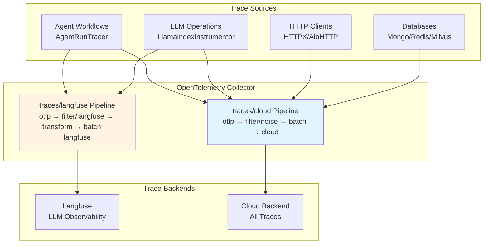
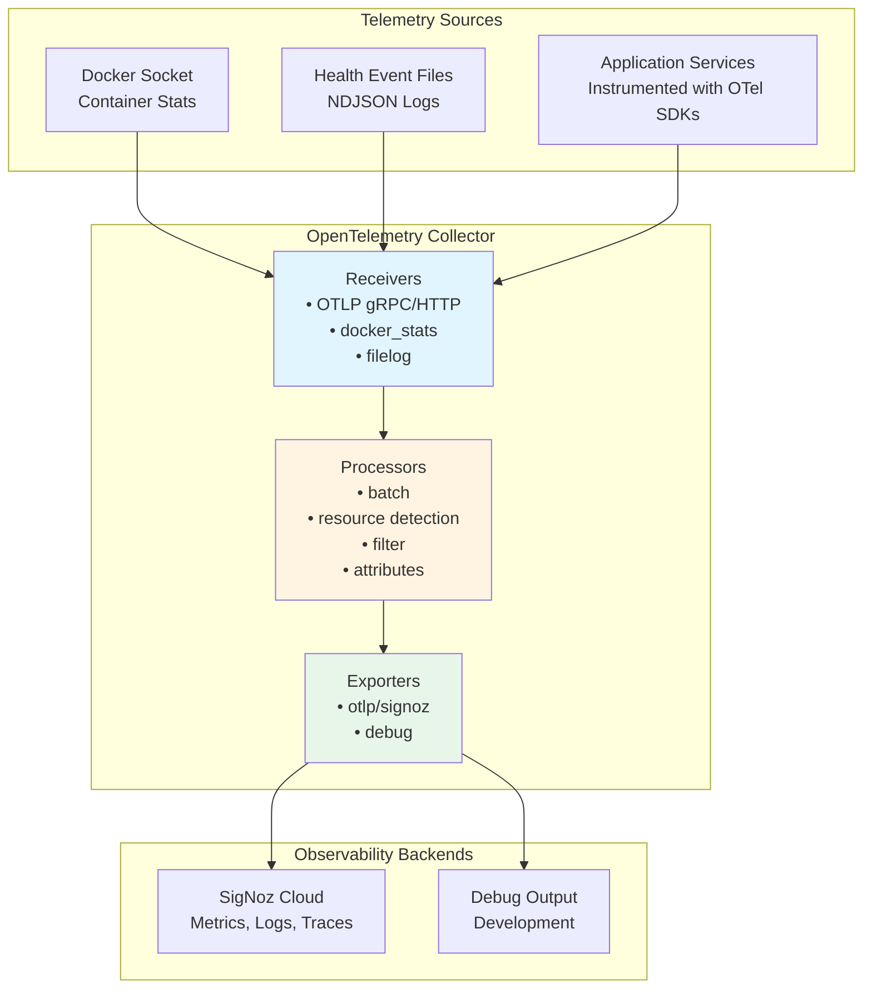

# Tiefe Observability mit OpenTelemetry :telescope: :100:

::: info **TL;DR – Was ist tiefe Observability?**
Der AI-Hub bietet **durchgängiges Distributed Tracing und tiefe Observability** unter Verwendung von
OpenTelemetry-Standards, was Ihnen vollständige Transparenz über jeden Aspekt Ihrer KI-Workflows verschafft. Von
einzelnen Agenten-Schritten bis hin zu komplexen Multi-Service-Prozessen können Sie jede Komponente Ihres KI-Ökosystems
mit Enterprise-grade Observability nachverfolgen, überwachen und optimieren, die sich nahtlos in Industriestandard-Tools
wie Langfuse, SigNoz oder DataDog integrieren lässt.
:::

## Was ist tiefe Observability und wie implementiert der AI-Hub sie? :brain:

**Tiefe Observability** geht weit über traditionelles Logging und Monitoring hinaus. Der AI-Hub implementiert eine
umfassende Observability-Strategie, die **Distributed Tracing**, **semantische Konventionen** und **KI-spezifische
Instrumentierung** kombiniert, um eine beispiellose Transparenz Ihrer KI-Systeme zu gewährleisten.

Die Plattform nutzt **OpenTelemetry** als grundlegendes Observability-Framework, erweitert um **OpenInference
semantische Konventionen** für KI/ML-Workloads. Dies bedeutet, dass jede Interaktion, von einer einfachen
Benutzeranfrage bis hin zu komplexen Multi-Agenten-Orchestrierungen, automatisch mit reichhaltigen Kontextinformationen
getraced wird, darunter:

- **Vollständige Anfrageflüsse**: Verfolgen Sie eine Benutzeranfrage, wie sie durch APIs, Agents, Datenbanken und
  externe Services fließt
- **KI-spezifische Semantik**: Erfassen Sie LLM-Aufrufe, Embeddings, Retrievals und Modellinteraktionen mit
  spezialisierten semantischen Attributen
- **Performance-Metriken**: Verfolgen Sie Latenz, Token-Nutzung, Kostenattribution und Ressourcenauslastung über alle
  Komponenten hinweg
- **Fehlerkontext**: Erhalten Sie detaillierte Fehlertraces mit vollständigem Kontext dessen, was zu Fehlern geführt hat
- **Service-Abhängigkeiten**: Automatisches Mapping, wie Ihre Services, Agents und Prozesse in Echtzeit interagieren

Das System instrumentiert automatisch **jede Komponente**, einschließlich NATS Messaging, Datenbankoperationen,
HTTP-Aufrufen, LLM-Interaktionen, Vektorsuchen und benutzerdefinierten Agenten-Workflows, ohne Codeänderungen zu
erfordern.

## Warum dies entscheidend für den Erfolg von Enterprise AI ist :trophy:

Tiefe Observability transformiert die Art und Weise, wie Sie KI-Systeme in Produktion aufbauen, debuggen und skalieren:

**🔍 Vollständige Systemtransparenz**: Sehen Sie genau, wie Ihre KI-Workflows in Produktion ausgeführt werden, von der
Benutzereingabe bis zur endgültigen Ausgabe, über alle Microservices und Agents hinweg. Keine blinden Flecken mehr in
komplexen verteilten KI-Systemen.

**🚀 Performance-Optimierung**: Identifizieren Sie Engpässe in Ihren KI-Pipelines präzise. Wissen Sie genau, welche
LLM-Aufrufe langsam sind, welche Retrievals ineffizient sind und wo Ihre Workflows hinsichtlich Geschwindigkeit und
Kosten optimiert werden können.

**🛡️ Proaktive Problemerkennung**: Erkennen Sie Probleme, bevor sie Benutzer beeinträchtigen. Fortgeschrittenes Tracing
deckt Muster auf, die zu Fehlern führen, sodass Sie Probleme proaktiv statt reaktiv beheben können.

**💰 Kostenattribution und -kontrolle**: Verfolgen Sie Token-Nutzung, API-Aufrufe und Compute-Kosten bis auf einzelne
Benutzer, Agents oder Workflows. Treffen Sie datengestützte Entscheidungen über Ressourcenzuweisung und
Kostenoptimierung.

**🌐 Herstellerunabhängige Flexibilität**: OpenTelemetry stellt sicher, dass Ihre Observability-Daten mit jedem
OTLP-kompatiblen Backend funktionieren. Beginnen Sie mit Langfuse für KI-spezifische Analysen und migrieren Sie dann zu
Enterprise-Tools wie DataDog oder New Relic, ohne Daten zu verlieren oder die Instrumentierung zu ändern.

::: details **Automatische Instrumentierungsabdeckung**
Der AI-Hub instrumentiert diese Komponenten automatisch ohne Codeänderungen:

### Kerninfrastruktur

- **NATS Messaging**: Vollständiges Message Flow Tracing über Microservices hinweg
- **Datenbankoperationen**: FeretDB, ValKey und Vektordatenbankabfragen
- **HTTP-Clients**: Alle externen API-Aufrufe und Webhooks
- **Hintergrundaufgaben**: Asynchrone Operationen und geplante Jobs

### KI-spezifische Komponenten

- **LLM-Interaktionen**: Token-Nutzung, Modellaufrufe und Antwortzeiten
- **Embeddings**: Vektorgenerierung und Ähnlichkeitssuchen
- **Retrieval**: RAG-Operationen und Wissensdatenbankabfragen
- **Agenten-Workflows**: Schritt-für-Schritt-Ausführungstraces mit semantischem Kontext
:::

## Erste Schritte

Um tiefe Observability in Ihrem AI-Hub-Deployment zu ermöglichen:

1. **Umgebungsvariablen konfigurieren**: Legen Sie die OTEL-Konfigurationsvariablen für Ihr Ziel-Observability-Backend
   fest
2. **Deployen mit aktiviertem Tracing**: Starten Sie Ihre AI-Hub-Services neu, um die automatische Instrumentierung zu
   aktivieren
3. **Auf Ihr Observability-Dashboard zugreifen**: Zeigen Sie Traces, Metriken und Analysen in Ihrer gewählten
   Observability-Plattform an

Das System erfordert keine Codeänderungen – die gesamte Instrumentierung erfolgt automatisch und folgt den
OpenTelemetry-Standards für maximale Kompatibilität und minimale Performance-Auswirkungen.

# Traces

## Übersicht

Traces verfolgen einzelne Anfragen durch die AI-Hub-Plattform und zeigen den vollständigen Pfad von Anfang bis Ende.
Jede Operation erhält automatisch einen eindeutigen Trace-Identifikator, der alle zusammenhängenden Aktivitäten über
Services hinweg verbindet und genau aufzeigt, was passiert ist, wo Zeit verbracht wurde und wie Komponenten
zusammengearbeitet haben.

Der Swiss AI-Hub verwendet OpenTelemetry für das Tracing mit spezialisierter Unterstützung für KI-Operationen durch
OpenInference semantische Konventionen.

______________________________________________________________________

## Was wir erfassen

### Agenten-Workflow-Ausführung (Operativ)

Agenten-Läufe werden mit hierarchischen Span-Strukturen getraced, die den vollständigen Workflow zeigen:

**Agent-Spans**: Root-Span, der den Beginn einer Agenten-Ausführung mit Benutzereingabe und Agenten-Identifikation
markiert.

**Chain-Spans**: Langlaufender Span, der die gesamte Laufzeit vom Start bis zur endgültigen Ausgabe erfasst.

**Step-Spans**: Einzelne Workflow-Schritte, die Eingaben, Ausgaben, Verarbeitungszeit und semantische Ereignisse zeigen.

**Trace-Attribute**:

- Session-/Thread-Identifikatoren für den Konversationskontext
- Eingabe- und Ausgabewerte im JSON-Format
- OpenInference Span-Typen (AGENT, CHAIN, TOOL, LLM, RETRIEVER)
- Tags zum Filtern (thread_id, display_id, run_id)

**Implementierung**: Der `AgentRunTracer` verwendet einen Zwei-Span-Ansatz mit einem initialen AGENT-Span als Parent und
einem finalen CHAIN-Span, der die Gesamtdauer erfasst.

### KI-Modell-Operationen (Operativ)

LLM-Operationen werden automatisch durch LlamaIndex-Instrumentierung getraced:

**LLM-Invokationen**: Modellselektion, Prompt-Konstruktion, Token-Nutzung und Antwortgenerierung.

**Retrieval-Operationen**: Vektordatenbankabfragen, Dokumenten-Retrieval und Kontextzusammenstellung.

**Embeddings**: Text-Embedding-Generierung für Dokumentenindizierung und Ähnlichkeitssuche.

**Semantische Ereignisse**: KI-spezifische Operationen emittieren semantische Ereignisse, die detaillierte Metadaten
(Token-Anzahl, Modellnamen, abgerufene Dokumente) enthalten und Traces mit domänenspezifischen Informationen anreichern.

**Sichtbarkeit**: Alle KI-Operationen erscheinen in der Langfuse Tracing-UI mit spezialisierten Ansichten für die
LLM-Performance-Analyse.

### HTTP- und Datenbankoperationen (Operativ)

Instrumentierte Bibliotheken erstellen automatisch Spans für externe Service-Aufrufe:

**HTTP-Clients**: HTTPX- und aiohttp-Anfragen mit Methode, URL, Statuscode und Timing.

**Datenbanken**: FerretDB-, PostgreSQL- und ValKey-Operationen mit Abfrageinformationen.

**Vektordatenbank**: Milvus-Ähnlichkeitssuchen und Indizierungsoperationen.

**Filterung**: Health Checks, Metrik-Endpoints und hochvolumige Datenbankabfragen werden aus Traces gefiltert, um
Rauschen zu reduzieren.

______________________________________________________________________

## Architektur der Trace-Sammlung

### Sammlungspipelines

Der OpenTelemetry Collector verarbeitet Traces über zwei spezialisierte Pipelines:

**traces/cloud**: Sendet alle Traces an das Cloud-Backend

- Receiver: `otlp` (gRPC Port 4317, HTTP Port 4318)
- Processors: `filter/noise` (entfernt Health Checks, Metrik-Endpoints, routinemäßige DB-Abfragen), `batch`
- Exporter: `otlp/cloud`

**traces/langfuse**: Sendet KI-spezifische Traces an Langfuse

- Receiver: `otlp` (gRPC Port 4317, HTTP Port 4318)
- Processors: `filter/langfuse` (behält nur OpenInference-Spans), `transform/langfuse` (fügt Projektmetadaten hinzu),
  `batch`
- Exporter: `otlphttp/langfuse` (Langfuse OTEL Ingestion-Endpoint, authentifiziert mit `LANGFUSE_PUBLIC_KEY` /
  `LANGFUSE_SECRET_KEY`)

### Instrumentierung

Services emittieren Traces automatisch über die von `AihubInstrumentor` konfigurierte OpenTelemetry-Instrumentierung:

**Automatische Instrumentierung** (via `AihubInstrumentor`):

- `AsyncioInstrumentor`: Asynchrone Operationen und Task-Ausführung
- `HTTPXClientInstrumentor` / `AioHttpClientInstrumentor`: HTTP-Anfragen
- `PymongoInstrumentor` / `RedisInstrumentor` / `MilvusInstrumentor`: Datenbankoperationen
- `LlamaIndexInstrumentor`: LLM- und RAG-Operationen mit OpenInference-Konventionen

**Benutzerdefiniertes Tracing** (via `AgentRunTracer`):

- Agenten-Workflow-Ausführung mit Schritt-Ebenen-Detail
- Hierarchische Span-Strukturen für komplexe Workflows
- Kontextpropagation über verteilte Agenten-Operationen hinweg

**Smart Tracing**: Der `SmartTracer` respektiert den `suppress_instrumentation`-Kontext und ermöglicht eine selektive
Tracing-Kontrolle.

______________________________________________________________________

## Geschäftliche Vorteile

### Performance-Optimierung

Traces zeigen genau auf, wo in jeder Operation Zeit verbracht wird. Die Engpasserkennung wird präzise statt spekulativ.
Wenn das Dokumenten-Retrieval drei Sekunden dauert, während die KI-Verarbeitung 500ms benötigt, werden
Optimierungsprioritäten klar.

### Kostenmanagement

KI-Operationen umfassen Token-Nutzung und Kostenattribution durch semantische Ereignisse. Die Verfolgung, welche
Operationen, Benutzer oder Abteilungen die meisten KI-Ressourcen verbrauchen, ermöglicht datengestützte Entscheidungen
über Modellwahl und Feature-Preise.

### Root-Cause-Analyse

Fehlgeschlagene Operationen bewahren den vollständigen Kontext und zeigen genau, wo und warum Fehler aufgetreten sind.
Fehlertraces umfassen Stack-Traces, Eingabedaten und die Abfolge der Ereignisse, die zum Fehler führten, wodurch die
Problembehebungszeit drastisch reduziert wird.

### KI-Transparenz

Traces zeigen, welche Informationen die KI bei der Generierung von Antworten berücksichtigt hat. Abgerufene Dokumente,
Token-Nutzung und Modellauswahl werden sichtbar, was die Einhaltung gesetzlicher Vorschriften unterstützt und das
Benutzervertrauen stärkt.

______________________________________________________________________

## Zugriff auf Trace-Informationen

### Langfuse UI

Langfuse bietet spezialisierte LLM-Observability unter `http://localhost:6006` (Dev) oder `https://langfuse.<domain>`
(Produktion):

**Funktionen**:

- Timeline-Ansichten, die Span-Dauer und -Beziehungen zeigen
- Token-Nutzung und Kostenverfolgung pro Trace, Benutzer und Agent
- Prüfung abgerufener Dokumente für RAG-Systeme
- Trace-Filterung nach Session, Tags oder Zeitbereich
- Performance-Analyse und Latenzverteilungen
- Dataset-Management und Experimentbewertung
- Azure AD SSO-Integration für Produktionszugriffskontrolle

**Fokus**: KI-spezifische Operationen mit OpenInference semantischen Konventionen (LLM-, CHAIN-, AGENT-, RETRIEVER-,
EMBEDDING-Spans).

### Cloud-Backend (Produktion)

Traces werden zur Langzeitspeicherung und -analyse an Cloud-Observability-Plattformen exportiert. Die Plattform
unterstützt jedes OTLP-kompatible Backend ausschließlich durch Konfigurationsänderungen.

______________________________________________________________________

## Sicherheit und Datenschutz

### Trace-Inhalt

Traces erfassen Operationsmetadaten, Timing-Informationen und Routing-Details. Entwickler sind dafür verantwortlich,
dass sensible Daten nicht in Trace-Attributen enthalten sind.

**Infrastruktur**: OpenInference-Spans enthalten Session-IDs, Modellnamen, Token-Anzahlen und Metadaten abgerufener
Dokumente.

**Anwendungsverantwortung**: Entwickler müssen vermeiden, tatsächliche Dokumentinhalte, Benutzernachrichten oder andere
sensible Informationen in benutzerdefinierten Trace-Attributen zu protokollieren.

### Übertragungssicherheit

Alle Traces werden über verschlüsselte Kanäle (TLS/HTTPS) übertragen, um Abfangen zu verhindern.

### Zugriffskontrolle

Collector-Konfiguration und Zugriff sind auf Infrastruktur-Administratoren beschränkt. Anwendungs-Services emittieren
Telemetrie über definierte Schnittstellen ohne Collector-Zugriff.

______________________________________________________________________

## Integration mit Plattformkomponenten

### Agenten-Workflows

Der `AgentRunTracer` erstellt eine strukturierte Tracing-Hierarchie für Agenten-Ausführungen:

1. Initialer AGENT-Span markiert den Workflow-Start
2. Individuelle STEP-Spans zeigen jeden Workflow-Schritt mit Eingaben und Ausgaben
3. Finaler CHAIN-Span erfasst die vollständige Laufzeit
4. Semantische Ereignisse aus KI-Operationen reichern Traces mit domänenspezifischen Metadaten an

### LLM-Operationen

LlamaIndex-Instrumentierung tracet automatisch:

- Sprachmodell-Invokationen mit Token-Anzahlen
- RAG-Operationen, die Dokumenten-Retrieval und Kontextzusammenstellung zeigen
- Vektordatenbank-Suchen und Ähnlichkeitsoperationen
- Embedding-Generierung für die Dokumentenverarbeitung

### HTTP-Services

FastAPI-Services tracen eingehende Anfragen automatisch, wenn sie instrumentiert sind. Entwickler können Spans
benutzerdefinierte Attribute für anwendungsspezifischen Kontext hinzufügen.

______________________________________________________________________

## Plattformflexibilität

Während Langfuse LLM-spezifische Observability bietet, unterstützt die OpenTelemetry-Grundlage jedes OTLP-kompatible
Backend:

**Unterstützte Plattformen**:

- **Langfuse**: Open-Source LLM-Observability mit Kostenverfolgung und -bewertung (aktuelle Standardeinstellung)
- **SigNoz**: Open-Source Observability-Plattform
- **Jaeger**: Distributed Tracing fokussiert auf Microservices
- **Tempo** (Grafana): Cloud-native Distributed Tracing
- **Datadog APM**: Kommerzielles APM mit umfassendem Tracing
- **New Relic**: Application Performance Monitoring mit KI-Einblicken

Das Wechseln von Backends erfordert nur Änderungen an der Collector-Konfiguration. Es sind keine
Anwendungs-Code-Modifikationen erforderlich.

______________________________________________________________________

## Zukünftige Entwicklung

### Geplante Verbesserungen

**Tail Sampling**: Intelligentes Sampling, das Fehlertraces und interessante Operationen beibehält, während die
Speicherkosten reduziert werden.

**Benutzerdefinierte Geschäftsereignisse**: Höherwertige Traces für Geschäftsoperationen über technische
Implementierungsdetails hinaus.

**Kostenprognose**: Kostenabschätzungen vor der Ausführung basierend auf historischen Trace-Daten und
Abfragekomplexität.

**Performance-Budgets**: Automatische Warnungen, wenn Operationen die erwartete Dauer basierend auf historischen Mustern
überschreiten.

______________________________________________________________________

## Zusammenfassung

Das Distributed Tracing der Plattform liefert:

✅ **Operatives Agenten-Tracing**: Vollständige Workflow-Ausführung mit Schritt-Ebenen-Detail durch AgentRunTracer

✅ **Sichtbarkeit von KI-Operationen**: LLM- und RAG-Operationen, die mit OpenInference semantischen Konventionen
getraced werden

✅ **Automatische Instrumentierung**: HTTP-, Datenbank- und asynchrone Operationen ohne manuellen Code getraced

✅ **Dual-Backend-Unterstützung**: Langfuse für LLM-spezifische Observability, Cloud-Backend für
Full-Stack-Produktions-Traces

✅ **Standardbasiert**: OpenTelemetry gewährleistet Herstellerflexibilität durch OTLP-Protokoll

✅ **Performance-Analyse**: Detaillierte Timing-Informationen ermöglichen eine präzise Engpasserkennung

✅ **Datenschutzgrundlage**: Infrastruktur erfasst Metadaten; Entwickler sind für den Datenschutz verantwortlich

Mit der Erweiterung der Tracing-Abdeckung erhalten Organisationen zunehmend detailliertere Einblicke in
Plattform-Performance, KI-Operationen und Benutzererfahrung.

# OpenTelemetry-Grundlagen

## Übersicht

**OpenTelemetry (OTel)** ist die technische Grundlage für die gesamte Observability im Swiss AI-Hub. Es bietet ein
herstellerneutrales, industriestandardisiertes Framework für die Sammlung, Verarbeitung und den Export von
Telemetriedaten über Metriken, Logs und Traces.

Im Gegensatz zu proprietären Monitoring-Lösungen, die Sie an bestimmte Anbieter binden, stellt OpenTelemetry sicher,
dass die Plattform in jedes kompatible Observability-Backend integriert werden kann. Diese architektonische Entscheidung
bietet Organisationen maximale Flexibilität bei der Wahl der Monitoring-Tools basierend auf ihrer Infrastruktur,
Compliance-Anforderungen und operationalen Präferenzen.

______________________________________________________________________

## Warum OpenTelemetry?

OpenTelemetry ermöglicht es uns, Services einmal zu instrumentieren und die Tool-Wahl flexibel zu halten. Es
standardisiert Metriken, Logs und Traces, sodass Signale standardmäßig korrelieren und austauschbare Backends eine
Konfigurationsänderung bleiben, keine Neuentwicklung.

**Vorteile**

- **Herstellerneutral per Design:** Verwenden Sie jedes OTLP-kompatible Backend (z.B. SigNoz, Datadog, Grafana,
  Prometheus, New Relic) ohne Neu-Instrumentierung.
- **Vereinheitlichte Signale:** Konsistente Modelle und gemeinsam genutzter Kontext (Trace-/Span-IDs,
  Ressourcenattribute) verknüpfen Metriken, Logs und Traces für eine schnellere Fehlerbehebung.
- **Bewährter Standard:** Ein CNCF-Projekt mit breiter Branchenunterstützung und aktiver Entwicklung, das das
  Technologierisiko reduziert.
- **Zukunftsfähig:** Entwickeln Sie Plattformen und Richtlinien über den OTel Collector und die Konfiguration, nicht
  über Anwendungscode.

______________________________________________________________________

## OpenTelemetry Collector

Der **OpenTelemetry Collector** ist die zentrale Telemetrie-Verarbeitungszentrale für den Swiss AI-Hub.

### Architektur

### Komponenten

**Receivers**: Sammeln Telemetrie von verschiedenen Quellen.

**Processors**: Transformieren, anreichern, filtern und batchen Telemetrie vor dem Export.

**Exporters**: Senden verarbeitete Telemetrie an Observability-Backends.

**Extensions**: Bieten Zusatzfunktionen wie Health Checks und Profiling.

______________________________________________________________________

## Receivers

Receivers sind Aufnahmepunkte. Sie ziehen Telemetrie von Apps und Infrastruktur in die Plattform.

- **OTLP Receiver:** Standard-Einstiegspunkt für App-Telemetrie. Services senden Metriken, Logs und Traces unter
  Verwendung des OpenTelemetry-Protokolls. Konzept: ein Drahtformat für alles.
- **Container Metrics Receiver:** Sammelt Ressourcennutzung von laufenden Containern. Konzept: Überwachung der
  Laufzeit-Gesundheit ohne Änderungen am App-Code.
- **File Log Receivers:** Erfassen strukturierte Ereignis-Logs wie Container- und synthetische Health Checks. Konzept:
  Erfassen operationaler Signale, selbst wenn Apps keine nativen Endpunkte besitzen.

Ergebnis: Breite Abdeckung mit minimaler Kopplung an ein einzelnes Tool oder eine Laufzeitumgebung.

______________________________________________________________________

## Processors

Processors formen Telemetrie in Bewegung. Sie fügen Kontext hinzu, reduzieren Rauschen und bereiten Daten für die
Analyse vor.

- **Batching:** Gruppiert Daten für effizienten Transport. Konzept: geringerer Overhead ohne Verlust an Genauigkeit.
- **Ressourcenerkennung:** Automatische Anreicherung mit Umgebungsdetails wie Host, Container oder Systeminformationen.
  Konzept: Anbindung von Wer/Wo an jedes Signal.
- **Attributbearbeitung:** Normalisiert Tags wie Umgebung oder Quelle. Konzept: konsistente Labels für zuverlässiges
  Filtern und Dashboards.
- **Ressourcen-Mapping:** Übersetzt Container-Fakten in Service-Identitäten (z.B. Service-Name, Version). Konzept:
  Abgleich der Infrastrukturrealität mit Service-Ansichten.
- **Filterung:** Entfernt geringwertiges Rauschen wie routinemäßige Health Checks. Konzept: Verbesserung des
  Signal-Rausch-Verhältnisses und Kostenkontrolle.

Ergebnis: Saubere, kontextuelle und analysebereite Telemetrie.

______________________________________________________________________

## Exporters

Exporters liefern Telemetrie an Ziele.

- **Primärer Backend-Exporter:** Sendet Daten an die gewählte OTLP-kompatible Plattform. Konzept: Wählen oder ändern Sie
  Ihr Analysetool ohne Neu-Instrumentierung.
- **Debug-Exporter:** Druckt oder zeigt Daten zur Validierung an. Konzept: Pipelines lokal verifizieren, bevor sie
  skaliert werden.

Ergebnis: Plug-in-fähige Ausgaben mit sicheren Entwicklungs-Workflows.

______________________________________________________________________

## Telemetrie-Pipelines

Pipelines sind End-to-End-Flüsse pro Signaltyp. Jede definiert, welche Receivers, Processors und Exporters zu verwenden
sind.

- **Metrik-Pipelines:** Optimieren für Durchsatz und Trendanalyse. Anreichern mit Service-Kontext.
- **Log-Pipelines:** Struktur und Reihenfolge bewahren. Attribute für Abfragen und Korrelation extrahieren.
- **Trace-Pipelines:** Parent-Child-Beziehungen intakt halten. Sorgfältig batchen, um die Trace-Integrität zu erhalten.

Konzept: zweckgebundene Spuren, die Signale über den Stack hinweg konsistent und verknüpfbar halten.

______________________________________________________________________

## Extensions

Extensions fügen dem Collector selbst operative Fähigkeiten hinzu.

- **Health Checks:** Exponieren des Collector-Status für Monitoring. Konzept: Observability als First-Class-Service
  behandeln.
- **Profiling (pprof):** Inspektion der Performance unter Last. Konzept: Diagnose von Pipeline-Engpässen.
- **Diagnostik (zPages):** Anzeige interner Metriken und Zustände. Konzept: schnellere Fehlerbehebung ohne externe
  Tools.

Ergebnis: Eine verwaltbare, inspizierbare Observability-Steuerungsebene.

______________________________________________________________________

## Integration mit Plattform-Services

### Anwendungs-Instrumentierung

Mit OpenTelemetry SDKs instrumentierte Services emittieren Telemetrie automatisch:

**Python-Services** (API, Agents, Pipelines):

- `opentelemetry-instrumentation-*`-Bibliotheken für automatische Framework-Instrumentierung
- Benutzerdefinierte Instrumentierung für Geschäftslogik
- OpenInference für AI/ML semantische Konventionen

**Instrumentierte Komponenten**:

- FastAPI HTTP-Anfragen und -Antworten
- Datenbankoperationen (MongoDB, PostgreSQL, Redis, Milvus)
- HTTP-Client-Anfragen (httpx, aiohttp, requests)
- LlamaIndex LLM-Operationen
- Python Logging-Framework

### Infrastruktur-Integration

Nicht instrumentierte Services stellen Telemetrie über Infrastruktur-Monitoring bereit:

**Container-Metriken**: Docker Stats Receiver sammelt Ressourcenmetriken für alle Container, unabhängig von der
Instrumentierung.

**Health Monitoring**: File Log Receivers erfassen den Gesundheitsstatus sowohl von Docker-Events als auch von
synthetischen Checks.

**Netzwerk-Observability**: Traefik Proxy-Logs und -Metriken bieten Sichtbarkeit des Anfrage-Routings.

______________________________________________________________________

## Multi-Plattform-Unterstützung

### Herstellerflexibilität

Die OpenTelemetry-Grundlage unterstützt den gleichzeitigen Export an mehrere Plattformen:

**Unterstützte Plattformen**:

- **SigNoz**: Open-Source, OpenTelemetry-native Plattform (aktuell primär)
- **Datadog**: Kommerzielles APM mit umfassenden Funktionen
- **Grafana Cloud**: Managed Prometheus, Loki und Tempo
- **New Relic**: Application Performance Monitoring mit KI-Einblicken
- **Prometheus**: Open-Source Zeitreihen-Datenbank
- **Elasticsearch/ELK**: Log-Analyse- und Suchplattform
- **Splunk**: Enterprise SIEM- und Observability-Plattform

### Hinzufügen von Exportzielen

Neue Observability-Plattformen erfordern nur Collector-Konfigurationsänderungen:

1. Exporter in Collector-Konfiguration definieren
2. Exporter zu relevanten Pipelines hinzufügen
3. Authentifizierung über Umgebungsvariablen konfigurieren

Keine Anwendungs-Code-Änderungen erforderlich.

## Sicherheit

### Sichere Übertragung

Alle Telemetrie-Exporte verwenden TLS-Verschlüsselung, um Abfangen oder Manipulation zu verhindern.

### Zugriffskontrolle

Collector-Konfiguration und Zugriff sind auf Infrastruktur-Administratoren beschränkt. Anwendungs-Services emittieren
Telemetrie über definierte Schnittstellen ohne Collector-Zugriff.

### Geheimnisverwaltung

Authentifizierungsschlüssel werden über Umgebungsvariablen verwaltet, getrennt von Konfigurationsdateien, was eine
sichere Rotation von Geheimnissen ermöglicht.
