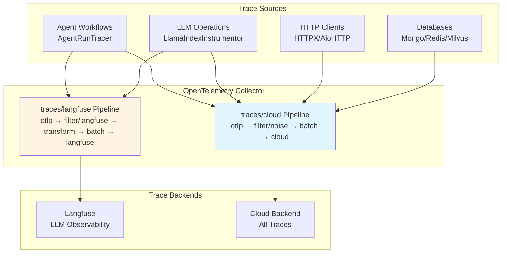
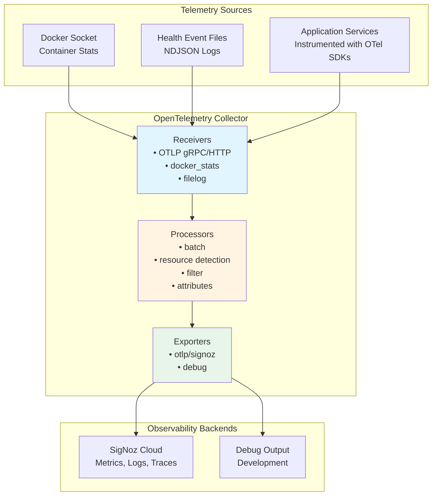

# Tiefe Observability mit OpenTelemetry :telescope: :100:

::: info **TL;DR - Was ist Tiefe Observability?**
Der AI-Hub bietet **End-to-End Distributed Tracing und tiefe Observability** unter Verwendung von
OpenTelemetry-Standards, wodurch Sie vollständige Transparenz über jeden Aspekt Ihrer KI-Workflows erhalten. Von
einzelnen Agent-Schritten bis hin zu komplexen Multi-Service-Prozessen können Sie jede Komponente Ihres KI-Ökosystems
mit unternehmenstauglicher Observability verfolgen, überwachen und optimieren, die sich nahtlos in
Industriestandard-Tools wie Langfuse, SigNoz oder DataDog integrieren lässt.
:::

## Was ist Tiefe Observability und wie implementiert sie der AI-Hub? :brain:

**Tiefe Observability** geht weit über traditionelles Logging und Monitoring hinaus. Der AI-Hub implementiert eine
umfassende Observability-Strategie, die **Distributed Tracing**, **Semantische Konventionen** und **KI-spezifische
Instrumentierung** kombiniert, um eine beispiellose Transparenz Ihrer KI-Systeme zu gewährleisten.

Die Plattform verwendet **OpenTelemetry** als ihr grundlegendes Observability-Framework, ergänzt durch **OpenInference
Semantische Konventionen** für AI/ML-Workloads. Das bedeutet, jede Interaktion, von einer einfachen Benutzernachricht
bis hin zu komplexen Multi-Agent-Orchestrierungen, wird automatisch mit reichhaltigen Kontextinformationen getraced,
einschließlich:

- **Vollständige Request Flows**: Verfolgen Sie eine Benutzeranfrage, wie sie durch APIs, Agents, Datenbanken und
  externe Services fließt
- **KI-spezifische Semantik**: Erfassen Sie LLM-Aufrufe, Embeddings, Retrievals und Modellinteraktionen mit
  spezialisierten semantischen Attributen
- **Performance-Metriken**: Verfolgen Sie Latenz, Token-Nutzung, Kostenattributierung und Ressourcenauslastung über alle
  Komponenten hinweg
- **Fehlerkontext**: Erhalten Sie detaillierte Fehlertraces mit vollständigem Kontext dessen, was zu Fehlern geführt hat
- **Service-Abhängigkeiten**: Automatische Kartierung, wie Ihre Services, Agents und Prozesse in Echtzeit interagieren

Das System instrumentiert automatisch **jede Komponente**, einschließlich NATS-Messaging, Datenbank-Operationen,
HTTP-Aufrufen, LLM-Interaktionen, Vektor-Suchen und benutzerdefinierten Agent-Workflows, ohne dass Codeänderungen
erforderlich sind.

## Warum dies für den Erfolg von Enterprise AI entscheidend ist :trophy:

Tiefe Observability transformiert die Art und Weise, wie Sie KI-Systeme in Produktion aufbauen, debuggen und skalieren:

**🔍 Vollständige Systemtransparenz**: Sehen Sie genau, wie Ihre KI-Workflows in Produktion ausgeführt werden, vom
Benutzereingang bis zur finalen Ausgabe, über alle Microservices und Agents hinweg. Keine blinden Flecken mehr in
komplexen verteilten KI-Systemen.

**🚀 Performance-Optimierung**: Identifizieren Sie Engpässe in Ihren KI-Pipelines mit Präzision. Wissen Sie genau, welche
LLM-Aufrufe langsam sind, welche Retrievals ineffizient sind und wo Ihre Workflows für Geschwindigkeit und Kosten
optimiert werden können.

**🛡️ Proaktive Problemerkennung**: Erkennen Sie Probleme, bevor sie Benutzer beeinträchtigen. Fortschrittliches Tracing
zeigt Muster auf, die zu Fehlern führen, sodass Sie Probleme proaktiv statt reaktiv beheben können.

**💰 Kostenattribution und -kontrolle**: Verfolgen Sie Token-Nutzung, API-Aufrufe und Compute-Kosten bis hin zu einzelnen
Benutzern, Agents oder Workflows. Treffen Sie datengestützte Entscheidungen über Ressourcenzuweisung und
Kostenoptimierung.

**🌐 Herstellerunabhängige Flexibilität**: OpenTelemetry stellt sicher, dass Ihre Observability-Daten mit jedem
OTLP-kompatiblen Backend funktionieren. Beginnen Sie mit Langfuse für KI-spezifische Analysen und migrieren Sie dann zu
Unternehmenstools wie DataDog oder New Relic, ohne Daten zu verlieren oder die Instrumentierung zu ändern.

::: details **Abdeckung der automatischen Instrumentierung**
Der AI-Hub instrumentiert diese Komponenten automatisch ohne Codeänderungen:

### Kerninfrastruktur

- **NATS Messaging**: Vollständiges Nachrichtenfluss-Tracing über Microservices hinweg
- **Datenbank-Operationen**: FeretDB, ValKey und Vektordatenbank-Abfragen
- **HTTP Clients**: Alle externen API-Aufrufe und Webhooks
- **Hintergrundaufgaben**: Asynchrone Operationen und geplante Jobs

### KI-spezifische Komponenten

- **LLM-Interaktionen**: Token-Nutzung, Modellaufrufe und Antwortzeiten
- **Embeddings**: Vektorgenerierung und Ähnlichkeitssuchen
- **Retrieval**: RAG-Operationen und Wissensdatenbank-Abfragen
- **Agent Workflows**: Schritt-für-Schritt-Ausführungstraces mit semantischem Kontext
:::

## Erste Schritte

Um tiefe Observability in Ihrem AI-Hub Deployment zu aktivieren:

1. **Umgebungsvariablen konfigurieren**: Legen Sie die OTEL-Konfigurationsvariablen für Ihr Ziel-Observability-Backend
   fest
2. **Mit aktiviertem Tracing deployen**: Starten Sie Ihre AI-Hub-Services neu, um die automatische Instrumentierung zu
   aktivieren
3. **Auf Ihr Observability Dashboard zugreifen**: Zeigen Sie Traces, Metriken und Analysen in Ihrer gewählten
   Observability-Plattform an

Das System erfordert keine Codeänderungen – die gesamte Instrumentierung erfolgt automatisch und folgt den
OpenTelemetry-Standards für maximale Kompatibilität und minimale Performance-Auswirkungen.

# Traces

## Überblick

Traces verfolgen einzelne Anfragen durch die AI-Hub Plattform und zeigen den vollständigen Pfad von Anfang bis Ende.
Jede Operation erhält automatisch einen eindeutigen Trace-Identifikator, der alle zugehörigen Aktivitäten über Services
hinweg verbindet und genau aufzeigt, was passiert ist, wo Zeit verbracht wurde und wie Komponenten zusammenarbeiteten.

Der Swiss AI-Hub verwendet OpenTelemetry für das Tracing mit spezialisierter Unterstützung für KI-Operationen durch
OpenInference Semantische Konventionen.

______________________________________________________________________

## Was wir erfassen

### Agent Workflow-Ausführung (Operativ)

Agent-Läufe werden mit hierarchischen Span-Strukturen getraced, die den vollständigen Workflow zeigen:

**Agent Spans**: Root-Span, der den Beginn einer Agent-Ausführung mit Benutzereingabe und Agent-Identifikation markiert.

**Chain Spans**: Langlaufender Span, der die gesamte Laufzeit vom Start bis zur finalen Ausgabe erfasst.

**Step Spans**: Individuelle Workflow-Schritte, die Eingaben, Ausgaben, Verarbeitungszeit und semantische Events zeigen.

**Trace-Attribute**:

- Session-/Thread-Identifikatoren für den Konversationskontext
- Eingabe- und Ausgabewerte im JSON-Format
- OpenInference Span-Typen (AGENT, CHAIN, TOOL, LLM, RETRIEVER)
- Tags zum Filtern (thread_id, display_id, run_id)

**Implementierung**: Der `AgentRunTracer` erstellt für jeden Workflow-Schritt einen CHAIN Span, der Eingaben, Ausgaben,
Verarbeitungszeit und semantische Events erfasst. Langfuse Trace-Level-Attribute (Name, Session, Benutzer,
Eingabe/Ausgabe) werden über Span-Attribute gesetzt, sodass Langfuse alle Step Spans zu einem einzigen Trace pro Lauf
gruppiert.

**Agent-in-the-Loop (AITL) Delegation**: Wenn Agent A über AITL an Agent B delegiert, erstellt der Tracer einen
langlebigen AGENT Wrapper-Span unter dem Schritt von Agent A. Der Kontext des Wrapper-Spans wird über Redis (unter
Verwendung von W3C TraceContext) propagiert, sodass die Step Spans von Agent B darunter neu eingeordnet werden. Agent B
unterdrückt `langfuse.trace.*`-Attribute, um ein Überschreiben der Trace-Level-Anzeige von Agent A zu vermeiden. Dies
erzeugt eine verschachtelte Hierarchie in Langfuse, bei der die Schritte des delegierten Agents unter dem Trace des
delegierenden Agents erscheinen.

### KI-Modell-Operationen (Operativ)

LLM-Operationen werden automatisch durch die LlamaIndex-Instrumentierung getraced:

**LLM-Aufrufe**: Modellauswahl, Prompt-Konstruktion, Token-Nutzung und Antwortgenerierung.

**Retrieval-Operationen**: Vektordatenbank-Abfragen, Dokumentenabruf und Kontextzusammenstellung.

**Embeddings**: Text-Embedding-Generierung für Dokumentenindizierung und Ähnlichkeitssuche.

**Semantische Events**: KI-spezifische Operationen emittieren semantische Events mit detaillierten Metadaten
(Token-Zählungen, Modellnamen, abgerufene Dokumente), die Traces mit domänenspezifischen Informationen anreichern.

**Sichtbarkeit**: Alle KI-Operationen erscheinen in der Langfuse Tracing UI mit spezialisierten Ansichten für die
LLM-Performance-Analyse.

### HTTP- und Datenbank-Operationen (Operativ)

Instrumentierte Bibliotheken erstellen automatisch Spans für externe Service-Aufrufe:

**HTTP Clients**: HTTPX- und aiohttp-Anfragen mit Methode, URL, Statuscode und Timing.

**Datenbanken**: FerretDB-, PostgreSQL- und ValKey-Operationen mit Abfrageinformationen.

**Vektordatenbank**: Milvus-Ähnlichkeitssuchen und Indexierungsoperationen.

**Filterung**: Health Checks, Metrik-Endpoints und hochvolumige Datenbankabfragen werden aus Traces gefiltert, um
Rauschen zu reduzieren.

______________________________________________________________________

## Architektur der Trace-Erfassung



### Erfassungspipelines

Der OpenTelemetry Collector verarbeitet Traces durch zwei spezialisierte Pipelines:

**traces/cloud**: Sendet alle Traces an das Cloud-Backend

- Receiver: `otlp` (gRPC Port 4317, HTTP Port 4318)
- Processors: `filter/noise` (entfernt Health Checks, Metrik-Endpoints, routinemäßige DB-Abfragen), `batch`
- Exporter: `otlp/cloud`

**traces/langfuse**: Sendet KI-spezifische Traces an Langfuse

- Receiver: `otlp` (gRPC Port 4317, HTTP Port 4318)
- Processors: `filter/langfuse` (behält nur OpenInference Spans bei), `transform/langfuse` (fügt Projekt-Metadaten
  hinzu), `batch`
- Exporter: `otlphttp/langfuse` (Langfuse OTEL Ingestion Endpoint, authentifiziert mit `LANGFUSE_PUBLIC_KEY` /
  `LANGFUSE_SECRET_KEY`)

### Instrumentierung

Services emittieren automatisch Traces durch die von `AihubInstrumentor` konfigurierte OpenTelemetry-Instrumentierung:

**Automatische Instrumentierung** (via `AihubInstrumentor`):

- `AsyncioInstrumentor`: Asynchrone Operationen und Task-Ausführung
- `HTTPXClientInstrumentor` / `AioHttpClientInstrumentor`: HTTP-Anfragen
- `PymongoInstrumentor` / `RedisInstrumentor` / `MilvusInstrumentor`: Datenbank-Operationen
- `LlamaIndexInstrumentor`: LLM- und RAG-Operationen mit OpenInference Konventionen

**Benutzerdefiniertes Tracing** (via `AgentRunTracer`):

- Agent Workflow-Ausführung mit pro-Schritt CHAIN Spans
- AITL-Delegations-Tracing mit AGENT Wrapper-Spans und Redis-basierter W3C-Kontext-Propagation
- Langfuse Trace-Anreicherung (Name, Session, Benutzer, Eingabe/Ausgabe, Token-Nutzung, Modell)

**Smart Tracing**: Der `SmartTracer` respektiert den `suppress_instrumentation`-Kontext, was eine selektive
Trace-Kontrolle ermöglicht.

______________________________________________________________________

## Geschäftlicher Nutzen

### Performance-Optimierung

Traces zeigen genau, wo in jeder Operation Zeit verbracht wird. Die Engpassidentifikation wird präzise statt spekulativ.
Wenn der Dokumentenabruf drei Sekunden dauert, während die KI-Verarbeitung 500 ms benötigt, werden die
Optimierungsprioritäten klar.

### Kostenmanagement

KI-Operationen umfassen Token-Nutzung und Kostenattribution durch semantische Events. Die Verfolgung, welche
Operationen, Benutzer oder Abteilungen die meisten KI-Ressourcen verbrauchen, ermöglicht datengestützte Entscheidungen
über Modellauswahl und Feature-Preise.

### Ursachenanalyse

Fehlgeschlagene Operationen bewahren den vollständigen Kontext und zeigen genau, wo und warum Fehler auftraten.
Fehlertraces umfassen Stack-Traces, Eingabedaten und die Abfolge der Ereignisse, die zum Fehler führten, was die
Problembehebungszeit drastisch reduziert.

### KI-Transparenz

Traces zeigen, welche Informationen die KI bei der Generierung von Antworten berücksichtigte. Abgerufene Dokumente,
Token-Nutzung und Modellauswahl werden sichtbar, was die Einhaltung gesetzlicher Vorschriften unterstützt und das
Vertrauen der Benutzer aufbaut.

______________________________________________________________________

## Zugriff auf Trace-Informationen

### Langfuse UI

Langfuse bietet spezialisierte LLM-Observability unter `http://localhost:6006` (Dev) oder `https://langfuse.<domain>`
(Produktion):

**Features**:

- Timeline-Ansichten, die Span-Dauer und -Beziehungen zeigen
- Token-Nutzung und Kostenverfolgung pro Trace, Benutzer und Agent
- Inspektion abgerufener Dokumente für RAG-Systeme
- Trace-Filterung nach Session, Tags oder Zeitbereich
- Performance-Analyse und Latenzverteilungen
- Dataset-Management und Experimentbewertung
- Azure AD SSO-Integration für die Produktions-Zugriffskontrolle

**Fokus**: KI-spezifische Operationen mit OpenInference Semantischen Konventionen (LLM, CHAIN, AGENT, RETRIEVER,
EMBEDDING Spans).

### Cloud-Backend (Produktion)

Traces werden zur Langzeitspeicherung und -analyse an Cloud-Observability-Plattformen exportiert. Die Plattform
unterstützt jedes OTLP-kompatible Backend allein durch Konfigurationsänderungen.

______________________________________________________________________

## Sicherheit und Datenschutz

### Trace-Inhalt

Traces erfassen Operations-Metadaten, Timing-Informationen und Routing-Details. Entwickler sind dafür verantwortlich,
dass sensible Daten nicht in Trace-Attributen enthalten sind.

**Infrastruktur**: OpenInference Spans enthalten Session-IDs, Modellnamen, Token-Zählungen und Metadaten der abgerufenen
Dokumente.

**Verantwortung der Anwendung**: Entwickler müssen vermeiden, tatsächlichen Dokumentinhalt, Benutzernachrichten oder
andere sensible Informationen in benutzerdefinierten Trace-Attributen zu protokollieren.

### Übertragungssicherheit

Alle Traces werden über verschlüsselte Kanäle (TLS/HTTPS) übertragen, um Abfangen zu verhindern.

### Zugriffssteuerung

Der Trace-Zugriff ist durch rollenbasierte Zugriffssteuerung der Observability-Plattform eingeschränkt. Nur
autorisiertes Personal kann detaillierte Traces einsehen.

______________________________________________________________________

## Integration mit Plattformkomponenten

### Agent Workflows

Der `AgentRunTracer` erstellt eine strukturierte Tracing-Hierarchie für Agent-Ausführungen:

1. Jeder Workflow-Schritt erhält einen CHAIN Span mit Eingaben, Ausgaben und semantischen Event-Metadaten
2. Langfuse Trace-Level-Attribute (Name, Session, Benutzer, Tags) werden auf Step Spans zur Gruppierung gesetzt
3. Semantische Events aus KI-Operationen reichern Traces mit Token-Nutzung, Modellnamen und LLM-Ausgabe an
4. Für die AITL-Delegation überbrückt ein AGENT Wrapper-Span den Schritt von Agent A zu den Step Spans von Agent B:

```
Trace: "AgentA/profile-1"
  AgentA.start_step           (CHAIN)
    AITL -> AgentB/profile-2  (AGENT, wrapper span)
      AgentB.compute_step     (CHAIN, re-parented via Redis)
      AgentB.stop_step        (CHAIN, re-parented via Redis)
  AgentA.end_step             (CHAIN)
```

### LLM-Operationen

Die LlamaIndex-Instrumentierung traced automatisch:

- Sprachmodell-Aufrufe mit Token-Zählungen
- RAG-Operationen, die Dokumentenabruf und Kontextzusammenstellung zeigen
- Vektordatenbank-Suchen und Ähnlichkeitsoperationen
- Embedding-Generierung für die Dokumentenverarbeitung

### HTTP-Services

FastAPI-Services tracen eingehende Anfragen automatisch, wenn sie instrumentiert sind. Entwickler können
benutzerdefinierte Attribute zu Spans hinzufügen, um anwendungsspezifischen Kontext zu liefern.

______________________________________________________________________

## Plattformflexibilität

Während Langfuse LLM-spezifische Observability bietet, unterstützt die OpenTelemetry Foundation jedes OTLP-kompatible
Backend:

**Unterstützte Plattformen**:

- **Langfuse**: Open-Source LLM Observability mit Kostenverfolgung und Evaluierung (aktueller Standard)
- **SigNoz**: Open-Source Observability-Plattform
- **Jaeger**: Distributed Tracing, fokussiert auf Microservices
- **Tempo** (Grafana): Cloud-native Distributed Tracing
- **Datadog APM**: Kommerzielles APM mit umfassendem Tracing
- **New Relic**: Application Performance Monitoring mit KI-Einblicken

Das Wechseln von Backends erfordert lediglich Änderungen in der Collector-Konfiguration. Keine
Anwendungs-Code-Modifikationen sind erforderlich.

______________________________________________________________________

## Zukünftige Entwicklung

### Geplante Verbesserungen

**Tail Sampling**: Intelligentes Sampling, das Fehlertraces und interessante Operationen beibehält, während
Speicherkosten reduziert werden.

**Benutzerdefinierte Geschäfts-Events**: Höherwertige Traces für Geschäftsoperationen, die über technische
Implementierungsdetails hinausgehen.

**Kostenprognose**: Vorausschätzung der Kosten basierend auf historischen Trace-Daten und Abfragekomplexität.

**Performance-Budgets**: Automatische Benachrichtigungen, wenn Operationen die erwartete Dauer basierend auf
historischen Mustern überschreiten.

______________________________________________________________________

## Zusammenfassung

Das Distributed Tracing der Plattform liefert:

✅ **Operatives Agent Tracing**: Vollständige Workflow-Ausführung mit Details auf Schritt-Ebene durch AgentRunTracer

✅ **KI-Operations-Sichtbarkeit**: LLM- und RAG-Operationen mit OpenInference Semantischen Konventionen getraced

✅ **Automatische Instrumentierung**: HTTP-, Datenbank- und asynchrone Operationen ohne manuellen Code getraced

✅ **Dualer Backend-Support**: Langfuse für LLM-spezifische Observability, Cloud-Backend für
Full-Stack-Produktions-Traces

✅ **Standardsbasiert**: OpenTelemetry gewährleistet Herstellerflexibilität durch das OTLP-Protokoll

✅ **Performance-Analyse**: Detaillierte Timing-Informationen ermöglichen eine präzise Engpassidentifikation

✅ **Datenschutz-Grundlage**: Infrastruktur erfasst Metadaten; Entwickler sind für den Datenschutz verantwortlich

Mit der Ausweitung der Tracing-Abdeckung erhalten Unternehmen immer detailliertere Einblicke in die
Plattform-Performance, KI-Operationen und das Benutzererlebnis.

# OpenTelemetry Foundation

## Überblick

**OpenTelemetry (OTel)** ist die technische Grundlage für die gesamte Observability im Swiss AI-Hub. Es bietet ein
herstellerneutrales, branchenübliches Framework für die Erfassung, Verarbeitung und den Export von Telemetriedaten über
Metriken, Logs und Traces.

Im Gegensatz zu proprietären Überwachungslösungen, die Sie an bestimmte Anbieter binden, stellt OpenTelemetry sicher,
dass die Plattform mit jedem kompatiblen Observability-Backend integriert werden kann. Diese architektonische
Entscheidung bietet Organisationen maximale Flexibilität bei der Auswahl von Überwachungstools basierend auf ihrer
Infrastruktur, Compliance-Anforderungen und operationalen Präferenzen.

______________________________________________________________________

## Warum OpenTelemetry?

OpenTelemetry ermöglicht es uns, Services einmal zu instrumentieren und die Werkzeugwahl flexibel zu halten. Es
standardisiert Metriken, Logs und Traces, sodass Signale standardmäßig korrelieren und austauschbare Backends eine
Konfigurationsänderung bleiben, keine Neuentwicklung.

**Vorteile**

- **Herstellerneutral by Design:** Verwenden Sie jedes OTLP-kompatible Backend (z.B. SigNoz, Datadog, Grafana,
  Prometheus, New Relic) ohne erneute Instrumentierung.
- **Vereinheitlichte Signale:** Konsistente Modelle und gemeinsamer Kontext (Trace-/Span-IDs, Ressourcenattribute)
  verknüpfen Metriken, Logs und Traces für eine schnellere Fehlerbehebung.
- **Bewährter Standard:** Ein CNCF-Projekt mit breiter Branchenunterstützung und aktiver Entwicklung, was das
  Technologierisiko reduziert.
- **Zukunftsfähig:** Entwickeln Sie Plattformen und Richtlinien durch den OTel Collector und die Konfiguration, nicht
  durch Anwendungscode.

______________________________________________________________________

## OpenTelemetry Collector

Der **OpenTelemetry Collector** ist der zentrale Telemetrie-Verarbeitungshub für den Swiss AI-Hub.

### Architektur



### Komponenten

**Receivers**: Sammeln Telemetriedaten aus verschiedenen Quellen.

**Processors**: Transformieren, anreichern, filtern und stapeln Telemetriedaten vor dem Export.

**Exporters**: Senden verarbeitete Telemetriedaten an Observability-Backends.

**Extensions**: Bieten Zusatzfunktionen wie Health Checks und Profiling.

______________________________________________________________________

## Receivers

Receivers sind Aufnahmepunkte. Sie ziehen Telemetriedaten von Anwendungen und Infrastruktur in die Plattform.

- **OTLP Receiver:** Standardeingang für Anwendungs-Telemetrie. Services senden Metriken, Logs und Traces unter
  Verwendung des OpenTelemetry-Protokolls. Konzept: ein Wire-Format für alles.
- **Container Metrics Receiver:** Sammelt Ressourcennutzung von laufenden Containern. Konzept: Überwachung des
  Laufzeit-Health ohne Änderungen am Anwendungscode.
- **File Log Receivers:** Erfassen strukturierte Event-Logs wie Container- und synthetische Health Checks. Konzept:
  operationale Signale erfassen, auch wenn Anwendungen keine nativen Endpoints haben.

Ergebnis: Breite Abdeckung mit minimaler Kopplung an ein einzelnes Tool oder eine Laufzeitumgebung.

______________________________________________________________________

## Processors

Processors formen Telemetriedaten in Bewegung. Sie fügen Kontext hinzu, reduzieren Rauschen und bereiten Daten für die
Analyse vor.

- **Batching:** Gruppiert Daten für effizienten Transport. Konzept: geringerer Overhead ohne Verlust der Detailtreue.
- **Ressourcenerkennung:** Automatische Anreicherung mit Umgebungsdetails wie Host-, Container- oder
  Systeminformationen. Konzept: Wer/Wo an jedes Signal anhängen.
- **Attributbearbeitung:** Normalisiert Tags wie Umgebung oder Quelle. Konzept: konsistente Labels für zuverlässiges
  Filtern und Dashboards.
- **Ressourcen-Mapping:** Übersetzt Container-Fakten in Service-Identitäten (z.B. Service-Name, Version). Konzept:
  Infrastruktur-Realität mit Service-Ansichten abgleichen.
- **Filterung:** Entfernt geringwertiges Rauschen wie routinemäßige Health Checks. Konzept: Verbesserung des
  Signal-Rausch-Verhältnisses und Kostenkontrolle.

Ergebnis: Saubere, kontextbezogene und analysebereite Telemetrie.

______________________________________________________________________

## Exporters

Exporters liefern Telemetriedaten an Ziele.

- **Primärer Backend Exporter:** Sendet Daten an die gewählte OTLP-kompatible Plattform. Konzept: Wählen oder ändern Sie
  Ihr Analyse-Tool ohne erneute Instrumentierung.
- **Debug Exporter:** Druckt oder zeigt Daten zur Validierung an. Konzept: Pipelines lokal verifizieren, bevor sie
  skaliert werden.

Ergebnis: Plug-in-fähige Ausgaben mit sicheren Entwicklungs-Workflows.

______________________________________________________________________

## Telemetrie-Pipelines

Pipelines sind End-to-End-Flows pro Signaltyp. Jede definiert, welche Receivers, Processors und Exporters verwendet
werden sollen.

- **Metrik-Pipelines:** Optimieren für Durchsatz und Trendanalyse. Anreichern mit Service-Kontext.
- **Log-Pipelines:** Struktur und Reihenfolge bewahren. Attribute für Abfrage und Korrelation extrahieren.
- **Trace-Pipelines:** Eltern-Kind-Beziehungen intakt halten. Vorsichtig batchen, um die Trace-Integrität zu erhalten.

Konzept: Zweckgebundene Lanes, die Signale über den gesamten Stack hinweg konsistent und verknüpfbar halten.

______________________________________________________________________

## Extensions

Extensions fügen operationale Fähigkeiten rund um den Collector selbst hinzu.

- **Health Checks:** Zeigen Collector-Status für die Überwachung an. Konzept: Observability als First-Class-Service
  behandeln.
- **Profiling (pprof):** Performance unter Last inspizieren. Konzept: Pipeline-Engpässe diagnostizieren.
- **Diagnose (zPages):** Interne Metriken und Status anzeigen. Konzept: schnellere Fehlerbehebung ohne externe Tools.

Ergebnis: Eine übersichtliche, inspizierbare Observability-Kontrollebene.

______________________________________________________________________

## Integration mit Plattform-Services

### Anwendungs-Instrumentierung

Services, die mit OpenTelemetry SDKs instrumentiert sind, emittieren automatisch Telemetrie:

**Python-Services** (API, Agents, Pipelines):

- `opentelemetry-instrumentation-*-Bibliotheken` für die automatische Framework-Instrumentierung
- Benutzerdefinierte Instrumentierung für Geschäftslogik
- OpenInference für AI/ML semantische Konventionen

**Instrumentierte Komponenten**:

- FastAPI HTTP-Anfragen und -Antworten
- Datenbank-Operationen (MongoDB, PostgreSQL, Redis, Milvus)
- HTTP-Client-Anfragen (httpx, aiohttp, requests)
- LlamaIndex LLM-Operationen
- Python-Logging-Framework

### Infrastruktur-Integration

Nicht instrumentierte Services liefern Telemetriedaten durch Infrastruktur-Monitoring:

**Container-Metriken**: Der Docker-Stats-Receiver sammelt Ressourcenmetriken für alle Container, unabhängig von der
Instrumentierung.

**Health Monitoring**: File Log Receivers erfassen den Gesundheitsstatus sowohl von Docker-Events als auch von
synthetischen Checks.

**Netzwerk-Observability**: Traefik Proxy-Logs und -Metriken bieten Sichtbarkeit des Request-Routings.

______________________________________________________________________

## Multi-Plattform-Unterstützung

### Herstellerflexibilität

Die OpenTelemetry Foundation unterstützt den gleichzeitigen Export auf mehrere Plattformen:

**Unterstützte Plattformen**:

- **SigNoz**: Open-Source, OpenTelemetry-native Plattform (aktuell primär)
- **Datadog**: Kommerzielles APM mit umfassenden Funktionen
- **Grafana Cloud**: Verwaltetes Prometheus, Loki und Tempo
- **New Relic**: Application Performance Monitoring mit KI-Einblicken
- **Prometheus**: Open-Source Zeitreihendatenbank
- **Elasticsearch/ELK**: Log-Analyse- und Suchplattform
- **Splunk**: Enterprise SIEM und Observability-Plattform

### Hinzufügen von Exportzielen

Neue Observability-Plattformen erfordern lediglich Collector-Konfigurationsänderungen:

1. Exporter in der Collector-Konfiguration definieren
2. Exporter zu relevanten Pipelines hinzufügen
3. Authentifizierung über Umgebungsvariablen konfigurieren

Keine Anwendungs-Code-Änderungen erforderlich.

## Sicherheit

### Sichere Übertragung

Alle Telemetrie-Exporte verwenden TLS-Verschlüsselung, um Abfangen oder Manipulation zu verhindern.

### Zugriffssteuerung

Collector-Konfiguration und Zugriff sind auf Infrastruktur-Administratoren beschränkt. Anwendungs-Services emittieren
Telemetrie über definierte Schnittstellen ohne Collector-Zugriff.

### Geheimnisverwaltung

Authentifizierungsschlüssel werden über Umgebungsvariablen verwaltet, getrennt von Konfigurationsdateien, was eine
sichere Geheimnis-Rotation ermöglicht.
