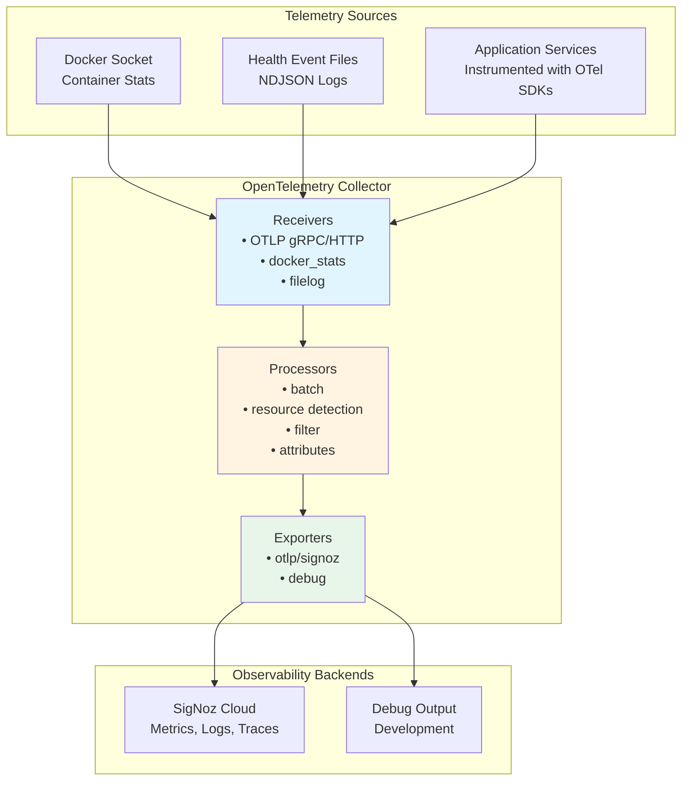

# Tiefe Observability mit OpenTelemetry :telescope: :100:

::: info **TL;DR – Was ist tiefe Observability?**
Der AI-Hub bietet **End-to-End Distributed Tracing und tiefe Observability** mittels OpenTelemetry-Standards, was Ihnen
vollständige Transparenz über jeden Aspekt Ihrer KI-Workflows verschafft. Von einzelnen Agent-Schritten bis hin zu komplexen
Multi-Service-Prozessen können Sie jede Komponente Ihres KI-Ökosystems mit unternehmensgerechter Observability verfolgen,
überwachen und optimieren, die sich nahtlos in Industriestandard-Tools wie Phoenix, SigNoz oder DataDog integrieren lässt.
:::

## Was ist tiefe Observability und wie implementiert der AI-Hub sie? :brain:

**Tiefe Observability** geht weit über traditionelles Logging und Monitoring hinaus. Der AI-Hub implementiert eine
umfassende Observability-Strategie, die **Distributed Tracing**, **semantische Konventionen** und **KI-spezifische
Instrumentierung** kombiniert, um eine beispiellose Transparenz Ihrer KI-Systeme zu gewährleisten.

Die Plattform verwendet **OpenTelemetry** als grundlegendes Observability-Framework, ergänzt durch **OpenInference-Semantikkonventionen**
für KI/ML-Workloads. Dies bedeutet, dass jede Interaktion, von einer einfachen Benutzernachricht bis hin zu komplexen
Multi-Agenten-Orchestrierungen, automatisch mit reichhaltigen Kontextinformationen nachverfolgt wird, darunter:

- **Vollständige Request-Flows**: Verfolgen Sie eine Benutzeranfrage, wie sie durch APIs, Agents, Datenbanken und externe Dienste fließt
- **KI-spezifische Semantik**: Erfassen Sie LLM-Aufrufe, Embeddings, Retrievals und Modellinteraktionen mit spezialisierten
  semantischen Attributen
- **Performance-Metriken**: Verfolgen Sie Latenz, Token-Nutzung, Kostenattribution und Ressourcennutzung über alle Komponenten hinweg
- **Fehlerkontext**: Erhalten Sie detaillierte Fehler-Traces mit dem vollständigen Kontext dessen, was zu Fehlern geführt hat
- **Service-Abhängigkeiten**: Automatische Zuordnung, wie Ihre Dienste, Agents und Prozesse in Echtzeit interagieren

Das System instrumentiert automatisch **jede Komponente**, einschließlich NATS-Messaging, Datenbankoperationen, HTTP-Aufrufe,
LLM-Interaktionen, Vektorsuchen und benutzerdefinierte Agent-Workflows, ohne Codeänderungen zu erfordern.

## Warum dies entscheidend für den Erfolg von Enterprise AI ist :trophy:

Tiefe Observability transformiert die Art und Weise, wie Sie KI-Systeme in Produktion entwickeln, debuggen und skalieren:

**🔍 Vollständige Systemtransparenz**: Sehen Sie genau, wie Ihre KI-Workflows in Produktion ausgeführt werden, von der
Benutzereingabe bis zur endgültigen Ausgabe, über alle Microservices und Agents hinweg. Keine blinden Flecken mehr in
komplexen verteilten KI-Systemen.

**🚀 Performance-Optimierung**: Identifizieren Sie Engpässe in Ihren KI-Pipelines mit Präzision. Wissen Sie genau, welche
LLM-Aufrufe langsam sind, welche Retrievals ineffizient sind und wo Ihre Workflows für Geschwindigkeit und Kosten optimiert
werden können.

**🛡️ Proaktive Problemfindung**: Erkennen Sie Probleme, bevor sie Benutzer beeinträchtigen. Fortgeschrittenes Tracing
zeigt Muster auf, die zu Fehlern führen, sodass Sie Probleme proaktiv statt reaktiv beheben können.

**💰 Kostenattribution und -kontrolle**: Verfolgen Sie Token-Nutzung, API-Aufrufe und Rechenkosten bis auf einzelne Benutzer,
Agents oder Workflows. Treffen Sie datengestützte Entscheidungen über Ressourcenallokation und Kostenoptimierung.

**🌐 Herstellerunabhängige Flexibilität**: OpenTelemetry stellt sicher, dass Ihre Observability-Daten mit jedem
OTLP-kompatiblen Backend funktionieren. Beginnen Sie mit Phoenix für KI-spezifische Analysen und migrieren Sie dann zu
Enterprise-Tools wie DataDog oder New Relic, ohne Daten zu verlieren oder die Instrumentierung zu ändern.

::: details **Automatische Instrumentierungsabdeckung**
Der AI-Hub instrumentiert diese Komponenten automatisch ohne Codeänderungen:

### Kerninfrastruktur

- **NATS Messaging**: Vollständiges Nachrichtenfluss-Tracing über Microservices hinweg
- **Datenbankoperationen**: MongoDB-, Redis- und Vektordatenbankabfragen
- **HTTP Clients**: Alle externen API-Aufrufe und Webhooks
- **Hintergrundaufgaben**: Asynchrone Operationen und geplante Jobs

### KI-spezifische Komponenten

- **LLM-Interaktionen**: Token-Nutzung, Modellaufrufe und Antwortzeiten
- **Embeddings**: Vektorgenerierung und Ähnlichkeitssuchen
- **Retrieval**: RAG-Operationen und Wissensdatenbankabfragen
- **Agent-Workflows**: Schritt-für-Schritt-Ausführungs-Traces mit semantischem Kontext
:::

## Erste Schritte

Um tiefe Observability in Ihrer AI-Hub-Bereitstellung zu aktivieren:

1.  **Umgebungsvariablen konfigurieren**: Legen Sie die OTEL-Konfigurationsvariablen für Ihr Ziel-Observability-Backend fest
2.  **Bereitstellung mit aktiviertem Tracing**: Starten Sie Ihre AI-Hub-Dienste neu, um die automatische Instrumentierung zu aktivieren
3.  **Auf Ihr Observability Dashboard zugreifen**: Zeigen Sie Traces, Metriken und Analysen in Ihrer gewählten Observability-Plattform an

Das System erfordert keine Codeänderungen – die gesamte Instrumentierung erfolgt automatisch und folgt den OpenTelemetry-Standards
für maximale Kompatibilität und minimale Performance-Auswirkungen.

# Traces

## Übersicht

Traces verfolgen einzelne Anfragen durch die AI-Hub-Plattform und zeigen den vollständigen Pfad vom Start bis zum Ende. Jede
Operation erhält automatisch einen eindeutigen Trace-Identifikator, der alle zugehörigen Aktivitäten über Dienste hinweg
verbindet und genau aufzeigt, was passiert ist, wo Zeit verbracht wurde und wie Komponenten zusammengearbeitet haben.

Der Swiss AI-Hub verwendet OpenTelemetry für das Tracing mit spezialisierter Unterstützung für KI-Operationen durch
OpenInference-Semantikkonventionen.

---

## Was wir erfassen

### Agent-Workflow-Ausführung (Operativ)

Agent-Läufe werden mit hierarchischen Span-Strukturen getraced, die den vollständigen Workflow zeigen:

**Agent-Spans**: Root-Span, der den Start einer Agent-Ausführung mit Benutzereingabe und Agent-Identifikation markiert.

**Chain-Spans**: Langlaufende Spans, die die gesamte Laufdauer vom Start bis zur endgültigen Ausgabe erfassen.

**Step-Spans**: Einzelne Workflow-Schritte, die Eingaben, Ausgaben, Verarbeitungszeit und semantische Ereignisse zeigen.

**Trace-Attribute**:

- Session-/Thread-Identifikatoren für den Konversationskontext
- Eingabe- und Ausgabewerte im JSON-Format
- OpenInference Span-Arten (AGENT, CHAIN, TOOL, LLM, RETRIEVER)
- Tags für die Filterung (thread_id, display_id, run_id)

**Implementierung**: Der `AgentRunTracer` erstellt einen Zwei-Span-Ansatz mit einem initialen AGENT-Span als Parent und
einem finalen CHAIN-Span, der die Gesamtdauer erfasst.

### KI-Modelloperationen (Operativ)

LLM-Operationen werden automatisch durch die LlamaIndex-Instrumentierung getraced:

**LLM-Aufrufe**: Modellauswahl, Prompt-Konstruktion, Token-Nutzung und Antwortgenerierung.

**Retrieval-Operationen**: Vektordatenbankabfragen, Dokumentenabruf und Kontextzusammenstellung.

**Embeddings**: Texterstellungsgenerierung für Dokumentenindizierung und Ähnlichkeitssuche.

**Semantische Ereignisse**: KI-spezifische Operationen emittieren semantische Ereignisse, die detaillierte Metadaten
(Token-Anzahlen, Modellnamen, abgerufene Dokumente) enthalten, die Traces mit domänenspezifischen Informationen anreichern.

**Sichtbarkeit**: Alle KI-Operationen erscheinen in der Phoenix-Tracing-UI mit spezialisierten Ansichten für die
LLM-Performance-Analyse.

### HTTP- und Datenbankoperationen (Operativ)

Instrumentierte Bibliotheken erstellen automatisch Spans für externe Dienstaufrufe:

**HTTP Clients**: HTTPX- und aiohttp-Anfragen mit Methode, URL, Statuscode und Timing.

**Datenbanken**: MongoDB-, PostgreSQL- und Redis-Operationen mit Abfrageinformationen.

**Vektordatenbank**: Milvus-Ähnlichkeitssuchen und Indizierungsoperationen.

**Filterung**: Health Checks, Metrik-Endpunkte und hochvolumige Datenbankabfragen werden aus Traces gefiltert, um Rauschen zu reduzieren.

---

## Trace Collection Architektur

### Collection-Pipelines

Der OpenTelemetry Collector verarbeitet Traces durch zwei spezialisierte Pipelines:

**traces/cloud**: Sendet alle Traces an das Cloud Backend

- Receiver: `otlp` (gRPC Port 4317, HTTP Port 4318)
- Processor: `filter/noise` (entfernt Health Checks, Metrik-Endpunkte, routinemäßige DB-Abfragen), `batch`
- Exporter: `otlp/cloud`

**traces/phoenix**: Sendet KI-spezifische Traces an das lokale Phoenix

- Receiver: `otlp` (gRPC Port 4317, HTTP Port 4318)
- Processor: `filter/phoenix` (behält nur OpenInference-Spans), `transform/phoenix` (fügt Projektmetadaten hinzu), `batch`
- Exporter: `otlp/phoenix` (Port 6007)

### Instrumentierung

Dienste emittieren Traces automatisch durch die OpenTelemetry-Instrumentierung, die von `AihubInstrumentor` konfiguriert wird:

**Automatische Instrumentierung** (via `AihubInstrumentor`):

- `AsyncioInstrumentor`: Asynchrone Operationen und Aufgaben-Ausführung
- `HTTPXClientInstrumentor` / `AioHttpClientInstrumentor`: HTTP-Anfragen
- `PymongoInstrumentor` / `RedisInstrumentor` / `MilvusInstrumentor`: Datenbankoperationen
- `LlamaIndexInstrumentor`: LLM- und RAG-Operationen mit OpenInference-Konventionen

**Benutzerdefiniertes Tracing** (via `AgentRunTracer`):

- Agent-Workflow-Ausführung mit Schritt-für-Schritt-Details
- Hierarchische Span-Strukturen für komplexe Workflows
- Kontext-Propagierung über verteilte Agent-Operationen

**Smart Tracing**: Der `SmartTracer` respektiert den `suppress_instrumentation`-Kontext, was eine selektive Tracing-Steuerung ermöglicht.

---

## Geschäftlicher Nutzen

### Performance-Optimierung

Traces zeigen genau, wo Zeit in jeder Operation verbracht wird. Engpassidentifikation wird präzise statt spekulativ. Wenn der
Dokumentenabruf drei Sekunden dauert, während die KI-Verarbeitung 500 ms benötigt, werden die Optimierungsprioritäten klar.

### Kostenmanagement

KI-Operationen umfassen Token-Nutzung und Kostenattribution durch semantische Ereignisse. Die Verfolgung, welche Operationen,
Benutzer oder Abteilungen die meisten KI-Ressourcen verbrauchen, ermöglicht datengestützte Entscheidungen über Modellauswahl
und Feature-Preisgestaltung.

### Ursachenanalyse

Fehlgeschlagene Operationen bewahren den vollständigen Kontext und zeigen genau, wo und warum Fehler aufgetreten sind.
Fehler-Traces umfassen Stack-Traces, Eingabedaten und die Abfolge der Ereignisse, die zum Fehler führten, was die
Problemlösungszeit drastisch reduziert.

### KI-Transparenz

Traces zeigen, welche Informationen die KI bei der Generierung von Antworten berücksichtigt hat. Abgerufene Dokumente,
Token-Nutzung und Modellauswahl werden sichtbar, was die Einhaltung gesetzlicher Vorschriften unterstützt und das
Benutzervertrauen aufbaut.

---

## Zugriff auf Trace-Informationen

### Phoenix UI (Entwicklung)

Phoenix bietet spezialisierte LLM-Observability unter `http://localhost:6006`:

**Funktionen**:

- Zeitlinienansichten, die Span-Dauer und -Beziehungen zeigen
- Token-Nutzung und Kostenverfolgung für LLM-Operationen
- Inspektion abgerufener Dokumente für RAG-Systeme
- Trace-Filterung nach Session, Tags oder Zeitbereich
- Performance-Analyse und Latenzverteilungen

**Fokus**: KI-spezifische Operationen mit OpenInference-Semantikkonventionen (LLM-, CHAIN-, AGENT-, RETRIEVER-, EMBEDDING-Spans).

### Cloud Backend (Produktion)

Traces werden zur langfristigen Speicherung und Analyse an Cloud-Observability-Plattformen exportiert. Die Plattform
unterstützt jedes OTLP-kompatible Backend nur durch Konfigurationsänderungen.

---

## Sicherheit und Datenschutz

### Trace-Inhalt

Traces erfassen Operationsmetadaten, Timing-Informationen und Routing-Details. Entwickler sind dafür verantwortlich, dass
sensible Daten nicht in Trace-Attributen enthalten sind.

**Infrastruktur**: OpenInference-Spans enthalten Session-IDs, Modellnamen, Token-Anzahlen und Metadaten zu abgerufenen Dokumenten.

**Verantwortung der Anwendung**: Entwickler müssen das Logging von tatsächlichem Dokumentinhalt, Benutzernachrichten oder
anderen sensiblen Informationen in benutzerdefinierten Trace-Attributen vermeiden.

### Übertragungssicherheit

Alle Traces werden über verschlüsselte Kanäle (TLS/HTTPS) übertragen, um Abfangen zu verhindern.

### Zugriffskontrolle

Der Trace-Zugriff ist durch rollenbasierte Zugriffskontrolle der Observability-Plattform eingeschränkt. Nur autorisiertes
Personal kann detaillierte Traces einsehen.

---

## Integration mit Plattformkomponenten

### Agent-Workflows

Der `AgentRunTracer` erstellt eine strukturierte Tracing-Hierarchie für Agent-Ausführungen:

1.  Initialer AGENT-Span markiert den Workflow-Start
2.  Einzelne STEP-Spans zeigen jeden Workflow-Schritt mit Eingaben und Ausgaben
3.  Finaler CHAIN-Span erfasst die gesamte Laufdauer
4.  Semantische Ereignisse von KI-Operationen reichern Traces mit domänenspezifischen Metadaten an

### LLM-Operationen

LlamaIndex-Instrumentierung verfolgt automatisch:

-   Sprachmodellaufrufe mit Token-Anzahlen
-   RAG-Operationen, die Dokumentenabruf und Kontextzusammenstellung zeigen
-   Vektordatenbank-Suchen und Ähnlichkeitsoperationen
-   Embedding-Generierung für die Dokumentenverarbeitung

### HTTP-Dienste

FastAPI-Dienste verfolgen eingehende Anfragen automatisch, wenn sie instrumentiert sind. Entwickler können benutzerdefinierte
Attribute zu Spans hinzufügen, um anwendungsspezifischen Kontext bereitzustellen.

---

## Plattformflexibilität

Während Phoenix während der Entwicklung LLM-spezifische Observability bietet, unterstützt die OpenTelemetry-Grundlage
jedes OTLP-kompatible Backend:

**Unterstützte Plattformen**:

-   **Phoenix**: Open-Source LLM-Observability (aktuelle lokale Entwicklung)
-   **SigNoz**: Open-Source Observability-Plattform
-   **Jaeger**: Distributed Tracing mit Fokus auf Microservices
-   **Tempo** (Grafana): Cloud-native Distributed Tracing
-   **Datadog APM**: Kommerzielles APM mit umfassendem Tracing
-   **New Relic**: Application Performance Monitoring mit KI-Einblicken

Der Wechsel des Backends erfordert lediglich Änderungen an der Collector-Konfiguration. Keine Änderungen am Anwendungscode sind erforderlich.

---

## Zukünftige Entwicklung

### Geplante Verbesserungen

**Tail Sampling**: Intelligentes Sampling, das Fehler-Traces und interessante Operationen beibehält, während Speicherkosten reduziert werden.

**Benutzerdefinierte Geschäftsereignisse**: Höherstufige Traces für Geschäftsoperationen, die über technische Implementierungsdetails hinausgehen.

**Kostenprognose**: Kostenschätzungen vor der Ausführung basierend auf historischen Trace-Daten und Abfragekomplexität.

**Performance-Budgets**: Automatische Warnungen, wenn Operationen die erwartete Dauer basierend auf historischen Mustern überschreiten.

---

## Zusammenfassung

Das Distributed Tracing der Plattform liefert:

✅ **Operationelles Agent Tracing**: Vollständige Workflow-Ausführung mit Schritt-für-Schritt-Details durch AgentRunTracer

✅ **Sichtbarkeit von KI-Operationen**: LLM- und RAG-Operationen getraced mit OpenInference-Semantikkonventionen

✅ **Automatische Instrumentierung**: HTTP-, Datenbank- und asynchrone Operationen getraced ohne manuellen Code

✅ **Dualer Backend-Support**: Phoenix für LLM-spezifische Entwicklungs-Observability, Cloud Backend für die Produktion

✅ **Standardbasiert**: OpenTelemetry gewährleistet Herstellerflexibilität durch das OTLP-Protokoll

✅ **Performance-Analyse**: Detaillierte Timing-Informationen ermöglichen eine präzise Engpassidentifikation

✅ **Datenschutzgrundlage**: Infrastruktur erfasst Metadaten; Entwickler sind für den Datenschutz verantwortlich

Mit der Erweiterung der Tracing-Abdeckung erhalten Organisationen zunehmend detailliertere Einblicke in die Plattform-Performance,
KI-Operationen und Benutzererfahrung.

# OpenTelemetry-Grundlage

## Übersicht

**OpenTelemetry (OTel)** ist die technische Grundlage für die gesamte Observability im Swiss AI-Hub. Es bietet ein
herstellerneutrales, industrieweites Framework zum Sammeln, Verarbeiten und Exportieren von Telemetriedaten über Metriken,
Logs und Traces hinweg.

Im Gegensatz zu proprietären Monitoring-Lösungen, die Sie an bestimmte Anbieter binden, stellt OpenTelemetry sicher, dass die
Plattform mit jedem kompatiblen Observability-Backend integriert werden kann. Diese architektonische Entscheidung bietet
Organisationen maximale Flexibilität bei der Wahl von Monitoring-Tools, basierend auf ihrer Infrastruktur,
Compliance-Anforderungen und operativen Präferenzen.

---

## Warum OpenTelemetry?

OpenTelemetry ermöglicht es uns, Dienste einmal zu instrumentieren und die Tool-Wahl flexibel zu halten. Es standardisiert
Metriken, Logs und Traces, sodass Signale standardmäßig korrelieren und austauschbare Backends eine Konfigurationsänderung
bleiben, keine Neuentwicklung.

**Vorteile**

-   **Herstellerneutral im Design:** Verwenden Sie jedes OTLP-kompatible Backend (z.B. SigNoz, Datadog, Grafana, Prometheus,
    New Relic) ohne erneute Instrumentierung.
-   **Vereinheitlichte Signale:** Konsistente Modelle und gemeinsam genutzter Kontext (Trace-/Span-IDs, Ressourcenattribute)
    verknüpfen Metriken, Logs und Traces für eine schnellere Fehlerbehebung.
-   **Bewährter Standard:** Ein CNCF-Projekt mit breiter Branchenunterstützung und aktiver Entwicklung, wodurch das
    Technologierisiko reduziert wird.
-   **Zukunftssicher:** Entwickeln Sie Plattformen und Richtlinien über den OTel Collector und die Konfiguration weiter,
    nicht über den Anwendungscode.

---

## OpenTelemetry Collector

Der **OpenTelemetry Collector** ist die zentrale Drehscheibe für die Telemetrieverarbeitung im Swiss AI-Hub.

### Architektur

### Komponenten

**Receiver**: Sammeln Telemetriedaten aus verschiedenen Quellen.

**Processor**: Transformieren, anreichern, filtern und batchen Telemetriedaten vor dem Export.

**Exporter**: Senden verarbeitete Telemetriedaten an Observability-Backends.

**Extensions**: Bieten zusätzliche Funktionen wie Health Checks und Profiling.

---

## Receiver

Receiver sind Aufnahmepunkte. Sie ziehen Telemetriedaten aus Anwendungen und der Infrastruktur in die Plattform.

-   **OTLP-Receiver:** Standard-Eingang für Anwendungs-Telemetrie. Dienste senden Metriken, Logs und Traces über das
    OpenTelemetry-Protokoll. Konzept: ein Drahtformat für alles.
-   **Container-Metrik-Receiver:** Sammelt Ressourcennutzung von laufenden Containern. Konzept: Überwachung des
    Laufzeitstatus ohne Änderung des Anwendungscodes.
-   **File-Log-Receiver:** Nimmt strukturierte Ereignisprotokolle wie Container- und synthetische Health Checks auf.
    Konzept: Erfassung operativer Signale, auch wenn Anwendungen keine nativen Endpunkte haben.

Ergebnis: Breite Abdeckung mit minimaler Kopplung an ein einzelnes Tool oder eine Laufzeitumgebung.

---

## Processor

Processor formen Telemetriedaten in Bewegung. Sie fügen Kontext hinzu, reduzieren Rauschen und bereiten Daten für die Analyse vor.

-   **Batching:** Gruppiert Daten für einen effizienten Transport. Konzept: geringerer Overhead ohne Verlust an Genauigkeit.
-   **Ressourcenerkennung:** Automatische Anreicherung mit Umgebungsdetails wie Host, Container oder Systeminformationen.
    Konzept: Wer/Wo an jedes Signal anhängen.
-   **Attributbearbeitung:** Normalisiert Tags wie Umgebung oder Quelle. Konzept: konsistente Labels für zuverlässige
    Filterung und Dashboards.
-   **Ressourcen-Mapping:** Übersetzt Container-Fakten in Dienst-Identitäten (z.B. Dienstname, Version). Konzept:
    Abstimmung der Infrastrukturrealität mit Dienstansichten.
-   **Filterung:** Entfernt geringwertiges Rauschen wie routinemäßige Health Checks. Konzept: Verbesserung des Signal-Rausch-Verhältnisses und Kostenkontrolle.

Ergebnis: Saubere, kontextbezogene und analysebereite Telemetriedaten.

---

## Exporter

Exporter liefern Telemetriedaten an Ziele.

-   **Primärer Backend-Exporter:** Sendet Daten an die gewählte OTLP-kompatible Plattform. Konzept: Wählen oder wechseln
    Sie Ihr Analyse-Tool ohne erneute Instrumentierung.
-   **Debug-Exporter:** Gibt Daten zur Validierung aus oder zeigt sie an. Konzept: Pipelines lokal vor der Skalierung überprüfen.

Ergebnis: Steckbare Ausgaben mit sicheren Entwicklungs-Workflows.

---

## Telemetrie-Pipelines

Pipelines sind End-to-End-Flows pro Signalart. Jede definiert, welche Receiver, Processor und Exporter zu verwenden sind.

-   **Metrik-Pipelines:** Optimieren für Durchsatz und Trendanalyse. Anreicherung mit Dienstkontext.
-   **Log-Pipelines:** Bewahren Struktur und Reihenfolge. Extrahieren Attribute für Abfragen und Korrelation.
-   **Trace-Pipelines:** Bewahren Parent-Child-Beziehungen. Sorgfältiges Batchen zur Aufrechterhaltung der Trace-Integrität.

Konzept: Speziell gebaute Spuren, die Signale über den gesamten Stack hinweg konsistent und verknüpfbar halten.

---

## Extensions

Extensions fügen dem Collector selbst operative Fähigkeiten hinzu.

-   **Health Checks:** Zeigen den Collector-Status für die Überwachung an. Konzept: Observability als erstklassigen Dienst behandeln.
-   **Profiling (pprof):** Untersucht die Performance unter Last. Konzept: Diagnose von Pipeline-Engpässen.
-   **Diagnose (zPages):** Zeigt interne Metriken und den Zustand an. Konzept: Schnellere Fehlersuche ohne externe Tools.

Ergebnis: Eine handhabbare, überprüfbare Observability-Kontrollebene.

---

## Integration mit Plattformdiensten

### Anwendungsinstrumentierung

Dienste, die mit OpenTelemetry SDKs instrumentiert sind, emittieren Telemetriedaten automatisch:

**Python-Dienste** (API, Agents, Pipelines):

-   `opentelemetry-instrumentation-*`-Bibliotheken für automatische Framework-Instrumentierung
-   Benutzerdefinierte Instrumentierung für Geschäftslogik
-   OpenInference für KI/ML-Semantikkonventionen

**Instrumentierte Komponenten**:

-   FastAPI HTTP-Anfragen und -Antworten
-   Datenbankoperationen (MongoDB, PostgreSQL, Redis, Milvus)
-   HTTP-Client-Anfragen (httpx, aiohttp, requests)
-   LlamaIndex LLM-Operationen
-   Python-Logging-Framework

### Infrastrukturintegration

Nicht instrumentierte Dienste liefern Telemetriedaten durch Infrastruktur-Monitoring:

**Container-Metriken**: Docker Stats Receiver sammelt Ressourcenmetriken für alle Container, unabhängig von der Instrumentierung.

**Gesundheitsüberwachung**: File Log Receiver erfassen den Gesundheitsstatus sowohl von Docker-Ereignissen als auch von synthetischen Checks.

**Netzwerk-Observability**: Traefik-Proxy-Logs und -Metriken bieten Sichtbarkeit des Anfrage-Routings.

---

## Multi-Plattform-Unterstützung

### Herstellerflexibilität

Die OpenTelemetry-Grundlage unterstützt den gleichzeitigen Export auf mehrere Plattformen:

**Unterstützte Plattformen**:

-   **SigNoz**: Open-Source, OpenTelemetry-native Plattform (aktuell primär)
-   **Datadog**: Kommerzielles APM mit umfassenden Funktionen
-   **Grafana Cloud**: Managed Prometheus, Loki und Tempo
-   **New Relic**: Application Performance Monitoring mit KI-Einblicken
-   **Prometheus**: Open-Source Zeitreihen-Datenbank
-   **Elasticsearch/ELK**: Log-Analyse- und Suchplattform
-   **Splunk**: Enterprise SIEM und Observability-Plattform

### Exportziele hinzufügen

Neue Observability-Plattformen erfordern nur Änderungen an der Collector-Konfiguration:

1.  Exporter in der Collector-Konfiguration definieren
2.  Exporter zu den relevanten Pipelines hinzufügen
3.  Authentifizierung über Umgebungsvariablen konfigurieren

Keine Änderungen am Anwendungscode erforderlich.

## Sicherheit

### Sichere Übertragung

Alle Telemetrie-Exporte verwenden TLS-Verschlüsselung, um Abfangen oder Manipulation zu verhindern.

### Zugriffskontrolle

Collector-Konfiguration und -Zugriff sind auf Infrastrukturadministratoren beschränkt. Anwendungsdienste emittieren
Telemetriedaten über definierte Schnittstellen ohne Collector-Zugriff.

### Geheimnisverwaltung

Authentifizierungsschlüssel werden über Umgebungsvariablen verwaltet, getrennt von Konfigurationsdateien, was eine
sichere Schlüsselrotation ermöglicht.
