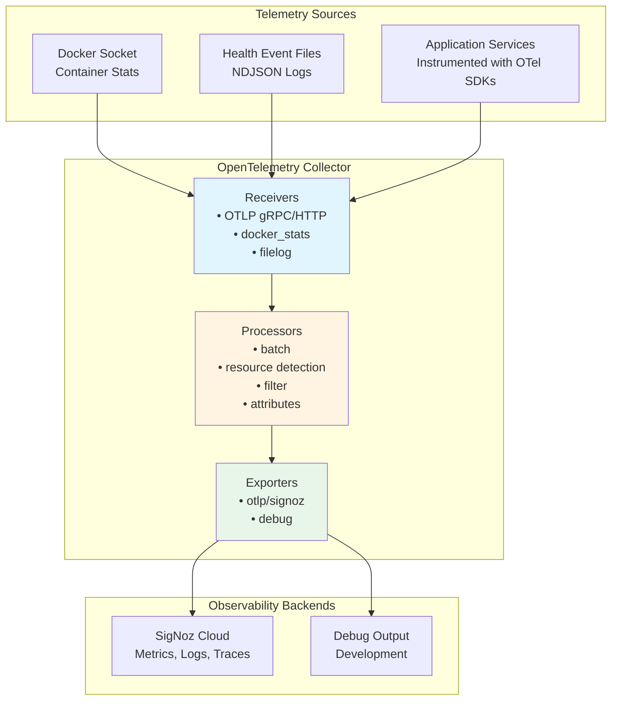

# Tiefe Observability mit OpenTelemetry :telescope: :100:

::: info **TL;DR - Was ist tiefe Observability?**
Der AI-Hub bietet **End-to-End Distributed Tracing und tiefe Observability** unter Verwendung von OpenTelemetry-Standards, was Ihnen
vollständige Transparenz über jeden Aspekt Ihrer KI-Workflows verschafft. Von einzelnen Agenten-Schritten bis hin zu komplexen Multi-Service-Prozessen
können Sie jede Komponente Ihres KI-Ökosystems mit unternehmensgerechter Observability verfolgen, überwachen und optimieren,
die sich nahtlos in branchenübliche Tools wie Phoenix, SigNoz oder DataDog integrieren lässt.
:::

## Was ist tiefe Observability und wie implementiert der AI-Hub sie? :brain:

**Tiefe Observability** geht weit über traditionelles Logging und Monitoring hinaus. Der AI-Hub implementiert eine umfassende
Observability-Strategie, die **Distributed Tracing**, **semantische Konventionen** und **KI-spezifische
Instrumentierung** kombiniert, um eine beispiellose Transparenz Ihrer KI-Systeme zu gewährleisten.

Die Plattform nutzt **OpenTelemetry** als ihr grundlegendes Observability-Framework, ergänzt durch **OpenInference semantische
Konventionen** für KI/ML-Workloads. Das bedeutet, dass jede Interaktion, von einer einfachen Benutzernachricht bis hin zu komplexen
Multi-Agenten-Orchestrierungen, automatisch mit umfangreichen Kontextinformationen verfolgt wird, darunter:

- **Komplette Anfrageabläufe**: Verfolgen Sie eine Benutzeranfrage, wie sie durch APIs, Agenten, Datenbanken und externe Dienste fließt
- **KI-spezifische Semantik**: Erfassen Sie LLM-Aufrufe, Embeddings, Retrievals und Modellinteraktionen mit spezialisierten semantischen
  Attributen
- **Leistungsmetriken**: Verfolgen Sie Latenz, Token-Nutzung, Kostenattribution und Ressourcennutzung über alle Komponenten hinweg
- **Fehlerkontext**: Erhalten Sie detaillierte Fehler-Traces mit vollständigem Kontext dessen, was zu Fehlern führte
- **Dienstabhängigkeiten**: Erstellen Sie automatisch eine Echtzeit-Karte der Interaktion Ihrer Dienste, Agenten und Prozesse

Das System instrumentiert automatisch **jede Komponente**, einschließlich NATS Messaging, Datenbankoperationen, HTTP-Aufrufe, LLM-
Interaktionen, Vektorsuchen und benutzerdefinierte Agenten-Workflows, ohne dass Codeänderungen erforderlich sind.

## Warum dies entscheidend für den Erfolg von Enterprise AI ist :trophy:

Tiefe Observability verändert die Art und Weise, wie Sie KI-Systeme in der Produktion erstellen, debuggen und skalieren:

**🔍 Vollständige Systemsichtbarkeit**: Sehen Sie genau, wie Ihre KI-Workflows in der Produktion ausgeführt werden, von der Benutzereingabe bis zur endgültigen
Ausgabe, über alle Microservices und Agenten hinweg. Keine blinden Flecken mehr in komplexen verteilten KI-Systemen.

**🚀 Leistungsoptimierung**: Identifizieren Sie Engpässe in Ihren KI-Pipelines präzise. Wissen Sie genau, welche LLM-Aufrufe
langsam sind, welche Retrievals ineffizient sind und wo Ihre Workflows für Geschwindigkeit und Kosten optimiert werden können.

**🛡️ Proaktive Fehlererkennung**: Erkennen Sie Probleme, bevor sie Benutzer beeinträchtigen. Fortgeschrittenes Tracing offenbart Muster, die zu
Fehlern führen, sodass Sie Probleme proaktiv beheben können, anstatt reaktiv.

**💰 Kostenattribution und -kontrolle**: Verfolgen Sie Token-Nutzung, API-Aufrufe und Rechenkosten bis hin zu einzelnen Benutzern, Agenten oder
Workflows. Treffen Sie datengestützte Entscheidungen über Ressourcenzuweisung und Kostenoptimierung.

**🌐 Anbieterunabhängige Flexibilität**: OpenTelemetry stellt sicher, dass Ihre Observability-Daten mit jedem OTLP-kompatiblen Backend funktionieren.
Beginnen Sie mit Phoenix für KI-spezifische Analysen und migrieren Sie dann zu Unternehmens-Tools wie DataDog oder New Relic, ohne
Daten zu verlieren oder die Instrumentierung zu ändern.

::: details **Automatische Instrumentierungsabdeckung**
Der AI-Hub instrumentiert diese Komponenten automatisch ohne Codeänderungen:

### Kerninfrastruktur

- **NATS Messaging**: Vollständiges Message-Flow-Tracing über Microservices hinweg
- **Datenbankoperationen**: MongoDB-, Redis- und Vektordatenbank-Abfragen
- **HTTP Clients**: Alle externen API-Aufrufe und Webhooks
- **Hintergrundaufgaben**: Asynchrone Operationen und geplante Jobs

### KI-Spezifische Komponenten

- **LLM-Interaktionen**: Token-Nutzung, Modellaufrufe und Antwortzeiten
- **Embeddings**: Vektorgenerierung und Ähnlichkeitssuchen
- **Retrieval**: RAG-Operationen und Wissensdatenbank-Abfragen
- **Agent Workflows**: Schrittweise Ausführungs-Traces mit semantischem Kontext
:::

## Erste Schritte

Um tiefe Observability in Ihrer AI-Hub-Bereitstellung zu aktivieren:

1. **Umgebungsvariablen konfigurieren**: Legen Sie die OTEL-Konfigurationsvariablen für Ihr Ziel-Observability-Backend fest
2. **Mit aktiviertem Tracing deployen**: Starten Sie Ihre AI-Hub-Dienste neu, um die automatische Instrumentierung zu aktivieren
3. **Auf Ihr Observability-Dashboard zugreifen**: Zeigen Sie Traces, Metriken und Analysen in Ihrer gewählten Observability-Plattform an

Das System erfordert keine Codeänderungen – die gesamte Instrumentierung ist automatisch und folgt den OpenTelemetry-Standards für maximale
Kompatibilität und minimale Leistungsauswirkungen.

# Traces

## Übersicht

Traces verfolgen einzelne Anfragen durch die AI-Hub-Plattform und zeigen den vollständigen Pfad von Anfang bis Ende. Jede
Operation erhält automatisch eine eindeutige Trace-ID, die alle zugehörigen Aktivitäten über Dienste hinweg verbindet und
genau aufzeigt, was passiert ist, wo Zeit verbracht wurde und wie Komponenten zusammengearbeitet haben.

Der Swiss AI-Hub verwendet OpenTelemetry für das Tracing mit spezieller Unterstützung für KI-Operationen durch OpenInference
semantische Konventionen. Details zur OpenTelemetry-Infrastruktur finden Sie unter
[OpenTelemetry Foundation](../0_opentelemetry/index.md).

---

## Was wir erfassen

### Agent Workflow-Ausführung (Operational)

Agentenläufe werden mit hierarchischen Span-Strukturen verfolgt, die den vollständigen Workflow zeigen:

**Agent Spans**: Root-Span, der den Start einer Agenten-Ausführung mit Benutzereingabe und Agenten-Identifikation markiert.

**Chain Spans**: Langlebiger Span, der die gesamte Laufzeit vom Start bis zur endgültigen Ausgabe erfasst.

**Step Spans**: Einzelne Workflow-Schritte, die Eingaben, Ausgaben, Verarbeitungszeit und semantische Ereignisse zeigen.

**Trace-Attribute**:

- Sitzungs-/Thread-Identifikatoren für den Konversationskontext
- Eingabe- und Ausgabewerte im JSON-Format
- OpenInference Span-Arten (AGENT, CHAIN, TOOL, LLM, RETRIEVER)
- Tags zum Filtern (thread_id, display_id, run_id)

**Implementierung**: Der `AgentRunTracer` verwendet einen Zwei-Span-Ansatz mit einem initialen AGENT-Span als übergeordnetem Element und einem finalen
CHAIN-Span, der die Gesamtdauer erfasst.

### KI-Modelloperationen (Operational)

LLM-Operationen werden automatisch durch LlamaIndex-Instrumentierung verfolgt:

**LLM-Aufrufe**: Modellauswahl, Prompt-Erstellung, Token-Nutzung und Antwortgenerierung.

**Retrieval-Operationen**: Vektordatenbankabfragen, Dokumenten-Retrieval und Kontextzusammenstellung.

**Embeddings**: Texterstellungs-Embeddings für Dokumentenindizierung und Ähnlichkeitssuche.

**Semantische Ereignisse**: KI-spezifische Operationen emittieren semantische Ereignisse, die detaillierte Metadaten (Token-Zählungen, Modell-
Namen, abgerufene Dokumente) enthalten, die Traces mit domänenspezifischen Informationen anreichern.

**Sichtbarkeit**: Alle KI-Operationen erscheinen in der Phoenix Tracing UI mit speziellen Ansichten für die LLM-Leistungsanalyse.

### HTTP- und Datenbankoperationen (Operational)

Instrumentierte Bibliotheken erstellen automatisch Spans für externe Dienstaufrufe:

**HTTP Clients**: HTTPX- und aiohttp-Anfragen mit Methode, URL, Statuscode und Zeitmessung.

**Datenbanken**: MongoDB-, PostgreSQL- und Redis-Operationen mit Abfrageinformationen.

**Vektordatenbank**: Milvus-Ähnlichkeitssuchen und Indizierungsoperationen.

**Filterung**: Health Checks, Metrik-Endpunkte und hochvolumige Datenbankabfragen werden aus Traces gefiltert, um
Rauschen zu reduzieren.

---

## Architektur der Trace-Erfassung

### Erfassungspipelines

Der OpenTelemetry Collector verarbeitet Traces durch zwei spezialisierte Pipelines:

**traces/cloud**: Sendet alle Traces an das Cloud-Backend

- Empfänger: `otlp` (gRPC Port 4317, HTTP Port 4318)
- Prozessoren: `filter/noise` (entfernt Health Checks, Metrik-Endpunkte, routinemäßige DB-Abfragen), `batch`
- Exporter: `otlp/cloud`

**traces/phoenix**: Sendet KI-spezifische Traces an das lokale Phoenix

- Empfänger: `otlp` (gRPC Port 4317, HTTP Port 4318)
- Prozessoren: `filter/phoenix` (behält nur OpenInference Spans), `transform/phoenix` (fügt Projektmetadaten hinzu), `batch`
- Exporter: `otlp/phoenix` (Port 6007)

Detaillierte Informationen zur OpenTelemetry-Architektur finden Sie unter [OpenTelemetry Foundation](../0_opentelemetry/index.md).

### Instrumentierung

Dienste emittieren Traces automatisch durch OpenTelemetry-Instrumentierung, die von `AihubInstrumentor` konfiguriert wird:

**Automatische Instrumentierung** (via `AihubInstrumentor`):

- `AsyncioInstrumentor`: Asynchrone Operationen und Aufgaben-Ausführung
- `HTTPXClientInstrumentor` / `AioHttpClientInstrumentor`: HTTP-Anfragen
- `PymongoInstrumentor` / `RedisInstrumentor` / `MilvusInstrumentor`: Datenbankoperationen
- `LlamaIndexInstrumentor`: LLM- und RAG-Operationen mit OpenInference-Konventionen

**Benutzerdefiniertes Tracing** (via `AgentRunTracer`):

- Agenten-Workflow-Ausführung mit Schritt-für-Schritt-Details
- Hierarchische Span-Strukturen für komplexe Workflows
- Kontextpropagation über verteilte Agenten-Operationen

**Smart Tracing**: Der `SmartTracer` respektiert den `suppress_instrumentation` Kontext und ermöglicht eine selektive Tracing-Kontrolle.

---

## Geschäftliche Vorteile

### Leistungsoptimierung

Traces zeigen genau, wo in jeder Operation Zeit verbracht wird. Die Engpasserkennung wird präzise statt spekulativ.
Wenn der Dokumentenabruf drei Sekunden dauert, während die KI-Verarbeitung 500ms benötigt, werden die Optimierungsprioritäten klar.

### Kostenmanagement

KI-Operationen umfassen Token-Nutzung und Kostenattribution durch semantische Ereignisse. Die Verfolgung, welche Operationen, Benutzer oder
Abteilungen die meisten KI-Ressourcen verbrauchen, ermöglicht datengestützte Entscheidungen über Modellauswahl und Feature-Preise.

### Ursachenanalyse

Fehlgeschlagene Operationen behalten den vollständigen Kontext bei und zeigen genau, wo und warum Fehler auftraten. Fehler-Traces umfassen Stack-Traces,
Eingabedaten und die Abfolge der Ereignisse, die zum Fehler führten, was die Problemlösungszeit dramatisch reduziert.

### KI-Transparenz

Traces zeigen, welche Informationen die KI bei der Generierung von Antworten berücksichtigt hat. Abgerufene Dokumente, Token-Nutzung und
Modellauswahl werden sichtbar, was die Einhaltung gesetzlicher Vorschriften unterstützt und das Vertrauen der Benutzer stärkt.

---

## Zugriff auf Trace-Informationen

### Phoenix UI (Entwicklung)

Phoenix bietet spezialisierte LLM-Observability unter `http://localhost:6006`:

**Funktionen**:

- Zeitachsenansichten, die die Dauer und Beziehungen von Spans zeigen
- Token-Nutzung und Kostenverfolgung für LLM-Operationen
- Inspektion abgerufener Dokumente für RAG-Systeme
- Trace-Filterung nach Sitzung, Tags oder Zeitbereich
- Leistungsanalyse und Latenzverteilungen

**Fokus**: KI-spezifische Operationen mit OpenInference semantischen Konventionen (LLM, CHAIN, AGENT, RETRIEVER, EMBEDDING Spans).

### Cloud-Backend (Produktion)

Traces werden zur langfristigen Speicherung und Analyse an Cloud-Observability-Plattformen exportiert. Die Plattform unterstützt jedes
OTLP-kompatible Backend allein durch Konfigurationsänderungen.

Informationen zu Cloud-Backends und Visualisierung finden Sie unter [Dashboards](../2_dashboards/index.md).

---

## Sicherheit und Datenschutz

### Trace-Inhalt

Traces erfassen Operationsmetadaten, Timing-Informationen und Routing-Details. Entwickler sind dafür verantwortlich,
dass sensible Daten nicht in Trace-Attributen enthalten sind.

**Infrastruktur**: OpenInference Spans enthalten Sitzungs-IDs, Modellnamen, Token-Zählungen und Metadaten abgerufener Dokumente.

**Anwendungsverantwortung**: Entwickler müssen das Logging von tatsächlichem Dokumenteninhalt, Benutzernachrichten oder anderen sensiblen
Informationen in benutzerdefinierten Trace-Attributen vermeiden.

### Übertragungssicherheit

Alle Traces werden über verschlüsselte Kanäle (TLS/HTTPS) übertragen, um Abhören zu verhindern.

### Zugriffskontrolle

Der Trace-Zugriff wird durch rollenbasierte Zugriffskontrolle der Observability-Plattform eingeschränkt. Nur autorisiertes Personal kann
detaillierte Traces einsehen.

---

## Integration mit Plattformkomponenten

### Agent Workflows

Der `AgentRunTracer` erstellt eine strukturierte Tracing-Hierarchie für Agenten-Ausführungen:

1. Initialer AGENT-Span markiert den Workflow-Start
2. Einzelne STEP-Spans zeigen jeden Workflow-Schritt mit Eingaben und Ausgaben
3. Finaler CHAIN-Span erfasst die komplette Laufdauer
4. Semantische Ereignisse aus KI-Operationen reichern Traces mit domänenspezifischen Metadaten an

### LLM-Operationen

Die LlamaIndex-Instrumentierung verfolgt automatisch:

- Sprachmodell-Aufrufe mit Token-Zählungen
- RAG-Operationen, die den Dokumentenabruf und die Kontextzusammenstellung zeigen
- Vektordatenbank-Suchen und Ähnlichkeitsoperationen
- Embedding-Generierung für die Dokumentenverarbeitung

### HTTP-Dienste

FastAPI-Dienste verfolgen eingehende Anfragen automatisch, wenn sie instrumentiert sind. Entwickler können Spans
benutzerdefinierte Attribute für anwendungsspezifischen Kontext hinzufügen.

---

## Plattformflexibilität

Während Phoenix während der Entwicklung LLM-spezifische Observability bietet, unterstützt die OpenTelemetry-Grundlage jedes
OTLP-kompatible Backend:

**Unterstützte Plattformen**:

- **Phoenix**: Open-Source LLM-Observability (aktuelle lokale Entwicklung)
- **SigNoz**: Open-Source Observability-Plattform
- **Jaeger**: Distributed Tracing mit Fokus auf Microservices
- **Tempo** (Grafana): Cloud-native Distributed Tracing
- **Datadog APM**: Kommerzielles APM mit umfassendem Tracing
- **New Relic**: Application Performance Monitoring mit KI-Einblicken

Der Wechsel des Backends erfordert lediglich Änderungen an der Collector-Konfiguration. Keine Anwendungs-Codeänderungen sind erforderlich.

Vollständige Details zur Multi-Plattform-Unterstützung finden Sie unter [OpenTelemetry Foundation](../0_opentelemetry/index.md) und
[Dashboards - Multi-Plattform-Support](../2_dashboards/index.md#multi-platform-support).

---

## Zukünftige Entwicklung

### Geplante Verbesserungen

**Tail Sampling**: Intelligentes Sampling, das Fehler-Traces und interessante Operationen beibehält, während die Speicherkosten reduziert werden.

**Benutzerdefinierte Geschäftsereignisse**: Höhere Traces für Geschäftsabläufe jenseits technischer Implementierungsdetails.

**Kostenprognose**: Kostenschätzungen vor der Ausführung basierend auf historischen Trace-Daten und Abfragekomplexität.

**Performance Budgets**: Automatische Alarme, wenn Operationen die erwartete Dauer basierend auf historischen Mustern überschreiten.

---

## Zusammenfassung

Das Distributed Tracing der Plattform liefert:

✅ **Operationelles Agent Tracing**: Vollständige Workflow-Ausführung mit Schritt-für-Schritt-Details durch AgentRunTracer

✅ **Sichtbarkeit von KI-Operationen**: LLM- und RAG-Operationen verfolgt mit OpenInference semantischen Konventionen

✅ **Automatische Instrumentierung**: HTTP-, Datenbank- und asynchrone Operationen ohne manuellen Code verfolgt

✅ **Unterstützung für zwei Backends**: Phoenix für LLM-spezifische Entwicklungs-Observability, Cloud-Backend für die Produktion

✅ **Standardbasiert**: OpenTelemetry gewährleistet Anbieterflexibilität durch das OTLP-Protokoll

✅ **Leistungsanalyse**: Detaillierte Zeitinformationen ermöglichen eine präzise Engpasserkennung

✅ **Datenschutzgrundlage**: Infrastruktur erfasst Metadaten; Entwickler sind für den Datenschutz verantwortlich

Mit der Ausweitung der Tracing-Abdeckung erhalten Unternehmen zunehmend detaillierte Einblicke in die Plattformleistung, KI-Operationen und
Benutzererfahrung.

# OpenTelemetry-Grundlagen

## Übersicht

**OpenTelemetry (OTel)** ist die technische Grundlage für die gesamte Observability im Swiss AI-Hub. Es bietet ein
anbieterneutrales, branchenübliches Framework zum Sammeln, Verarbeiten und Exportieren von Telemetriedaten über Metriken,
Logs und Traces hinweg.

Im Gegensatz zu proprietären Monitoring-Lösungen, die Sie an bestimmte Anbieter binden, stellt OpenTelemetry sicher, dass die Plattform
mit jedem kompatiblen Observability-Backend integriert werden kann. Diese architektonische Entscheidung bietet Unternehmen maximale
Flexibilität bei der Auswahl von Monitoring-Tools basierend auf ihrer Infrastruktur, Compliance-Anforderungen und operativen Präferenzen.

---

## Warum OpenTelemetry?

OpenTelemetry ermöglicht es uns, Dienste einmal zu instrumentieren und die Tool-Wahl flexibel zu halten. Es standardisiert Metriken, Logs und Traces,
sodass Signale standardmäßig korrelieren und austauschbare Backends eine Konfigurationsänderung bleiben, keine Neuimplementierung.

**Vorteile**

- **Anbieterneutral im Design:** Verwenden Sie jedes OTLP-kompatible Backend (z.B. SigNoz, Datadog, Grafana, Prometheus, New Relic)
  ohne Neu-Instrumentierung.
- **Vereinheitlichte Signale:** Konsistente Modelle und gemeinsam genutzter Kontext (Trace-/Span-IDs, Ressourcenattribute) verknüpfen Metriken, Logs
  und Traces für schnellere Fehlerbehebung.
- **Bewährter Standard:** Ein CNCF-Projekt mit breiter Branchenunterstützung und aktiver Entwicklung, das Technologierisiken reduziert.
- **Zukunftssicher:** Entwickeln Sie Plattformen und Richtlinien über den OTel Collector und die Konfiguration, nicht über den Anwendungscode.

---

## OpenTelemetry Collector

Der **OpenTelemetry Collector** ist der zentrale Telemetrie-Verarbeitungsknotenpunkt für den Swiss AI-Hub.

### Architektur

### Komponenten

**Receivers**: Sammeln Telemetriedaten aus verschiedenen Quellen.

**Prozessoren**: Transformieren, anreichern, filtern und stapeln Telemetriedaten vor dem Export.

**Exporter**: Senden verarbeitete Telemetriedaten an Observability-Backends.

**Erweiterungen**: Bieten Hilfsfunktionen wie Health Checks und Profiling.

---

## Receiver

Receiver sind Aufnahmepunkte. Sie ziehen Telemetriedaten von Anwendungen und Infrastruktur in die Plattform.

- **OTLP-Receiver:** Standardeingang für Anwendungs-Telemetrie. Dienste senden Metriken, Logs und Traces mit dem OpenTelemetry-
  Protokoll. Konzept: ein Drahtformat für alles.
- **Container-Metrik-Receiver:** Sammelt Ressourcennutzung von laufenden Containern. Konzept: Überwachung der Laufzeitgesundheit,
  ohne den Anwendungscode zu berühren.
- **Datei-Log-Receiver:** Nimmt strukturierte Ereignis-Logs wie Container- und synthetische Health Checks auf. Konzept:
  Erfassung operativer Signale, auch wenn Anwendungen keine nativen Endpunkte haben.

Ergebnis: Breite Abdeckung mit minimaler Kopplung an ein einzelnes Tool oder eine Laufzeitumgebung.

---

## Prozessoren

Prozessoren formen Telemetriedaten in Bewegung. Sie fügen Kontext hinzu, reduzieren Rauschen und bereiten Daten für die Analyse vor.

- **Batching:** Gruppiert Daten für effizienten Transport. Konzept: geringerer Overhead ohne Verlust an Genauigkeit.
- **Ressourcenerkennung:** Automatische Anreicherung mit Umgebungsdetails wie Host-, Container- oder Systeminformationen. Konzept:
  Anfügen von "Wer/Wo" an jedes Signal.
- **Attributbearbeitung:** Normalisiert Tags wie Umgebung oder Quelle. Konzept: konsistente Labels für zuverlässiges Filtern
  und Dashboards.
- **Ressourcenmapping:** Übersetzt Container-Fakten in Dienstidentitäten (z.B. Dienstname, Version). Konzept:
  Infrastrukturrealität mit Dienstansichten in Einklang bringen.
- **Filterung:** Entfernt rauschende Daten mit geringem Wert, wie z.B. routinemäßige Health Checks. Konzept:
  Verbesserung des Signal-Rausch-Verhältnisses und Kostenkontrolle.

Ergebnis: Saubere, kontextbezogene und analysebereite Telemetriedaten.

---

## Exporter

Exporter liefern Telemetriedaten an ihre Ziele.

- **Primärer Backend-Exporter:** Sendet Daten an die gewählte OTLP-kompatible Plattform. Konzept:
  Wählen oder ändern Sie Ihr Analyse-Tool, ohne neu zu instrumentieren.
- **Debug-Exporter:** Gibt Daten zur Validierung aus oder zeigt sie an. Konzept: Pipelines lokal überprüfen, bevor sie skaliert werden.

Ergebnis: Steckbare Ausgaben mit sicheren Entwicklungsworkflows.

---

## Telemetrie-Pipelines

Pipelines sind End-to-End-Abläufe pro Signaltyp. Jede definiert, welche Receiver, Prozessoren und Exporter verwendet werden sollen.

- **Metrik-Pipelines:** Optimierung auf Durchsatz und Trendanalyse. Anreicherung mit Dienstkontext.
- **Log-Pipelines:** Struktur und Reihenfolge beibehalten. Attribute für Abfragen und Korrelation extrahieren.
- **Trace-Pipelines:** Übergeordnete/untergeordnete Beziehungen intakt halten. Sorgfältiges Batching zur Wahrung der Trace-Integrität.

Konzept: zweckbestimmte Spuren, die Signale über den gesamten Stack hinweg konsistent und verknüpfbar halten.

---

## Erweiterungen

Erweiterungen fügen operative Funktionen um den Collector selbst hinzu.

- **Health Checks:** Zeigen den Collector-Status zur Überwachung an. Konzept: Observability als erstklassigen Dienst behandeln.
- **Profiling (pprof):** Untersuchen der Leistung unter Last. Konzept: Diagnose von Pipeline-Engpässen.
- **Diagnostik (zPages):** Interne Metriken und den Zustand anzeigen. Konzept: schnellere Fehlerbehebung ohne externe Tools.

Ergebnis: Eine verwaltbare, überprüfbare Observability-Steuerungsebene.

---

## Integration mit Plattformdiensten

### Anwendungs-Instrumentierung

Dienste, die mit OpenTelemetry SDKs instrumentiert sind, emittieren automatisch Telemetriedaten:

**Python-Dienste** (API, Agents, Pipelines):

- `opentelemetry-instrumentation-*`-Bibliotheken für die automatische Framework-Instrumentierung
- Benutzerdefinierte Instrumentierung für die Geschäftslogik
- OpenInference für KI/ML-semantische Konventionen

**Instrumentierte Komponenten**:

- FastAPI HTTP-Anfragen und -Antworten
- Datenbankoperationen (MongoDB, PostgreSQL, Redis, Milvus)
- HTTP-Client-Anfragen (httpx, aiohttp, requests)
- LlamaIndex LLM-Operationen
- Python-Logging-Framework

### Infrastruktur-Integration

Nicht-instrumentierte Dienste liefern Telemetriedaten durch Infrastruktur-Monitoring:

**Container-Metriken**: Docker-Statistiken-Receiver sammelt Ressourcenmetriken für alle Container unabhängig von der Instrumentierung.

**Gesundheitsüberwachung**: Datei-Log-Receiver erfassen den Gesundheitsstatus sowohl von Docker-Ereignissen als auch von synthetischen Prüfungen.

**Netzwerk-Observability**: Traefik-Proxy-Logs und -Metriken bieten Sichtbarkeit des Anfrage-Routings.

---

## Multi-Plattform-Unterstützung

### Anbieterflexibilität

Die OpenTelemetry-Grundlage unterstützt den gleichzeitigen Export an mehrere Plattformen:

**Unterstützte Plattformen**:

- **SigNoz**: Open-Source, OpenTelemetry-native Plattform (aktuell primär)
- **Datadog**: Kommerzielles APM mit umfassenden Funktionen
- **Grafana Cloud**: Verwaltetes Prometheus, Loki und Tempo
- **New Relic**: Application Performance Monitoring mit KI-Einblicken
- **Prometheus**: Open-Source Zeitreihen-Datenbank
- **Elasticsearch/ELK**: Log-Analyse- und Suchplattform
- **Splunk**: Enterprise SIEM und Observability-Plattform

### Hinzufügen von Exportzielen

Neue Observability-Plattformen erfordern lediglich Änderungen an der Collector-Konfiguration:

1. Exporter in der Collector-Konfiguration definieren
2. Exporter zu den relevanten Pipelines hinzufügen
3. Authentifizierung über Umgebungsvariablen konfigurieren

Keine Änderungen am Anwendungscode erforderlich.

## Sicherheit

### Sichere Übertragung

Alle Telemetrie-Exporte verwenden TLS-Verschlüsselung, um Abfangen oder Manipulation zu verhindern.

### Zugriffskontrolle

Collector-Konfiguration und -Zugriff sind auf Infrastrukturadministratoren beschränkt. Anwendungsdienste senden Telemetriedaten
über definierte Schnittstellen ohne Collector-Zugriff.

### Geheimnisverwaltung

Authentifizierungsschlüssel werden über Umgebungsvariablen verwaltet, getrennt von Konfigurationsdateien, was eine sichere
Geheimnisrotation ermöglicht.
