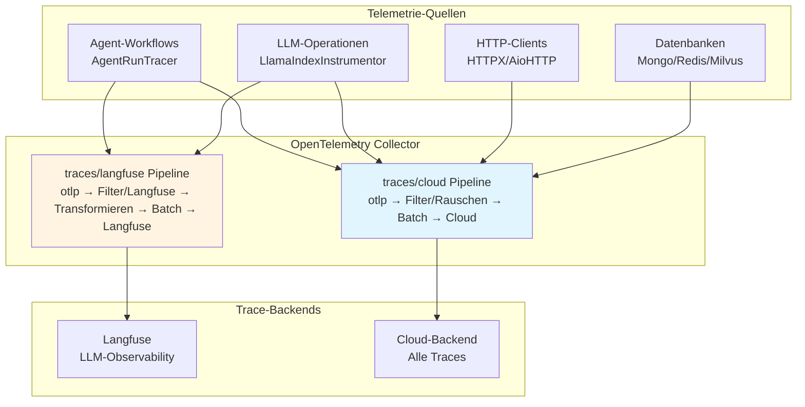
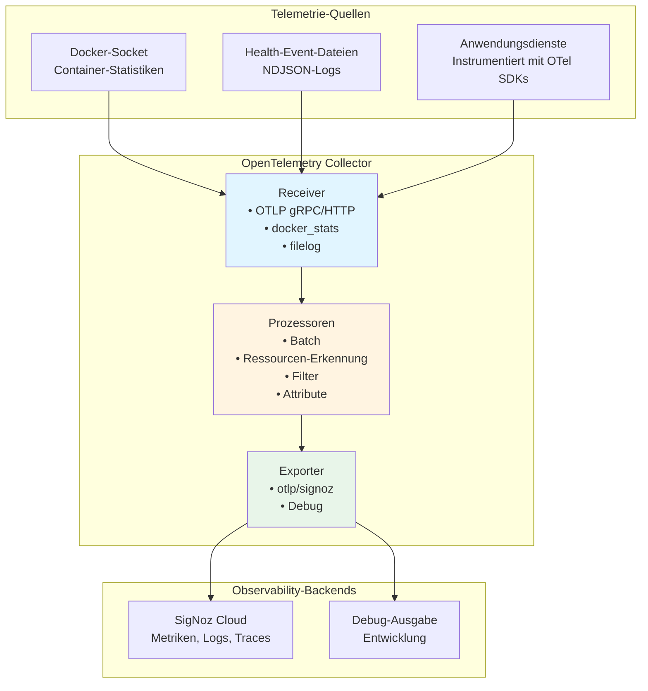

# Tiefe Observability mit OpenTelemetry :telescope: :100:

::: info **TL;DR - Was ist tiefe Observability?**
Der AI-Hub bietet **End-to-End Distributed Tracing und tiefe Observability** unter Verwendung von
OpenTelemetry-Standards, was Ihnen vollständige Transparenz über jeden Aspekt Ihrer KI-Workflows verschafft. Von
einzelnen Agent-Schritten bis hin zu komplexen Multi-Service-Prozessen können Sie jede Komponente Ihres KI-Ökosystems
mit unternehmensgerechter Observability verfolgen, überwachen und optimieren, die sich nahtlos in
Industriestandard-Tools wie Langfuse, SigNoz oder DataDog integriert.
:::

## Was ist tiefe Observability und wie implementiert der AI-Hub sie? :brain:

**Tiefe Observability** geht weit über traditionelles Logging und Monitoring hinaus. Der AI-Hub implementiert eine
umfassende Observability-Strategie, die **Distributed Tracing**, **semantische Konventionen** und **KI-spezifische
Instrumentierung** kombiniert, um eine beispiellose Transparenz Ihrer KI-Systeme zu gewährleisten.

Die Plattform nutzt **OpenTelemetry** als ihr fundamentales Observability-Framework, ergänzt durch **OpenInference
Semantic Conventions** für KI/ML-Workloads. Das bedeutet, jede Interaktion, von einer einfachen Benutzernachricht bis
hin zu komplexen Multi-Agenten-Orchestrierungen, wird automatisch mit umfangreichen Kontextinformationen getraced,
einschließlich:

- **Komplette Anfragenflüsse**: Verfolgen Sie eine Benutzeranfrage, wie sie durch APIs, Agenten, Datenbanken und externe
  Dienste fließt
- **KI-spezifische Semantik**: Erfassen Sie LLM-Aufrufe, Embeddings, Retrievals und Modellinteraktionen mit
  spezialisierten semantischen Attributen
- **Performance-Metriken**: Verfolgen Sie Latenz, Token-Nutzung, Kostenattribution und Ressourcennutzung über alle
  Komponenten hinweg
- **Fehlerkontext**: Erhalten Sie detaillierte Fehler-Traces mit vollständigem Kontext dessen, was zu Fehlern führte
- **Service-Abhängigkeiten**: Bilden Sie automatisch ab, wie Ihre Dienste, Agenten und Prozesse in Echtzeit interagieren

Das System instrumentiert automatisch **jede Komponente**, einschließlich NATS-Messaging, Datenbankoperationen,
HTTP-Aufrufe, LLM-Interaktionen, Vektorsuchen und benutzerdefinierte Agenten-Workflows, ohne Codeänderungen zu
erfordern.

## Warum dies entscheidend für den Erfolg von Enterprise AI ist :trophy:

Tiefe Observability transformiert, wie Sie KI-Systeme in Produktion entwickeln, debuggen und skalieren:

**🔍 Vollständige Systemtransparenz**: Sehen Sie genau, wie Ihre KI-Workflows in Produktion ausgeführt werden, von der
Benutzereingabe bis zur endgültigen Ausgabe, über alle Microservices und Agenten hinweg. Keine blinden Flecken mehr in
komplexen verteilten KI-Systemen.

**🚀 Performance-Optimierung**: Identifizieren Sie Engpässe in Ihren KI-Pipelines präzise. Wissen Sie genau, welche
LLM-Aufrufe langsam sind, welche Retrievals ineffizient sind und wo Ihre Workflows für Geschwindigkeit und Kosten
optimiert werden können.

**🛡️ Proaktive Problemerkennung**: Erkennen Sie Probleme, bevor sie Benutzer beeinträchtigen. Fortgeschrittenes Tracing
enthüllt Muster, die zu Fehlern führen, sodass Sie Probleme proaktiv statt reaktiv beheben können.

**💰 Kostenattribution und -kontrolle**: Verfolgen Sie Token-Nutzung, API-Aufrufe und Rechenkosten bis auf einzelne
Benutzer, Agenten oder Workflows. Treffen Sie datengestützte Entscheidungen über Ressourcenzuweisung und
Kostenoptimierung.

**🌐 Herstellerunabhängige Flexibilität**: OpenTelemetry stellt sicher, dass Ihre Observability-Daten mit jedem
OTLP-kompatiblen Backend funktionieren. Beginnen Sie mit Langfuse für KI-spezifische Analysen und migrieren Sie dann zu
Unternehmens-Tools wie DataDog oder New Relic, ohne Daten zu verlieren oder die Instrumentierung zu ändern.

::: details **Automatische Instrumentierungsabdeckung**
Der AI-Hub instrumentiert diese Komponenten automatisch ohne Codeänderungen:

### Kerninfrastruktur

- **NATS Messaging**: Vollständiges Nachrichtenfluss-Tracing über Microservices
- **Datenbankoperationen**: FeretDB-, ValKey- und Vektordatenbankabfragen
- **HTTP-Clients**: Alle externen API-Aufrufe und Webhooks
- **Hintergrundaufgaben**: Asynchrone Operationen und geplante Jobs

### KI-spezifische Komponenten

- **LLM-Interaktionen**: Token-Nutzung, Modellaufrufe und Antwortzeiten
- **Embeddings**: Vektorgenerierung und Ähnlichkeitssuchen
- **Retrieval**: RAG-Operationen und Wissensdatenbankabfragen
- **Agenten-Workflows**: Schrittweise Ausführungs-Traces mit semantischem Kontext
:::

## Erste Schritte

Um tiefe Observability in Ihrer AI-Hub-Bereitstellung zu aktivieren:

1. **Umgebungsvariablen konfigurieren**: Legen Sie die OTEL-Konfigurationsvariablen für Ihr Ziel-Observability-Backend
   fest
2. **Mit aktiviertem Tracing deployen**: Starten Sie Ihre AI-Hub-Dienste neu, um die automatische Instrumentierung zu
   aktivieren
3. **Auf Ihr Observability Dashboard zugreifen**: Zeigen Sie Traces, Metriken und Analysen in Ihrer gewählten
   Observability-Plattform an

Das System erfordert keine Codeänderungen – die gesamte Instrumentierung erfolgt automatisch und folgt den
OpenTelemetry-Standards für maximale Kompatibilität und minimale Performance-Auswirkungen.

# Traces

## Überblick

Traces verfolgen einzelne Anfragen durch die AI-Hub-Plattform und zeigen den kompletten Pfad von Anfang bis Ende. Jede
Operation erhält automatisch einen eindeutigen Trace-Identifikator, der alle zugehörigen Aktivitäten über Dienste hinweg
verbindet und genau aufzeigt, was geschah, wo Zeit verbracht wurde und wie Komponenten zusammenarbeiteten.

Der Swiss AI-Hub verwendet OpenTelemetry für das Tracing mit spezialisierter Unterstützung für KI-Operationen durch
OpenInference Semantic Conventions.

---

## Was wir erfassen

### Agent-Workflow-Ausführung (Operativ)

Agent-Läufe werden mit hierarchischen Span-Strukturen getraced, die den kompletten Workflow zeigen:

**Agent-Spans**: Root-Span, der den Beginn einer Agent-Ausführung mit Benutzereingabe und Agenten-Identifikation
markiert.

**Chain-Spans**: Langlaufender Span, der die komplette Laufzeit von Start bis zur endgültigen Ausgabe erfasst.

**Step-Spans**: Individuelle Workflow-Schritte, die Eingaben, Ausgaben, Verarbeitungszeit und semantische Ereignisse
zeigen.

**Trace-Attribute**:

- Session/Thread-Identifikatoren für den Konversationskontext
- Eingabe- und Ausgabewerte im JSON-Format
- OpenInference Span-Typen (AGENT, CHAIN, TOOL, LLM, RETRIEVER)
- Tags zur Filterung (thread_id, display_id, run_id)

**Implementierung**: Der `AgentRunTracer` erstellt einen Zwei-Span-Ansatz mit einem initialen AGENT-Span als Elternteil
und einem finalen CHAIN-Span, der die Gesamtdauer erfasst.

### KI-Modell-Operationen (Operativ)

LLM-Operationen werden automatisch über die LlamaIndex-Instrumentierung getraced:

**LLM-Aufrufe**: Modellauswahl, Prompt-Konstruktion, Token-Nutzung und Antwortgenerierung.

**Retrieval-Operationen**: Vektordatenbankabfragen, Dokumentenabruf und Kontextzusammenstellung.

**Embeddings**: Texterzeugung von Embeddings für Dokumentenindizierung und Ähnlichkeitssuche.

**Semantische Ereignisse**: KI-spezifische Operationen emittieren semantische Ereignisse mit detaillierten Metadaten
(Token-Anzahl, Modellnamen, abgerufene Dokumente), die Traces mit domänenspezifischen Informationen anreichern.

**Sichtbarkeit**: Alle KI-Operationen erscheinen in der Langfuse Tracing UI mit spezialisierten Ansichten für die
LLM-Performance-Analyse.

### HTTP- und Datenbankoperationen (Operativ)

Instrumentierte Bibliotheken erstellen automatisch Spans für externe Service-Aufrufe:

**HTTP-Clients**: HTTPX- und aiohttp-Anfragen mit Methode, URL, Statuscode und Timing.

**Datenbanken**: FerretDB-, PostgreSQL- und ValKey-Operationen mit Abfrageinformationen.

**Vektordatenbank**: Milvus-Ähnlichkeitssuchen und Indizierungsoperationen.

**Filterung**: Health Checks, Metrik-Endpunkte und hochvolumige Datenbankabfragen werden aus den Traces gefiltert, um
Rauschen zu reduzieren.

---

## Trace-Sammlungsarchitektur

### Sammlungs-Pipelines

Der OpenTelemetry Collector verarbeitet Traces über zwei spezialisierte Pipelines:

**traces/cloud**: Sendet alle Traces an das Cloud-Backend

- Receiver: `otlp` (gRPC Port 4317, HTTP Port 4318)
- Prozessoren: `filter/noise` (entfernt Health Checks, Metrik-Endpunkte, routinemäßige DB-Abfragen), `batch`
- Exporter: `otlp/cloud`

**traces/langfuse**: Sendet KI-spezifische Traces an das lokale Langfuse

- Receiver: `otlp` (gRPC Port 4317, HTTP Port 4318)
- Prozessoren: `filter/langfuse` (behält nur OpenInference-Spans), `transform/langfuse` (fügt Projektmetadaten hinzu),
  `batch`
- Exporter: `otlp/langfuse` (Port 6007)

### Instrumentierung

Dienste emittieren automatisch Traces über die OpenTelemetry-Instrumentierung, die von `AihubInstrumentor` konfiguriert
wird:

**Automatische Instrumentierung** (via `AihubInstrumentor`):

- `AsyncioInstrumentor`: Asynchrone Operationen und Aufgaben-Ausführung
- `HTTPXClientInstrumentor` / `AioHttpClientInstrumentor`: HTTP-Anfragen
- `PymongoInstrumentor` / `RedisInstrumentor` / `MilvusInstrumentor`: Datenbankoperationen
- `LlamaIndexInstrumentor`: LLM- und RAG-Operationen mit OpenInference Conventions

**Benutzerdefiniertes Tracing** (via `AgentRunTracer`):

- Agent-Workflow-Ausführung mit Schritt-Level-Details
- Hierarchische Span-Strukturen für komplexe Workflows
- Kontext-Propagation über verteilte Agent-Operationen

**Smart Tracing**: Der `SmartTracer` berücksichtigt den `suppress_instrumentation`-Kontext, was eine selektive
Tracing-Steuerung ermöglicht.

---

## Geschäftliche Vorteile

### Performance-Optimierung

Traces zeigen genau, wo in jeder Operation Zeit verbracht wird. Die Engpasserkennung wird präzise statt spekulativ. Wenn
der Dokumentenabruf drei Sekunden dauert, während die KI-Verarbeitung 500ms benötigt, werden Optimierungsprioritäten
klar.

### Kostenmanagement

KI-Operationen umfassen die Token-Nutzung und Kostenattribution durch semantische Ereignisse. Die Verfolgung, welche
Operationen, Benutzer oder Abteilungen die meisten KI-Ressourcen verbrauchen, ermöglicht datengestützte Entscheidungen
über Modellwahl und Feature-Preise.

### Ursachenanalyse

Fehlgeschlagene Operationen bewahren den vollständigen Kontext und zeigen genau, wo und warum Fehler auftraten.
Fehler-Traces umfassen Stack-Traces, Eingabedaten und die Abfolge der Ereignisse, die zum Fehler führten, was die
Problembehebungszeit drastisch reduziert.

### KI-Transparenz

Traces zeigen, welche Informationen die KI bei der Generierung von Antworten berücksichtigte. Abgerufene Dokumente,
Token-Nutzung und Modellauswahl werden sichtbar, was die Einhaltung gesetzlicher Vorschriften unterstützt und das
Vertrauen der Benutzer stärkt.

---

## Zugriff auf Trace-Informationen

### Langfuse UI (Entwicklung)

Langfuse bietet spezialisierte LLM-Observability unter `http://localhost:6006`:

**Funktionen**:

- Timeline-Ansichten, die Span-Dauer und Beziehungen zeigen
- Token-Nutzung und Kostenverfolgung für LLM-Operationen
- Inspektion abgerufener Dokumente für RAG-Systeme
- Trace-Filterung nach Session, Tags oder Zeitbereich
- Performance-Analyse und Latenzverteilungen

**Fokus**: KI-spezifische Operationen mit OpenInference Semantic Conventions (LLM-, CHAIN-, AGENT-, RETRIEVER-,
EMBEDDING-Spans).

### Cloud-Backend (Produktion)

Traces werden für die langfristige Speicherung und Analyse an Cloud-Observability-Plattformen exportiert. Die Plattform
unterstützt jedes OTLP-kompatible Backend ausschließlich durch Konfigurationsänderungen.

---

## Sicherheit und Datenschutz

### Trace-Inhalt

Traces erfassen Operationsmetadaten, Timing-Informationen und Routing-Details. Entwickler sind dafür verantwortlich,
dass sensible Daten nicht in Trace-Attributen enthalten sind.

**Infrastruktur**: OpenInference-Spans enthalten Session-IDs, Modellnamen, Token-Anzahlen und Metadaten abgerufener
Dokumente.

**Anwendungsverantwortung**: Entwickler müssen vermeiden, tatsächliche Dokumenteninhalte, Benutzernachrichten oder
andere sensible Informationen in benutzerdefinierten Trace-Attributen zu protokollieren.

### Übertragungssicherheit

Alle Traces werden über verschlüsselte Kanäle (TLS/HTTPS) übertragen, um Abfangen zu verhindern.

### Zugriffskontrolle

Der Trace-Zugriff ist durch die rollenbasierte Zugriffskontrolle der Observability-Plattform eingeschränkt. Nur
autorisiertes Personal kann detaillierte Traces einsehen.

---

## Integration mit Plattformkomponenten

### Agenten-Workflows

Der `AgentRunTracer` erstellt eine strukturierte Tracing-Hierarchie für Agenten-Ausführungen:

1. Initialer AGENT-Span markiert den Workflow-Start
2. Individuelle STEP-Spans zeigen jeden Workflow-Schritt mit Eingaben und Ausgaben
3. Finaler CHAIN-Span erfasst die komplette Laufzeit
4. Semantische Ereignisse aus KI-Operationen reichern Traces mit domänenspezifischen Metadaten an

### LLM-Operationen

Die LlamaIndex-Instrumentierung traced automatisch:

- Sprachmodell-Aufrufe mit Token-Anzahlen
- RAG-Operationen, die Dokumentenabruf und Kontextzusammenstellung zeigen
- Vektordatenbank-Suchen und Ähnlichkeitsoperationen
- Embedding-Generierung für die Dokumentenverarbeitung

### HTTP-Dienste

FastAPI-Dienste tracen automatisch eingehende Anfragen, wenn sie instrumentiert sind. Entwickler können
benutzerdefinierte Attribute zu Spans hinzufügen, um anwendungsspezifischen Kontext bereitzustellen.

---

## Plattformflexibilität

Während Langfuse LLM-spezifische Observability während der Entwicklung bietet, unterstützt die OpenTelemetry-Grundlage
jedes OTLP-kompatible Backend:

**Unterstützte Plattformen**:

- **Langfuse**: Open-Source LLM-Observability (aktuelle lokale Entwicklung)
- **SigNoz**: Open-Source Observability-Plattform
- **Jaeger**: Distributed Tracing fokussiert auf Microservices
- **Tempo** (Grafana): Cloud-native Distributed Tracing
- **Datadog APM**: Kommerzielles APM mit umfassendem Tracing
- **New Relic**: Application Performance Monitoring mit KI-Einblicken

Das Umschalten der Backends erfordert lediglich Änderungen an der Collector-Konfiguration. Es sind keine Änderungen am
Anwendungscode erforderlich.

---

## Zukünftige Entwicklung

### Geplante Erweiterungen

**Tail Sampling**: Intelligentes Sampling, das Fehler-Traces und interessante Operationen beibehält und gleichzeitig die
Speicherkosten reduziert.

**Benutzerdefinierte Geschäftsereignisse**: Höherstufige Traces für Geschäftsoperationen, die über technische
Implementierungsdetails hinausgehen.

**Kostenprognose**: Kostenschätzungen vor der Ausführung basierend auf historischen Trace-Daten und der Komplexität von
Abfragen.

**Performance Budgets**: Automatische Benachrichtigungen, wenn Operationen die erwartete Dauer basierend auf
historischen Mustern überschreiten.

---

## Zusammenfassung

Das Distributed Tracing der Plattform bietet:

✅ **Operationelles Agent-Tracing**: Vollständige Workflow-Ausführung mit Schritt-Level-Details durch AgentRunTracer

✅ **Sichtbarkeit von KI-Operationen**: LLM- und RAG-Operationen getraced mit OpenInference Semantic Conventions

✅ **Automatische Instrumentierung**: HTTP-, Datenbank- und asynchrone Operationen ohne manuelle Codeänderungen getraced

✅ **Unterstützung für Dual-Backend**: Langfuse für LLM-spezifische Entwicklungs-Observability, Cloud-Backend für die
Produktion

✅ **Standardbasiert**: OpenTelemetry gewährleistet Herstellerflexibilität durch das OTLP-Protokoll

✅ **Performance-Analyse**: Detaillierte Timing-Informationen ermöglichen eine präzise Engpasserkennung

✅ **Datenschutz-Grundlage**: Infrastruktur erfasst Metadaten; Entwickler sind für den Datenschutz verantwortlich

Mit der Erweiterung der Tracing-Abdeckung erhalten Organisationen immer detailliertere Einblicke in die
Plattform-Performance, KI-Operationen und das Benutzererlebnis.

# OpenTelemetry-Grundlage

## Überblick

**OpenTelemetry (OTel)** ist die technische Grundlage für die gesamte Observability im Swiss AI-Hub. Es bietet ein
herstellerneutrales, branchenübliches Framework für das Sammeln, Verarbeiten und Exportieren von Telemetriedaten über
Metriken, Logs und Traces hinweg.

Im Gegensatz zu proprietären Monitoring-Lösungen, die Sie an bestimmte Anbieter binden, stellt OpenTelemetry sicher,
dass die Plattform mit jedem kompatiblen Observability-Backend integriert werden kann. Diese architektonische
Entscheidung bietet Organisationen maximale Flexibilität bei der Wahl der Monitoring-Tools basierend auf ihrer
Infrastruktur, Compliance-Anforderungen und operativen Präferenzen.

---

## Warum OpenTelemetry?

OpenTelemetry ermöglicht es uns, Dienste einmal zu instrumentieren und die Tool-Wahl flexibel zu halten. Es
standardisiert Metriken, Logs und Traces, sodass Signale standardmäßig korrelieren und austauschbare Backends eine
Konfigurationsänderung bleiben, keine Neuentwicklung.

**Vorteile**

- **Herstellerneutral by design:** Verwenden Sie jedes OTLP-kompatible Backend (z. B. SigNoz, Datadog, Grafana,
  Prometheus, New Relic) ohne erneute Instrumentierung.
- **Vereinheitlichte Signale:** Konsistente Modelle und gemeinsam genutzter Kontext (Trace/Span IDs,
  Ressourcenattribute) verknüpfen Metriken, Logs und Traces für eine schnellere Fehlerbehebung.
- **Bewährter Standard:** Ein CNCF-Projekt mit breiter Branchenunterstützung und aktiver Entwicklung, was das
  Technologierisiko reduziert.
- **Zukunftssicher:** Entwickeln Sie Plattformen und Richtlinien über den OTel Collector und die Konfiguration weiter,
  nicht über den Anwendungscode.

---

## OpenTelemetry Collector

Der **OpenTelemetry Collector** ist der zentrale Hub für die Telemetrieverarbeitung des Swiss AI-Hubs.

### Architektur

### Komponenten

**Receiver**: Sammeln Telemetriedaten aus verschiedenen Quellen.

**Prozessoren**: Transformieren, anreichern, filtern und batchen Telemetriedaten vor dem Export.

**Exporter**: Senden verarbeitete Telemetriedaten an Observability-Backends.

**Erweiterungen**: Bieten Hilfsfunktionen wie Health Checks und Profiling.

---

## Receiver

Receiver sind Aufnahmepunkte. Sie ziehen Telemetriedaten von Anwendungen und Infrastruktur in die Plattform.

- **OTLP-Receiver:** Standardeingang für Anwendungs-Telemetrie. Dienste senden Metriken, Logs und Traces mit dem
  OpenTelemetry-Protokoll. Konzept: ein Wire-Format für alles.
- **Container-Metrik-Receiver:** Sammelt Ressourcennutzung von laufenden Containern. Konzept: Überwachung der
  Laufzeit-Integrität ohne Änderungen am Anwendungscode.
- **Dateilog-Receiver:** Erfassen strukturierte Ereignis-Logs wie Container- und synthetische Health Checks. Konzept:
  Erfassung operativer Signale, auch wenn Anwendungen keine nativen Endpunkte haben.

Ergebnis: Breite Abdeckung mit minimaler Kopplung an ein einzelnes Tool oder eine Laufzeitumgebung.

---

## Prozessoren

Prozessoren formen Telemetriedaten in Bewegung. Sie fügen Kontext hinzu, reduzieren Rauschen und bereiten Daten für die
Analyse vor.

- **Batching:** Gruppiert Daten für effizienten Transport. Konzept: geringerer Overhead ohne Verlust der
  Detailgenauigkeit.
- **Ressourcen-Erkennung:** Automatische Anreicherung mit Umgebungsdetails wie Host-, Container- oder
  Systeminformationen. Konzept: Anhängen von „Wer/Wo“ an jedes Signal.
- **Attribut-Bearbeitung:** Normalisiert Tags wie Umgebung oder Quelle. Konzept: konsistente Labels für zuverlässige
  Filterung und Dashboards.
- **Ressourcen-Mapping:** Übersetzt Container-Fakten in Dienstidentitäten (z. B. Dienstname, Version). Konzept: Abgleich
  der Infrastrukturrealität mit Dienstansichten.
- **Filterung:** Entfernt rauschende Daten mit geringem Wert, wie z. B. routinemäßige Health Checks. Konzept:
  Verbesserung des Signal-Rausch-Verhältnisses und Kostenkontrolle.

Ergebnis: Saubere, kontextuelle und analysebereite Telemetriedaten.

---

## Exporter

Exporter liefern Telemetriedaten an Ziele.

- **Primärer Backend-Exporter:** Sendet Daten an die gewählte OTLP-kompatible Plattform. Konzept: Wählen oder ändern Sie
  Ihr Analyse-Tool ohne Neu-Instrumentierung.
- **Debug-Exporter:** Gibt Daten aus oder zeigt sie zur Validierung an. Konzept: Überprüfung der Pipelines lokal vor der
  Skalierung.

Ergebnis: Steckbare Ausgaben mit sicheren Entwicklungs-Workflows.

---

## Telemetrie-Pipelines

Pipelines sind End-to-End-Flüsse pro Signaltyp. Jede definiert, welche Receiver, Prozessoren und Exporter zu verwenden
sind.

- **Metrik-Pipelines:** Optimierung für Durchsatz und Trendanalyse. Anreicherung mit Dienstkontext.
- **Log-Pipelines:** Beibehaltung von Struktur und Reihenfolge. Extrahieren von Attributen für Abfragen und Korrelation.
- **Trace-Pipelines:** Beibehaltung von Eltern-Kind-Beziehungen. Vorsichtiges Batching zur Wahrung der Trace-Integrität.

Konzept: zweckgebundene Bahnen, die Signale über den gesamten Stack hinweg konsistent und verknüpfbar halten.

---

## Erweiterungen

Erweiterungen fügen operative Fähigkeiten rund um den Collector selbst hinzu.

- **Health Checks:** Zeigt den Status des Collectors für das Monitoring an. Konzept: Observability als erstklassigen
  Dienst behandeln.
- **Profiling (pprof):** Untersucht die Performance unter Last. Konzept: Diagnose von Pipeline-Engpässen.
- **Diagnose (zPages):** Zeigt interne Metriken und den Zustand an. Konzept: schnelleres Debugging ohne externe Tools.

Ergebnis: Eine handhabbare, inspizierbare Observability-Kontrollebene.

---

## Integration mit Plattformdiensten

### Anwendungs-Instrumentierung

Dienste, die mit OpenTelemetry SDKs instrumentiert sind, emittieren automatisch Telemetriedaten:

**Python-Dienste** (API, Agents, Pipelines):

- `opentelemetry-instrumentation-*`-Bibliotheken für automatische Framework-Instrumentierung
- Benutzerdefinierte Instrumentierung für Geschäftslogik
- OpenInference für KI/ML Semantic Conventions

**Instrumentierte Komponenten**:

- FastAPI HTTP-Anfragen und -Antworten
- Datenbankoperationen (MongoDB, PostgreSQL, Redis, Milvus)
- HTTP-Client-Anfragen (httpx, aiohttp, requests)
- LlamaIndex LLM-Operationen
- Python-Logging-Framework

### Infrastruktur-Integration

Nicht-instrumentierte Dienste stellen Telemetriedaten durch Infrastruktur-Monitoring bereit:

**Container-Metriken**: Der Docker-Stats-Receiver sammelt Ressourcenmetriken für alle Container, unabhängig von der
Instrumentierung.

**Health Monitoring**: Dateilog-Receiver erfassen den Gesundheitsstatus sowohl von Docker-Ereignissen als auch von
synthetischen Checks.

**Netzwerk-Observability**: Traefik Proxy-Logs und -Metriken bieten Transparenz bei der Anfragen-Weiterleitung.

---

## Multi-Plattform-Unterstützung

### Anbieter-Flexibilität

Die OpenTelemetry-Grundlage unterstützt den gleichzeitigen Export an mehrere Plattformen:

**Unterstützte Plattformen**:

- **Langfuse**: Open-Source LLM-Observability (aktueller lokaler Entwicklungsschwerpunkt)
- **SigNoz**: Open-Source Observability-Plattform
- **Datadog**: Kommerzielles APM mit umfassenden Funktionen
- **Grafana Cloud**: Verwaltetes Prometheus, Loki und Tempo
- **New Relic**: Application Performance Monitoring mit KI-Einblicken
- **Prometheus**: Open-Source Zeitreihendatenbank
- **Elasticsearch/ELK**: Log-Analyse- und Suchplattform
- **Splunk**: Enterprise SIEM und Observability-Plattform

### Hinzufügen von Exportzielen

Neue Observability-Plattformen erfordern lediglich Collector-Konfigurationsänderungen:

1. Exporter in der Collector-Konfiguration definieren
2. Exporter zu den relevanten Pipelines hinzufügen
3. Authentifizierung über Umgebungsvariablen konfigurieren

Keine Änderungen am Anwendungscode erforderlich.

## Sicherheit

### Sichere Übertragung

Alle Telemetrie-Exporte verwenden TLS-Verschlüsselung, um Abfangen oder Manipulation zu verhindern.

### Zugriffskontrolle

Die Collector-Konfiguration und der Zugriff sind auf Infrastruktur-Administratoren beschränkt. Anwendungsdienste
emittieren Telemetriedaten über definierte Schnittstellen ohne Collector-Zugriff.

### Geheimnisverwaltung

Authentifizierungsschlüssel werden über Umgebungsvariablen verwaltet, getrennt von Konfigurationsdateien, was eine
sichere Rotation von Geheimnissen ermöglicht.
