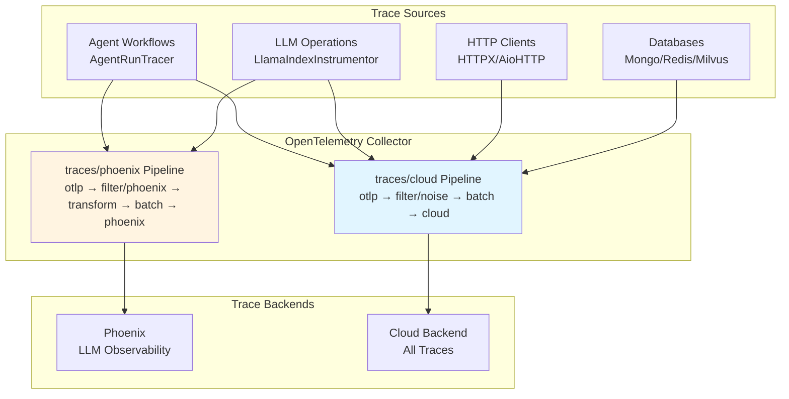

# Traces

## Overview

Traces follow individual requests through the AI Hub platform, showing the complete path from start to finish. Each
operation automatically receives a unique trace identifier that connects all related activities across services,
revealing exactly what happened, where time was spent, and how components collaborated.

The Swiss AI-Hub uses OpenTelemetry for tracing with specialized support for AI operations through OpenInference
semantic conventions. For details on the OpenTelemetry infrastructure, see
[OpenTelemetry Foundation](../0_opentelemetry/index.md).

---

## What We Capture

### Agent Workflow Execution (Operational)

Agent runs are traced with hierarchical span structures showing the complete workflow:

**Agent Spans**: Root span marking the start of an agent execution with user input and agent identification.

**Chain Spans**: Long-running span capturing the complete run duration from start to final output.

**Step Spans**: Individual workflow steps showing inputs, outputs, processing time, and semantic events.

**Trace Attributes**:

- Session/thread identifiers for conversation context
- Input and output values in JSON format
- OpenInference span kinds (AGENT, CHAIN, TOOL, LLM, RETRIEVER)
- Tags for filtering (thread_id, display_id, run_id)

**Implementation**: The `AgentRunTracer` creates a two-span approach with an initial AGENT span as parent and a final
CHAIN span capturing total duration.

### AI Model Operations (Operational)

LLM operations are automatically traced through LlamaIndex instrumentation:

**LLM Invocations**: Model selection, prompt construction, token usage, and response generation.

**Retrieval Operations**: Vector database queries, document retrieval, and context assembly.

**Embeddings**: Text embedding generation for document indexing and similarity search.

**Semantic Events**: AI-specific operations emit semantic events containing detailed metadata (token counts, model
names, retrieved documents) that enrich traces with domain-specific information.

**Visibility**: All AI operations appear in Phoenix tracing UI with specialized views for LLM performance analysis.

### HTTP and Database Operations (Operational)

Instrumented libraries automatically create spans for external service calls:

**HTTP Clients**: HTTPX and aiohttp requests with method, URL, status code, and timing.

**Databases**: MongoDB, PostgreSQL, and Redis operations with query information.

**Vector Database**: Milvus similarity searches and indexing operations.

**Filtering**: Health checks, metrics endpoints, and high-volume database queries are filtered from traces to reduce
noise.

---

## Trace Collection Architecture

### Collection Pipelines

The OpenTelemetry Collector processes traces through two specialized pipelines:

**traces/cloud**: Sends all traces to cloud backend

- Receiver: `otlp` (gRPC port 4317, HTTP port 4318)
- Processors: `filter/noise` (removes health checks, metrics endpoints, routine DB queries), `batch`
- Exporter: `otlp/cloud`

**traces/phoenix**: Sends AI-specific traces to local Phoenix

- Receiver: `otlp` (gRPC port 4317, HTTP port 4318)
- Processors: `filter/phoenix` (keeps only OpenInference spans), `transform/phoenix` (adds project metadata), `batch`
- Exporter: `otlp/phoenix` (port 6007)

For complete OpenTelemetry architecture details, see [OpenTelemetry Foundation](../0_opentelemetry/index.md).

### Instrumentation

Services automatically emit traces through OpenTelemetry instrumentation configured by `AihubInstrumentor`:

**Automatic Instrumentation** (via `AihubInstrumentor`):

- `AsyncioInstrumentor`: Async operations and task execution
- `HTTPXClientInstrumentor` / `AioHttpClientInstrumentor`: HTTP requests
- `PymongoInstrumentor` / `RedisInstrumentor` / `MilvusInstrumentor`: Database operations
- `LlamaIndexInstrumentor`: LLM and RAG operations with OpenInference conventions

**Custom Tracing** (via `AgentRunTracer`):

- Agent workflow execution with step-level detail
- Hierarchical span structures for complex workflows
- Context propagation across distributed agent operations

**Smart Tracing**: The `SmartTracer` respects `suppress_instrumentation` context, allowing selective tracing control.

---

## Business Benefits

### Performance Optimization

Traces reveal exactly where time is spent in each operation. Bottleneck identification becomes precise rather than
speculative. When document retrieval takes three seconds while AI processing takes 500ms, optimization priorities become
clear.

### Cost Management

AI operations include token usage and cost attribution through semantic events. Tracking which operations, users, or
departments consume the most AI resources enables data-driven decisions about model selection and feature pricing.

### Root Cause Analysis

Failed operations preserve complete context showing exactly where and why failures occurred. Error traces include stack
traces, input data, and the sequence of events leading to failure, dramatically reducing problem resolution time.

### AI Transparency

Traces show what information the AI considered when generating answers. Retrieved documents, token usage, and model
selection become visible, supporting regulatory compliance and building user trust.

---

## Accessing Trace Information

### Phoenix UI (Development)

Phoenix provides specialized LLM observability at `http://localhost:6006`:

**Features**:

- Timeline views showing span duration and relationships
- Token usage and cost tracking for LLM operations
- Retrieved document inspection for RAG systems
- Trace filtering by session, tags, or time range
- Performance analysis and latency distributions

**Focus**: AI-specific operations with OpenInference semantic conventions (LLM, CHAIN, AGENT, RETRIEVER, EMBEDDING
spans).

### Cloud Backend (Production)

Traces are exported to cloud observability platforms for long-term storage and analysis. The platform supports any
OTLP-compatible backend through configuration changes only.

For information on cloud backends and visualization, see [Dashboards](../2_dashboards/index.md).

---

## Security and Privacy

### Trace Content

Traces capture operation metadata, timing information, and routing details. Developers are responsible for ensuring
sensitive data is not included in trace attributes.

**Infrastructure**: OpenInference spans include session IDs, model names, token counts, and retrieved document metadata.

**Application Responsibility**: Developers must avoid logging actual document content, user messages, or other sensitive
information in custom trace attributes.

### Transmission Security

All traces are transmitted via encrypted channels (TLS/HTTPS) to prevent interception.

### Access Control

Trace access is restricted through observability platform role-based access control. Only authorized personnel can view
detailed traces.

---

## Integration with Platform Components

### Agent Workflows

The `AgentRunTracer` creates a structured tracing hierarchy for agent executions:

1. Initial AGENT span marks the workflow start
2. Individual STEP spans show each workflow step with inputs and outputs
3. Final CHAIN span captures the complete run duration
4. Semantic events from AI operations enrich traces with domain-specific metadata

### LLM Operations

LlamaIndex instrumentation automatically traces:

- Language model invocations with token counts
- RAG operations showing document retrieval and context assembly
- Vector database searches and similarity operations
- Embedding generation for document processing

### HTTP Services

FastAPI services automatically trace incoming requests when instrumented. Developers can add custom attributes to spans
for application-specific context.

---

## Platform Flexibility

While Phoenix provides LLM-specific observability during development, the OpenTelemetry foundation supports any
OTLP-compatible backend:

**Supported Platforms**:

- **Phoenix**: Open-source LLM observability (current local development)
- **SigNoz**: Open-source observability platform
- **Jaeger**: Distributed tracing focused on microservices
- **Tempo** (Grafana): Cloud-native distributed tracing
- **Datadog APM**: Commercial APM with comprehensive tracing
- **New Relic**: Application performance monitoring with AI insights

Switching backends requires only collector configuration changes. No application code modifications are needed.

For complete multi-platform details, see [OpenTelemetry Foundation](../0_opentelemetry/index.md) and
[Dashboards - Multi-Platform Support](../2_dashboards/index.md#multi-platform-support).

---

## Future Development

### Planned Enhancements

**Tail Sampling**: Intelligent sampling that keeps error traces and interesting operations while reducing storage costs.

**Custom Business Events**: Higher-level traces for business operations beyond technical implementation details.

**Cost Prediction**: Pre-execution cost estimates based on historical trace data and query complexity.

**Performance Budgets**: Automatic alerts when operations exceed expected duration based on historical patterns.

---

## Summary

The platform's distributed tracing delivers:

✅ **Operational Agent Tracing**: Complete workflow execution with step-level detail through AgentRunTracer

✅ **AI Operation Visibility**: LLM and RAG operations traced with OpenInference semantic conventions

✅ **Automatic Instrumentation**: HTTP, database, and async operations traced without manual code

✅ **Dual Backend Support**: Phoenix for LLM-specific development observability, cloud backend for production

✅ **Standards-Based**: OpenTelemetry ensures vendor flexibility through OTLP protocol

✅ **Performance Analysis**: Detailed timing information enables precise bottleneck identification

✅ **Privacy Foundation**: Infrastructure captures metadata; developers responsible for data protection

As tracing coverage expands, organizations gain increasingly detailed insights into platform performance, AI operations,
and user experience.
