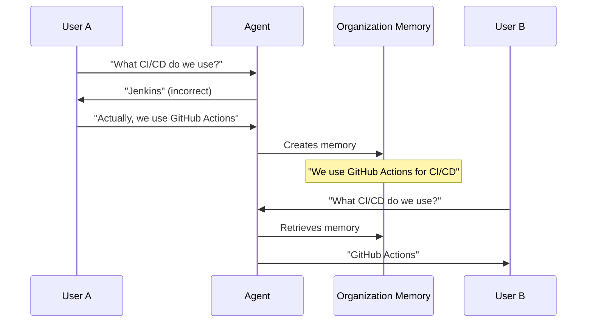

# Organisationsgedächtnis

Organisationsgedächtnis ermöglicht es KI-Agents, Wissen über Ihre gesamte Organisation hinweg zu teilen. Wenn ein Benutzer eine Unternehmensrichtlinie, Projektdetails oder Teamkonventionen dokumentiert, werden diese Informationen allen Agents, die alle Benutzer bedienen, zugänglich. Dieses geteilte Wissen schafft Konsistenz und baut eine institutionelle Wissensbasis auf, die den Mitarbeiterwechsel überdauert.

Im Gegensatz zum Benutzergedächtnis, das Agents an individuelle Präferenzen anpasst, stellt das Organisationsgedächtnis sicher, dass Agents auf derselben Faktenbasis arbeiten, wenn sie verschiedene Teammitglieder unterstützen.

## Warum geteiltes Gedächtnis wichtig ist

Wenn Sie einen Fehler eines Agents bezüglich einer Unternehmensrichtlinie korrigieren, kommt diese Korrektur allen zugute. Der Agent lernt nicht nur für Ihre Gespräche – er verbessert sich für alle Benutzer. Ohne geteiltes Gedächtnis müsste jeder Benutzer dieselbe Korrektur selbständig vornehmen. Mit dem Organisationsgedächtnis aktualisiert eine Korrektur die gemeinsame Wissensbasis, und alle Agents arbeiten sofort mit präzisen Informationen.

Verschiedene Benutzer, die nach demselben Projekt fragen, erhalten konsistente Informationen. Agents geben keine widersprüchlichen Antworten zu Unternehmensrichtlinien, Projektarchitekturen oder Teamprozeduren. Diese Konsistenz hilft beim Onboarding (neue Mitarbeiter interagieren mit Agents, die die Unternehmenskonventionen bereits verstehen), bei der teamübergreifenden Zusammenarbeit (Agents, die verschiedenen Abteilungen helfen, arbeiten auf der Grundlage derselben Fakten) und bei der Richtliniendurchsetzung (Agents wenden Richtlinien einheitlich an, unabhängig davon, wem sie helfen).

Wenn Teammitglieder gehen, bleibt ihr dokumentiertes Wissen erhalten. Die Erkenntnisse eines erfahrenen Entwicklers über architektonische Entscheidungen oder Systembeschränkungen bleiben als Organisationsgedächtnisse erhalten.

## Was gespeichert wird

Das Organisationsgedächtnis speichert Fakten, die für mehrere Benutzer relevant sind: Unternehmensrichtlinien (Deployment-Zeitpläne, Genehmigungs-Workflows, Sicherheitsanforderungen, Codierungsstandards), Projektinformationen (Architekturentscheidungen, Technologieauswahl, Teamzuweisungen), Teamkonventionen (Namenskonventionen, Dateiorganisationsmuster, Kommunikationsprotokolle) und technische Fakten („Unsere API verwendet OAuth2-Authentifizierung“, „Produktionsdatenbank ist PostgreSQL 15“, „Wir verwenden semantische Versionierung für alle Releases“).

Das Organisationsgedächtnis konzentriert sich auf objektive Fakten, die für alle gelten, nicht auf subjektive Präferenzen, die je nach Person variieren.

| Typ                 | Beispiel                                                     | Gedächtnistyp  |
| :------------------ | :----------------------------------------------------------- | :------------- |
| Geteilter Fakt      | „Wir deployen freitags in die Produktion“                    | Organisation   |
| Persönliche Präferenz | „Benutzer bevorzugt Deployment-Benachrichtigungen am Vortag“ | Benutzer       |
| Projektarchitektur  | „Projekt Falcon verwendet Microservices“                     | Organisation   |
| Individueller Fokus | „Benutzer arbeitet hauptsächlich am Auth-Service von Projekt Falcon“ | Benutzer       |

## Sichtbarkeit und Zugriff

Standardmäßig sind Organisationsgedächtnisse für alle Benutzer innerhalb Ihres Mandanten sichtbar. Diese Sichtbarkeit ist beabsichtigt – das Organisationsgedächtnis dient als gemeinsame Basis für alle Agents, unabhängig davon, welchem Benutzer sie helfen.

Große Organisationen können Organisationsgedächtnisse über Namespaces auf bestimmte Abteilungen oder Teams zuschneiden. Ein Engineering-Namespace könnte technische Architektur und Deployment-Verfahren enthalten, während ein HR-Namespace Informationen zu Leistungen und Onboarding-Verfahren enthält. Die Abteilungszuweisung verhindert eine Informationsüberflutung; ein Engineering-Agent muss keine HR-Richtliniengedächtnisse verarbeiten, wenn er bei Code-Reviews hilft.

::: info Namespace-Konfiguration
Die Namespace-Zuweisung wird von Administratoren auf Mandantenebene konfiguriert. Die meisten Organisationen verwenden einen einzelnen Namespace oder eine kleine Anzahl von Namespaces auf Abteilungsebene.
:::

Während die Anzeige von Organisationsgedächtnissen typischerweise allen Mandantenbenutzern offensteht, erfordert das Erstellen, Bearbeiten und Löschen von Organisationsgedächtnissen oft erhöhte Berechtigungen. Dies verhindert unbeabsichtigte Änderungen an gemeinsamem Wissen. Organisationen erteilen diese Berechtigungen typischerweise Wissensmanagern, Teamleitern oder Systemadministratoren.

## Organisationsgedächtnisse erstellen

Im Gegensatz zum Benutzergedächtnis, das Agents automatisch aus Gesprächen ableiten, erfordert das Organisationsgedächtnis eine explizite Dokumentation. Sie müssen bewusst entscheiden, Informationen als organisatorisches Wissen zu bewahren. Da Organisationsgedächtnisse alle Benutzer betreffen, stellt die Plattform sicher, dass Sie sich bewusst sind, dass Sie geteiltes Wissen und keine persönlichen Notizen erstellen.

Erstellen Sie Organisationsgedächtnisse, wenn Sie einen Agent korrigiert haben (damit andere Benutzer nicht auf denselben Fehler stoßen), wenn Sie denselben Kontext wiederholt erklären müssen, wenn neue Mitarbeiter diese Informationen benötigen würden oder wenn die Informationen objektiv wahr und für mehrere Benutzer relevant sind.

Greifen Sie über die Plattformoberfläche auf den **Organisationsgedächtnis**-Service zu. Erstellen Sie ein neues Gedächtnis, indem Sie die sachlichen Informationen, ausreichend Kontext, damit Agents wissen, wann diese anzuwenden sind, und gegebenenfalls Quellen (Richtliniendokumente, Architekturentscheidungen, offizielle Ankündigungen) bereitstellen. Die Plattform verfolgt automatisch, wer das Gedächtnis wann erstellt hat.

::: tip Effektive Gedächtnisse schreiben
Seien Sie spezifisch: „Wir deployen jeden Freitag um 17:00 MEZ in die Produktion“ ist besser als „Wir haben einen regelmäßigen Deployment-Zeitplan.“ Formulieren Sie aktuelle Fakten im Präsens: „Projekt Falcon verwendet Microservices“ anstatt „Wir haben uns entschieden, Microservices zu verwenden.“ Halten Sie Gedächtnisse fokussiert – eine Tatsache pro Gedächtnis. Wenn sich Fakten ändern, aktualisieren Sie das bestehende Gedächtnis, anstatt ein neues zu erstellen.
:::

## Anzeigen und Verwalten

Navigieren Sie zum **Organisationsgedächtnis**-Service, um das gesamte geteilte Wissen anzuzeigen. Die Oberfläche zeigt eine durchsuchbare Liste des dokumentierten Organisationswissens, Erstellungsdetails (wer welches Gedächtnis wann dokumentiert hat), Nutzungsverfolgung (wann Agents spezifische Gedächtnisse abrufen) und Beziehungen zwischen verwandten Informationen.

Verwenden Sie die semantische Suche, um relevante Informationen nach Bedeutung zu finden. Die Suche nach „Authentifizierung“ findet Gedächtnisse über OAuth2, SSO, API-Schlüssel und Identity Provider, auch wenn diese genauen Begriffe nicht in Ihrer Suche vorkommen.

Organisationsgedächtnisse sind durch Beziehungen verbunden. „Projekt Falcon“ bezieht sich auf „Microservices-Architektur“, die sich auf „NATS Messaging“ bezieht. Die Plattform visualisiert diese als Graph, der Ihnen hilft, den Kontext zu verstehen, Dokumentationslücken zu identifizieren und die Konsistenz zu überprüfen.

Wenn Sie über entsprechende Berechtigungen verfügen, können Sie Organisationsgedächtnisse bearbeiten, um Ungenauigkeiten zu korrigieren, geänderte Fakten zu aktualisieren oder Kontext hinzuzufügen. Bearbeitungen wirken sich sofort auf alle Benutzer aus. Das Löschen erfordert sorgfältige Überlegung – löschen Sie nur, wenn Informationen nicht mehr wahr sind, fehlerhaft erstellt wurden oder grundlegend falsch sind.

## Wie Korrekturen sich verbreiten

Die Korrektur eines Benutzers verbessert die Plattform für alle. Wenn ein Administrator ein Gedächtnis aktualisiert (zum Beispiel die Änderung des Deployment-Zeitplans von freitags auf donnerstags), arbeiten alle Agents sofort mit den neuen Informationen, ohne dass ein erneutes Training oder Konfigurationsupdates erforderlich sind.

## Praktische Beispiele

### Technische Dokumentation

Ihr Infrastrukturteam verwendet ein spezifisches Authentifizierungsmuster. Sie erstellen ein Gedächtnis: „Unsere Backend-Services authentifizieren sich mit OAuth2-Tokens, die vom zentralen Identitäts-Service unter auth.company.com ausgestellt werden. Alle API-Anfragen müssen das Token im Authorization-Header als Bearer-Token enthalten.“

Ein Code-Assistent, der einem Entwickler beim Aufbau eines neuen Service hilft, fügt automatisch den korrekten Authentifizierungscode ein. Ein Dokumentations-Agent beschreibt das korrekte Muster, ohne dass es ihm gesagt werden muss. Ein Onboarding-Agent erklärt neuen Entwicklern das Authentifizierungssystem präzise.

### Richtliniendurchsetzung

Ihre Organisation hat eine Sicherheitsrichtlinie zur Datenverarbeitung. Sie erstellen ein Gedächtnis: „Personenbezogene Daten (PII) dürfen niemals in Anwendungsprotokollen protokolliert werden. Verwenden Sie Datenmaskierung für alle Debugging-Szenarien, die PII betreffen.“

Code-Assistenten überprüfen proaktiv das PII-Logging in Code-Reviews. Debugging-Agents schlagen Datenmaskierung vor, wenn Entwickler PII-bezogene Probleme beheben müssen.

### Teamübergreifende Zusammenarbeit

Verschiedene Teams dokumentieren ihre Übergabeanforderungen. Marketing erstellt: „Produktstartkampagnen erfordern eine zweiwöchige Vorankündigung an das Engineering-Team für die Vorbereitung von Feature Flags.“ Engineering erstellt: „Feature Flags werden über LaunchDarkly verwaltet und erfordern die Genehmigung des Product Owners vor dem Deployment.“

Ein Marketing-Agent, der bei der Planung einer Kampagne hilft, berücksichtigt automatisch die zweiwöchige Engineering-Ankündigung. Ein Engineering-Agent, der bei Feature Flags hilft, weiß, dass Product Owner einbezogen werden müssen.

## Verantwortung und Genauigkeit

Falsche Organisationsgedächtnisse betreffen alle. Wenn Sie „Wir deployen freitags“ dokumentieren, obwohl der tatsächliche Zeitplan donnerstags ist, wird jeder Agent jedem Benutzer falsche Informationen liefern. Bevor Sie Organisationsgedächtnisse erstellen oder bearbeiten, überprüfen Sie die Genauigkeit der Informationen – konsultieren Sie maßgebliche Quellen, überprüfen Sie sie mit relevanten Teams oder bestätigen Sie sie mit Administratoren.

Im Gegensatz zu Konfigurationsänderungen, die ein Deployment erfordern könnten, wirken sich Updates des Organisationsgedächtnisses sofort auf Agents aus. Berücksichtigen Sie die Auswirkungen, bevor Sie Änderungen vornehmen. Wenn Sie unsicher sind, konsultieren Sie Kollegen oder Administratoren.

Organisationsgedächtnis funktioniert am besten, wenn es als kollaborativer Vermögenswert behandelt wird. Fachexperten dokumentieren ihr Domänenwissen, Teamleiter erfassen Prozeduren, erfahrene Mitarbeiter bewahren institutionelles Wissen, und neue Mitarbeiter stellen Fragen, die Dokumentationslücken aufdecken.

## Governance

Überprüfen Sie regelmäßig Organisationsgedächtnisse, um veraltete Informationen zu identifizieren, redundante Gedächtnisse zu konsolidieren, Dokumentationslücken zu schließen und die Klarheit zu verbessern. Viele Organisationen etablieren einen vierteljährlichen Überprüfungszyklus.

Die Plattform verfolgt alle Änderungen an Organisationsgedächtnissen – wer welches Gedächtnis wann erstellt hat, wer wann Bearbeitungen vorgenommen hat und was sich geändert hat. Dieser Audit-Trail unterstützt Compliance-Anforderungen und hilft, Fragen zu klären, wann Informationen aktualisiert wurden.

Überlegen Sie, ob Sie Gedächtnisse über abgeschlossene Projekte oder veraltete Systeme löschen oder aktualisieren sollten. Einige Organisationen ziehen es vor, Gedächtnisse zu aktualisieren, um anzugeben: „Projekt Falcon wurde im Q2 2024 abgeschlossen und befindet sich nicht mehr in aktiver Entwicklung“, anstatt sie zu löschen, um den historischen Kontext zu bewahren und gleichzeitig den aktuellen Status zu klären.

## Erste Schritte

Beginnen Sie damit, zu erkunden, welche Organisationsgedächtnisse bereits existieren. Dies hilft Ihnen zu verstehen, was Agents bereits wissen, Lücken zu identifizieren, wo Dokumentation wertvoll wäre, und zu erfahren, was Ihre Kollegen dokumentiert haben.

Die einfachste Zeit, Organisationsgedächtnis zu erstellen, ist, wenn Sie einen Agent korrigieren. Wenn ein Agent falsche Informationen angibt, dokumentieren Sie die Korrektur, damit andere Benutzer nicht auf denselben Fehler stoßen.

Wenn Sie ein Fachexperte sind, dokumentieren Sie wichtige Fakten über Ihr Gebiet. Sie brauchen keine umfassenden Anleitungen – einfache sachliche Aussagen funktionieren gut. „Die Kundendatenbank ist PostgreSQL 15“ ist wertvoll, auch ohne umfangreiche Details.

::: details Mechanismus zum Abrufen von Gedächtnissen
Agents rufen Organisationsgedächtnisse mittels semantischer Suche (Finden relevanten Kontexts nach Bedeutung) und Graphtraversierung (Verfolgen von Beziehungen zwischen Konzepten) ab. Dieser duale Ansatz stellt sicher, dass Agents sowohl direkt relevante Informationen als auch den verwandten Kontext finden.
:::

::: details Multi-Tenancy und Isolation
Organisationsgedächtnisse sind streng nach Mandant isoliert. Wenn Ihre Plattform mehrere Organisationen hostet, sind die Gedächtnisse jedes Mandanten vollständig getrennt.
:::

::: details Leistungsüberlegungen
Die Anzahl der Organisationsgedächtnisse beeinflusst die Agent-Performance nicht wesentlich. Agents rufen nur relevante Gedächtnisse durch semantisches Filtern ab. Organisationen mit Tausenden von Gedächtnissen erleben dieselben Antwortzeiten wie solche mit Dutzenden.
:::

::: details Integration mit dem Benutzergedächtnis
Agents verwenden beide Gedächtnistypen zusammen. Sie könnten Organisationsgedächtnisse über „Projekt Falcons Architektur“ abrufen und gleichzeitig das Benutzergedächtnis über „Benutzer ist spezialisiert auf den Authentifizierungs-Service von Projekt Falcon“ berücksichtigen, um kontextuell relevante Unterstützung zu bieten.
:::
