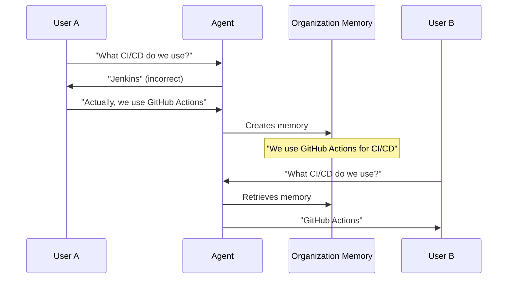

# Organisationsgedächtnis

Das Organisationsgedächtnis ermöglicht es KI-Agents, Wissen über Ihre gesamte Organisation hinweg zu teilen. Wenn ein
Benutzer eine Unternehmensrichtlinie, Projektdetails oder Teamkonventionen dokumentiert, werden diese Informationen
allen Agents zugänglich, die alle Benutzer bedienen. Dieses geteilte Wissen schafft Konsistenz und baut eine
institutionelle Wissensbasis auf, die den Mitarbeiterwechsel überdauert.

Im Gegensatz zum Benutzergedächtnis, das Agents an individuelle Präferenzen anpasst, stellt das Organisationsgedächtnis
sicher, dass Agents auf derselben faktischen Grundlage arbeiten, wenn sie verschiedene Teammitglieder unterstützen.

## Warum geteiltes Gedächtnis wichtig ist

Wenn Sie einen Fehler eines Agents bezüglich einer Unternehmensrichtlinie korrigieren, kommt diese Korrektur allen
zugute. Der Agent lernt nicht nur für Ihre Gespräche – er verbessert sich für alle Benutzer. Ohne geteiltes Gedächtnis
müsste jeder Benutzer dieselbe Korrektur unabhängig voneinander vornehmen. Mit dem Organisationsgedächtnis aktualisiert
eine Korrektur die gemeinsame Wissensbasis, und alle Agents arbeiten sofort mit präzisen Informationen.

Verschiedene Benutzer, die dasselbe Projekt anfragen, erhalten konsistente Informationen. Agents liefern keine
widersprüchlichen Antworten über Unternehmensrichtlinien, Projektarchitekturen oder Teamprozeduren. Diese Konsistenz
hilft beim Onboarding (neue Mitarbeiter interagieren mit Agents, die bereits Unternehmenskonventionen verstehen), bei
der teamübergreifenden Zusammenarbeit (Agents, die verschiedene Abteilungen unterstützen, arbeiten auf Basis derselben
Fakten) und bei der Richtliniendurchsetzung (Agents wenden Richtlinien einheitlich an, unabhängig davon, wem sie
helfen).

Wenn Teammitglieder das Unternehmen verlassen, bleibt ihr dokumentiertes Wissen erhalten. Die Erkenntnisse eines
erfahrenen Entwicklers über Architekturentscheidungen oder Systembeschränkungen bleiben als Organisationsgedächtnisse
bestehen.

## Was gespeichert wird

Das Organisationsgedächtnis speichert faktische Informationen, die für mehrere Benutzer relevant sind:
Unternehmensrichtlinien (Deployment-Zeitpläne, Genehmigungs-Workflows, Sicherheitsanforderungen, Kodierungsstandards),
Projektinformationen (Architekturentscheidungen, Technologiewahlen, Teamzuweisungen), Teamkonventionen
(Namenskonventionen, Dateiorganisationsmuster, Kommunikationsprotokolle) und technische Fakten ("Unsere API verwendet
OAuth2-Authentifizierung", "Die Produktionsdatenbank ist PostgreSQL 15", "Wir verwenden semantische Versionierung für
alle Releases").

Das Organisationsgedächtnis konzentriert sich auf objektive Fakten, die für alle gelten, nicht auf subjektive
Präferenzen, die von Person zu Person variieren.

| Typ                   | Beispiel                                                             | Gedächtnistyp |
| :-------------------- | :------------------------------------------------------------------- | :------------ |
| Gemeinsame Tatsache   | "Wir deployen freitags in die Produktion"                            | Organisation  |
| Persönliche Präferenz | "Benutzer bevorzugt Deployment-Benachrichtigungen einen Tag vorher"  | Benutzer      |
| Projektarchitektur    | "Projekt Falcon verwendet Microservices"                             | Organisation  |
| Individueller Fokus   | "Benutzer arbeitet hauptsächlich am Auth-Service von Projekt Falcon" | Benutzer      |

## Sichtbarkeit und Zugriff

Standardmäßig sind Organisationsgedächtnisse für alle Benutzer innerhalb Ihres Mandanten sichtbar. Diese Sichtbarkeit
ist beabsichtigt – das Organisationsgedächtnis dient als gemeinsame Grundlage für alle Agents, unabhängig davon, welchen
Benutzer sie unterstützen.

Große Organisationen können Organisationsgedächtnisse über Namespaces auf spezifische Abteilungen oder Teams
zuschneiden. Ein Engineering-Namespace könnte technische Architekturen und Deployment-Prozeduren enthalten, während ein
HR-Namespace Informationen zu Leistungen und Onboarding-Prozeduren enthält. Die Abteilungseinschränkung verhindert
Informationsüberflutung; ein Engineering-Agent muss keine HR-Richtlinien-Erinnerungen verarbeiten, wenn er bei
Code-Reviews hilft.

::: info Namespace-Konfiguration
Die Einschränkung durch Namespaces wird von Administratoren auf Mandantenebene konfiguriert. Die meisten Organisationen
verwenden einen einzelnen Namespace oder eine kleine Anzahl von Namespaces auf Abteilungsebene.
:::

Während das Anzeigen von Organisationsgedächtnissen in der Regel allen Mandantenbenutzern offensteht, erfordert das
Erstellen, Bearbeiten und Löschen von Organisationsgedächtnissen oft erhöhte Berechtigungen. Dies verhindert
versehentliche Änderungen an gemeinsamem Wissen. Organisationen erteilen diese Berechtigungen typischerweise
Wissensmanagern, Teamleitern oder Systemadministratoren.

## Erstellen von Organisationsgedächtnissen

Im Gegensatz zum Benutzergedächtnis, das Agents automatisch aus Gesprächen ableiten, erfordert das
Organisationsgedächtnis eine explizite Dokumentation. Sie müssen bewusst entscheiden, Informationen als
organisatorisches Wissen zu speichern. Da Organisationsgedächtnisse alle Benutzer betreffen, stellt die Plattform
sicher, dass Sie sich bewusst sind, dass Sie geteiltes Wissen und keine persönlichen Notizen erstellen.

Erstellen Sie Organisationsgedächtnisse, wenn Sie einen Agenten korrigiert haben (damit andere Benutzer nicht denselben
Fehler machen), wenn Sie denselben Kontext wiederholt erklären müssen, wenn neue Mitarbeiter diese Informationen
benötigen würden oder wenn die Informationen objektiv wahr und für mehrere Benutzer relevant sind.

Greifen Sie über die Plattformoberfläche auf den **Organisationsgedächtnis**-Service zu. Erstellen Sie eine neue
Erinnerung, indem Sie die faktischen Informationen, ausreichend Kontext für Agents, um zu wissen, wann sie anzuwenden
sind, und gegebenenfalls Quellen (Richtliniendokumente, Architekturentscheidungen, offizielle Ankündigungen)
bereitstellen. Die Plattform verfolgt automatisch, wer die Erinnerung wann erstellt hat.

::: tip Effektive Erinnerungen schreiben
Seien Sie spezifisch: "Wir deployen jeden Freitag um 17:00 Uhr MEZ in die Produktion" ist besser als "Wir haben einen
regelmäßigen Deployment-Zeitplan." Geben Sie aktuelle Fakten im Präsens an: "Projekt Falcon verwendet Microservices"
statt "Wir haben uns entschieden, Microservices zu verwenden." Halten Sie Erinnerungen fokussiert – eine Tatsache pro
Erinnerung. Wenn sich Fakten ändern, aktualisieren Sie die bestehende Erinnerung, anstatt eine neue zu erstellen.
:::

## Anzeigen und Verwalten

Navigieren Sie zum **Organisationsgedächtnis**-Service, um alle geteilten Kenntnisse anzuzeigen. Die Oberfläche zeigt
eine durchsuchbare Liste des dokumentierten organisationalen Wissens, Erstellungsdetails (wer welche Erinnerung wann
dokumentiert hat), Nutzungsverfolgung (wann Agents bestimmte Erinnerungen abrufen) und Beziehungen zwischen verwandten
Informationen.

Verwenden Sie die semantische Suche, um relevante Informationen nach Bedeutung zu finden. Die Suche nach
"Authentifizierung" findet Erinnerungen über OAuth2, SSO, API-Schlüssel und Identitätsanbieter, auch wenn diese genauen
Begriffe nicht in Ihrer Suche erscheinen.

Organisationsgedächtnisse sind durch Beziehungen miteinander verbunden. "Projekt Falcon" bezieht sich auf
"Microservices-Architektur", die sich auf "NATS Messaging" bezieht. Die Plattform visualisiert dies als Graphen und
hilft Ihnen so, den Kontext zu verstehen, Dokumentationslücken zu identifizieren und die Konsistenz zu überprüfen.

Wenn Sie entsprechende Berechtigungen haben, können Sie Organisationsgedächtnisse bearbeiten, um Ungenauigkeiten zu
korrigieren, geänderte Fakten zu aktualisieren oder Kontext hinzuzufügen. Das Bearbeiten wirkt sich sofort auf alle
Benutzer aus. Das Löschen erfordert sorgfältige Überlegung – löschen Sie nur, wenn Informationen nicht mehr zutreffen,
fehlerhaft erstellt wurden oder grundsätzlich falsch sind.

## Wie Korrekturen propagieren

Die Korrektur eines Benutzers verbessert die Plattform für alle. Wenn ein Administrator eine Erinnerung aktualisiert (z.
B. den Deployment-Zeitplan von Freitags auf Donnerstags ändert), arbeiten alle Agents sofort mit den neuen
Informationen, ohne dass ein erneutes Training oder Konfigurationsaktualisierungen erforderlich sind.

## Praktische Beispiele

### Technische Dokumentation

Ihr Infrastrukturteam verwendet ein spezifisches Authentifizierungsmuster. Sie erstellen eine Erinnerung: "Unsere
Backend-Services authentifizieren sich mit OAuth2-Tokens, die vom zentralen Identitätsdienst unter auth.company.com
ausgestellt werden. Alle API-Anfragen müssen das Token im Authorization-Header als Bearer-Token enthalten."

Ein Code-Assistent, der einem Entwickler beim Erstellen eines neuen Services hilft, fügt automatisch den korrekten
Authentifizierungscode ein. Ein Dokumentationsagent beschreibt das richtige Muster, ohne dass es ihm gesagt werden muss.
Ein Onboarding-Agent erklärt neuen Entwicklern das Authentifizierungssystem präzise.

### Richtliniendurchsetzung

Ihre Organisation hat eine Sicherheitsrichtlinie zum Umgang mit Daten. Sie erstellen eine Erinnerung: "Persönlich
identifizierbare Informationen (PII) dürfen niemals in Anwendungsprotokollen protokolliert werden. Verwenden Sie
Datenmaskierung für alle Debugging-Szenarien, die PII betreffen."

Code-Assistenten prüfen proaktiv auf PII-Protokollierung in Code-Reviews. Debugging-Agents schlagen Datenmaskierung vor,
wenn Entwickler PII-bezogene Probleme beheben müssen.

### Teamübergreifende Zusammenarbeit

Verschiedene Teams dokumentieren ihre Übergabeanforderungen. Marketing erstellt: "Produktstartkampagnen erfordern eine
2-wöchige Vorankündigung an das Engineering-Team für die Feature-Flag-Vorbereitung." Engineering erstellt:
"Feature-Flags werden über LaunchDarkly verwaltet und erfordern die Genehmigung des Product Owners vor dem Deployment."

Ein Marketing-Agent, der bei der Planung einer Kampagne hilft, berücksichtigt automatisch die 2-wöchige
Engineering-Vorankündigung. Ein Engineering-Agent, der bei Feature-Flags hilft, weiß, dass er Product Owner einbeziehen
muss.

## Verantwortung und Genauigkeit

Inkorrekte Organisationsgedächtnisse betreffen jeden. Wenn Sie dokumentieren "Wir deployen freitags", während der
tatsächliche Zeitplan donnerstags ist, liefert jeder Agent jedem Benutzer falsche Informationen. Bevor Sie
Organisationsgedächtnisse erstellen oder bearbeiten, überprüfen Sie die Richtigkeit der Informationen – konsultieren Sie
autoritative Quellen, fragen Sie relevante Teams oder bestätigen Sie dies mit Administratoren.

Im Gegensatz zu Konfigurationsänderungen, die ein Deployment erfordern könnten, wirken sich Aktualisierungen des
Organisationsgedächtnisses sofort auf Agents aus. Berücksichtigen Sie die Auswirkungen, bevor Sie Änderungen vornehmen.
Wenn Sie unsicher sind, wenden Sie sich an Kollegen oder Administratoren.

Das Organisationsgedächtnis funktioniert am besten, wenn es als kollaboratives Asset behandelt wird. Fachexperten
dokumentieren ihr Domänenwissen, Teamleiter erfassen Prozeduren, erfahrene Mitarbeiter bewahren institutionelles Wissen,
und neue Mitarbeiter stellen Fragen, die Dokumentationslücken aufzeigen.

## Governance

Überprüfen Sie regelmäßig Organisationsgedächtnisse, um veraltete Informationen zu identifizieren, redundante
Erinnerungen zu konsolidieren, Dokumentationslücken zu schließen und die Klarheit zu verbessern. Viele Organisationen
etablieren einen vierteljährlichen Überprüfungszyklus.

Die Plattform verfolgt alle Änderungen an Organisationsgedächtnissen – wer welche Erinnerung erstellt hat, wer wann
Änderungen vorgenommen hat und was sich geändert hat. Dieser Audit-Trail unterstützt Compliance-Anforderungen und hilft
bei der Klärung von Fragen, wann Informationen aktualisiert wurden.

Überlegen Sie, ob Sie Erinnerungen über abgeschlossene Projekte oder eingestellte Systeme löschen oder aktualisieren
sollten. Einige Organisationen ziehen es vor, Erinnerungen zu aktualisieren, um anzugeben: "Projekt Falcon wurde im 2.
Quartal 2024 abgeschlossen und befindet sich nicht mehr in aktiver Entwicklung", anstatt sie zu löschen, um den
historischen Kontext zu bewahren und gleichzeitig den aktuellen Zustand zu klären.

## Erste Schritte

Beginnen Sie damit, zu erkunden, welche Organisationsgedächtnisse bereits existieren. Dies hilft Ihnen zu verstehen, was
Agents bereits wissen, Lücken zu identifizieren, in denen Dokumentation wertvoll wäre, und zu erfahren, was Ihre
Kollegen dokumentiert haben.

Der einfachste Zeitpunkt, Organisationsgedächtnis zu erstellen, ist, wenn Sie einen Agenten korrigieren. Wenn ein Agent
falsche Informationen angibt, dokumentieren Sie die Korrektur, damit andere Benutzer nicht denselben Fehler machen.

Wenn Sie ein Fachexperte sind, dokumentieren Sie wichtige Fakten über Ihr Fachgebiet. Sie benötigen keine umfassenden
Anleitungen – einfache, faktische Aussagen funktionieren gut. "Die Kundendatenbank ist PostgreSQL 15" ist auch ohne
umfangreiche Details wertvoll.

::: details Mechanismus zum Abrufen von Erinnerungen
Agents rufen Organisationsgedächtnisse mithilfe der semantischen Suche (Finden relevanter Kontexte nach Bedeutung) und
des Graph-Traversals (Verfolgen von Beziehungen zwischen Konzepten) ab. Dieser duale Ansatz stellt sicher, dass Agents
sowohl direkt relevante Informationen als auch verwandten Kontext finden.
:::

::: details Multi-Tenancy und Isolation
Organisationsgedächtnisse sind streng nach Mandanten isoliert. Wenn Ihre Plattform mehrere Organisationen hostet, sind
die Erinnerungen jedes Mandanten vollständig getrennt.
:::

::: details Leistungsüberlegungen
Die Anzahl der Organisationsgedächtnisse beeinflusst die Agentenleistung nicht erheblich. Agents rufen nur relevante
Erinnerungen durch semantische Filterung ab. Organisationen mit Tausenden von Erinnerungen erleben dieselben
Antwortzeiten wie solche mit Dutzenden.
:::

::: details Integration mit dem Benutzergedächtnis
Agents verwenden beide Gedächtnistypen zusammen. Sie könnten Organisationsgedächtnis über "die Architektur von Projekt
Falcon" abrufen, während sie auch Benutzergedächtnis über "Benutzer spezialisiert sich auf den Authentifizierungsdienst
von Projekt Falcon" berücksichtigen, um kontextuell relevante Unterstützung zu bieten.
:::
