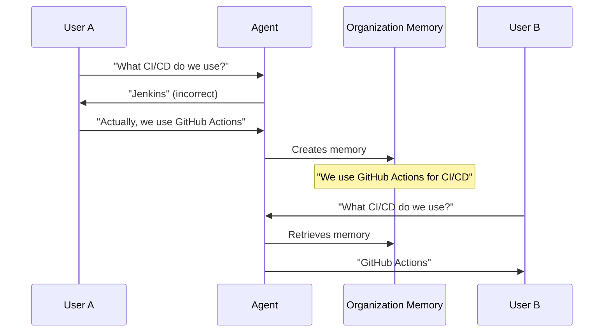

# Organization memory

Organization memory enables AI agents to share knowledge across your entire organization. When one user documents a
company policy, project detail, or team convention, that information becomes available to all agents serving all users.
This shared knowledge creates consistency and builds an institutional knowledge base that survives employee turnover.

Unlike user memory, which adapts agents to individual preferences, organization memory ensures agents work from the same
factual foundation when assisting different team members.

## Why shared memory matters

When you correct an agent's mistake about company policy, that correction benefits everyone. The agent doesn't just
learn for your conversations – it improves for all users. Without shared memory, every user would need to make the same
correction independently. With organization memory, one correction updates the shared knowledge base and all agents
immediately operate with accurate information.

Different users asking about the same project receive consistent information. Agents don't provide contradictory answers
about company policies, project architectures, or team procedures. This consistency helps with onboarding (new employees
interact with agents that already understand company conventions), cross-team collaboration (agents helping different
departments work from the same facts), and policy enforcement (agents apply policies uniformly regardless of who they're
assisting).

When team members leave, their documented knowledge remains. An experienced developer's insights about architectural
decisions or system limitations survive as organization memories.

## What gets remembered

Organization memory stores factual information relevant to multiple users: company policies (deployment schedules,
approval workflows, security requirements, coding standards), project information (architecture decisions, technology
choices, team assignments), team conventions (naming conventions, file organization patterns, communication protocols),
and technical facts ("Our API uses OAuth2 authentication," "Production database is PostgreSQL 15," "We use semantic
versioning for all releases").

Organization memory focuses on objective facts that apply to everyone, not subjective preferences that vary by
individual.

| Type                 | Example                                                 | Memory type  |
| -------------------- | ------------------------------------------------------- | ------------ |
| Shared fact          | "We deploy to production on Fridays"                    | Organization |
| Personal preference  | "User prefers deployment notifications the day before"  | User         |
| Project architecture | "Project Falcon uses microservices"                     | Organization |
| Individual focus     | "User works primarily on Project Falcon's auth service" | User         |

## Visibility and access

By default, organization memories are visible to all users within your tenant. This visibility is intentional –
organization memory serves as common ground for all agents regardless of which user they're assisting.

Large organizations can scope organization memories to specific departments or teams through namespaces. An engineering
namespace might contain technical architecture and deployment procedures, while an HR namespace contains benefits
information and onboarding procedures. Department scoping prevents information overload; an engineering agent doesn't
need to process HR policy memories when helping with code reviews.

::: info Namespace configuration
Namespace scoping is configured at the tenant level by administrators. Most organizations use a single namespace or a
small number of department-level namespaces.
:::

While viewing organization memories is typically open to all tenant users, creating, editing, and deleting organization
memories often requires elevated permissions. This prevents accidental modifications to shared knowledge. Organizations
typically grant these permissions to knowledge managers, team leads, or system administrators.

## Creating organization memories

Unlike user memory, which agents infer automatically from conversations, organization memory requires explicit
documentation. You must deliberately choose to preserve information as organizational knowledge. Because organization
memories affect all users, the platform ensures you're aware you're creating shared knowledge rather than personal
notes.

Create organization memories when you've corrected an agent (so other users don't encounter the same error), when you
find yourself explaining the same context repeatedly, when new employees would need this information, or when the
information is objectively true and relevant to multiple users.

Access the **Organization Memory** service through the platform interface. Create a new memory by providing the factual
information, enough context for agents to know when it applies, and sources if applicable (policy documents,
architecture decisions, official announcements). The platform automatically tracks who created the memory and when.

::: tip Writing effective memories
Be specific: "We deploy to production every Friday at 17:00 CET" beats "We have a regular deployment schedule." State
current facts in present tense: "Project Falcon uses microservices" rather than "We decided to use microservices." Keep
memories focused – one fact per memory. When facts change, update the existing memory rather than creating a new one.
:::

## Viewing and managing

Navigate to the **Organization Memory** service to view all shared knowledge. The interface shows a searchable list of
documented organizational knowledge, creation details (who documented each memory and when), usage tracking (when agents
retrieve specific memories), and relationships between related pieces of information.

Use semantic search to find relevant information by meaning. Searching for "authentication" will find memories about
OAuth2, SSO, API keys, and identity providers, even if those exact terms don't appear in your search.

Organization memories connect through relationships. "Project Falcon" relates to "microservices architecture" which
relates to "NATS messaging." The platform visualizes these as a graph, helping you understand context, identify
documentation gaps, and verify consistency.

If you have appropriate permissions, you can edit organization memories to correct inaccuracies, update changed facts,
or add context. Editing affects all users immediately. Deleting requires careful consideration – delete only when
information is no longer true, was created in error, or is fundamentally incorrect.

## How corrections propagate

One user's correction improves the platform for everyone. When an administrator updates a memory (for example, changing
deployment schedule from Fridays to Thursdays), all agents instantly operate with the new information without retraining
or configuration updates.

## Practical examples

### Technical documentation

Your infrastructure team uses a specific authentication pattern. You create a memory: "Our backend services authenticate
using OAuth2 tokens issued by the central identity service at auth.company.com. All API requests must include the token
in the Authorization header as a Bearer token."

A code assistant helping a developer build a new service automatically includes proper authentication code. A
documentation agent describes the correct pattern without being told. An onboarding agent explains the authentication
system accurately to new developers.

### Policy enforcement

Your organization has a security policy about data handling. You create a memory: "Personally identifiable information
(PII) must never be logged in application logs. Use data masking for any debugging scenarios that involve PII."

Code assistants proactively check for PII logging in code reviews. Debugging agents suggest data masking when developers
need to troubleshoot PII-related issues.

### Cross-team collaboration

Different teams document their handoff requirements. Marketing creates: "Product launch campaigns require 2-week notice
to the engineering team for feature flag preparation." Engineering creates: "Feature flags are managed through
LaunchDarkly and require product owner approval before deployment."

A marketing agent helping plan a campaign automatically accounts for the 2-week engineering notice. An engineering agent
helping with feature flags knows to involve product owners.

## Responsibility and accuracy

Incorrect organization memories affect everyone. If you document "We deploy on Fridays" when the actual schedule is
Thursdays, every agent will provide wrong information to every user. Before creating or editing organization memories,
verify the information is accurate – consult authoritative sources, check with relevant teams, or confirm with
administrators.

Unlike configuration changes that might require deployment, organization memory updates affect agents instantly.
Consider the impact before making changes. If you're uncertain, consult with colleagues or administrators.

Organization memory works best when treated as a collaborative asset. Subject matter experts document their domain
knowledge, team leads capture procedures, experienced employees preserve institutional knowledge, and new employees ask
questions that reveal documentation gaps.

## Governance

Periodically review organization memories to identify outdated information, consolidate redundant memories, fill
documentation gaps, and improve clarity. Many organizations establish a quarterly review cycle.

The platform tracks all changes to organization memories – who created each memory, who made edits and when, and what
changed. This audit trail supports compliance requirements and helps resolve questions about when information was
updated.

Consider whether to delete or update memories about completed projects or deprecated systems. Some organizations prefer
updating memories to state "Project Falcon was completed in Q2 2024 and is no longer in active development" rather than
deleting them, preserving historical context while clarifying current state.

## Getting started

Start by exploring what organization memories already exist. This helps you understand what agents already know,
identify gaps where documentation would be valuable, and learn what your colleagues have documented.

The easiest time to create organization memory is when you correct an agent. If an agent states incorrect information,
document the correction so other users don't encounter the same error.

If you're a subject matter expert, document key facts about your area. You don't need comprehensive guides – simple
factual statements work well. "The customer database is PostgreSQL 15" is valuable even without extensive detail.

::: details Memory retrieval mechanism
Agents retrieve organization memories using semantic search (finding relevant context by meaning) and graph traversal
(following relationships between concepts). This dual approach ensures agents find both directly relevant information
and related context.
:::

::: details Multi-tenancy and isolation
Organization memories are strictly isolated by tenant. If your platform hosts multiple organizations, each tenant's
memories are completely separate.
:::

::: details Performance considerations
The number of organization memories doesn't significantly affect agent performance. Agents retrieve only relevant
memories through semantic filtering. Organizations with thousands of memories experience the same response times as
those with dozens.
:::

::: details Integration with user memory
Agents use both memory types together. They might retrieve organization memory about "Project Falcon's architecture"
while also considering user memory about "User specializes in Project Falcon's authentication service" to provide
contextually relevant assistance.
:::
