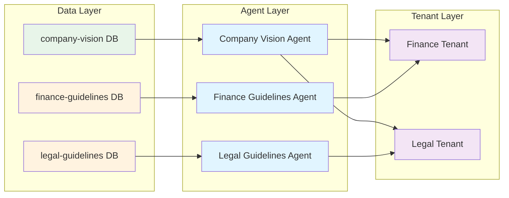

# Funktionsweise von Multi-Tenancy

Das Verständnis von Multi-Tenancy erfordert ein Verständnis dafür, wie die Plattform Personen, Agents und Daten trennt.
Diese Trennung schafft sowohl große Flexibilität als auch wichtige Verantwortlichkeiten.

## Ein praktisches Beispiel

Betrachten wir eine realistische Bereitstellung, um zu sehen, wie die einzelnen Teile zusammenpassen.

### Das Szenario

Ihr Unternehmen hat fünf Abteilungen (Recht, Finanzen, Personal, Betrieb, Vertrieb). Sie möchten, dass jeder auf
Informationen zur Unternehmensvision und -identität zugreifen kann, aber jede Abteilung soll nur ihre eigenen internen
Richtlinien sehen.

### Schritt 1: Systemadministratoren bereiten die Daten vor

Die Systemadministratoren (Sysadmins) der Plattform richten Datenpipelines ein:

- Eine Pipeline nimmt die Dokumente zur Unternehmensvision, -mission und -identität in eine Wissensdatenbank namens
  `company-vision` auf.
- Fünf separate Pipelines verarbeiten die internen Richtlinien jeder Abteilung in eigene Datenbanken:
  `legal-guidelines`, `finance-guidelines`, `hr-guidelines`, `operations-guidelines`, `sales-guidelines`.

Sie haben nun sechs Wissensdatenbanken, die geparste, durchsuchbare Dokumente enthalten.

### Schritt 2: Sysadmins deployen die Agent-Klasse

Die Sysadmins deployen eine RAG (Retrieval-Augmented Generation) Agent-Klasse auf der Plattform. Diese Agent-Klasse ist
konfigurierbar – Sie können jeder Instanz einen benutzerdefinierten System-Prompt geben und festlegen, welche
Wissensdatenbank sie durchsuchen soll.

Die Agent-Klasse selbst enthält keine Daten und weiß nicht, welche Datenbank sie verwenden soll. Sie ist eine Vorlage,
die auf Konfiguration wartet.

### Schritt 3: Manager erstellen Agent-Instanzen

Personen im Management-Tenant können keinen Agent-Code deployen, aber sie können Instanzen aus deployten Klassen
erstellen. Sie erstellen sechs Agent-Instanzen:

- **Company Vision Agent**: Konfiguriert, um nur `company-vision` zu durchsuchen.
- **Legal Guidelines Agent**: Konfiguriert, um nur `legal-guidelines` zu durchsuchen.
- **Finance Guidelines Agent**: Konfiguriert, um nur `finance-guidelines` zu durchsuchen.
- **HR Guidelines Agent**: Konfiguriert, um nur `hr-guidelines` zu durchsuchen.
- **Operations Guidelines Agent**: Konfiguriert, um nur `operations-guidelines` zu durchsuchen.
- **Sales Guidelines Agent**: Konfiguriert, um nur `sales-guidelines` zu durchsuchen.

Jede Agent-Instanz hat ihren Datenzugriff fest in ihrer Konfiguration verankert. Der Company Vision Agent kann nur
Dokumente der Unternehmensvision durchsuchen. Der Finance Guidelines Agent kann nur Finanzrichtlinien durchsuchen. Dies
wird nicht dadurch bestimmt, wer mit dem Agent chattet – es wird bei der Erstellung der Instanz konfiguriert.

### Schritt 4: Manager konfigurieren den Tenant-Zugriff

Die Manager haben bereits fünf Abteilungs-Tenants erstellt. Nun konfigurieren sie, welche Agents jeder Tenant sehen
kann:

- Legal Tenant: Kann den Company Vision Agent und den Legal Guidelines Agent nutzen.
- Finance Tenant: Kann den Company Vision Agent und den Finance Guidelines Agent nutzen.
- HR Tenant: Kann den Company Vision Agent und den HR Guidelines Agent nutzen.
- Operations Tenant: Kann den Company Vision Agent und den Operations Guidelines Agent nutzen.
- Sales Tenant: Kann den Company Vision Agent und den Sales Guidelines Agent nutzen.

Alle Tenants können den Company Vision Agent nutzen (unternehmensweite Informationen). Jeder Tenant kann nur seinen
eigenen Richtlinien-Agent nutzen.

### Was dadurch entsteht

Ein Benutzer im Finance Tenant sieht in seiner Oberfläche zwei Agents: den Company Vision Agent und den Finance
Guidelines Agent. Er kann mit beiden chatten. Er kann nicht sehen, dass der Legal Guidelines Agent existiert.

Der Finance Guidelines Agent wird nur Fragen aus der Finanzrichtlinien-Datenbank beantworten. Auch wenn der Benutzer im
Finance Tenant diesen Agent nutzen kann, kann er dennoch nicht auf HR- oder Legal-Richtlinien zugreifen – weil der Agent
selbst keinen Zugriff auf diese Datenbanken hat.

## Der kontraintuitive Teil

::: warning Benutzer greifen nicht direkt auf Daten zu
**Benutzer in Abteilungs-Tenants können überhaupt nicht auf den Wissensdienst zugreifen.**

Der Finance Tenant hat keine Berechtigung, Wissensdatenbanken einzusehen, Dokumente zu durchsuchen oder den
Ingestion-Status zu sehen. Dennoch können Benutzer im Finance Tenant mit Agents chatten, die auf Wissensdatenbanken
zugreifen.

Das erscheint widersprüchlich, ist aber beabsichtigt.
:::

Reguläre Benutzer profitieren nicht davon, rohe, geparste Dokumente und Datenbank-Metadaten zu sehen. Das sind
administrative Informationen. Benutzer profitieren davon, mit Agents zu chatten, die Fragen mithilfe dieser Daten
beantworten.

Die Manager im Management-Tenant haben Zugriff auf den Wissensdienst. Sie können alle sechs Datenbanken sehen,
überprüfen, ob Dokumente korrekt aufgenommen wurden, und Probleme beheben. Aber sie sind Administratoren, keine
Endbenutzer.

## Warum Agents Berechtigungen nicht erben

Untersuchen wir, warum der Finance Guidelines Agent auf die `finance-guidelines`-Datenbank zugreifen kann, selbst wenn
der Benutzer, der mit ihm chattet, dies nicht kann.

**Agents laufen autonom**. Ein Agent könnte:

- Nach einem Zeitplan ohne Benutzerbeteiligung ausgeführt werden
- An einem Slack-Kanal mit mehreren Benutzern teilnehmen, die unterschiedliche Berechtigungen haben
- Durch einen Prozess im Hintergrund ausgelöst werden
- Daten aus mehreren Quellen benötigen, um eine Antwort zu synthetisieren

Wenn Agents Benutzerberechtigungen erben würden, könnten Sie nichts davon zuverlässig tun. Das Verhalten des Agents
würde sich danach ändern, wer ihn ausgelöst hat, was Tests oder Vorhersagen unmöglich machen würde.

**Agents werden für bestimmte Zwecke konfiguriert.** Wenn Sie den Finance Guidelines Agent erstellen, sagen Sie: „Dieser
Agent existiert, um Fragen zu Finanzrichtlinien zu beantworten.“ Sein gesamter Zweck erfordert den Zugriff auf diese
spezifische Datenbank. Der Zugriff ist Teil seiner Identität.

**Sie steuern den Zugriff, indem Sie den Agent-Zugriff steuern.** Möchten Sie jemandem Zugriff auf Finanzrichtlinien
geben? Geben Sie ihm Zugriff auf den Finance Guidelines Agent. Möchten Sie diesen widerrufen? Entfernen Sie seinen
Zugriff auf diesen Agent. Der Datenzugriff folgt dem Agent-Design, nicht den Benutzerberechtigungen.

## Vorteile dieses Modells

Diese Trennung zwischen Agent-Funktionalitäten und Benutzerberechtigungen schafft leistungsstarke Möglichkeiten:

**Informationen über Grenzen hinweg synthetisieren.** Erstellen Sie einen Agent, der auf mehrere Datenbanken zugreift,
die Benutzer nicht einzeln sehen können. Ein C-Level Executive Agent könnte alle Abteilungsrichtlinien durchsuchen, um
strategische Fragen zu beantworten. Nur Führungskräfte erhalten Zugriff auf diesen Agent.

**Vorhersagbares Agent-Verhalten.** Der Finance Guidelines Agent verhält sich identisch, egal ob der CFO oder ein
Praktikant mit ihm chattet. Dies macht Tests aussagekräftig und reduziert Sicherheitsbedenken hinsichtlich variablen
Verhaltens.

**Granulare Zugriffskontrolle.** Statt zu verwalten, wer auf welche Dokumente zugreifen kann, verwalten Sie, wer auf
welche Agents zugreifen kann. Dies stimmt mit der tatsächlichen Arbeitsweise der Menschen überein – sie müssen Aufgaben
erledigen, nicht Dokumentenrepositorien durchsuchen.

**Klare Audit-Trails.** Wenn jemand dem Finance Guidelines Agent eine Frage stellt, wissen Sie genau, auf welche Daten
zugegriffen wurde (nur Finanzrichtlinien). Sie müssen keine Benutzerberechtigungen überprüfen, um zu verstehen, was
passiert ist.

## Verantwortlichkeiten dieses Modells

::: details Konfigurationsverantwortlichkeiten
Diese Flexibilität erfordert eine sorgfältige Konfiguration:

**Erstellen Sie keine übermäßig weit gefassten Agents.** Sie könnten einen RAG Agent mit Zugriff auf alle sechs
Datenbanken erstellen und ihn jedem geben. Aber jetzt können Sie nicht mehr kontrollieren, wer was sieht – jeder kann
nach allem fragen. Der Agent wird zu einem Sicherheits-Bypass. Erstellen Sie stattdessen fokussierte Agents mit engem
Datenzugriff und geben Sie diese Agents den entsprechenden Benutzern.

**Verstehen Sie das Vertrauensmodell.** Wenn Sie jemandem Zugriff auf einen Agent geben, vertrauen Sie ihm das an, was
dieser Agent tun kann. Der Finance Guidelines Agent kann alle Finanzrichtlinien lesen. Wenn Sie jemandem Zugriff auf
diesen Agent geben, kann er ihn nach jeder Finanzrichtlinie fragen. Der Agent respektiert keine Zeilen- oder
Feldberechtigungen – er ist so konfiguriert, dass er auf die gesamte `finance-guidelines`-Datenbank zugreift.

**Testen Sie den Datenzugriff des Agents.** Erstellen Sie Testinstanzen von Agents in isolierten Tenants. Überprüfen
Sie, ob sie nur auf die beabsichtigten Daten zugreifen können. Gehen Sie nicht davon aus, dass ein Agent
Benutzerberechtigungen respektiert – das tut er nicht.

**Dokumentieren Sie Agent-Zwecke klar.** Zukünftige Administratoren müssen verstehen, worauf jeder Agent zugreifen kann
und warum. „Finance Guidelines Agent – greift nur auf die finance-guidelines-Datenbank zu – für die Finanzabteilung“ ist
klar. „Helper Agent“ ist es nicht.

**Überprüfen Sie den Zugriff regelmäßig.** Personen wechseln Rollen. Abteilungen reorganisieren sich. Der Agent, der vor
sechs Monaten sinnvoll war, könnte jetzt unangemessenen Zugriff gewähren.
:::

## Was ist mit dem Service-Zugriff?

Sie fragen sich vielleicht, warum Manager Zugriff auf den Wissensdienst haben, aber Abteilungsbenutzer nicht.

Services sind administrative Fähigkeiten. Der Wissensdienst ermöglicht es Ihnen, Ingestion-Logs, geparste Dokumente,
Chunking-Details und Datenbank-Metadaten einzusehen. Diese Informationen sind für die Fehlerbehebung und Überwachung
nützlich, aber für Endbenutzer bedeutungslos.

Ein Benutzer im Finance Tenant muss nicht wissen, dass sich 47 Dokumente in der `finance-guidelines`-Datenbank befinden
oder dass die letzte Ingestion am Dienstag um 3 Uhr morgens stattfand. Er muss dem Finance Guidelines Agent Fragen
stellen und Antworten erhalten.

Services sind für Administratoren. Agents sind für Benutzer. Diese Trennung hält die Benutzeroberfläche für Benutzer
sauber und gibt Administratoren gleichzeitig die Werkzeuge, die sie benötigen.

## Design Ihrer Tenant-Struktur

Mit diesem Verständnis können Sie Ihre Tenants bewusst gestalten:

**Sysadmin Tenant**: Voller Service-Zugriff, kann Agents und Prozesse deployen, kann Wissensdatenbanken und Pipelines
erstellen. Dies sind technische Experten, die die Plattforminfrastruktur warten.

**Management Tenant**: Zugriff auf administrative Services (Benutzerverwaltung, Tenant-Verwaltung, Erstellung von
Agent-Instanzen, Evaluationsservices). Kann konfigurieren, aber nicht deployen. Dies sind Business-Administratoren, die
die Plattform für Benutzer verwalten.

**Abteilungs-Tenants**: Nur Zugriff auf relevante Agents, kein Service-Zugriff, keine administrativen Fähigkeiten. Dies
sind Endbenutzer, die Aufgaben über Agents erledigen.

Sie können Ebenen hinzufügen oder diese Struktur ändern. Vielleicht benötigt Ihre Rechtsabteilung einige administrative
Funktionen innerhalb ihres eigenen Tenants. Vielleicht benötigen Führungskräfte eine eigene Ebene mit speziellen Agents.
Die Struktur passt sich Ihren Bedürfnissen an.

Der Schlüssel ist das Verständnis, dass **der Datenzugriff über Agents erfolgt**, nicht direkt über Benutzer. Entwerfen
Sie Ihre Agents zuerst basierend auf den Datenzugriffsanforderungen und weisen Sie die Agents dann Tenants zu, basierend
darauf, wer diese Funktionen nutzen können soll.
