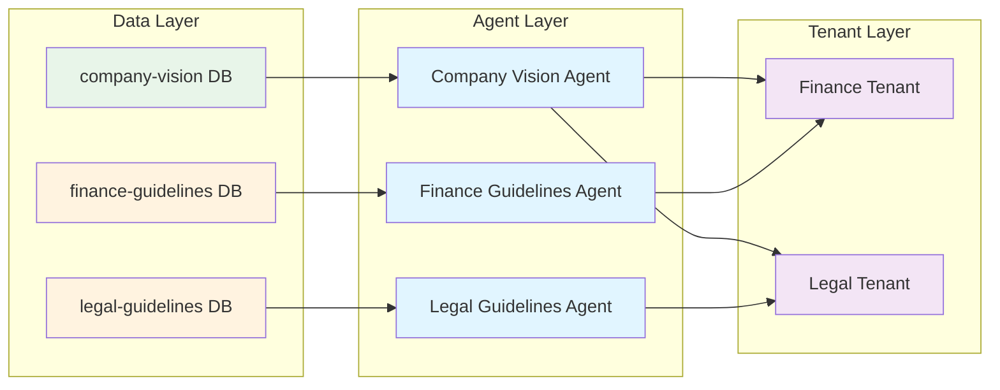

# How multi-tenancy works

Understanding multi-tenancy requires understanding how the platform separates people, agents, and data. This separation
creates both powerful flexibility and important responsibilities.

## A practical example

Let's walk through a realistic deployment to see how the pieces fit together.

### The scenario

Your company has five departments (Legal, Finance, HR, Operations, Sales). You want everyone to access information about
the company's vision and identity, but each department should only see their own internal guidelines.

### Step 1: System administrators prepare the data

The platform's system administrators (sysadmins) set up data pipelines:

- One pipeline ingests the company vision, mission, and identity documents into a knowledge database called
  `company-vision`
- Five separate pipelines process each department's internal guidelines into their own databases: `legal-guidelines`,
  `finance-guidelines`, `hr-guidelines`, `operations-guidelines`, `sales-guidelines`

You now have six knowledge databases containing parsed, searchable documents.

### Step 2: Sysadmins deploy the agent class

The sysadmins deploy a RAG (Retrieval-Augmented Generation) agent class to the platform. This agent class is
configurable - you can give each instance a custom system prompt and specify which knowledge database it should search.

The agent class itself doesn't contain any data or know which database to use. It's a template waiting to be configured.

### Step 3: Managers create agent instances

People in the management tenant can't deploy agent code, but they can create instances from deployed classes. They
create six agent instances:

- **Company Vision Agent**: Configured to search only `company-vision`
- **Legal Guidelines Agent**: Configured to search only `legal-guidelines`
- **Finance Guidelines Agent**: Configured to search only `finance-guidelines`
- **HR Guidelines Agent**: Configured to search only `hr-guidelines`
- **Operations Guidelines Agent**: Configured to search only `operations-guidelines`
- **Sales Guidelines Agent**: Configured to search only `sales-guidelines`

Each agent instance has its data access baked into its configuration. The Company Vision Agent can only search company
vision documents. The Finance Guidelines Agent can only search finance guidelines. This isn't determined by who's
chatting with the agent - it's configured when the instance is created.

### Step 4: Managers configure tenant access

The managers have already created five department tenants. Now they configure which agents each tenant can see:

- Legal tenant: Can use Company Vision Agent and Legal Guidelines Agent
- Finance tenant: Can use Company Vision Agent and Finance Guidelines Agent
- HR tenant: Can use Company Vision Agent and HR Guidelines Agent
- Operations tenant: Can use Company Vision Agent and Operations Guidelines Agent
- Sales tenant: Can use Company Vision Agent and Sales Guidelines Agent

All tenants can use the Company Vision Agent (company-wide information). Each tenant can only use their own guidelines
agent.

### What this creates

A user in the Finance tenant sees two agents in their interface: Company Vision Agent and Finance Guidelines Agent. They
can chat with either one. They cannot see that the Legal Guidelines Agent exists.

The Finance Guidelines Agent will only answer questions from the finance guidelines database. Even though the user in
Finance tenant can use this agent, they still can't access HR or Legal guidelines - because the agent itself can't
access those databases.

## The counterintuitive part

::: warning Users Don't Access Data Directly
**Users in department tenants cannot access the knowledge service at all.**

The Finance tenant doesn't have permission to view knowledge databases, browse documents, or see ingestion status. Yet
users in Finance tenant can chat with agents that access knowledge databases.

This seems contradictory but it's intentional.
:::

Regular users don't benefit from seeing raw parsed documents and database metadata. That's administrative information.
Users benefit from chatting with agents that answer questions using that data.

The managers in the management tenant do have access to the knowledge service. They can see all six databases, verify
documents were ingested correctly, and troubleshoot issues. But they're administrators, not end users.

## Why agents don't inherit permissions

Let's explore why the Finance Guidelines Agent can access the `finance-guidelines` database even when the user chatting
with it can't.

**Agents run autonomously**. An agent might:

- Execute on a schedule with no user involved
- Participate in a Slack channel with multiple users who have different permissions
- Be triggered by a process that runs in the background
- Need to access data from multiple sources to synthesize an answer

If agents inherited user permissions, you couldn't do any of this reliably. The agent's behavior would change based on
who triggered it, making it impossible to test or predict.

**Agents are configured for specific purposes**. When you create the Finance Guidelines Agent, you're saying "this agent
exists to answer questions about finance guidelines." Its entire purpose requires accessing that specific database. The
access is part of its identity.

**You control access by controlling agent access**. Want to give someone access to finance guidelines? Give them access
to the Finance Guidelines Agent. Want to revoke it? Remove their access to that agent. The data access follows the agent
design, not the user permissions.

## Benefits of this model

This separation between agent capabilities and user permissions creates powerful possibilities:

**Synthesize information across boundaries**. Create an agent that accesses multiple databases users can't see
individually. A C-level Executive Agent might search across all department guidelines to answer strategic questions.
Only executives get access to this agent.

**Predictable agent behavior**. The Finance Guidelines Agent behaves identically whether the CFO or an intern chats with
it. This makes testing meaningful and reduces security concerns about variable behavior.

**Granular access control**. Instead of managing who can access which documents, you manage who can access which agents.
This aligns with how people actually work - they need to accomplish tasks, not browse document repositories.

**Clear audit trails**. When someone asks the Finance Guidelines Agent a question, you know exactly which data was
accessed (finance guidelines only). You don't need to check user permissions to understand what happened.

## Responsibilities of this model

::: details Configuration Responsibilities
This flexibility requires thoughtful configuration:

**Don't create overly broad agents**. You could create one RAG agent with access to all six databases and give it to
everyone. But now you can't control who sees what - everyone can ask about everything. The agent becomes a security
bypass. Instead, create focused agents with narrow data access and give those agents to appropriate users.

**Understand the trust model**. When you give someone access to an agent, you're trusting them with whatever that agent
can do. The Finance Guidelines Agent can read all finance guidelines. If you give someone access to that agent, they can
ask it about any finance guideline. The agent won't respect row-level or field-level permissions - it's configured to
access the entire `finance-guidelines` database.

**Test agent data access**. Create test instances of agents in isolated tenants. Verify they can only access intended
data. Don't assume an agent respects user permissions - it doesn't.

**Document agent purposes clearly**. Future administrators need to understand what each agent can access and why.
"Finance Guidelines Agent - accesses finance-guidelines database only - for Finance department" is clear. "Helper Agent"
is not.

**Review access regularly**. People change roles. Departments reorganize. The agent that made sense six months ago might
grant inappropriate access now.
:::

## What about service access?

You might wonder why managers have access to the knowledge service but department users don't.

Services are administrative capabilities. The knowledge service lets you see ingestion logs, parsed documents, chunking
details, and database metadata. This information is useful for troubleshooting and monitoring but meaningless for end
users.

A user in the Finance tenant doesn't need to know that 47 documents are in the `finance-guidelines` database or that the
last ingestion happened Tuesday at 3 AM. They need to ask the Finance Guidelines Agent questions and get answers.

Services are for administrators. Agents are for users. This separation keeps the interface clean for users while giving
administrators the tools they need.

## Designing your tenant structure

With this understanding, you can design your tenants intentionally:

**Sysadmin tenant**: Full service access, can deploy agents and processes, can create knowledge databases and pipelines.
These are technical experts who maintain the platform infrastructure.

**Management tenant**: Access to administrative services (user management, tenant management, agent instance creation,
evaluation services). Can configure but can't deploy. These are business administrators who manage the platform for
users.

**Department tenants**: Access to relevant agents only, no service access, no administrative capabilities. These are end
users who accomplish work through agents.

You can add layers or modify this structure. Maybe your Legal department needs some administrative capabilities within
their own tenant. Maybe executives need their own tier with special agents. The structure adapts to your needs.

The key is understanding that **data access flows through agents**, not directly to users. Design your agents first
based on data access requirements, then assign agents to tenants based on who should be able to use those capabilities.
