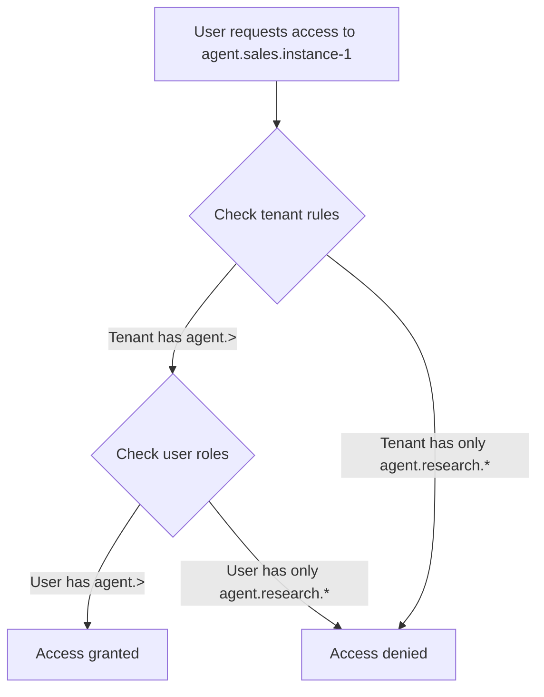

# Multi-tenancy concept

The platform uses a tenant-scoped authorization model. Users authenticate once through your identity provider (Azure AD, Google Workspace, etc.), then select a tenant workspace. Roles and permissions are resolved within that tenant context.

## Authentication vs authorization

Identity providers handle only authentication - verifying who you are. The platform manages all authorization locally - what you can do and what you can access.

When you sign in through Azure AD or another provider, the platform:

1. Verifies your identity (email, name, unique ID)
2. Creates or updates your user profile
3. Does not sync roles or permissions from the identity provider

Roles exist only within the platform's database, scoped to specific tenants. This separation lets you use any identity provider without configuring complex role mappings in each external system.

## Tenant structure

A tenant contains:

**Name and description** that identify the tenant in the UI

**Access rules** that define the maximum scope for all users in the tenant

**Roles** specific to that tenant with their own access rules

**User assignments** mapping users to roles within the tenant

Tenants share the platform infrastructure (agents, knowledge bases, models) but control which parts users can access through access rules.

## Access rule hierarchy

Access rules use a hierarchical pattern: `aihub.[user|admin].<service>.<resource>.<identifier>`

Examples:
- `aihub.user.agent.>` - Access all agents
- `aihub.user.agent.research.*` - Access all instances of the research agent class
- `aihub.admin.service.role` - Admin access to role management
- `aihub.user.knowledge.hr-docs.policies` - Access the policies namespace in hr-docs knowledge base

Wildcards work at any level:
- `*` matches one segment (`agent.research.*` matches any research agent instance)
- `>` matches remaining segments (`agent.>` matches all agents of all types)

## Two-layer permission model

Every permission check evaluates two sets of rules:

**Tenant access rules** define what exists in the tenant's world. If a tenant has `aihub.user.agent.research.*`, only research agents are visible to anyone in that tenant.

**User role rules** define what the user can do within the tenant's boundaries. A user with `aihub.user.agent.>` normally accesses all agents, but the tenant rules constrain this to only research agents.

The tenant rules act as a ceiling. A user's permissions can never exceed what the tenant allows.

## Role scoping

Roles exist either globally or within a specific tenant:

**Global roles** (tenant_id = null) apply to system operations. The superuser role is global and grants platform-wide admin access.

**Tenant roles** (tenant_id = specific tenant) apply only within that tenant. A "Manager" role in Tenant A is separate from a "Manager" role in Tenant B. They can have different access rules.

Role names can duplicate across tenants. The combination of tenant + role name must be unique.

## User membership

Users can belong to multiple tenants simultaneously. Each membership specifies:

- Which tenant
- Which roles the user has in that tenant

A user might be:
- Admin in the development tenant
- Viewer in the production tenant
- Not a member of the customer-demo tenant

The UI shows which tenants you belong to. Switch between them to change your working context.

## System roles

System roles are created during platform initialization and cannot be deleted. They include:

- `AIHubSuperuser` - Global admin access (tenant_id = null)
- Default tenant roles like `AIHubUser`, `AIHubAdmin` created in the default tenant

These roles are marked with `is_system_role = True` to prevent accidental deletion.

## First user advantage

The first person to sign in after platform deployment receives admin roles automatically in the default tenant. This ensures someone can administer the system immediately.

Configure this behavior with environment variables:
- `FIRST_USER_SIGNUP_DEFAULT_ROLES` - Roles for the first user (default: AIHubAdmin)
- `USER_SIGNUP_DEFAULT_ROLES` - Roles for subsequent users (default: AIHubUser)

## Tenant selection flow

When you log in:

1. The platform fetches which tenants you belong to
2. If you belong to one tenant, it selects automatically
3. If you belong to multiple tenants, you choose which to work in
4. Your selection persists in browser storage

All API requests include your selected tenant in the `X-Tenant-Id` header. The backend resolves your permissions within that tenant.

Switch tenants using the selector in the top navigation bar. The UI refetches all data for the new tenant context.

::: warning
Switching tenants requires reloading data. Open forms or unsaved work may be lost.
:::
