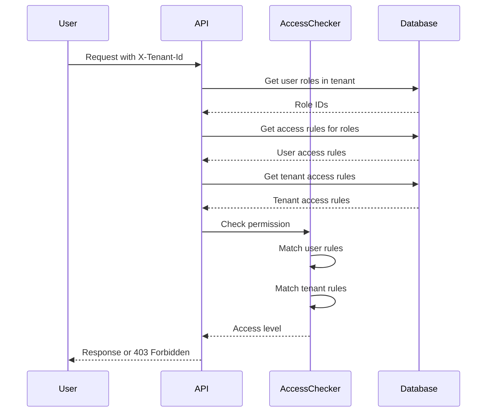

# Access control model

The platform enforces access control through a combination of tenant boundaries and role-based permissions. Understanding this model helps you design effective tenant and role structures.

## Permission resolution

Every API request includes an `X-Tenant-Id` header identifying the user's current tenant. The backend resolves permissions in this sequence:

1. Extract user identity from authentication token
2. Look up user's roles within the specified tenant
3. Collect all access rules from those roles
4. Retrieve the tenant's access rules
5. Evaluate the requested permission against both user rules and tenant rules

Access is granted only if:
- The tenant's access rules permit the resource
- The user's role rules permit the action
- The user is a member of the tenant



## Access levels

The system recognizes three access levels:

**Access denied**: The user lacks permission entirely. Returns 403 Forbidden.

**User access**: The user can view and interact with the resource as a regular user.

**Admin access**: The user can modify, configure, or delete the resource.

Admin access requires matching an `aihub.admin.*` rule. Admin rules automatically grant the equivalent user access. A user with `aihub.admin.agent.>` can also access resources requiring `aihub.user.agent.>`.

## Wildcard matching

Access rules support two wildcards:

**Single-level wildcard** (`*`) matches exactly one segment:
- `agent.research.*` matches `agent.research.instance-1` and `agent.research.instance-2`
- Does not match `agent.research.test.instance-1` (too many segments)

**Multi-level wildcard** (`>`) matches one or more segments:
- `agent.>` matches `agent.research.instance-1`, `agent.analysis.special.test-2`, and any other agent path
- Must appear only at the end of a rule

The system evaluates wildcards part by part. A user rule matches when each segment aligns with the permission being checked.

## Tenant ceiling effect

Tenant access rules act as a maximum boundary. User permissions cannot exceed tenant permissions.

Example scenario:

**Tenant access rules**:
```
aihub.user.agent.research.*
```

**User role rules**:
```
aihub.user.agent.>
```

The user can access only research agents. Their role grants broader access, but the tenant constrains it to research agents only.

The system checks tenant rules first. If the tenant doesn't allow a resource, the permission check fails immediately without examining user roles.

## Service-level permissions

Each service (agents, processes, knowledge, etc.) requires a service-level permission: `aihub.user.service.<service-name>`

Controllers check this permission before any resource-specific checks. A user needs:
- Service access (`aihub.user.service.agent`)
- Resource access (`aihub.user.agent.research.instance-1`)

This two-tier check lets you grant or revoke access to entire services. A tenant without `aihub.user.service.agent` in its rules makes all agents inaccessible regardless of more specific agent rules.

## Path parameter substitution

Permission templates use placeholders for dynamic resources:
```
aihub.user.agent.{agent_class}.{agent_id}
```

The system substitutes actual values from the request:
- User requests `/api/v1/agents/research/instance-alpha`
- Permission becomes `aihub.user.agent.research.instance-alpha`
- Checked against user and tenant access rules

This pattern extends to all resources (knowledge bases, processes, threads).

## Permission inheritance

Permissions don't inherit across tenants. A user's admin role in one tenant grants no privileges in another tenant.

Permissions don't inherit within the access rule hierarchy. A user with `aihub.user.agent.research.*` cannot access `aihub.admin.agent.research.*` without an explicit admin rule.

Admin rules grant equivalent user access automatically. A user with `aihub.admin.agent.>` can access resources requiring either `aihub.admin.agent.*` or `aihub.user.agent.*`.

## Superuser bypass

The global superuser role bypasses tenant restrictions entirely. Superusers:
- Don't need to select a tenant
- Aren't checked against tenant access rules
- Can access all resources across all tenants
- Have admin access everywhere

Configure the superuser through environment variables. Use sparingly - superuser access exists for platform administration, not regular operations.

## Common access patterns

### Read-only access to specific resources

Grant users access to view specific agents without modification:
```
aihub.user.agent.support.faq-bot
aihub.user.knowledge.support-docs.>
```

### Departmental isolation

Create tenant with department-specific access rules:
```
aihub.user.agent.finance.*
aihub.user.knowledge.finance-docs.>
aihub.user.process.finance.*
```

All users in this tenant, regardless of their roles, can only access finance resources.

### Tiered access within tenant

Define roles for different access levels:

**Viewer role**:
```
aihub.user.agent.>
aihub.user.knowledge.>
```

**Power user role**:
```
aihub.user.agent.>
aihub.user.knowledge.>
aihub.user.process.>
aihub.admin.knowledge.team-docs.>
```

**Admin role**:
```
aihub.admin.>
```

### Cross-functional teams

User belongs to multiple tenants with different roles:
- Engineering tenant: `aihub.admin.agent.engineering.*` (can create and manage engineering agents)
- Company-wide tenant: `aihub.user.>` (can use all shared resources)

## Debugging access issues

When a user reports access problems:

1. Verify they selected the correct tenant (check tenant switcher)
2. Check the tenant's access rules permit the resource
3. Confirm the user has roles in that tenant
4. Review the access rules in those roles
5. Check for typos in access rule patterns

The UI displays permission errors with the specific permission that failed. Use this to trace which access rule is missing.

Common mistakes:
- Forgetting the service-level permission (`aihub.user.service.agent`)
- Using uppercase letters in access rules (rules are lowercase only)
- Placing `>` in the middle of a rule (must be at the end)
- Granting `aihub.user.*` when admin access is needed (`aihub.admin.*`)

## Security boundaries

Tenant access rules create hard boundaries. Code cannot bypass these checks - they're enforced at the controller level before any business logic executes.

Users cannot escalate their privileges within a tenant. Adding roles requires admin access to user management (`aihub.admin.service.user`).

Users cannot access resources in other tenants. The `X-Tenant-Id` header determines the context, and users can only send headers for tenants they belong to.

API tokens inherit the user's tenant memberships. Creating a token doesn't grant cross-tenant access - the token works only in tenants where the user is a member.

## Performance considerations

The access checker caches compiled access rules per request. Checking multiple permissions for the same user and tenant in one request is efficient.

Switching tenants triggers cache invalidation in the frontend. Large datasets may take time to reload.

Role changes take effect immediately without cache delays. Users see new permissions on their next request.

Complex access rule patterns (many wildcards, long paths) don't significantly impact performance. The matching algorithm is optimized for hierarchical patterns.
