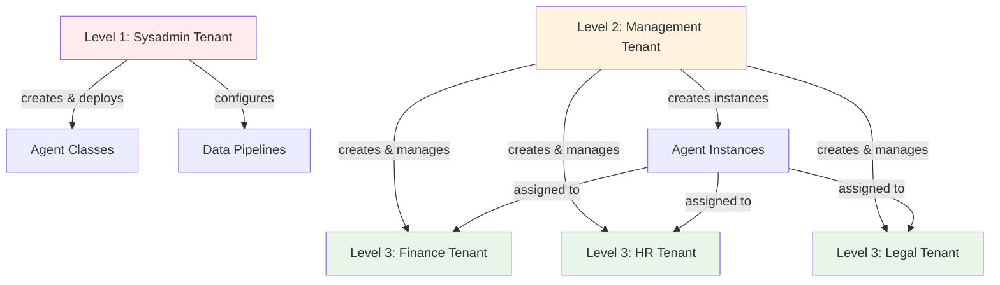

# Mandanten einrichten

Das Einrichten von Mandanten erfordert die Planung Ihrer Organisationsstruktur und das Verständnis, welche
Berechtigungen jede Benutzergruppe haben soll. Dieses Kapitel führt Sie durch praktische Ansätze zum Mandantendesign.

## Ihre Mandantenstruktur planen

Beginnen Sie damit, die Gruppen zu identifizieren, die getrennte Arbeitsbereiche benötigen. Gängige Muster sind:

**Organisationshierarchie**: Systemadministratoren, Manager und Abteilungen erhalten jeweils einen eigenen Mandanten.
Dies trennt technische Operationen von der Geschäftsadministration und der täglichen Arbeit.

**Geschäftseinheiten**: Marketing, Vertrieb, Engineering, Operations erhalten jeweils einen Mandanten. Sie teilen sich
einige Ressourcen (unternehmensweite Agents), haben aber einheitsspezifische Agents.

**Kundenisolation**: Jeder Kunde erhält einen eigenen Mandanten. Nützlich für Service Provider oder SaaS-Deployments,
bei denen Kunden niemals die Daten oder Agents anderer Kunden sehen dürfen.

**Umgebungsseparation**: Entwicklung, Staging und Produktion laufen als separate Mandanten. Entwickler können im
Entwicklungs-Mandanten experimentieren, ohne Produktionsbenutzer zu beeinträchtigen.

**Compliance-Grenzen**: Gesetzliche Anforderungen können eine Trennung zwischen Entitäten, geografischen Regionen oder
Datenklassifikationen vorschreiben. Jede regulierte Grenze wird zu einem Mandanten.

## Das Drei-Ebenen-Muster

Die meisten Deployments profitieren von drei Ebenen von Mandanten:



### Ebene 1: Systemadministration

Erstellen Sie einen Mandanten für Personen, die die Plattforminfrastruktur warten. Diese Benutzer:

- Deployen Agent- und Prozesscode auf die Plattform
- Konfigurieren Daten-Pipelines für das Einlesen von Dokumenten
- Verwalten Plattform-Services und -Monitoring
- Haben vollen Zugriff auf alle Plattformfunktionen

Dies sind typischerweise 2-5 Personen: Ihr DevOps-Team, leitende Entwickler oder IT-Mitarbeiter, die für die Plattform
verantwortlich sind.

### Ebene 2: Geschäftsadministration

Erstellen Sie einen Mandanten für Personen, die die Plattform für Geschäftsbenutzer administrieren. Diese Benutzer:

- Erstellen und konfigurieren neue Mandanten
- Fügen Benutzer zu Mandanten hinzu und weisen Rollen zu
- Erstellen Agent-Instanzen aus deployten Klassen
- Überwachen die Agent-Performance und führen Evaluationen durch
- Verwalten Wissensdatenbanken (Ingestionsstatus anzeigen, Probleme beheben)

Dies sind Business Analysts, Projektmanager oder Abteilungsleiter, die die Bedürfnisse der Organisation verstehen, aber
keinen Code schreiben.

### Ebene 3: Endbenutzer

Erstellen Sie Mandanten für Personen, die Agents nutzen, um ihre Aufgaben zu erledigen. Diese Benutzer:

- Chatten mit Agents, die für ihre Rolle relevant sind
- Nehmen an Prozessen teil, die ihre Abteilung betreffen
- Können keine administrativen Oberflächen sehen oder Agent-Instanzen erstellen

Das ist jeder andere in Ihrer Organisation.

## Einen Mandanten erstellen

Navigieren Sie in der Admin-Oberfläche zu **Service** → **Mandanten**. Sie müssen sich in einem Mandanten befinden, der
administrativen Zugriff auf den Mandanten-Service hat.

Klicken Sie auf **Mandant erstellen**. Sie benötigen drei Informationen:

**Name**: Wählen Sie einen klaren und beschreibenden Namen. „Finanzabteilung“, „Kunde - Acme Corp“,
„Produktionsumgebung“. Benutzer sehen diesen Namen, wenn sie auswählen, in welchem Mandanten sie arbeiten möchten.

**Beschreibung**: Erklären Sie, wofür dieser Mandant dient. „Benutzer der Finanzabteilung – Zugriff auf
Finanzberichts-Agents und Abteilungsrichtlinien.“ Dies hilft sowohl aktuellen als auch zukünftigen Administratoren, den
Zweck des Mandanten zu verstehen.

**Umfang**: Definieren Sie, auf welche Ressourcen dieser Mandant zugreifen kann. Für das Drei-Ebenen-Muster:

- Sysadmin-Ebene: Voller Plattformzugriff
- Management-Ebene: Administrative Services, aber keine Deployment-Fähigkeiten
- Endbenutzer-Ebene: Spezifische Agents und Prozesse, keine Services

## Umfang der Mandanten festlegen

Der Umfang des Mandanten bestimmt den maximalen Zugriff, den jeder in diesem Mandanten haben kann. Stellen Sie es sich
vor wie das Ziehen einer Grenze um Ressourcen.

Für einen Mandanten der Finanzabteilung könnten Sie den Umfang wie folgt festlegen:

- Finanzbezogene Agents (Berichts-Agents, Richtlinien-Agents, Genehmigungs-Workflows)
- Finanz-Wissensdatenbanken (für Manager, die Probleme bei der Datenaufnahme beheben)
- Spezifische Prozesse (Budgetgenehmigungs-Workflow, Spesenabrechnung)

Ein Benutzer im Finanz-Mandanten kann nicht auf HR-Agents zugreifen, selbst wenn Sie ihm eine Admin-Rolle innerhalb des
Finanz-Mandanten zuweisen. Die Mandantengrenze verhindert dies.

### Breiter oder enger Start

Sie haben zwei Ansätze:

**Breiter Umfang**: Geben Sie dem Mandanten anfänglich Zugriff auf alles. Benutzer können alle Agents, alle Services und
alle Prozesse sehen. Wenn Sie erfahren, was sie tatsächlich benötigen, schränken Sie den Umfang ein, indem Sie den
Zugriff auf ungenutzte Ressourcen entfernen.

**Enger Umfang**: Geben Sie dem Mandanten nur Zugriff auf spezifische Ressourcen. Wenn Benutzer weitere Funktionen
anfordern, erweitern Sie den Umfang schrittweise.

Ein breiter Umfang ist anfänglich einfacher, erfordert aber später mehr Bereinigung. Ein enger Umfang ist sicherer, aber
Benutzer werden Zugriff anfordern, sobald sie Bedürfnisse entdecken.

Für Endbenutzer-Mandanten (Abteilungen, Kunden) beginnen Sie mit einem engen Umfang. Diese Benutzer benötigen keine
breite Sichtbarkeit – sie benötigen spezifische Tools. Für Management-Mandanten beginnen Sie mit einem breiten Umfang,
da diese Benutzer Flexibilität bei der Administration der Plattform benötigen.

## Rollen innerhalb von Mandanten konfigurieren

Nachdem Sie den Mandanten erstellt haben, konfigurieren Sie die Rollen, die Benutzer in diesem Mandanten haben können.
Rollen definieren, was Benutzer innerhalb der Mandantengrenzen tun können.

Für einen Abteilungs-Mandanten könnten Sie erstellen:

**Standardbenutzer**: Kann mit Abteilungs-Agents chatten, an Prozessen teilnehmen, aber nichts erstellen oder ändern.

**Teamleiter**: Kann Agent-Instanzen erstellen, Agents für sein Team konfigurieren, Evaluationsergebnisse anzeigen, aber
keine Benutzer verwalten oder Mandanten-Einstellungen ändern.

**Abteilungsadministrator**: Volle Kontrolle innerhalb des Abteilungs-Mandanten – kann Benutzer hinzufügen, Rollen
zuweisen, Agents erstellen und alle Abteilungsressourcen verwalten.

Diese Rollen gelten nur innerhalb dieses Mandanten. Ein Benutzer, der „Abteilungsadministrator“ in Finanzen ist, hat
keine Berechtigungen im HR-Mandanten, es sei denn, sie wurden explizit erteilt.

## Benutzer zu Mandanten hinzufügen

Nachdem Sie Rollen erstellt haben, fügen Sie Benutzer dem Mandanten hinzu und weisen ihnen Rollen zu.

Suchen Sie Benutzer nach E-Mail oder Namen. Wenn ein Benutzer noch nicht existiert (er hat sich noch nicht angemeldet),
können Sie ihn trotzdem hinzufügen. Sein Profil wird erstellt, wenn er sich zum ersten Mal über Ihren Identitätsprovider
authentifiziert.

Benutzer können mehreren Mandanten angehören. Jemand könnte sein:

- Standardbenutzer in seinem Abteilungs-Mandanten
- Teamleiter in einem funktionsübergreifenden Projekt-Mandanten
- Admin in einem Test-Mandanten zum Ausprobieren neuer Funktionen

## Standardverhalten des Mandanten

Wenn sich jemand zum ersten Mal anmeldet, tritt er automatisch dem Standard-Mandanten mit Standardbenutzerrollen bei.
Konfigurieren Sie dieses Verhalten mit Umgebungsvariablen:

```bash
AIHUB_USER_SIGNUP_DEFAULT_TENANT="default"
AIHUB_USER_SIGNUP_DEFAULT_ROLES="AIHubUser"
FIRST_AIHUB_USER_SIGNUP_DEFAULT_ROLES="AIHubAdmin"
```

Die erste Person, die sich anmeldet, erhält Admin-Rollen, wodurch sichergestellt wird, dass jemand die Plattform sofort
administrieren kann. Nachfolgende Benutzer erhalten Standardrollen.

Diese automatische Zuweisung erfolgt nur einmal pro Benutzer. Danach fügen Sie sie bei Bedarf explizit zu anderen
Mandanten hinzu.

## Gängige Konfigurationen

### Einzelunternehmen mit Abteilungen

Sysadmin-Mandant → Management-Mandant → Ein Mandant pro Abteilung

Manager erstellen Abteilungs-Mandanten und konfigurieren, auf welche Agents jede Abteilung zugreifen kann.
Abteilungsbenutzer sehen nur die Ressourcen ihrer Abteilung.

### Multi-Kunden-SaaS

Sysadmin-Mandant → Management-Mandant → Ein Mandant pro Kunde

Jeder Kunden-Mandant ist isoliert. Kunden können die Agents oder Daten anderer Kunden nicht sehen. Manager onboarden
neue Kunden, indem sie einen Mandanten erstellen, relevante Agents konfigurieren und die Benutzer dieses Kunden
hinzufügen.

### Beratungsunternehmen

Sysadmin-Mandant → Management-Mandant → Ein Mandant pro Kundenprojekt

Projekt-Mandanten geben Beratern Zugriff auf kundenspezifische Agents und Wissen. Wenn ein Projekt endet, archivieren
Sie den Mandanten. Wenn ein Berater einem neuen Projekt beitritt, fügen Sie ihn dem Mandanten dieses Projekts hinzu.

### Entwicklungs-Workflow

Sysadmin-Mandant → Dev-Mandant → Staging-Mandant → Produktions-Mandant

Entwickler arbeiten im Dev-Mandanten mit gelockerten Kontrollen. Der Staging-Mandant spiegelt die Produktion für Tests
wider. Der Produktions-Mandant hat strenge Zugriffskontrollen. Dieselben Agents, derselbe Code, unterschiedliche
Mandanten für unterschiedliche Zwecke.

## Mandanten-Lebenszyklus

Mandanten bleiben bestehen, bis sie explizit gelöscht werden. Sie können:

**Einen Mandanten archivieren**: Entfernen Sie alle Benutzer, behalten Sie aber den Mandanten und seine Rollen. Nützlich
für abgeschlossene Projekte oder inaktive Kunden. Niemand kann darauf zugreifen, aber die Konfiguration bleibt erhalten,
falls Sie ihn reaktivieren müssen.

**Einen Mandanten löschen**: Entfernen Sie den Mandanten, alle seine Rollen und alle Benutzerzuordnungen. Permanent. Nur
möglich, nachdem zuerst alle Benutzer entfernt wurden.

::: warning Schutz des Standard-Mandanten
Der Standard-Mandant kann nicht gelöscht werden. Dies stellt sicher, dass die Plattform immer mindestens einen
funktionsfähigen Mandanten hat.
:::

## Praktische Tipps

::: tip Best Practices **Dokumentieren Sie Ihre Entscheidungen**: Halten Sie schriftlich fest, warum Sie jeden Mandanten erstellt haben und welchen Umfang er haben soll. Sechs Monate später, wenn sich Rollen geändert haben, verhindert diese Dokumentation Verwirrung.
**Beginnen Sie einfach**: Ein Management-Mandant und ein Endbenutzer-Mandant reichen für viele Organisationen aus. Fügen
Sie Komplexität nur hinzu, wenn Sie sie benötigen.

**Testen Sie mit eingeschränkten Benutzern**: Erstellen Sie ein Testkonto, fügen Sie es einem neuen Mandanten hinzu und
überprüfen Sie, was dieser Benutzer sehen kann. Nicht annehmen – überprüfen.

**Vierteljährlich überprüfen**: Personen wechseln Rollen. Projekte enden. Neue Abteilungen entstehen. Ihre
Mandantenstruktur sollte sich mit Ihrer Organisation entwickeln.

**Planen Sie für Wachstum**: „Kunde 1“ funktioniert, wenn Sie drei Kunden haben. „Kunde - Acme Corp“ funktioniert, wenn
Sie dreihundert haben.
:::
