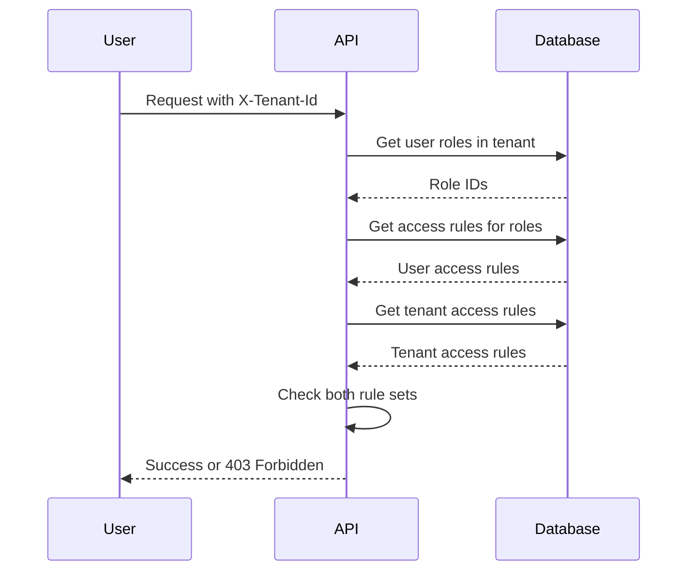

# Technische Referenz: Zugriffssteuerung

Dieses Kapitel dokumentiert die technischen Details, wie die Plattform die Zugriffssteuerung durchsetzt. Diese
Informationen sind nützlich für Systemadministratoren, die Mandanten und Rollen konfigurieren, und für Entwickler, die
die Plattform erweitern.

## Format der Zugriffsregeln

Zugriffsregeln verwenden ein hierarchisches Muster: `aihub.[user|admin].<service>.<resource>.<identifier>`

Beispiele:

```
aihub.user.agent.>                      # All agents (user access)
aihub.admin.agent.research.*            # All research agents (admin access)
aihub.user.knowledge.hr-docs.policies   # Specific knowledge namespace
aihub.admin.service.tenant              # Tenant management service
```

### Platzhalter

**Ein-Ebenen-Platzhalter** (`*`) stimmt genau mit einem Segment überein:

- `agent.research.*` stimmt mit `agent.research.instance-1` überein, aber nicht mit `agent.research.team.instance-1`

**Mehr-Ebenen-Platzhalter** (`>`) stimmt mit einem oder mehreren Segmenten am Ende überein:

- `agent.>` stimmt mit `agent.research.instance-1`, `agent.analysis.team.special` und jedem anderen Agenten-Pfad überein
- Muss der letzte Token in der Regel sein

### Admin- vs. Benutzerregeln

Regeln, die mit `aihub.admin.*` beginnen, gewähren administrativen Zugriff. Benutzer mit Admin-Zugriff haben automatisch
äquivalenten Benutzerzugriff.

Ein Benutzer mit `aihub.admin.agent.>` kann auf Ressourcen zugreifen, die entweder `aihub.admin.agent.*` oder
`aihub.user.agent.*` erfordern.

## Berechtigungsauflösung

Wenn eine Anfrage eingeht, führt die Plattform Folgendes aus:

1. Extrahiert die Benutzeridentität aus dem Authentifizierungstoken
2. Liest den `X-Tenant-Id`-Header, um den Mandantenkontext zu bestimmen
3. Fragt die Rollen des Benutzers innerhalb dieses spezifischen Mandanten ab
4. Sammelt alle Zugriffsregeln aus diesen Rollen
5. Ruft die Zugriffsregeln des Mandanten ab
6. Überprüft, ob sowohl der Mandant als auch der Benutzer die angeforderte Aktion zulassen



### Zweischichtige Überprüfung

Der Zugriff erfordert das Bestehen beider Schichten:

**Schicht 1: Mandantengrenze** – Erlaubt der Mandant diese Ressource überhaupt?

Wenn die Zugriffsregeln des Mandanten die angeforderte Ressource nicht enthalten, wird der Zugriff sofort verweigert,
ohne die Benutzerrollen zu überprüfen.

**Schicht 2: Benutzerberechtigungen** – Erlaubt die Rolle des Benutzers diese Aktion?

Nach Bestätigung, dass der Mandant die Ressource erlaubt, überprüft das System, ob die Rollen des Benutzers die
erforderliche Berechtigung erteilen.

Beide müssen bestanden werden, damit der Zugriff gewährt wird.

### Beispiel

Mandant hat: `aihub.user.agent.research.*`

Benutzer hat: `aihub.user.agent.>` (aus seiner Rolle)

Benutzeranfragen: `aihub.user.agent.research.instance-1`

- Mandantenprüfung: ✓ (Mandant erlaubt Forschungs-Agents)
- Benutzerprüfung: ✓ (Benutzerrolle erlaubt alle Agents)
- Ergebnis: Zugriff gewährt

Benutzeranfragen: `aihub.user.agent.finance.instance-1`

- Mandantenprüfung: ✗ (Mandant erlaubt nur Forschungs-Agents)
- Ergebnis: Zugriff verweigert (Benutzerprüfung nicht ausgewertet)

## Berechtigungen auf Service-Ebene

Jeder Service erfordert eine Basisberechtigung: `aihub.user.service.<service-name>`

Bevor ressourcenspezifische Berechtigungen überprüft werden, verifiziert das System, ob der Benutzer Zugriff auf den
Service selbst hat.

Um auf einen Agenten zuzugreifen, benötigen Sie:

- Service-Zugriff: `aihub.user.service.agent`
- Ressourcen-Zugriff: `aihub.user.agent.<agent-class>.<agent-id>`

Wenn der Mandant keinen Service-Zugriff gewährt, sind keine Ressourcen in diesem Service zugänglich, unabhängig von
anderen Regeln.

## Pfadparameter-Substitution

Berechtigungsvorlagen verwenden Platzhalter, die aus der Anfrage aufgelöst werden:

Vorlage: `aihub.user.agent.{agent_class}.{agent_id}`

Anfrage: `GET /api/v1/agents/research/instance-alpha`

Aufgelöste Berechtigung: `aihub.user.agent.research.instance-alpha`

Das System überprüft diese konkrete Berechtigung anhand der Zugriffsregeln des Benutzers und des Mandanten.

## Zugriffsstufen

Das System gibt drei Stufen zurück:

**ACCESS_DENIED**: Keine Berechtigung. Gibt HTTP 403 zurück.

**ACCESS_USER**: Benutzerzugriff zum Anzeigen und Interagieren mit der Ressource.

**ACCESS_ADMIN**: Admin-Zugriff zum Ändern, Konfigurieren oder Löschen der Ressource.

Controller können zwischen Benutzer- und Admin-Zugriff für Audit-Zwecke unterscheiden, obwohl viele Operationen nur
überprüfen, ob der Zugriff gewährt (nicht verweigert) wird.

## Konfiguration über Umgebungsvariablen

Konfigurieren Sie das Standardverhalten über Umgebungsvariablen:

```bash
# Default tenant created on first startup
AIHUB_DEFAULT_TENANT_NAME="Default Organization"
AIHUB_DEFAULT_TENANT_ACCESS_RULES="aihub.admin.>"

# Automatic user signup
AIHUB_USER_SIGNUP_DEFAULT_TENANT="default"
AIHUB_USER_SIGNUP_DEFAULT_ROLES="AIHubUser,AIHubAgentUser"
FIRST_AIHUB_USER_SIGNUP_DEFAULT_ROLES="AIHubAdmin"
```

## Superuser-Umgehung

Die globale Superuser-Rolle umgeht Mandantenbeschränkungen:

- **Virtueller Superuser-Mandant**: Agiert innerhalb eines virtuellen Mandanten, der `aihub.admin.>`-Zugriffsregeln hat
- **Voller Admin-Zugriff**: Hat Admin-Zugriff auf alle Ressourcen über alle Mandanten hinweg
- **Umgeht Grenzen**: Während das zweistufige Zugriffssteuerungssystem weiterhin durchlaufen wird, stellt der virtuelle
  Mandant sicher, dass alle Prüfungen bestanden werden
- **Immer authentifiziert**: Verwendet einen statischen Token anstelle der Authentifizierung über einen
  Identitätsprovider

Konfigurieren Sie über:

```bash
SUPERUSER_TOKEN="<secure-token>"
SUPERUSER_OID="<user-id>"
```

Sparsam verwenden – der Superuser-Zugriff dient der Plattformadministration, nicht dem regulären Betrieb.

## Validierungsregeln

::: warning Zugriffsregel-Formatanforderungen
Beim Erstellen von Zugriffsregeln:

**Erforderliches Format**:

- Muss mit `aihub.user.` oder `aihub.admin.` beginnen
- Nur Kleinbuchstaben, Zahlen, Punkte, Bindestriche, Unterstriche, `*`, `>`
- Mehr-Ebenen-Platzhalter `>` nur am Ende

**Verboten**:

- Großbuchstaben
- Sonderzeichen außer `.`, `-`, `_`, `*`, `>`
- `>` in der Mitte einer Regel

Das System validiert Regeln beim Erstellen oder Bearbeiten von Mandanten und Rollen. Ungültige Regeln lösen einen Fehler
mit dem spezifischen Problem aus.
:::

## Häufige Muster

### Breiter Plattformzugriff

```
aihub.admin.>
```

Voller Admin-Zugriff auf alles. Für Sysadmin-Mandanten verwenden.

### Service-Administratoren

```
aihub.admin.service.user
aihub.admin.service.role
aihub.admin.service.tenant
```

Kann Benutzer, Rollen und Mandanten verwalten, aber keine anderen Services.

### Abteilungszugriff

```
aihub.user.agent.department-finance.*
aihub.user.knowledge.finance-docs.>
aihub.user.process.finance-workflows.*
```

Zugriff nur auf finanzspezifische Ressourcen.

### Lesezugriff

```
aihub.user.agent.>
aihub.user.knowledge.>
```

Kann Agents und Wissen anzeigen und nutzen, aber nicht erstellen oder ändern.

### Power-User

```
aihub.user.>
aihub.admin.agent.<department>.*
aihub.admin.knowledge.<department>-docs.>
```

Benutzerzugriff überall, Admin-Zugriff nur auf Abteilungsressourcen.

## Zugriffsprobleme debuggen

::: details Fehlerbehebungs-Checkliste
Bei der Fehlerbehebung überprüfen Sie diese Punkte der Reihe nach:

1. **Mandantenwahl**: Überprüfen Sie, ob der Benutzer den beabsichtigten Mandanten ausgewählt hat
2. **Mandantengrenze**: Bestätigen Sie, dass die Zugriffsregeln des Mandanten die Ressource enthalten
3. **Benutzerzugehörigkeit**: Überprüfen Sie, ob der Benutzer dem Mandanten angehört
4. **Rollenzuweisung**: Prüfen Sie, ob der Benutzer Rollen in diesem Mandanten hat
5. **Rollenregeln**: Überprüfen Sie, was diese Rollen erlauben
6. **Service-Zugriff**: Überprüfen Sie, ob die Berechtigung auf Service-Ebene existiert

Die Plattform gibt detaillierte Fehlermeldungen zurück, die anzeigen, welche Berechtigung fehlgeschlagen ist. Verwenden
Sie dies, um die fehlende Regel zu identifizieren.
:::

## Performance-Hinweise

Die Zugriffsprüfung ist optimiert:

- Regeln werden einmal pro Anfrage kompiliert
- Mehrere Berechtigungsprüfungen für denselben Benutzer verwenden die kompilierten Regeln wieder
- Komplexe Platzhaltermuster haben minimale Performance-Auswirkungen
- Rollenänderungen treten sofort und ohne Cache-Verzögerungen in Kraft

Das Wechseln von Mandanten löst eine vollständige Cache-Invalidierung im Frontend aus, was dazu führt, dass Daten neu
abgerufen werden.
